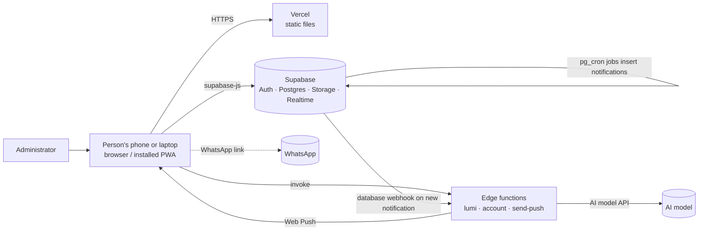

<!-- Generated by docs/build-docs.py from docs/srs/SRS-*.md. Do not edit. -->

# Software Requirements Specification — LUMA

**Part 0: Introduction and overall description**

| | |
|---|---|
| Product | LUMA — a personal operating system (Personal, Work and Study modes) |
| Document | SRS, part 0 of 6 (the functional requirements are in parts 1–5; see the list at the end) |
| Software version described | 0.26.x (staging); see `CHANGELOG.md` |
| Status | Draft for review. Requirements were written from the code and the migrations, not from an earlier specification. |

---

## 1. Introduction

### 1.1 Purpose

This document states what LUMA must do and how well it must do it. It is written so that product owners can check that the product matches the intent, developers can see what each part is for, and testers can derive test cases. Every functional requirement has an identifier (`FR-<AREA>-<NNN>`) that the test cases in `docs/tests/` point back to.

### 1.2 Scope

LUMA is a web application (a progressive web app) that gives one person a single place for daily life, work and study:

- **Personal mode** — dashboard, calendar with events and invitations, reminders, tasks, notes, documents, contacts and chat, focus mode, money, subscriptions, bills, goals, habits, health, analytics and insights, split expenses and the Lumi AI assistant.
- **Work mode** (add-on) — companies, projects with phases or folders, tasks with several assignees, teams, comments with files and @mentions, Gantt chart and timeline, time tracking with a monthly timesheet, reminders and plan limits.
- **Study mode** (add-on) — timetable, assignments and exams, subjects and semesters with an archive, grades, group projects, shared notes, flashcards and attendance.
- **Platform** — sign-up and sign-in, plans and add-ons, settings, notifications and push, busy-day alerts, feedback to the developer, support and FAQ, administration and account export / deletion.

Out of scope: native mobile apps, online payment (add-ons and plans are requested by WhatsApp and switched on by an administrator), multi-language screens (the interface is English), and a public API.

### 1.3 Definitions

| Term | Meaning |
|---|---|
| Mode / space | Personal, Work or Study. What a person creates in Work or Study stays in that mode (the `space` column). In Personal mode, "Show Work in Personal" and "Show Study in Personal" also show those items. |
| Plan | Dawn (free), Glow (RM9 / month) or Zenith (RM19 / month). Sets limits for the Personal features. |
| Add-on | Study (RM7 / month), Work (RM15 / month) or Work Pro (RM25 / month). Bundle Work + Study RM19 / month. Gives access to a mode. Work and Work Pro set the Work limits. |
| Trial | A one-time free 7-day use of an add-on, started by the person. |
| Administrator | A person listed in `luma.admin_users`; may grant plans and add-ons and read reports. |
| RLS | Row Level Security: the database rule that decides which rows a signed-in person can read or change. |
| RPC | A database function called from the browser. Most writes that need checks go through RPCs. |
| Edge function | A server function on Supabase: `lumi` (AI assistant), `account` (export / delete account), `send-push` (Web Push). |
| MYT | Malaysia Time (UTC+8), the default time zone of the interface; reminders use each person's own time zone. |

### 1.4 References

- `docs/CONVENTIONS.md` — identifiers and formats used by all documents.
- `docs/design/SDD.md`, `docs/design/DATABASE.md`, `docs/design/EDGE-FUNCTIONS.md` — design.
- `docs/04-TEST-PLAN.md`, `docs/tests/` — verification.
- `CHANGELOG.md`, `README.md`, `docs/STAGING_SETUP.md`.

---

## 2. Overall description

### 2.1 Product perspective

LUMA is a static web front end (plain HTML, CSS and JavaScript, no build step) hosted on Vercel. It talks directly to Supabase: Auth for accounts, Postgres (schema `luma`) for data with Row Level Security, Storage for files, Realtime for chat and live notifications, scheduled jobs (`pg_cron`) for reminders, and Edge functions for the AI assistant, account export / deletion and push notifications. See `docs/design/SDD.md` for the architecture.

### 2.2 Product functions (summary)

| Group | Main functions |
|---|---|
| Account | Register, confirm e-mail, sign in / out, reset password, profile, delete account, export data |
| Personal | Plan the day (calendar, reminders, tasks, notes), keep files, talk to contacts, track money / bills / subscriptions / goals / habits / health, review analytics, ask Lumi |
| Work | Run projects for one or more companies, with teams, time tracking and timesheets |
| Study | Run a semester: classes, assignments, grades, groups, notes, flashcards |
| Platform | Plans, add-ons and gifts; settings; notifications and push; busy-day alerts; feedback; support |
| Administration | Users, plans, add-ons, trials, gifts, reports, limits |

### 2.3 User classes

| Class | Description | Typical rights |
|---|---|---|
| Visitor | Not signed in | Register, sign in, reset password |
| Dawn user | Free plan | All Personal features within the Dawn limits |
| Glow / Zenith user | Paid plan | Higher limits; Lumi actions; own wallpaper; Zenith: split expenses |
| Add-on user | Has Work, Work Pro and / or Study | Opens that mode; limits of the add-on |
| Project owner | Created a Work project | Everything in it; invites people; sees team time; manages teams |
| Project member | Accepted an invitation to a Work project (has the Work add-on) | Edits tasks, logs time, comments |
| Project viewer / guest | Invited as viewer, or invited without the Work add-on | Looks, comments where allowed; cannot change tasks |
| Study group member | Invited to a Study group project, with or without the Study add-on | Works in that group project |
| Contact | An accepted contact of another person | Chat; may be invited to events, shared documents / notes, projects, teams |
| Administrator | Listed in `admin_users` | Admin pages; reads feedback; grants plans / add-ons; edits plan limits |

### 2.4 Operating environment

- **Browsers:** current Chrome, Edge, Firefox and Safari (macOS and iOS). Installable as a PWA; Web Push needs HTTPS and, on iPhone, installation to the Home Screen (iOS 16.4+).
- **Screens:** phones from 320 px wide up to desktop monitors; the layout is responsive.
- **Back end:** Supabase (managed Postgres with the `pg_cron` extension enabled), Edge functions (Deno), Vercel static hosting.
- **Environments:** staging (own Supabase project and Vercel site, shows a STAGING tag) and production.

### 2.4.1 Constraints

- No build step and no front-end framework: classic `<script>` files share one global scope (see the SDD for the rules this imposes).
- All data access is through the Supabase client under the signed-in person's rights; there is no custom API server. Rules that matter must therefore be enforced in the database (RLS, triggers, security-definer functions).
- Payments are manual (WhatsApp request, then an administrator switches the plan / add-on on).
- Limits are stored in `luma.plan_limits` and can be changed by an administrator without a release.

### 2.5 Assumptions and dependencies

- A working Supabase project with all migrations (`supabase/migrations/001` onward) applied in order, `pg_cron` enabled, and the Edge functions deployed with their secrets.
- E-mail delivery for confirmation and password-reset messages is provided by Supabase Auth (a custom SMTP sender is recommended for production).
- An administrator account exists.
- The person's device clock and time zone are correct enough for reminders (reminder times follow the time zone saved in the profile).

---

## 3. Where the requirements are

| Part | File | Area codes |
|---|---|---|
| 0 | `docs/srs/SRS-00-introduction.md` (this file) | — |
| 1 | `docs/srs/SRS-personal-a.md` | DASH, CAL, REM, TASK, NOTE, DOC, CON, FOC |
| 2 | `docs/srs/SRS-personal-b.md` | MON, SUB, BILL, GOAL, HAB, HLTH, ANA, SPL, PUR, LUMI |
| 3 | `docs/srs/SRS-work.md` | WRK, WCO, WTM, WTE, WCM, WGV, WLM, WNT |
| 4 | `docs/srs/SRS-study.md` | STT, STA, STS, STG, STN, STC, STK, STM |
| 5 | `docs/srs/SRS-platform.md` | AUTH, SHL, SET, PLN, NTF, BSY, FBK, SUP, ADM, ACC and the NFRs |
| 9 | `docs/srs/SRS-99-appendices.md` | Plan and add-on limits, permission matrix, notification catalogue pointers |

`docs/SRS-complete.md` joins all parts into one file (generated by `docs/build-docs.py`).

---

# SRS — Personal mode (part A)

**Scope.** This document lists the functional requirements of the first group of Personal-mode pages of LUMA: the Dashboard, the Calendar (with event invitations, busy-day colouring and the .ics export), Reminders, Tasks (the personal Kanban board "Tasks & Work"), Notes, Documents, Contacts (requests, chat, nudge, follow-ups) and Focus mode. Habits, Goals, Bills, Money, Health, Analytics, Lumi, Settings, Notifications and the Work and Study modes are in other documents; they are mentioned here only where these pages read from or link to them. Everything below was written from the code (`app/modules/<name>/`, `app/core/busy.js`, `app/core/ics.js`, `app/core/skins.js`, `shared/luma-space.js`), the migrations in `supabase/migrations/` and `CHANGELOG.md`. Where the code does not make something clear, the text says "TBC". Problems found while reading are listed in `docs/tests/TC-personal-a.md` (Findings section).

| Area code | Feature | Main files |
|---|---|---|
| DASH | Dashboard | `modules/dashboard/*`, `core/busy.js`, `core/shell.js` |
| CAL | Calendar, invitations, busy days, .ics export, date picker | `modules/calendar/*`, `core/busy.js`, `core/ics.js`, `core/skins.js`, migrations 027, 048, 050, 070, 082 |
| REM | Reminders (custom reminders) | `modules/reminders/*`, migrations 032, 033 |
| TASK | Tasks & Work board (personal tasks) | `modules/tasks/*`, migrations 002, 026, 066 |
| NOTE | Notes | `modules/notes/*`, migrations 005, 006 |
| DOC | Documents | `modules/documents/*`, migrations 003, 004, 007, 033 |
| CON | Contacts and chat | `modules/contacts/*`, migrations 001, 009, 010, 033, 037, 070 |
| FOC | Focus mode (timer and ambience) | `modules/focus/*`, migration 041 |

**Conventions.** "Space" means the mode a record belongs to (Personal / Work / Study, migration 050). "The person" is the signed-in user. Plan limits are the values in `luma.plan_limits` (Dawn / Glow / Zenith; NULL = unlimited). All dates and times are shown in the person's time zone (Settings → Edit profile; default Asia/Kuala_Lumpur), which the code calls `MYT`.

**Plan limits that matter to this document** (migration 033, 037):

| Key | Dawn | Glow | Zenith |
|---|---|---|---|
| `reminders` (custom reminders) | 5 | 25 | unlimited |
| `contacts` (accepted + your own pending requests) | 3 | 12 | unlimited |
| `storage_mb` (total file storage) | 50 | 300 | 1000 |
| `file_mb` (one file) | 5 | 20 | 50 |
| `chat_messages` (sent per day) | 50 | 50 | 50 |

There is no plan limit on personal tasks, notes, events or document categories. An event can have at most 30 guests on every plan.

---

## 1. Dashboard (DASH)

| ID | Requirement | Priority | Source |
|---|---|---|---|
| FR-DASH-001 | The system shall show, at the top of the Dashboard, a date line (weekday, day, month, time) and a greeting "Good morning" (before 12:00), "Good afternoon" (12:00–17:59) or "Good evening" (from 18:00) followed by the person's first name, using the person's time zone. | Must | core/shell.js, core/session.js |
| FR-DASH-002 | The system shall show a greeting chip for tasks that reads "N task(s) due or overdue" (open tasks due today plus overdue) or "No tasks due today", and a click on it shall open the Tasks page. | Must | dashboard.js `paintDashboard` |
| FR-DASH-003 | The system shall show a greeting chip "N event(s) today" or "No events today" (events on today's date, repeats included, ignoring the Calendar's category filter), and a click shall open the Calendar. | Must | dashboard.js |
| FR-DASH-004 | The system shall show a money chip: when a monthly budget is set, "RM x left to spend" (green) or "RM x over budget" (red); when no budget is set, "RM x spent this month". A click shall open the Money page. | Should | dashboard.js |
| FR-DASH-005 | The system shall show, for each add-on the person owns (Work, Study) whose items are not shown in Personal, a chip "Work is hidden here" / "Study is hidden here" with a **Show** button and a dismiss (x) button. **Show** shall switch on the preference `show_work_personal` / `show_study_personal`, reload the Dashboard and show the toast "Work is now shown in Personal" (or Study) with the hint "You can change this in Settings → Preferences". The dismiss button shall store `work_note_dismissed` / `study_note_dismissed` so the chip is not shown again. | Should | dashboard.js `dashAddonChip` |
| FR-DASH-006 | The system shall, on a phone or tablet where LUMA is not installed and the person has not dismissed it, show the chip "Add LUMA to your home screen" with **Install** (when the browser can prompt) or **How** (otherwise) and a dismiss button; dismissing shall be remembered on that device (`luma_install_dismissed`). | Could | dashboard.js `dashInstallChip` |
| FR-DASH-007 | The system shall show a "Suggestion" line inside the greeting card (under the chips, with an Open button and "Not now") with the first rule that applies, in this order: (1) overdue tasks — names the oldest overdue task, opens Tasks; (2) overdue bills — names the first bill and its amount, opens Bills; (3) more than 5 tasks due today — advises moving some, opens Tasks; (4) daily habits still to tick today — names the first, opens Habits. When no rule applies the card shall be hidden. | Should | dashboard.js |
| FR-DASH-008 | The system shall hide the Suggestion line and the Tip card when the preference "Proactive AI suggestions" (`ai`) is off. The **Not now** button shall hide the Suggestion line until the Dashboard page is reloaded; **Open** shall go to the page named in the suggestion. | Should | dashboard.js |
| FR-DASH-009 | The system shall offer Quick Actions: **Add Task** (opens the New task popup), **Log Expense** (opens the Money entry popup), **New Event** (opens the New event popup on today), **Add Note** (opens the New note editor) and **AI Chat** (opens the Lumi chat). | Must | dashboard.js `initQuick` |
| FR-DASH-010 | The system shall reload the Dashboard widgets when the task, money-entry or event popup is closed while the Dashboard is the active page, so a new item shows at once. | Should | dashboard.js |
| FR-DASH-011 | The system shall show "Today's Schedule": every item of today (events, invited events not declined, open tasks due, bills due, and — when enabled — Study classes and deadlines and Work task deadlines) sorted untimed-first, then by time, then by title. Each row shows the time (12-hour) or "All day" / "Task" / "Bill", the title, the time range and, for events, the category. A click shall open that item in the Calendar. With nothing today it shall say "Nothing scheduled today. Add an event on the Calendar." | Must | dashboard.js, calendar.js `cItemsOn` |
| FR-DASH-012 | The system shall show the busy-day notice bar (see FR-CAL-026) above Today's Schedule when the person's busy-day alerts are on and a day in the next 7 days is busy or packed. The Dashboard shows the notice bar only, not the 7-day strip. | Should | busy.js `luPaintBusy`, dashboard.html |
| FR-DASH-013 | The system shall show "Today's Priorities": up to 8 open tasks, overdue ones first (oldest due date first), then High, Medium, Low priority (nearest due date first within a priority), each with a tick box, a due label ("overdue", "today" or the date) and a priority dot. | Must | dashboard.js |
| FR-DASH-014 | When the person ticks a priority, the system shall mark the task Done immediately (completed time set); ticking a done task again shall restore its earlier status (To do or In progress). Ticked tasks shall stay in the list, crossed out and moved below the others, until the Dashboard is reloaded. If saving fails the tick shall be undone and the message "Could not update the task: <reason>" shall be shown. With no open tasks the card shall say "No open tasks. Enjoy the calm." | Must | dashboard.js |
| FR-DASH-015 | The system shall show a "This Month" card: money spent this month, "Left in budget" (or "Not set" when there is no budget; a negative value is shown red with a minus sign), a spend-versus-budget bar capped at 100 % and "Income this month" with its bar. | Should | dashboard.js |
| FR-DASH-016 | The system shall show "Habit Streaks": the three habits with the longest current streak, each with its icon, name, the last 7 periods as small squares and the streak number. With no habits it shall say "No habits yet — add one on the Habits page." | Should | habits.js `paintDashHabits` |
| FR-DASH-017 | The system shall show a "Wellness" card with today's sleep hours, water (litres) and mood from Health, using "—" for anything not logged. | Should | dashboard.js |
| FR-DASH-018 | The system shall show a "Productivity" card: a score for the last 7 days, task completion % and habit consistency %, and a pill with the change against the 7 days before (green "+n%" when equal or better, red otherwise); "—" when there is no data. | Could | dashboard.js, `anCalc` |
| FR-DASH-019 | The system shall show "Upcoming Reminders": up to 4 entries, sorted by date then time, drawn from unpaid bills and subscriptions (this month and next; "Overdue Nd", "Due today", "Due in Nd", "Renews in Nd") and from active custom reminders whose next date is within 14 days ("Today", "Tomorrow", "In Nd"). A "View all" link opens Reminders. With none it shall say "No reminders, bills or subscriptions coming up." | Should | dashboard.js |
| FR-DASH-020 | The system shall show "Today's Overview": Events today, Open tasks, Due Today, Left in Budget (or Spent when no budget) and Workload Level, where load = overdue + due-today tasks and the level is Low (0–3), Medium (4–6) or High (7 or more). | Should | dashboard.js |
| FR-DASH-021 | The system shall show a "Tip for today" chosen at random from the tips that apply to the person's data right now (for example overdue tasks, no habits, over budget) and general tips, and shall replace it with another one every 20 seconds while the Dashboard is visible, fading between them. | Could | dashboard.js `DASH_TIPS` |
| FR-DASH-022 | The system shall show a "Work" card on the Dashboard only when the person has the Work add-on and "Show Work in Personal" is on. It shall show counts of the person's overdue, due-today and open Work tasks, time logged today (or "Timer running"), and the next four tasks assigned to the person; a click on a task opens it in Work, on the time box opens Work → Time, and "Open Work" opens Work. | Should | work.js `wkPaintDashCard`, dashboard.html |
| FR-DASH-023 | The system shall make each widget header link ("View calendar", "All tasks", "Money", "Habits", "Health") open the matching page. | Should | dashboard.js `dashNav`, dashboard.html |
| FR-DASH-024 | While data is loading the system shall show "Loading…" in each widget, and the data (tasks, events, reminders, habits, money, health, invitations, and Study data when shown) shall be requested in parallel. | Should | dashboard.js `loadDashboard` |
| FR-DASH-025 | Next to the task, event and money pills the greeting shall show small pills for things near their time, only when there is something: **reminders** that will fire later today ("<title> at <time>" for one, "N reminders later today"), **bills** (not subscriptions) due today or within 3 days, **subscriptions** renewing within 3 days, **habits** still to tick (from 5 pm), **water** below the daily goal (from 4 pm, "X of water to go") and **goals** ending within 7 days. | Should | dashboard.js `dashNearChips` |
| FR-DASH-026 | At most five such pills shall be shown, nearest first (today before tomorrow before later); each opens its page (Reminders, Bills, Subscriptions, Habits, Health, Goals). Overdue bills and unfinished tasks shall not be repeated here (the task pill and the Suggestion cover them). | Should | dashboard.js |
| FR-DASH-027 | Today's Priorities (up to 15 tasks), Upcoming Reminders (up to 12 items) and Habit Streaks (all habits, most streak first) shall scroll inside their card after about five rows, like Today's Schedule, with a soft fade at the bottom that disappears at the end of the list. | Should | dashboard.html/js/css, habits.js `paintDashHabits` |
| FR-DASH-028 | Today's Schedule, Today's Priorities and Upcoming Reminders shall be the same height; each list shall be five rows tall (rows of equal height, titles on one line with an ellipsis) and scroll inside beyond five. The smaller cards shall follow in two rows (This Month, Today's Overview, Productivity; then Habit Streaks wide beside Wellness) on a wide window, two columns on a tablet and one on a phone. | Should | dashboard.html/css |

**NFR-DASH-001.** On a phone (up to 768 px wide, down to 320 px) the Dashboard shall scroll as one page, with no horizontal scrolling, and the decorative robot icon in the greeting card shall be hidden. (core/responsive.css, CHANGELOG.)

**NFR-DASH-002.** The Dashboard shall only show the person's own data and the mode's data (see FR-CAL-030); it reads through row-level security like every page.

Notes. The "Suggestion" and "Tip" are computed in the browser from the person's data; they do not call Lumi (the AI). Their switch is still called "Proactive AI suggestions" in Settings → Preferences.

---

## 2. Calendar (CAL)

| ID | Requirement | Priority | Source |
|---|---|---|---|
| FR-CAL-001 | The system shall offer four views — **Day**, **Week**, **Month** (default) and **Year** — and shall open each view on today when its tab is chosen. | Must | calendar.js `calViews` |
| FR-CAL-002 | The system shall provide previous / next arrows that move by one day, one week, one month or one year depending on the view, a **Today** button (hidden when the view already shows today) and a title that shows the current range. | Must | calendar.js `calMove`, `paintCalendar` |
| FR-CAL-003 | The system shall open a date picker when the title is clicked, and jump to the chosen date. | Should | calendar.js, skins.js `luDatePopup` |
| FR-CAL-004 | The Month view shall show a grid of weeks (Sunday first) with, in each day, one line per item (coloured dot, time, title). When the items do not fit, the last line shall become "+N more", and a click on it shall open a small popup listing every item of that day with the button **Open day view**. | Must | calendar.js `paintCalendar`, `calFitCells`, `calDayPopup` |
| FR-CAL-005 | On a narrow window (phone) the Month view shall show small dots for the day's items, and a tap on the day shall open its items. | Should | calendar.css (max-width 480), CHANGELOG |
| FR-CAL-006 | The Week view shall show seven day columns on a 24-hour grid (52 px per hour): timed items placed at their start and sized by length (at least 25 minutes tall), overlapping items side by side, an "all-day" row for untimed items, tasks and bills, a red "now" line on today, and a "GMT +hh:mm" label. It shall open scrolled to 7 am, or to the top when any all-day item exists. | Must | calendar.js `cTimeGrid` |
| FR-CAL-007 | The Day view shall show an agenda: an "All day" row, then one row per hour (00:00–23:00), a card per item (icon, title, time and note or category), with the current hour highlighted on today and the view scrolled to the current hour (or 07:00). | Must | calendar.js `cDayAgenda` |
| FR-CAL-008 | The Year view shall show twelve small months; days with at least one item are marked; a click on a month name shall open that month in the Month view and a click on a day shall open it in the Day view. | Should | calendar.js |
| FR-CAL-009 | A click on empty space shall start a new event: on a month cell for that date; on a week column or an empty day-view hour for that date and that hour (start time = the hour). The **Create** button shall start a new event on today (Month / Year) or on the date shown (Day / Week). | Must | calendar.js `calBind` |
| FR-CAL-010 | The event form shall have: Event name (required, maximum 120 characters), category (Work, Meeting, Personal, Health, Social, Other; default Work), Date (required), "At a time" / "All day", Starts (required unless All day), Ends (optional), Repeats, Invite people, Note (optional, maximum 1000 characters). | Must | calendar.js, calendar.html, migration 027 |
| FR-CAL-011 | The system shall validate the event form and show these messages in the form: "Give the event a name.", "Pick the date.", "Pick a start time, or choose All day.", "The end time must be after the start time." Nothing shall be saved while a message is shown. | Must | calendar.js `calEvSave` |
| FR-CAL-012 | The system shall support repeats Never, Daily, Weekly (same weekday as the first date), Monthly (same day number; in a short month the last day) and Yearly (same month and day; day clamped likewise). A repeating event is one record; editing it changes every occurrence, and the form says so. | Must | calendar.js `cOccurs`, migration 027 |
| FR-CAL-013 | The system shall let the person edit an event from its details popup (**Edit event**) and delete it (trash button) after a confirmation ("Delete “<name>”?" with "Every occurrence of this repeating event is removed." for repeating events). After deleting it shall show an **Undo** toast ("Event deleted") that adds the event back as it was; invitations are not restored. | Must | calendar.js |
| FR-CAL-014 | A click on an item shall open a details popup. For an event: date, time, repeats, note, category, guests (when there are any) and Edit / Delete. For a task: due date (with "— overdue"), status, priority, tag, notes and **Open in Tasks**. For a bill: amount, due date, status (Paid / Overdue / Not paid yet), repeats, category, note, **Mark as paid** / **Undo paid** and **Open in Bills**. | Must | calendar.js `calShowDetail` |
| FR-CAL-015 | The Calendar shall show, read-only, the person's open tasks on their due date ("Task due") and the active bills on each due date in their cycle (paid ones ticked), each in its own colour, and shall never show a task that is done. | Must | calendar.js `cItemsOn` |
| FR-CAL-016 | The system shall provide a category panel with one toggle per category (Work, Meeting, Personal, Health, Social, Other, Tasks, Bills, plus Classes / Study and Work tasks when those are shown), each with the count of items in the month on screen; switching a category off shall hide it in every view and in the Upcoming list. A switched-off category shall show dimmed with its count. | Must | calendar.js `paintCalSide` |
| FR-CAL-017 | The system shall show "Upcoming Events": the next 5 items in the next 14 days (labels Today, Tomorrow or the date), the remark "Only the next 2 weeks are listed (until <date>).", and a **View all** link that opens a popup with every item of those 14 days grouped by day (at most 300 items). With none it shall say "Nothing in the next 2 weeks." | Must | calendar.js `paintCalSide`, `openCalList` |
| FR-CAL-018 | The system shall let the owner of an event invite people from the event form with **Add from contacts**: a picker lists only accepted contacts (name and email), marks people already invited ("Already invited") and, with no contacts, says "You have no contacts yet. Add people on the Contacts page first, then invite them here." Invitations are sent when the event is saved; chips show who is about to be invited and who is already on the event (green = going, amber = invited, red = declined). | Must | calendar.js, migration 048 |
| FR-CAL-019 | The system shall allow an event to have at most 30 guests (not counting people who declined), shall only allow inviting accepted contacts of the owner, and only on the owner's own events. The errors "You can only invite people to your own events", "You can only invite people who are in your contacts" and "An event can have up to 30 guests" shall be shown. If the event saves but the invitation fails, the message "The event was saved, but the invitations could not be updated: <reason>" shall be shown. | Must | migration 048, calendar.js |
| FR-CAL-020 | The system shall notify an invited person with the notification "📅 <name> invited you to <event>" (with the date and time and "Open your calendar to accept or decline."), shall show the toast "Invitations sent" to the owner, and shall notify the owner when the guest replies ("✅ <name> is coming to <event>" or "❌ <name> can't make <event>"). Opening either notification shall open the Calendar on that event. | Must | migration 048, 070, calendar.js |
| FR-CAL-021 | An invited event shall appear in the guest's calendar with an "invited" mark (dashed style while pending) and an "Invitation" tag; its details shall show the organiser and the guest's reply. A pending invitation offers **Accept** and **Decline**; an accepted one offers **Leave event** (after a confirmation "Leave “<name>”? It is removed from your calendar. The organiser is told."). Declining or leaving removes the event from the guest's calendar. The toasts "You are going" and "Invitation declined" shall be shown. A guest cannot edit or delete the event. | Must | calendar.js, migration 048 |
| FR-CAL-022 | The system shall show the guest list (organiser first, then guests by name) to the organiser, including people who declined, and to any guest whose invitation is pending or accepted (not declined people); the person's own row shows "(you)". A person who is not the organiser or a current guest shall get the error "Not allowed". | Must | migration 048 `event_attendees`, calendar.js |
| FR-CAL-023 | The system shall let the organiser remove a guest (the guest disappears from the list when the event is saved); re-inviting a person who declined shall set them back to pending and notify them again. Removing a guest sends no notification. | Should | migration 048 `uninvite_from_event`, `invite_to_event` |
| FR-CAL-024 | The system shall keep invitations private: the table `event_invites` shall not be readable or writable directly; a guest shall only ever read the one event they were invited to (through `my_invited_events`); only the owner can change or delete an event; deleting an event removes it for everyone. | Must | migration 048 |
| FR-CAL-025 | The system shall colour busy days. For a day, the load is the count of items shown for the person's mode (Study classes count 0.5), the hours booked (sum of timed items; an item without an end time counts 60 minutes, at least 15) and the clashes (timed items that start before an earlier item ends). Normal sensitivity: **busy** (amber, warning icon) from 6 things, 6 hours or 1 clash; **packed** (red, flame icon) from 9 things, 9 hours or 3 clashes. Sensitive: 4/6 things, 4/6 hours, 1/2 clashes. Relaxed: 8/12, 8/12, 2/4. The colour shall show on month cells and week/day headers (tooltip "Busy: 7 things · 6.5 h booked · 1 clash"), and the day view shall show a notice saying why. The Calendar's category filter shall not change a day's load. | Must | busy.js |
| FR-CAL-026 | The system shall show a notice bar above the calendar (and on the Dashboard, Work and Study) when any day in the next 7 days is busy or packed: "Today / Tomorrow / <date> is busy" or "is packed", with the reason, an **Open** button for the first such day and buttons for up to 4 more days, and an x that hides the notice for the rest of today (remembered in the browser session). | Should | busy.js `luBusyBanner` |
| FR-CAL-027 | The system shall let the person switch busy-day alerts off (Settings → Preferences → "Busy-day alerts", `busy_alerts`, default on) and choose the sensitivity (`busy_level`: sensitive / normal / relaxed). With alerts off no colouring and no notice shall show. | Should | busy.js, settings.js |
| FR-CAL-028 | The system shall send the notification "🔥 Tomorrow is packed" or "⚠️ Tomorrow is busy" (with the count, hours and clashes, linking to the Calendar) once a day at 6 pm in the person's time zone (hourly job `luma-busy-alerts`, minute 5), only when tomorrow reaches the person's threshold, at most once per 20 hours, and only when `busy_alerts` and `busy_push` (default on) are not off. | Should | migration 082 |
| FR-CAL-029 | The system shall send a reminder for each event: "📅 <title> starts in N min" / "starts now" when the start is within the lead time (default 15 minutes, set in Settings → Reminders), or "📅 <title> is today" at 08:00 (default) for all-day events; not more than once per 12 hours per event; only to the owner; only when "event reminders" is on. The job runs every minute. | Must | migration 030, 031, 060 |
| FR-CAL-030 | The system shall file a new event under the mode the person is in (`space`) and show only that mode's events; in Personal mode it shall also show Work and/or Study items when "Show Work in Personal" / "Show Study in Personal" is on. The Study add-on's classes and deadlines (filters "Classes" and "Study") and the Work add-on's task deadlines (filter "Work tasks") shall appear in the Calendar only for people who have the add-on, in that add-on's mode or when shown in Personal. | Must | luma-space.js, migration 050, calendar.js |
| FR-CAL-031 | The system shall export the calendar as an .ics file with the **Export** button: after a confirmation that states the counts ("N event(s), N open task(s) and N bill(s)… It is a copy: later changes in LUMA are not sent to it.") it shall download `LUMA-calendar.ics` with the person's events (and accepted invitations) with their repeat rule, timed events with a 15-minute alarm, open tasks with a due date as all-day "Task: <title>", and active bills with a due date as all-day "Bill: <name> (RM x)" with their repeat rule. With nothing to export it shall say "There is nothing to export yet." | Should | calendar.js `calExportIcs`, ics.js |
| FR-CAL-032 | The date picker shall start weeks on Monday, show a month grid with today marked, offer **Today** and **Close**, let the person tap the month name to choose a month and type a year, and accept a typed date as DD/MM/YYYY, DD-MM-YYYY, DD.MM.YY or YYYY-MM-DD (years 1900–2100 unless the field sets a range); an invalid date shall show an error in the picker and not change the date. | Should | skins.js `luDatePopup`, CHANGELOG |
| FR-CAL-033 | When the person opens a notification about an event, the Calendar shall show the month of the event, or the day view when the month is crowded; for a repeating event it shall show today's occurrence. | Should | calendar.js `LU_FOCUS_HOOKS.calendar` |
| FR-CAL-034 | The system shall store events in `luma.events` (name 1–120 characters, category one of six, optional times in HH:MM, repeats one of five, note up to 1000 characters) with row-level security so a person can only read and change their own events. | Must | migration 027 |
| FR-CAL-035 | If events cannot be loaded the Calendar shall show "Could not load events — has supabase/migrations/027_events.sql been run in the Supabase SQL Editor?"; if saving fails because the table is missing the form shall show "The calendar isn't set up yet — run supabase/migrations/027_events.sql in the SQL Editor." | Could | calendar.js |

**NFR-CAL-001.** The Calendar shall have no horizontal page scrolling at 320, 360 and 390 px width, and the month grid shall fit its card without a vertical scrollbar on a 1180 px wide laptop. (responsive.css, calendar.css, audit rig.)

**NFR-CAL-002.** Opening the Calendar shall draw immediately from data already in memory and refresh when events, tasks, bills and invitations arrive; the busy-day data is cached for 60 seconds.

Notes. Times are 24-hour `HH:MM` strings; the grid shows 12-hour text ("03:00 pm"). Invitations are delivered through database functions only (`invite_to_event`, `respond_event_invite`, `uninvite_from_event`, `my_invited_events`, `event_attendees`).

---

## 3. Reminders (REM)

Custom reminders are the person's own reminders, separate from tasks. They are delivered by the server (an in-app notification and a push), so they work when LUMA is closed.

| ID | Requirement | Priority | Source |
|---|---|---|---|
| FR-REM-001 | The system shall list reminders in three groups: **Upcoming** (active with a next date, soonest first, then by time), **Done** (active, no next date — for example a one-time reminder that has fired) and **Paused** (switched off). The page subtitle shall read "N upcoming · next: <title> today / <date>" or "Nothing upcoming". | Must | reminders.js `paintReminders` |
| FR-REM-002 | Each list entry shall show the title, a description of its repeat and time ("Every weekday · 9:00 am"), its next occurrence ("Next: Today, 9:00 am", "Tomorrow", a date; "Paused"; "Done") and the note, with a pause / resume switch, an edit (pencil) and a delete (bin) button; a click on the entry shall open it for editing. | Must | reminders.js |
| FR-REM-003 | With no reminders the system shall show the empty state "Add your first reminder" with text that fits the mode (Personal, Study or Work) and four starting ideas as buttons (for Personal: Fill in the timesheet, Pay rent, Weekly review, Back up your files); choosing one shall open the New reminder form filled in. | Should | reminders.js `REM_TPL_SETS` |
| FR-REM-004 | The reminder form shall have: Remind me to (required, maximum 120 characters), Repeat, On (weekly only), Date (for one-time, monthly, yearly), Time (required, default 09:00) and Note (optional, maximum 300 characters, "Shown in the notification"). The messages "Give the reminder a name.", "Choose the time." and "Pick the date." shall be shown when the field is missing. | Must | reminders.js, reminders.html, migration 032 |
| FR-REM-005 | The system shall offer nine repeat kinds: Does not repeat, Every day, Every weekday (Mon–Fri), Every weekend (Sat–Sun), Every week, Every month on a date, Last weekday of every month, Last day of every month, Every year. A hint shall explain the chosen kind. | Must | reminders.js `REM_KINDS`, migration 032 |
| FR-REM-006 | For "Every week" the person shall pick one or more weekdays; if none is picked the reminder uses the weekday of its start date (the hint says "If you pick none, it uses the weekday of today"). | Must | reminders.js, migration 032 `reminder_due` |
| FR-REM-007 | "Every month on a date" shall fire on the same day number each month and, in a month without that day, on the last day of the month; "Every year" shall fire on the same month and day (day clamped likewise); "Last weekday of every month" shall fire on the last Monday–Friday; "Last day of every month" on the last calendar day. For repeat kinds that have no date field (daily, weekdays, weekends, weekly, last-day kinds) the start date shall be today. | Must | migration 032, reminders.js `remDue` |
| FR-REM-008 | When creating a one-time reminder the system shall refuse a date in the past, or today with a time more than 10 minutes ago, with the message "That time has already passed. Pick a later time or date." The check shall not apply when editing. | Must | reminders.js `crSave` |
| FR-REM-009 | The pause / resume switch shall change the reminder's active state at once and clear its "last fired" mark; a paused reminder shall not fire. A failure shall show "Could not update: <reason>". | Must | reminders.js |
| FR-REM-010 | Saving an edited reminder shall clear its "last fired" mark so that it can fire again (a reminder edited after it has fired today may therefore fire again if the time is still within the 10-minute window). | Should | reminders.js |
| FR-REM-011 | The system shall delete a reminder only after the confirmation "Delete this reminder?" ("<title>" will stop reminding you.) and shall then show an **Undo** toast ("Reminder deleted") that adds it back. | Must | reminders.js `remDelete` |
| FR-REM-012 | The system shall limit custom reminders per plan (Dawn 5, Glow 25, Zenith unlimited), counting every reminder the person has (active or paused, any mode). At the limit, **New reminder** shall show the dialog "Plan limit reached — Your <plan> plan includes up to N custom reminders. Upgrade to add more." with a **See plans** button; the database shall also refuse the insert with "Plan limit: the <Plan> plan allows up to N custom reminders. Upgrade your plan in Settings to add more." Editing is not limited. | Must | plans.js `planBlocked`, migration 033 |
| FR-REM-013 | The system shall deliver reminders with a job that runs every minute: an active reminder fires when its repeat rule matches today in the person's time zone and the current time is 0 to 10 minutes after its time. It shall create the notification "⏰ <title>" with the note as the body, linking to Reminders (and a push when push is on). | Must | migration 032 `run_custom_reminders` |
| FR-REM-014 | The system shall fire a reminder at most once per day (the day is recorded in `last_fired_on`); a one-time reminder that has fired shall move to Done. | Must | migration 032 |
| FR-REM-015 | The system shall compute the "next" date on the page as the first day from today (looking up to 800 days ahead) on which the reminder is due, skipping a day already fired and skipping today when more than 10 minutes have passed since its time. | Should | reminders.js `remNext` |
| FR-REM-016 | The system shall file a new reminder under the current mode (`space`) and show the reminders of the current mode only (Personal also shows Work / Study ones when those are shown in Personal). The server job fires reminders of every mode. | Must | luma-space.js, migration 050 |
| FR-REM-017 | The system shall keep reminders private: a person can only read, create, change and delete their own reminders (row-level security). | Must | migration 032 |
| FR-REM-018 | If reminders cannot be loaded the page shall say "Could not load reminders" with a hint to run migration 032; if saving fails because the table is missing the form shall say "Reminders aren't set up yet — run supabase/migrations/032_reminders.sql in the Supabase SQL Editor." | Could | reminders.js |

**NFR-REM-001.** A reminder shall be delivered within about 10 minutes of its time even if one run of the job is late; the page and notification shall use the person's own time zone.

**NFR-REM-002.** The New reminder form shall fit a 320 px wide screen without horizontal scrolling.

---

## 4. Tasks (TASK)

The page is titled "Tasks & Work". It is the personal Kanban board; Work-add-on tasks live in the Work page.

| ID | Requirement | Priority | Source |
|---|---|---|---|
| FR-TASK-001 | The system shall show three columns, **To do**, **In progress** and **Done**, each with its task count, tasks sorted by due date (soonest first, no date last), and a subtitle "N open · N due today" plus " · N overdue" when there are overdue tasks. | Must | tasks.js `render` |
| FR-TASK-002 | Each task card shall show the title (crossed out and dimmed when done), the first line of notes, a priority pill (High / Medium / Low), the tag, a repeat badge, a checklist badge "done/total" (green when all done), a status chip, the due label and arrow / bin actions. | Must | tasks.js |
| FR-TASK-003 | The system shall create a task with **Add task** in the header (status To do) or the "+ Add task" card at the bottom of a column (that column's status). The form has Task (required, maximum 200 characters), Status, Due date (required), Priority (Low / Medium / High; default Medium), Repeats, Checklist, Tag and Notes. | Must | tasks.js `openTaskModal` |
| FR-TASK-004 | The system shall validate the task form with "Give the task a name." and "Pick a due date." and shall not save while either is shown. | Must | tasks.js `tkSave` |
| FR-TASK-005 | The tag shall be free text up to 30 characters (default "Personal") with quick chips Personal, Work, Study and Errand; notes shall be up to 2,000 characters. The tag is only a label; it does not change the task's mode (space). | Should | tasks.html, migration 026 |
| FR-TASK-006 | The system shall let the person change status in four ways: the arrow on the card (To do → In progress → Done; from Done the arrow "Reopen"s to To do), the status chip (a small menu to jump to any status), the status buttons in the edit form, and the tick on the Dashboard. | Must | tasks.js |
| FR-TASK-007 | The database shall stamp the completion time when a task becomes Done and clear it when it leaves Done. | Must | migration 002 `set_task_completed_at` |
| FR-TASK-008 | The system shall support repeat Never, Daily, Weekdays, Weekly, Monthly and Yearly. When a repeating task is set to Done the database shall create the next task automatically — same title, priority, tag, notes, mode, checklist with every step unticked, status To do — due on the first repeat date after both the old due date and today (weekdays skip Saturday and Sunday; monthly and yearly clamp to the month length), and shall do so only once per task even if the task is reopened and finished again. The page shall show the toast "Next one added". | Must | migration 066, tasks.js |
| FR-TASK-009 | The system shall let a task have a checklist of up to 30 steps of up to 120 characters: add (button or Enter), tick, edit the text and remove; at 30 it shall show "A checklist can have up to 30 steps." Empty steps are dropped on save. | Should | tasks.js, migration 066 |
| FR-TASK-010 | A click on a card (outside its buttons) shall open the Edit task form with Save changes and a delete button; saving shall update the card. | Must | tasks.js |
| FR-TASK-011 | The system shall delete a task only after the confirmation "Delete “<title>”? This task is removed. This can't be undone." and shall then show an **Undo** toast ("Task deleted") that re-adds the task with its status, priority, tag, due date, notes, repeat and checklist. | Must | tasks.js `tkUndo` |
| FR-TASK-012 | The system shall label due dates "Today", "Tomorrow", the date ("12 Oct") or "Overdue · 12 Oct" (red) for open tasks past due, and "No due date" when empty. | Must | tasks.js `taskDue` |
| FR-TASK-013 | Open tasks with a due date shall appear on the Calendar (FR-CAL-015), in the Dashboard (FR-DASH-002, -011, -013, -020) and in the busy-day count; done tasks shall not. | Must | calendar.js, dashboard.js, busy.js |
| FR-TASK-014 | The system shall send one digest notification per person per day at the task-reminder hour (default 09:00, person's time zone; Settings → Reminders): "✅ N task(s) due today" or, when none are due today, "✅ N overdue task(s)", with "N more overdue." when both exist, linking to Tasks; not more than once per 12 hours; only when "task reminders" is on. | Should | migration 031, 060 |
| FR-TASK-015 | The system shall file a new task under the current mode (`space`) and show only that mode's tasks (Personal also shows Work / Study tasks when those are shown in Personal). | Must | luma-space.js, migration 050 |
| FR-TASK-016 | The system shall keep tasks private: a person can only read, create, change and delete their own tasks (row-level security). Status must be one of todo, in_progress, done; priority one of low, med, high; repeat one of the six values; the checklist a list of at most 30 items; notes at most 2,000 characters. | Must | migration 002, 026, 066 |
| FR-TASK-017 | The system shall not limit the number of personal tasks on any plan. | Should | migration 033 (no `tasks` key) |
| FR-TASK-018 | With no tasks each column shall show only its "+ Add task" card and the subtitle shall read "0 open · 0 due today". A task list that cannot be loaded shall show "Could not load tasks — has supabase/migrations/002_tasks.sql been run?" in the subtitle. | Should | tasks.js |
| FR-TASK-019 | A failed status change shall show "Could not update task: <reason>" and a failed delete "Could not delete task: <reason>"; the card shall stay as it was. | Should | tasks.js |

**NFR-TASK-001.** At 1024 px and below the three columns shall stack into one column; at 320 px there shall be no horizontal scrolling. (responsive.css, tasks.css.)

**NFR-TASK-002.** A column with more cards than fit shall scroll inside itself on a laptop and show a soft fade at the bottom; on a phone the page scrolls as one.

---

## 5. Notes (NOTE)

| ID | Requirement | Priority | Source |
|---|---|---|---|
| FR-NOTE-001 | The system shall show the person's notes as cards (tag with colour dot, title, the first 220 characters of the body, number of attached documents, last-updated date and time), newest update first, with the subtitle "N note(s) · your personal knowledge base". | Must | notes.js `render` |
| FR-NOTE-002 | The system shall create a note with **New note**: Title (required, maximum 120 characters), Note (required) and Tag (optional). The **Save note** button shall stay disabled until both the title and the body contain text. | Must | notes.js `updateSave`, notes.html |
| FR-NOTE-003 | The tag picker shall list the tags already used plus Personal, Work and Home, let the person select one (click again to clear), and add a new tag of up to 30 characters with "+ Add" (Enter or leaving the box saves it; Esc cancels). Tag names are matched without regard to upper / lower case. A new note opened while a tag filter is on starts with that tag. | Should | notes.js `renderTagChips` |
| FR-NOTE-004 | Each tag shall have a colour: a new tag gets a random colour not yet used; the person can change it from the dot on the chip or the colour row under the picker (palette); the colour is saved per person and tag name (one row per lower-case name) and shown on cards, filters and the picker. A failure shall show the database message. | Should | notes.js, migration 006 |
| FR-NOTE-005 | The system shall show a row of filter chips ("All" plus every tag in use) above the notes; a chip shall show only the notes with that tag. | Must | notes.js |
| FR-NOTE-006 | The system shall search notes by text typed in "Search notes…" (title, body and tag, ignoring case) and filter them by last-updated date with the "Any time" date button. | Must | notes.js |
| FR-NOTE-007 | A click on a card shall open a read-only view: tag, title, full body (line breaks kept), the attached documents (click to preview) and "Created <date time> · Updated <date time> (GMT+x)". | Must | notes.js `openView` |
| FR-NOTE-008 | The pencil on a card shall open the editor with the note's values; saving shall update the note, its last-updated time and its attachments. | Must | notes.js |
| FR-NOTE-009 | The system shall delete a note only after "Delete this note? “<title>” will be deleted. Attached documents are kept." and shall show an **Undo** toast ("Note deleted") that re-creates the note with its title, body and tag (attachments are not restored). | Must | notes.js |
| FR-NOTE-010 | The editor shall let the person attach documents from **Attach from Documents**: a picker lists the person's own documents and documents shared with them, with a search box ("Search your documents…"), a "select all" row and a tick per document; the picker says "No documents yet — use Upload." or "No documents match." when empty. Attachments are saved when the note is saved. | Should | notes.js `renderPicker` |
| FR-NOTE-011 | The editor shall let the person upload a new file with **Upload new**; it is stored as a normal document with no category and attached to the note. The Documents plan limits apply (FR-DOC-008, FR-DOC-009) and their messages shall show in the editor. | Should | notes.js |
| FR-NOTE-012 | A click on an attachment (editor or view) shall open the document preview (FR-DOC-013); the x on an attachment chip shall remove it from the note only. Deleting a note never deletes its documents; a document whose share was withdrawn disappears from the note. | Should | notes.js, notes.data.js |
| FR-NOTE-013 | A note shall not be shareable in Personal mode. What can be shared is a document (FR-DOC-020), including one attached to a note. | Should | code (no note-sharing in notes.js) |
| FR-NOTE-014 | With no notes the system shall say "No notes yet — hit New note."; with filters that match nothing, "No notes match." | Should | notes.js |
| FR-NOTE-015 | The system shall keep notes private: a person can read and change only their own notes, tag colours and note-to-document links, and can only link a document they are allowed to see. | Must | migration 005, 006 |
| FR-NOTE-016 | The system shall file a new note under the current mode (`space`) and show only that mode's notes (Personal also shows Work / Study notes when those are shown in Personal). | Must | luma-space.js, migration 050 |
| FR-NOTE-017 | A note whose save fails shall keep the editor open and show the database message above the form. | Should | notes.js |

**NFR-NOTE-001.** The notes grid shall become one column on phones, and the editor and picker popups shall fit 320 px without horizontal scrolling. (notes.css.)

---

## 6. Documents (DOC)

Files are stored in the private Storage bucket `luma-documents`; their records are in `luma.documents` and `luma.document_categories`.

| ID | Requirement | Priority | Source |
|---|---|---|---|
| FR-DOC-001 | The system shall show the person's documents as cards (file-type icon in the category colour, name, category path such as "Finance / Receipts", number of people it is shared with, upload date and time, size), newest first, with the subtitle "N file(s) (+N shared with you) · N categor(y/ies)". | Must | documents.js `render` |
| FR-DOC-002 | The system shall show filter chips: **All**, **Shared with me** (with a count), each top-level category (with a sub-category count and chevron when it has children) and **Uncategorised** (only when at least one document has no category). Choosing a category shall show a further row with its sub-categories (a breadcrumb) and list the documents of that category and all its descendants, plus shared documents the person filed there. | Must | documents.js |
| FR-DOC-003 | The system shall filter documents by date with the "Any time" button (upload date; for shared documents the date they were shared), saying "No documents in this date range." when nothing matches. | Should | documents.js |
| FR-DOC-004 | **Upload** shall open a popup where the person drops files on the drop zone or browses for them (several files at once); files appear in a queue with name and size, can be removed with an x before upload, and a file with the same name and size as one already queued is ignored. | Must | documents.js `addFiles` |
| FR-DOC-005 | The popup shall let the person choose an optional category (pre-selected when a category chip is on) and, when exactly one file is queued, a name (default the file name; a custom name applies only to a single file). The system shall upload up to 3 files at a time, show each file's state (Uploading…, Uploaded, error), and put each new document at the top of the list. | Must | documents.js |
| FR-DOC-006 | If some files fail, the system shall keep only the failed ones in the queue, change the button to Retry and show "N file(s) couldn't be uploaded: <reason>"; if all succeed the popup closes. With nothing to upload the message is "Choose or drop at least one file." | Must | documents.js |
| FR-DOC-007 | The system shall refuse any file larger than 50 MB with "File is larger than 50 MB." (the app limit and the Storage bucket limit). | Must | documents.data.js, migration 003 |
| FR-DOC-008 | The system shall limit the size of one file by plan: Dawn 5 MB, Glow 20 MB, Zenith 50 MB. A larger file shall be marked in the queue "Over N MB (your plan limit)" and, if it reaches the server, refused with "Plan limit: the <Plan> plan allows files up to N MB. Upgrade your plan in Settings for bigger files." A file of exactly the limit shall be accepted. | Must | documents.js, documents.data.js, migration 033 `enforce_doc_limits` |
| FR-DOC-009 | The system shall limit the total size of a person's documents by plan: Dawn 50 MB, Glow 300 MB, Zenith 1,000 MB. An upload that would take the total over the limit shall be refused with "Plan limit: the <Plan> plan includes N MB of file storage and it is full. Delete files or upgrade your plan in Settings." The total counts every document the person owns in every mode. | Must | documents.data.js, migration 033 |
| FR-DOC-010 | The system shall store a file under `<user id>/<random id>-<safe file name>` and then record it; if recording fails the stored file shall be removed again. | Must | documents.data.js `upload` |
| FR-DOC-011 | The pencil on a card shall open "Edit document" to rename the document (required; "Enter a name.") and change its category. For a document shared with the person, the same action shall be "Add to category" and shall only file it in the person's own categories (it cannot be renamed). | Must | documents.js |
| FR-DOC-012 | The system shall delete a document only after "Delete this document? “<name>” will be permanently deleted. This can't be undone." and shall then remove the record and the stored file; its shares and its links to notes disappear with it. | Must | documents.js, documents.data.js `remove` |
| FR-DOC-013 | A click on a card shall open a preview with the name, "Uploaded <date time> (GMT+x)" and a **Download** button. Previews: images, PDF, video, audio, plain text / Markdown / JSON, Word (.docx) and spreadsheets (.xlsx, .xls, .csv; first 1,000 rows of each sheet, with sheet tabs). Other types show "No preview for this file type — use Download." Esc or a click outside closes it. | Must | documents.js `viewDocument` |
| FR-DOC-014 | While a file loads the preview shall say "Loading…"; if it cannot be loaded it shall say "Could not load file: <reason>"; if a Word or spreadsheet preview fails (including when the preview library cannot be fetched, for example offline) it shall say "Couldn't preview this file (<reason>) — use Download." | Should | documents.js |
| FR-DOC-015 | **Download** shall save the file under its document name. | Must | documents.js |
| FR-DOC-016 | **Categories** shall open "Manage categories": add a top-level category with a colour (random unused colour by default), rename by editing the name, move with the "Move inside…" list, add a sub-category with "+", change the colour from the dot, and delete with the bin. | Must | documents.js |
| FR-DOC-017 | Category rules: a name is unique among its siblings, ignoring case ("You already have a category with that name." / "That location already has a category with this name." / "That category already has a subcategory with this name."); categories nest at most 5 levels ("Categories can be nested at most 5 levels deep."); a category cannot be placed inside itself or its own sub-category; a category can only have one of the person's own categories as parent. | Must | migration 003 |
| FR-DOC-018 | New accounts shall get seven categories: Contracts, Receipts, Finance, ID, Health, Warranty, Other (only if the person has none). | Should | migration 003 |
| FR-DOC-019 | Deleting a category shall ask for confirmation, saying how many documents become uncategorised and how many sub-categories move to the top level; the documents are kept. | Must | documents.js, migration 003 |
| FR-DOC-020 | The share button (arrows icon) shall open "Share “<name>”" listing only the person's accepted contacts with a tick each and a "select all" row; the ticks are applied when **Share** is pressed (new ticks share, removed ticks withdraw access); the result reads "Shared with N contact(s) · removed access for N" and the popup closes. With no contacts it says "No contacts yet — add one on the Contacts page and wait for them to accept." The database shall refuse sharing with a person who is not an accepted contact, with oneself, and any document the person does not own. | Must | documents.js, migration 004 |
| FR-DOC-021 | When a document is shared the recipient shall get the notification "<name> shared a document with you" ("“<doc>” is in Documents → Shared with me.") that opens Documents on that file, and the system shall also send the recipient the chat message "📎 I shared a document with you: “<doc>”. Find it under Documents → Shared with me." (best effort; it counts toward the sender's 50 messages a day). Recipients can view and download the document but cannot change or delete it. | Must | migration 004, 008, 070, documents.js |
| FR-DOC-022 | The **Shared with me** view shall list documents others shared with the person (icon, name, "From <owner name or email>", date shared, size). The person can file one in their own category (it then also shows under that category) and can remove it from their list with the x, which withdraws only their own access. | Must | documents.js, migration 007 |
| FR-DOC-023 | The system shall keep documents private: only the owner can read, change or delete a document, a category or a stored file (the first folder of the file path must be the person's id); a recipient can read the document and its file only while it is shared with them. | Must | migration 003, 004 |
| FR-DOC-024 | The system shall file a new document under the current mode (`space`) and show only that mode's documents (Personal also shows Work / Study documents when those are shown in Personal). | Must | luma-space.js, migration 050 |
| FR-DOC-025 | With no documents the page shall say "No documents here yet — hit Upload."; in the Shared with me view with nothing shared, "Nothing shared with you yet — files your contacts share will appear here automatically." | Should | documents.js |
| FR-DOC-026 | If documents cannot be loaded the subtitle shall say "Could not load documents — has supabase/migrations/003_documents.sql been run?" | Could | documents.js |

**NFR-DOC-001.** The preview libraries (Word, spreadsheet) shall be fetched only the first time a matching file is opened.

**NFR-DOC-002.** Up to three files shall upload at the same time; the document grid, popups and viewer shall fit 320 px width without horizontal scrolling.

---

## 7. Contacts and chat (CON)

| ID | Requirement | Priority | Source |
|---|---|---|---|
| FR-CON-001 | The Contacts page shall show three blocks: **All contacts** (accepted people), **Requests** (incoming, then outgoing) and **Follow-ups**, with the subtitle "N people · N follow-up(s) due". | Must | contacts.js |
| FR-CON-002 | **Add contact** shall open a popup asking for an email address ("They'll need to accept before you're connected and can chat."). An empty email shall show "Enter an email address." | Must | contacts.js |
| FR-CON-003 | Sending a request shall match the email without regard to case or surrounding spaces and shall show: success "Request sent — waiting for them to accept."; "No LUMA account found with that email."; "That's your own email — pick someone else."; "There's already a pending request between you two — check Requests below."; "You're already connected with this person." | Must | contacts.js, migration 001 `request_contact` |
| FR-CON-004 | If the other person earlier declined, a new request shall re-open the same contact as a pending request from the sender. | Should | migration 001 |
| FR-CON-005 | The system shall limit contacts per plan (Dawn 3, Glow 12, Zenith unlimited), counting accepted contacts plus the person's own pending requests. A request that would exceed it shall be refused with "Plan limit: the <Plan> plan allows up to N contacts. Upgrade your plan in Settings to add more.", shown in the popup. | Must | migration 033 `enforce_contact_limit` |
| FR-CON-006 | Accepting a request shall be refused with the same plan-limit message when it would take the accepting person over their own limit. | Must | migration 033 |
| FR-CON-007 | The system shall notify the addressee "<name> sent you a contact request" ("Open Contacts to accept or decline.") and notify the requester "<name> accepted your contact request" ("You can now chat and share documents with each other."); no notification is sent when a request is declined. The notifications open Contacts. | Must | migration 008, 070 |
| FR-CON-008 | An incoming request shall show **Accept** and **Decline** buttons; only the addressee can accept or decline, and only to "accepted" or "declined". After either the lists shall refresh. | Must | contacts.js, migration 001 |
| FR-CON-009 | An outgoing request shall show "Request sent", a Pending pill and a **Cancel** button that deletes the request. | Must | contacts.js |
| FR-CON-010 | Each accepted contact shall show a coloured initial, name (or email when there is no name), email, "No chats yet" or the time since the last message (Today, Yesterday, N days, N weeks, N months), a "New message" pill when the contact's latest message is unread or a "Follow up" pill when a follow-up is due, and the buttons **Nudge** and **Message**. | Must | contacts.js |
| FR-CON-011 | The Follow-ups block shall list contacts with an unread message (shown first, "<first name> sent a new message you haven't read yet."), contacts never messaged ("You haven't messaged yet — say hi to break the ice.") and contacts whose last message is 7 or more days old ("It's been N days — you usually check in around now."); a click on a card shall open the chat. With none: "Nothing needs a follow-up right now." | Should | contacts.js, contacts.data.js |
| FR-CON-012 | **Message** shall open a chat window with the contact's name and a message box. It shall show the latest 20 messages, oldest first, own messages on one side; scrolling to the top shall load 20 earlier messages ("Scroll up for earlier messages", "Loading earlier messages…") keeping the reading position. | Must | contacts.js |
| FR-CON-013 | Pressing Enter or the send button shall send the trimmed text; an empty message shall do nothing; the message shall appear at once as the person's own bubble. Text shall be shown as plain text (no HTML). | Must | contacts.js |
| FR-CON-014 | While a chat is open the system shall show a message from the other person as soon as it is sent (Realtime) and mark the chat read; closing the chat shall end the subscription. | Must | contacts.data.js `subscribeToMessages` |
| FR-CON-015 | Opening a chat shall mark it as read for the person (clearing the "New message" pill and the follow-up) and mark the chat's notifications read. | Must | contacts.js |
| FR-CON-016 | The system shall limit chat to 50 messages sent per day on every plan, counted from midnight in the person's time zone. At the limit the send shall fail with "Daily limit reached: you can send up to 50 chat messages a day. It resets at midnight." shown in the chat; under the message box the page shall show "N message(s) left today" (amber at 10 or fewer, red "You've used all of today's messages. It resets at midnight." at 0). | Must | migration 037, contacts.js `paintChatLeft` |
| FR-CON-017 | The system shall let only the two people of an accepted contact read and send messages; a message must have non-empty text and its sender must be the signed-in person; a contact that is pending, declined or removed has no chat. Removing a contact deletes its messages. | Must | migration 001 |
| FR-CON-018 | When a message is sent the system shall notify the other person "<name> sent you a message" with the first 120 characters, linking to Contacts and the chat; an earlier unread message notification from the same person in the same chat shall be replaced. | Must | migration 010, 070 |
| FR-CON-019 | **Nudge** (on the list and in the chat) shall send the contact a nudge. The server shall allow one nudge per sender to the same person every 180 seconds; while cooling down the button shall be disabled and show "Nudged · m:ss" with a tooltip; success shall show the toast "Nudge sent — <name> will get a notification to read your message."; a repeat shall show "Already nudged — You nudged <name> recently — you can nudge again in m:ss."; if the contact is not accepted any more: "Couldn't send the nudge — is this contact still connected?" | Must | contacts.js, migration 009 |
| FR-CON-020 | A nudge shall create the notification "<name> nudged you 👋" ("You have a message waiting — open the chat to read it.") that opens that chat, and shall only be possible between accepted contacts. | Must | migration 009 |
| FR-CON-021 | Only accepted contacts shall be offered for calendar invitations (FR-CAL-018) and document sharing (FR-DOC-020). | Must | calendar.js, documents.js, migrations 004, 048 |
| FR-CON-022 | The system shall keep contact rows private: both people can see the row; only the requester can create it; only the addressee can accept or decline; either can delete it. A person is never shown another person's contacts. | Must | migration 001 |
| FR-CON-023 | The Contacts page shall load the contact list through `list_contacts`, which returns the other person's name and email and whether the latest message is unread, newest chat first. | Should | migration 001 |
| FR-CON-024 | If contacts cannot be loaded the page shall say "Couldn't load contacts: <reason>"; if message history cannot be loaded the chat shall say "Couldn't load message history: <reason>"; if sending fails it shall say "Couldn't send that — <reason>". | Could | contacts.js |
| FR-CON-025 | A person arriving from a nudge or message notification shall land in the Contacts page with that chat already open. | Should | contacts.js `pendingChatOpen` |

**NFR-CON-001.** On a phone the Contacts page shall be one column, the action buttons of a contact shall wrap under its name, and the chat window shall fit 320 px without horizontal scrolling.

**NFR-CON-002.** A new message from the other person shall appear in an open chat within a few seconds (Supabase Realtime on `luma.messages`); if Realtime is unavailable the history still loads when the chat is opened.

---

## 8. Focus mode (FOC)

Focus mode is the Pomodoro-style timer window, opened from the "Focus" card of the side menu. (It is not the same as the Settings preference named "Focus mode" that only lets urgent reminders through.)

| ID | Requirement | Priority | Source |
|---|---|---|---|
| FR-FOC-001 | The system shall open the Focus Mode window when the person presses the Focus card, and close it with the x or a click outside; closing the window shall not stop a running timer. | Must | focus.js, shell.html |
| FR-FOC-002 | The window shall offer three modes — **Focus** (25 min), **Short Break** (5 min), **Long Break** (15 min) by default; choosing one shall stop the timer and reset it to that mode's full length. The phase line reads "Deep work session", "Short break" or "Long break". | Must | focus.js |
| FR-FOC-003 | The play / pause button shall start and pause the countdown (shown as mm:ss with a progress bar), **Reset** shall stop and restore the full time, and **Skip** shall switch from Focus to Short Break (or from a break to Focus) without recording a session. | Must | focus.js |
| FR-FOC-004 | The person shall be able to change each length from 1 to 90 minutes with the − / + steppers (1 minute per step); changing the length of the current mode shall stop and reset the timer; the lengths shall show in the mode tabs and in the side-menu card ("Deep work · N mins"). | Must | focus.js |
| FR-FOC-005 | When a timer reaches zero the system shall stop it, play a chime when an ambience sound is chosen or the "sounds" preference is on, and show the toast "Focus session done 🎉" ("N minutes. Time for a break.") after a focus session or "Break over" ("Ready for the next focus session?") after a break; it shall then switch to Short Break after a focus session and to Focus after a break, without starting automatically. | Must | focus.js `finish` |
| FR-FOC-006 | The system shall record a completed focus session (not a break, not a stopped or skipped one) in `luma.focus_sessions` with its minutes (1–240), sound (up to 20 characters) and start time. | Must | focus.js, migration 041 |
| FR-FOC-007 | The window shall show "Today: N session(s) · X min / Xh Ym of focus" (sessions since midnight, device time) or "No focus sessions yet today". | Should | focus.js `paintStats` |
| FR-FOC-008 | The system shall offer eight ambience choices — None, Rain, Forest, Café, Waves, White noise, Deep hum, Fireplace — generated in the browser (no audio files), with a volume slider 0–100 % (default 50 %). The sound plays only while the timer runs; choosing a sound while stopped plays a 5-second preview; if audio is not supported the timer still works. | Should | focus.js `Ambience` |
| FR-FOC-009 | The system shall save the three lengths, the chosen sound and the volume on the device and in the person's profile (`preferences.focus_setup`, saved 0.7 second after the last change) so they follow the person to another device; values outside 1–90 minutes or 0–100 % in a saved setup shall be ignored. | Should | focus.js `saveSetup`, `applySetup` |
| FR-FOC-010 | In Study mode a completed focus session shall be tagged with the subject whose class is on at that time, when there is one. | Could | focus.js `subjectId` |
| FR-FOC-011 | The system shall keep focus sessions private: a person can only read, add, change and delete their own sessions. | Must | migration 041 |
| FR-FOC-012 | If the session cannot be saved the timer shall carry on and no error shall be shown to the person. | Could | focus.js `recordSession` |

**NFR-FOC-001.** The Focus window shall fit short screens (height 700 px or 860 px breakpoints) and phone widths 320–390 px without horizontal scrolling, with its controls reachable by scrolling inside the window. (focus.css, responsive.css.)

**NFR-FOC-002.** The countdown is driven by a one-second browser timer (it subtracts one second per tick); the accuracy of a timer in a background or sleeping tab is TBC.

---

# SRS — Personal mode (part B)

| | |
|---|---|
| Product | LUMA — a personal operating system |
| Document | SRS, Personal mode part B (money, subscriptions, bills, goals, habits, health, analytics, split expenses, purchase history, Lumi) |
| Software version described | 0.26.x (staging); see `CHANGELOG.md` |
| Status | Draft for review. Written from the code, the migrations and `CHANGELOG.md`; "TBC" marks anything that could not be confirmed there. |

## 1. Scope

This part states the functional requirements of ten Personal-mode features: **Money** (income, expenses, budget, categories, all transactions, month navigation, budget alerts), **Subscriptions** (renewal tracking and renewal reminders), **Bills** (recurrence, payments, overdue handling, reminders), **Goals** (progress, deadlines, reminders), **Habits** (schedules, ticking, streaks, heat-map, back-filling, reminders), **Health** (daily log, goals and rings, quick add, mood, sleep, charts, reminders), **Analytics** (scores, charts, insights, AI insights and the weekly review), **Split expenses** (Zenith only), **Purchase history**, and the **Lumi** assistant (chat, daily limits, actions, Personal tools, the overview tool, dashboard suggestions). It also holds the non-functional requirements that belong to these features. Task, calendar, reminders, notes, documents, contacts, settings, Work and Study are described in other parts and are mentioned here only where they touch these features.

### 1.1 Area codes

| Code | Feature | Main source |
|---|---|---|
| MON | Money | `app/modules/money/`, migrations 023, 024, 031, 035, 038 |
| SUB | Subscriptions | `app/modules/subscriptions/`, migrations 020, 021, 022, 025, 031 |
| BILL | Bills | `app/modules/bills/`, migrations 020, 021, 022, 030, 031, 060 |
| GOAL | Goals | `app/modules/goals/`, migrations 019, 030, 060 |
| HAB | Habits | `app/modules/habits/`, migrations 016, 017, 018, 028 |
| HLTH | Health | `app/modules/health/`, migrations 011, 012, 013, 014, 015, 028, 039 |
| ANA | Analytics and insights | `app/modules/analytics/insights.js`, migrations 029, 034, 060 |
| SPL | Split expenses | `app/modules/split/`, migration 064 |
| PUR | Purchase history | `app/modules/purchases/`, migration 063 |
| LUMI | Lumi assistant | `app/modules/assistant/`, `supabase/functions/lumi/index.ts`, migrations 029, 037, 051 |

### 1.2 Plan limits that matter to this part

Values come from `luma.plan_limits` (migrations 033 and 064; no later migration changes these keys). Empty = unlimited. An administrator can edit the values under Admin → Plan limits.

| Limit key | Meaning | Dawn | Glow | Zenith |
|---|---|---|---|---|
| bills | Bills and subscriptions together | 5 | 12 | unlimited |
| goals | Active (not completed) goals | 3 | 5 | unlimited |
| habits | Habits that are not deleted | 5 | 10 | unlimited |
| lumi_questions | Lumi questions a day | 3 | 10 | 15 |
| lumi_actions | Lumi may add or change things (1 = yes) | 0 | 1 | 1 |
| insights | AI insights a day in Analytics | 0 | 3 | 10 |
| payroll | Malaysian payroll helper in Money (1 = yes) | 0 | 1 | 1 |
| timing | Choose reminder times and the budget warning level (1 = yes) | 0 | 1 | 1 |
| split | Split expenses (1 = yes) | 0 | 0 | 1 |

### 1.3 Conventions

- Money is shown as `RM1,234.50` (no decimals when the amount is whole).
- "Today" and "this month" follow the Malaysia time zone in the screens (`mytDayKey`) and the person's own time zone (Edit profile) in the server jobs.
- Items created in Personal mode belong to the Personal space; Work and Study items appear in these pages only when the person turns on "Show Work in Personal" / "Show Study in Personal" (migration 050, `shared/luma-space.js`).
- Priority: Must, Should, Could. Each feature ends with its non-functional requirements (NFR) and notes.

---

## 2. Money (MON)

| ID | Requirement | Priority | Source |
|---|---|---|---|
| FR-MON-001 | The system shall show a Money page titled "Money" with the buttons Income, Budget and Log expense, and a sub-title of the form "<Month> · RMx spent" followed by " of RMy" when a monthly budget is set. | Must | money.js |
| FR-MON-002 | The system shall show four summary cards for the month shown: Income, Spent (with the number of transactions), Saved (income minus spending, with the percentage of income; a negative value is shown red with a minus sign) and Budget left. | Must | money.js |
| FR-MON-003 | The system shall let the person move between months with the previous and next buttons or by choosing a month from the month picker opened by tapping the month name, within the range from 24 months before to 12 months after the current month; choosing the current month returns to "this month"; a month outside the range falls back to the current month. | Must | money.js |
| FR-MON-004 | The system shall open the "Log expense" window from the Log expense button, with the fields Amount (RM), What was it for? (up to 80 characters), Category and Date (default today) and an Expense / Income switch; the title changes to "Log income" when Income is chosen and to "Edit expense" / "Edit income" when an entry is edited. | Must | money.js, money.html |
| FR-MON-005 | The system shall offer 13 expense categories (Housing, Food & dining, Groceries, Transport, Bills & utilities, Subscriptions, Shopping, Health, Entertainment, Education, Insurance, Debt, Other) and 5 income categories (Bonus, Freelance, Investment, Gift, Other income); the default is "Other" for an expense and "Other income" for income, and switching the kind resets a category that does not exist for the new kind. | Must | money.js |
| FR-MON-006 | The system shall refuse to save an entry when the amount is not a number above 0 ("Enter the amount (a number above 0).") or the date is empty ("Pick the date."), and shall accept only digits and one decimal separator in the amount box. | Must | money.js, money_entries check `amount > 0` |
| FR-MON-007 | The system shall let the person edit an entry with the pencil button on its row (on the page or in All transactions); saving replaces the entry and updates every total. | Must | money.js |
| FR-MON-008 | The system shall show the Delete button only while an existing entry is edited, ask "Delete this entry?" ("It will be removed from your totals. This can't be undone.") and remove the entry only after the person confirms. | Must | money.js |
| FR-MON-009 | The system shall build the transactions of a month from three sources: logged entries dated in that month, bill and subscription payments marked paid in that month (dated by the day they were marked paid, shown as expenses with a "Bill" or "Subscription" tag) and the monthly salary. | Must | money.js |
| FR-MON-010 | The system shall file a paid bill under a Money category taken from the bill's category: Internet, Electricity, Water and Phone under "Bills & utilities"; Insurance under "Insurance"; Credit card and Loan under "Debt"; Rent under "Housing"; Subscription under "Subscriptions"; Other under "Other". | Must | money.js (M_BILLCAT) |
| FR-MON-011 | The system shall count the take-home salary as income on the pay day of each month from the month in which the income settings were first saved onwards, only when the take-home amount is above 0, using the last day of a short month when the pay day is later (for example 31 in February), and shall tag it "Expected" while that day is still in the future. | Must | money.js (mTxns) |
| FR-MON-012 | The system shall open an "Income & salary" window from the Income button or the Income card with the fields Country, Gross monthly salary, EPF (11% standard, 9% reduced, 0% none), PCB (optional) and Pay day, and shall save them with "Save income". | Must | money.js, money.html |
| FR-MON-013 | The system shall validate the income window: salary must be a number ("Enter your salary as a number."), pay day must be a whole number from 1 to 31 ("Pay day must be between 1 and 31."), PCB must be empty or 0 or more ("PCB must be a number (0 or more), or left blank."). | Must | money.js, money_settings checks (023, 024) |
| FR-MON-014 | For a person in Malaysia with the payroll feature (Glow or Zenith), the system shall work out take-home pay from the gross salary: EPF at the chosen rate rounded up to the next ringgit; SOCSO 0.5%, EIS 0.2% and LINDUNG 24 Jam 0.75% (new from 1 June 2026) on wages up to RM6,000, calculated on the midpoint of each RM100 wage band and rounded to the nearest 5 sen; PCB only as typed from the payslip (blank = RM0); take-home = gross minus all deductions. | Must | money.js (myPayroll) |
| FR-MON-015 | For a country other than Malaysia, or when the payroll feature is not in the plan, the system shall count the monthly income exactly as entered and show the note that deductions are worked out only for Malaysia. | Must | money.js (mIsMY, mPay) |
| FR-MON-016 | The system shall update the person's profile country when a different country is chosen in the income window. | Should | money.js |
| FR-MON-017 | The system shall let the person set the monthly budget from the Budget button or the Budget left card in a "Monthly budget" prompt: a number of 0 or more; 0 turns the budget off; anything else shows "Please enter a number (0 or more)." with the title "Invalid amount". | Must | money.js |
| FR-MON-018 | The Budget left card shall show the remaining amount with "of RMx", or the overspend in red with "over budget", or "Set budget" when no budget is set. | Must | money.js |
| FR-MON-019 | The system shall show "Spending by category" as bars sorted from the largest category, using the category colour, and the text "No spending logged this month yet. Log an expense, or mark a bill as paid." when the month has no spending. | Must | money.js |
| FR-MON-020 | The system shall show "Recent transactions" with only the 5 latest rows (newest day first) and a "View all" button; an empty month shows "Nothing yet this month."; an expected salary row is tagged "Expected". | Must | money.js |
| FR-MON-021 | The system shall open an "All transactions" window from "View all", starting at the month on the page, with previous / next month buttons (disabled at the ends of the allowed range), a month picker, a day selector ("All days" or one day of the month) and the totals Transactions, Spent and Income for the rows shown; empty results say "Nothing this month." or "Nothing on this day."; tapping the pencil on a row closes the window and opens the entry for editing. | Must | money.js, money.html |
| FR-MON-022 | The system shall load the entries of the last 24 months (at most 5,000, newest first) together with the bills data and the money settings. | Should | money.data.js, money.js |
| FR-MON-023 | The system shall show the share created by a split expense as an expense named after the split with the category "Split" (see FR-SPL-016); because "Split" is not one of the expense categories it is drawn with the "Other" icon and a grey bar. | Should | money.js, migration 064 |
| FR-MON-024 | The system shall run an hourly job (at minute 30) that, for each person with a monthly budget above 0 and budget alerts on, adds up this month's expense entries and bill payments (by the day marked paid) and creates one notification "💸 You have used N% of your monthly budget" when spending reaches the warning level (default 80%) and one "⚠️ You are over your monthly budget" when it reaches the budget, each at most once a month, with the body "Spent RMx of RMy this month." that opens Money and highlights the Budget left card. | Must | migrations 030, 031, 035; ui.js |
| FR-MON-025 | The system shall let a Glow or Zenith person choose the budget warning level (the Settings → Reminders list offers 50, 60, 70, 75, 80, 85, 90 and 95%; the database accepts 50 to 100) and shall keep it at 80% on Dawn; the database refuses a different level on Dawn with "Plan limit: choosing reminder times and the budget warning level is available on Glow and Zenith. You can still switch each reminder on or off." | Must | migrations 035, 038; settings.js |
| FR-MON-026 | The system shall allow each person to read and change only their own money entries and money settings (row-level security). | Must | migration 023 |
| FR-MON-027 | If the money tables cannot be read, the system shall show "Could not load money" and a hint to run migration 023 instead of the page; a save error caused by missing tables shows "Money isn't set up yet — run supabase/migrations/023_money_country.sql in the SQL Editor." | Should | money.js |
| FR-MON-028 | The system shall store income settings with these rules: gross salary 0 or more, EPF rate 0 to 11, pay day 1 to 31, monthly budget 0 or more, PCB empty or 0 or more; entry amount above 0, name up to 80 characters, kind "expense" or "income". | Must | migrations 023, 024 |

**NFR**

| ID | Requirement | Priority | Source |
|---|---|---|---|
| NFR-MON-001 | The Money page shall paint at once from data already in memory and refresh when the load finishes; a failed bills load shall only remove bill payments from the totals, not break the page. | Should | money.js |
| NFR-MON-002 | The Money page and its three windows shall fit phone widths from 320 px without sideways scrolling; the four cards shall stack and the two panels shall fold into one column. | Must | responsive.css, money.css |

Notes: the take-home salary appears in a month only when the Malaysian payroll calculation applies; otherwise the entered income is used. The salary is a calculated row, not an entry, so it has no pencil button.

---

## 3. Subscriptions (SUB)

| ID | Requirement | Priority | Source |
|---|---|---|---|
| FR-SUB-001 | The system shall treat a subscription as a bill whose category is "Subscription": it shows on the Subscriptions page and on the Bills page, shares the bills plan limit and its payments follow the bill rules. | Must | subscriptions.js, bills.js |
| FR-SUB-002 | The system shall show a Subscriptions page titled "Subscriptions" with a sub-title "<n> active · RMx/mo" (or "Keep track of what renews" when there are none) and an "Add subscription" button. | Must | subscriptions.js |
| FR-SUB-003 | When there are no subscriptions the system shall show "Add your first subscription" with eight one-tap presets (Netflix, Spotify, YouTube Premium, iCloud+, ChatGPT Plus, Adobe CC, Notion, Disney+); choosing one opens the add window filled with its name and type. | Should | subscriptions.js |
| FR-SUB-004 | The system shall open "Add subscription" with the fields Subscription name (required, up to 80 characters), Type chips (Streaming, Music, Storage, Creative, AI, Productivity, Gaming, Other), Amount, Repeats (Weekly, Monthly or Yearly — "Once" is not offered), "Next renewal date" and Note, and shall save the type in the note. | Must | bills.js, bills.html |
| FR-SUB-005 | The system shall validate a subscription as it validates a bill (FR-BILL-004): name required "Give the bill a name.", amount above 0, date required. | Must | bills.js |
| FR-SUB-006 | The system shall let the person edit a subscription (title "Edit subscription") and delete it after the confirmation "Delete “<name>”?", which also removes its payment history. | Must | bills.js |
| FR-SUB-007 | The system shall show four figures for active subscriptions: Monthly total (yearly amounts divided by 12, weekly amounts times 52 divided by 12), Yearly est. (monthly total times 12), Active (count) and Renews soon (count renewing within 7 days). | Must | subscriptions.js |
| FR-SUB-008 | The system shall give each card a status pill: "Renews today", "Renews N day(s)" (amber for 7 days or fewer, blue otherwise), "Paused" for a paused subscription, or "Ended" when no later renewal exists. | Must | subscriptions.js |
| FR-SUB-009 | The system shall work out the next renewal as the first date on or after today: the stored date for a one-off or weekly date still ahead, the next 7-day step for a weekly one, and for monthly and yearly the same day of the month (or year), using the last day of shorter months. | Must | subscriptions.js (bNext), bills.js (bCycle) |
| FR-SUB-010 | The system shall list the subscriptions under two tabs, "Active (n)" and "Inactive (n)"; Active is sorted by the next renewal date, Inactive by name; empty tabs say "No active subscriptions." and "No inactive subscriptions — paused ones will show up here." | Must | subscriptions.js |
| FR-SUB-011 | The system shall pause or resume a subscription with the switch on its card; a paused subscription leaves the totals, the reminders and the Bills page; the change is shown at once and undone with a message if saving fails. | Must | subscriptions.js |
| FR-SUB-012 | The "Renews soon" card shall, when tapped, switch to the Active tab, highlight the cards renewing within 7 days, dim the others and scroll to the first; a tap anywhere else on the page clears the highlight. | Should | subscriptions.js |
| FR-SUB-013 | The system shall refuse a new subscription once the plan's bills limit is reached (Dawn 5, Glow 12, Zenith unlimited, counted together with bills), showing "Plan limit reached" and "Your <Plan> plan includes up to N bills and subscriptions. Upgrade to add more." with a "See plans" button; the database also refuses with "Plan limit: …". | Must | bills.js, plans.js, migration 033 |
| FR-SUB-014 | The system shall run an hourly job that creates a notification "🔔 <name> renews in N day(s)" with the body "RMx on DD Mon. Pause it in Subscriptions if you no longer need it." for each active subscription whose next renewal is exactly N days ahead (N = the person's choice, default 3, from 1 to 14), at the person's chosen hour (default 9) in the person's time zone. | Must | migration 031 |
| FR-SUB-015 | The renewal reminder shall not be sent when that renewal is already marked paid, when the subscription is paused, when subscription reminders are switched off, or when the same reminder was sent in the last 12 hours; it shall open Subscriptions and highlight the card. | Must | migration 031, ui.js |
| FR-SUB-016 | On Dawn the system shall keep the subscription reminder hour and days at the standard values (9 and 3) and refuse other values in the database; the on/off switch works on every plan. | Should | migrations 033, 038 |
| FR-SUB-017 | The system shall show a subscription as a row on the Bills page where it can be ticked paid; a paid subscription counts as spending in the "Subscriptions" category of Money. | Should | bills.js, money.js |
| FR-SUB-018 | The system shall pick a card's icon and colour from the type kept in the note (case-insensitive) and use the "Other" look for an unknown type. | Could | subscriptions.js |
| FR-SUB-019 | If bills cannot be read the system shall show "Could not load subscriptions" with a hint to run migration 020. | Should | subscriptions.js |
| FR-SUB-020 | The system shall allow each person to read and change only their own subscriptions (row-level security on bills). | Must | migration 020 |

**NFR**

| ID | Requirement | Priority | Source |
|---|---|---|---|
| NFR-SUB-001 | The subscription cards shall reflow from three columns to one on a phone (320 px) with no text cut off. | Must | subscriptions.css |

---

## 4. Bills (BILL)

| ID | Requirement | Priority | Source |
|---|---|---|---|
| FR-BILL-001 | The system shall show a Bills page titled "Bills" whose sub-title reads "RMx to pay this month" (or "in <Month Year>"), "All paid — nice!", "Nothing due this month" or, with no bills at all, "Never miss a payment". | Must | bills.js |
| FR-BILL-002 | When there are no bills the system shall show "Add your first bill" with seven quick picks (Internet, Electricity, Water, Phone, Rent, Car insurance (yearly), Credit card); choosing one opens the add window filled in. | Should | bills.js |
| FR-BILL-003 | The system shall open "Add bill" with Quick start chips, Bill name (required, up to 80 characters), Amount (RM), Category (Internet, Electricity, Water, Phone, Insurance, Credit card, Rent, Subscription, Loan, Other), Repeats (Once, Weekly, Monthly, Yearly), the due-date field and an optional Note (up to 120 characters); the due date defaults to today and the repeat to Monthly. | Must | bills.js, bills.html |
| FR-BILL-004 | The system shall refuse to save a bill without a name ("Give the bill a name."), with an amount that is not above 0 ("Enter the amount (a number above 0)."), or without a due date ("Pick the due date."); Enter in the name box saves. | Must | bills.js |
| FR-BILL-005 | The system shall label the date field by repeat: "Due date" (once), "First due date (repeats every 7 days)", "First due date (repeats on this day each month)", "First due date (repeats on this day each year)". | Should | bills.js |
| FR-BILL-006 | The system shall let the person edit a bill and delete it after the confirmation "Delete “<name>”?" ("The bill and its payment history are removed. This can't be undone."). | Must | bills.js |
| FR-BILL-007 | The system shall place a bill's due dates as follows: a one-off on its date; weekly every 7 days from the first date; monthly on the same day of each month starting with the month of the first date, using the last day of shorter months; yearly on the same day and month each year from the first date. | Must | bills.js (bCycle, bCycles) |
| FR-BILL-008 | The system shall show for the chosen month the cycles due in that month and, for the current month only, earlier unpaid cycles of one-off bills (up to 24 months back) and of monthly or yearly bills (up to 6 months back, and only from the month the bill was added); weekly bills are not carried over. | Must | bills.js (bRows) |
| FR-BILL-009 | The system shall give each cycle a status and pill: "Paid"; "Overdue Nd" (due date before today); "Due today"; or "N day(s)" until due (amber for 7 days or fewer, blue otherwise); a repeating bill also shows its repeat after the date. | Must | bills.js |
| FR-BILL-010 | The system shall sort the cycles with unpaid before paid, then by distance of the due date from today (on a tie the overdue one first). | Should | bills.js |
| FR-BILL-011 | The summary card shall show "Due this month" (or "Due in <Month>"), the total still to pay, "across N unpaid bill(s)" or "everything is paid" or "no bills this month", a red alert "N bill(s) is/are overdue (RMx)." when any, and the Paid total. | Must | bills.js |
| FR-BILL-012 | The system shall mark one cycle paid or unpaid with the tick button on its row, record the amount (the bill amount at that moment) and the time, show the change at once and undo it with "Could not save: …" if the save fails; tapping a paid row again removes the payment. | Must | bills.js, bills.data.js |
| FR-BILL-013 | The system shall keep one payment per bill per due date; a paid cycle keeps the amount it was paid with even if the bill amount is edited later. | Must | migration 020, bills.js |
| FR-BILL-014 | The "Mark all as paid" button shall be disabled when nothing is unpaid, otherwise list the unpaid bills and the total in a confirmation ("Mark N bill(s) as paid?") and record them all paid on confirmation. | Must | bills.js |
| FR-BILL-015 | The system shall let the person move between months with previous / next buttons or the month picker within 24 months back and 12 months ahead; the current month is the default; paid cycles of other months stay visible as paid. | Must | bills.js |
| FR-BILL-016 | The system shall keep a history of payments (bill, due date, amount, paid time) that feeds Money and Analytics; a payment is for the whole bill amount — partial payments are not supported (see Findings in the test document). | Must | migration 020, bills.js |
| FR-BILL-017 | A bill marked paid shall appear in Money as an expense on the day it was marked paid and count toward the budget and the budget alert. | Must | money.js, migration 035 |
| FR-BILL-018 | The system shall hide bills that are paused (active = false) from the Bills page and from reminders; pausing is done from the Subscriptions page. | Should | bills.js, migration 021 |
| FR-BILL-019 | The system shall refuse a new bill once the plan limit is reached (Dawn 5, Glow 12, Zenith unlimited; subscriptions count too) with the "Plan limit reached" dialog and "See plans"; the database refuses with "Plan limit: the <Plan> plan allows up to N bills and subscriptions. Upgrade your plan in Settings to add more." | Must | bills.js, migration 033 |
| FR-BILL-020 | The system shall run an hourly job that, for each active bill that is not a subscription and is not paid for that cycle, creates "🧾 <name> is due in N day(s)", "🧾 <name> is due today" or "🧾 <name> is overdue" (N = the person's choice from 1 to 14, default 3; "overdue" is sent the day after the due date) at the chosen hour (default 9) in the person's time zone, with the body "RMx · DD Mon. Tick it off in Bills once paid.", at most once per 12 hours per message. | Must | migration 060 (run_morning_reminders) |
| FR-BILL-021 | Opening a bill reminder shall go to Bills and highlight the bill; when its due date is in the next month the page moves to that month first. | Should | bills.js (LU_FOCUS_HOOKS) |
| FR-BILL-022 | On Dawn the bill reminder hour and days stay at 9 and 3 and the database refuses other values; the on/off switch works on every plan. | Should | migrations 033, 038 |
| FR-BILL-023 | When saving fails because of the database the system shall explain: "Weekly needs a database update — run supabase/migrations/022_bill_weekly.sql" for a recurrence error, "Bills aren't set up yet — run supabase/migrations/020_bills.sql" for missing tables, and "Could not load bills" with a hint when the list cannot be read. | Should | bills.js |
| FR-BILL-024 | The system shall allow each person to read and change only their own bills and bill payments; a payment can only be written for a bill the person owns. | Must | migration 020 |
| FR-BILL-025 | The Dashboard shall suggest "N bill(s) is/are overdue. Pay <name> (RMx) first." when no task is overdue but a bill is. | Could | dashboard.js |

**NFR**

| ID | Requirement | Priority | Source |
|---|---|---|---|
| NFR-BILL-001 | Each bill row shall keep its name on one line and put the status, amount and buttons on the next line on phones (320 to 390 px); the list shall keep its scroll position when a bill is ticked. | Must | bills.css, bills.js |
| NFR-BILL-002 | Bill amounts shall be positive numbers stored without rounding errors (numeric), shown with up to two decimals. | Should | migration 020, bills.js |

Notes: the quick-start list is not shown when editing or when the window is opened from Subscriptions.

---

## 5. Goals (GOAL)

| ID | Requirement | Priority | Source |
|---|---|---|---|
| FR-GOAL-001 | The system shall show a Goals page titled "Goals" with a "New goal" button and a sub-title "<n> active · on track for <m>" followed by " · <k> completed" when some are completed, or "Set goals and watch your progress" when there are none. | Must | goals.js |
| FR-GOAL-002 | When there are no goals the system shall show "Set your first goal" with four ideas (emergency fund RM12,000; half marathon 21 km; 24 books; side project 100%); choosing one opens the window filled in. | Should | goals.js |
| FR-GOAL-003 | The system shall open "New goal" with Goal (required, up to 120 characters), Category chips (Finance, Health, Learning, Career, Personal, Other; default Personal), Target (required), Unit (optional, up to 20 characters, with chips RM, %, km, kg, books, hours, days), "Progress so far" (default 0), Deadline (optional, with "Remove deadline") and Note (optional, up to 200 characters). | Must | goals.js, goals.html |
| FR-GOAL-004 | The system shall refuse to save a goal without a name ("Give your goal a name."), with a target that is not above 0 ("Enter a target above 0 (use 100 with the unit % if it has no number)."), or with progress below 0 ("Progress must be 0 or more."); the Target and Progress boxes accept only digits and a decimal separator. | Must | goals.js, goals table checks |
| FR-GOAL-005 | The system shall show a hint under "Progress so far" that explains what to type for the unit chosen and gives an example built from the target (for the unit % it asks for the percentage reached). | Should | goals.js |
| FR-GOAL-006 | Each goal card shall show a progress ring with the percentage (current divided by target, rounded, capped at 100), the category, the title, "<current> of <target>" with the unit (RM before the number, % after it, other units after a space), the note, a status pill, the deadline text and an "Update progress" button. | Must | goals.js |
| FR-GOAL-007 | The system shall set the status: "Completed" when progress is at or above the target; "Overdue" when the deadline is before today; "Behind" when the share done is more than 5 percentage points below the share of time used between the day the goal was created and the deadline; otherwise "On track" (also when there is no deadline). | Must | goals.js (gStatus) |
| FR-GOAL-008 | The system shall describe the deadline as "No deadline", "Due <date>" for a completed goal, "N day(s) overdue", "Due today", or "N day(s) left · <date>". | Should | goals.js |
| FR-GOAL-009 | "Update progress" shall ask for the new total in a prompt (a number of 0 or more) and save it; anything else shows "Please enter a number (0 or more)." with the title "Invalid amount". | Must | goals.js |
| FR-GOAL-010 | When progress reaches the target the database shall stamp the goal as completed, the goal shall move to the Completed tab and a toast "Goal reached 🎉" with the goal name shall appear once; when progress is later lowered below the target the completion is cleared and the goal is active again. | Must | migration 019, goals.js |
| FR-GOAL-011 | The system shall list goals under "Active (n)" and "Completed (n)"; the Completed tab falls back to Active when no goal is completed; an empty list says "Nothing here yet." | Must | goals.js |
| FR-GOAL-012 | The system shall let the person edit a goal ("Edit goal") and delete it after the confirmation "Delete “<title>”?" ("This goal and its progress are removed. This can't be undone."). | Must | goals.js |
| FR-GOAL-013 | The system shall refuse a new goal when the number of active goals has reached the plan limit (Dawn 3, Glow 5, Zenith unlimited); completed goals do not count; the message is "Your <Plan> plan includes up to N active goals. Upgrade to add more." and the database refuses with "Plan limit: the <Plan> plan allows up to N active goals. …". | Must | goals.js, migration 033 |
| FR-GOAL-014 | The system shall run an hourly job that, for each goal that is not completed and has a deadline between yesterday and 15 days ahead, creates "🎯 <title> is due in N day(s)" (N = the person's choice from 1 to 14, default 3) or "🎯 <title> is due today" at the chosen hour (default 9), with the body "You are at N% of your goal.", at most once per 12 hours per message. | Must | migration 060 |
| FR-GOAL-015 | Goal reminders shall not be sent when the goal reminders are switched off or the goal is completed; opening one goes to Goals and highlights the goal. | Should | migration 060, ui.js |
| FR-GOAL-016 | On Dawn the goal reminder hour and days stay at 9 and 3; the database refuses other values. | Should | migrations 033, 038 |
| FR-GOAL-017 | The system shall allow each person to read and change only their own goals. | Must | migration 019 |
| FR-GOAL-018 | If goals cannot be read the system shall show "Could not load goals" with a hint to run migration 019; a save error about missing tables shows "Goals aren't set up yet — run supabase/migrations/019_goals.sql in the SQL Editor." | Should | goals.js |
| FR-GOAL-019 | The system shall store goals with these rules: title 1 to 120 characters, category one of the six, unit up to 20 characters, target above 0, progress 0 or more, note up to 200 characters. | Must | migration 019 |

**NFR**

| ID | Requirement | Priority | Source |
|---|---|---|---|
| NFR-GOAL-001 | The goal cards shall be one column on phones and two columns on a laptop (1180 px), with no sideways scrolling. | Must | goals.css, responsive.css |

---

## 6. Habits (HAB)

| ID | Requirement | Priority | Source |
|---|---|---|---|
| FR-HAB-001 | The system shall show a Habits page titled "Habits" with a sub-title "<d> of <n> done today" (or "yesterday", or "on <date>" when a past day is shown) followed by " · <w> of <m> weekly & monthly" when such habits exist, or "Build routines that stick" when there are none. | Must | habits.js |
| FR-HAB-002 | When there are no habits the system shall show "Start your first habit" with four starters: "Solat 5 waktu" (five habits Subuh, Zohor, Asar, Maghrib, Isyak), "Baca Al-Quran" (5 pages a day), "Exercise" (30 min a day) and "Tidur 6 jam" (6 hours of sleep read from Health). | Should | habits.js |
| FR-HAB-003 | Choosing a starter shall show a confirmation listing what will be added ("Add N habits?" / "Add “<name>”?"), skip habits whose name already exists (case-insensitive) with a note, and show "Already added" when all exist. | Should | habits.js |
| FR-HAB-004 | The system shall open "New habit" with Name (required, up to 80 characters), an icon (24 choices), a colour, Frequency (Daily, Weekly, Monthly) and an optional reminder time; "Edit habit" opens the same window for an existing habit. | Must | habits.js, habits.html |
| FR-HAB-005 | For a daily habit the system shall let the person choose the weekdays (Monday first) and shall refuse to save with none chosen ("Pick at least one day."). | Must | habits.js, habits table check |
| FR-HAB-006 | For a weekly or monthly habit the system shall ask "Times per week/month" and accept whole numbers 1 to 7 (weekly) or 1 to 31 (monthly), otherwise "Times per week must be between 1 and 7." / "Times per month must be between 1 and 31.". | Must | habits.js, migration 017 |
| FR-HAB-007 | For a daily habit the system shall offer three modes: "Tick off"; "Amount" (a daily amount above 0 and an optional unit up to 20 characters, e.g. 5 pages); "Sleep (Health)" (hours of sleep needed, default 6, read from the Health sleep log); a missing amount shows "Enter the daily amount (a number above 0)." or "Enter how many hours of sleep you need."; weekly and monthly habits are always "Tick off". | Must | habits.js |
| FR-HAB-008 | The system shall keep an optional note ("target", up to 40 characters in the database) for tick-off habits and show it on the row. | Could | habits.js, migration 016 |
| FR-HAB-009 | When the name matches another habit the system shall ask "You already have “<name>”" ("Add another habit with the same name?") before saving. | Should | habits.js |
| FR-HAB-010 | The system shall show on each habit row the icon, the name, the current streak ("N day/week/month streak"), a detail line (amount "x/goal unit", "slept Nh · goal Nh+", "n/times this week", the note, "rest day", the reminder time) and a check button. | Must | habits.js |
| FR-HAB-011 | The check button shall, for a tick-off habit, mark the chosen day done or, when already done, undo it; for an amount habit ask "How many <unit> today? Goal: N. Enter 0 to clear." (0 removes the tick; a negative or non-numeric value shows "Please enter a number." with the title "Invalid amount"); for a sleep habit go to the Health page. | Must | habits.js |
| FR-HAB-012 | The system shall count an amount habit as done on a day when the logged amount is at least the goal, and a sleep habit as done when the Health sleep hours for that day are at least the goal (6 when empty). | Must | habits.js (hLogged) |
| FR-HAB-013 | The system shall measure a weekly habit by calendar week (Monday to Sunday) and a monthly habit by calendar month, counting the days done inside the period; the period is done when the count reaches "times per period"; for a once-a-period habit a tick on any day marks it done and tapping again removes every tick of that period. | Must | habits.js |
| FR-HAB-014 | The system shall show seven small squares for each habit (the last seven days, weeks or months), filled in the habit's colour when that period was done, and shall let a tap on a square toggle that period. | Should | habits.js |
| FR-HAB-015 | The system shall work out the streak as the number of consecutive finished periods ending now: the current period counts once it is done and never breaks the streak while it is still pending; a daily habit's days that are not scheduled (rest days) do not break the streak; the best streak over the loaded history (365 days) is shown beside Consistency. | Must | habits.js (hRuns) |
| FR-HAB-016 | The system shall let the person go back up to 14 days with the previous / next day buttons, a day picker or "Back to today", shall label the view "Yesterday" or the date with "· editing past day", shall not allow future days, and shall apply ticks to the chosen day. | Must | habits.js |
| FR-HAB-017 | The system shall show a "Consistency" calendar for a month: one box per day, shaded blue in proportion to the share of daily habits done that day (grey for 0%, dim for future days, a mark for today), with the tooltip date and percentage, month buttons and a picker limited to the current month and the 11 months before it, and the "Best streak" figure. | Should | habits.js |
| FR-HAB-018 | The system shall show a "This week" bar chart (Monday to Sunday) of the share of daily habits done each day, with future days dimmed. | Should | habits.js |
| FR-HAB-019 | The system shall let the person delete a habit after the confirmation "Delete “<name>”?" ("It moves to your Deleted list (button at the top), stops reminding you and no longer counts in Consistency or best streak. You can restore it from there."); a deleted habit is archived, not erased. | Must | habits.js, habits.data.js |
| FR-HAB-020 | The system shall show a "Deleted (n)" button when habits are archived; its window lists them with the deletion date and the number of days done and a "Restore" button, and "Clear" erases all archived habits and their ticks for good after the confirmation "Clear N deleted habit(s)?"; current habits are not touched. | Should | habits.js, habits.data.js |
| FR-HAB-021 | The "Select" button shall switch to multi-select where rows are picked, "Select all" / "Deselect all" works, and "Delete (N)" archives the picked habits after confirmation; "Cancel" leaves the mode. | Should | habits.js |
| FR-HAB-022 | The system shall refuse a new habit when the number of habits that are not deleted has reached the plan limit (Dawn 5, Glow 10, Zenith unlimited): "Your <Plan> plan includes up to N habits. Upgrade to add more."; the database refuses with "Plan limit: …"; a starter that adds several habits is checked only by the database and shows its message. | Must | habits.js, migration 033 |
| FR-HAB-023 | The system shall run a job every minute that, for each habit with a reminder time that is not deleted, creates "⏰ <name>" at that minute in the person's time zone, only on the habit's scheduled weekdays (daily) and only if the habit is not already done for the day, week or month, with the body "Goal today: N unit.", "Log your sleep in Health to keep your streak going.", "Still to do this week — tick it off when it's done.", "Still to do this month — …" or "Time for your habit — tick it off when it's done."; the same habit is not reminded twice within 10 minutes. | Must | migration 028 |
| FR-HAB-024 | Habit reminders shall stop when "Habits" reminders are switched off in Settings (muted at the database) or the habit is deleted; opening one goes to Habits and highlights the habit. | Should | migration 035, ui.js |
| FR-HAB-025 | The Dashboard shall show the three habits with the longest current streaks, each with seven squares and the streak number. | Could | habits.js (paintDashHabits) |
| FR-HAB-026 | The system shall allow each person to read and change only their own habits and ticks; a tick can only be written for a habit the person owns. | Must | migration 016 |
| FR-HAB-027 | If habits cannot be read the system shall show "Could not load habits" with a hint to run migration 016; a save error about missing columns shows "Habits aren't fully set up — run supabase/migrations/016, 017 and 018 (habit_reminders) in the SQL Editor." | Should | habits.js |
| FR-HAB-028 | The system shall store habits with these rules: name 1 to 80 characters, 1 to 7 weekdays (0 to 6), period daily / weekly / monthly, times per period 1 to 31, goal above 0, unit up to 20 characters, source "manual" or "sleep", icon and colour in the allowed formats. | Must | migrations 016, 017 |

**NFR**

| ID | Requirement | Priority | Source |
|---|---|---|---|
| NFR-HAB-001 | A tick shall appear immediately and be undone with an error message if the save fails. | Should | habits.js |
| NFR-HAB-002 | The Habits page shall fit phone widths from 320 px: the list and the Consistency calendar stack in one column. | Must | habits.css |
| NFR-HAB-003 | Streaks shall be computed in the browser from at most the last 365 days of ticks (10,000 rows); older history is not used. | Should | habits.data.js |

---

## 7. Health (HLTH)

| ID | Requirement | Priority | Source |
|---|---|---|---|
| FR-HLTH-001 | The system shall show a Health page titled "Health" with the buttons Reminders, Goals and Log entry, a sub-title with today's date and either "· last updated <time>" or "· nothing logged yet", and the tabs "Overview" and "Diary (n)". | Must | health.js |
| FR-HLTH-002 | The Overview shall show four rings for today — Sleep, Water, Steps, Active — each with the value ("—" when nothing is logged), the goal and the percentage of the goal (capped at 100). | Must | health.js |
| FR-HLTH-003 | The default daily goals shall be Sleep 8 h, Water 2,500 ml (shown as litres), Steps 10,000 and Active 45 min, and the default quick-add amounts 0.5 h, 250 ml, 500 steps and 10 min, until the person saves their own. | Must | health.data.js, migrations 011, 012 |
| FR-HLTH-004 | Each ring shall have a "+" button that adds the quick amount to today's total and a "−" button that takes it away, writing only that metric; "−" does nothing when the total is 0; a result above the daily maximum shows "That would go over the daily limit for this metric." with the title "Too much". | Must | health.js |
| FR-HLTH-005 | Tapping a ring (not its quick buttons) shall open the Log entry window for today with the cursor in that metric. | Should | health.js |
| FR-HLTH-006 | The Log entry window ("Log health entry", or "Edit entry" when that day has an entry) shall have a Date (required, not after today), optional Bedtime and Wake-up time, Sleep (hours), Water (ml), Steps, Active (minutes), a Mood choice of five faces (Low, Meh, Okay, Good, Great; tapping the chosen face again clears it) and an optional Note; choosing another date loads that day's entry. | Must | health.js, health.html |
| FR-HLTH-007 | When both bedtime and wake-up time are set the system shall fill Sleep with the hours between them (wake-up may be after midnight), to one decimal. | Should | health.js |
| FR-HLTH-008 | The system shall check values as they are typed: sleep 0 to 24 hours; water 0 to 20,000 ml, steps 0 to 200,000 and active 0 to 1,440 minutes, all whole numbers; a wrong value gets a red box and a message ("Enter a number.", "Must be between X and Y <unit>.", "Whole numbers only.") and Save stays disabled. | Must | health.js, migration 011 checks |
| FR-HLTH-009 | "Save entry" shall be enabled only after something was changed and the date is set, and shall save only the changed fields: a field not touched keeps its stored value; clearing a box stores empty. | Must | health.js, health.data.js |
| FR-HLTH-010 | The system shall keep one entry per person per day (a second save for the same day updates it) and show an out-of-range server error as "One of the values is out of range — please check the numbers." | Must | migration 011, health.js |
| FR-HLTH-011 | "Mood this week" shall show the faces for Monday to Sunday of the current week, the text "No mood logged" for a past day without mood and dim the days still to come. | Should | health.js |
| FR-HLTH-012 | The system shall show "Sleep · last 7 days" and "Steps · last 7 days" bar charts with the average ("avg / night", "avg / day"), a small dim bar for a day without data and a tooltip with the day and value. | Should | health.js |
| FR-HLTH-013 | "Recent entries" shall show the 3 newest days with the numbers, the mood, a note preview and "Last updated <time>", a pencil to edit and a bin to delete after the confirmation "Delete this entry?" ("Your <date> entry will be removed."). | Must | health.js |
| FR-HLTH-014 | The Diary tab shall list only days that have a note, grouped by month, with a search box ("Search your notes…") that filters by note text; editing opens the entry at the note; the bin removes only the note after "Remove this note?" (the numbers of that day stay); empty states say "No notes yet — add a note when you log an entry and it will appear here." or "No notes match your search.". | Should | health.js |
| FR-HLTH-015 | The Goals window ("Daily goals") shall let the person set Sleep (1 to 24 h), Water (500 to 20,000 ml), Steps (100 to 200,000), Active (5 to 1,440 min) and the four quick-add amounts (sleep 0.5 to 12 h, water 10 to 5,000 ml, steps 10 to 20,000, active 1 to 600 min); every box is required and above zero ("Every goal and quick-add amount needs a number above zero."); a server range error shows "One of the goals is out of range."; saving updates the rings. | Must | health.js, migrations 011, 012 |
| FR-HLTH-016 | The Reminders window ("Health reminders") shall have a switch for each of Water, Steps, Active and Sleep, with "Remind me every" (water 15 to 480 min; steps and active 30 to 720 min), From and Until times, and for Sleep a bedtime, wake-up time and a lead of 0 to 240 minutes; all four are off by default (water 60 min 08:00–22:00; steps and active 180 min 10:00–20:00; bedtime 23:00; wake-up 07:00; lead 30 min). | Must | health.js, migrations 013, 015 |
| FR-HLTH-017 | The system shall refuse to save reminders when an enabled reminder's "Until" is not later than "From" ('Water: "Until" must be later than "From".', same for Steps and Active) or when bedtime equals wake-up time ("Sleep: bedtime and wake-up time can't be the same."), and after saving shall show the toast "Reminders saved" listing what is on. | Must | health.js |
| FR-HLTH-018 | On Dawn the system shall show the standard reminder times (they cannot be changed; a note explains they are available on Glow and Zenith) and the database shall refuse other values with "Plan limit: choosing reminder times is available on Glow and Zenith. You can still switch each reminder on or off."; the on/off switches work on every plan. | Must | health.js, migration 039 |
| FR-HLTH-019 | A job running every minute shall create a notification for each enabled reminder when the minute is on its schedule (From, then every N minutes, up to Until) in the person's time zone, only while the goal is not yet reached, with the titles "💧 Time to drink water", "👟 Time to get some steps in", "🔥 Time to get moving" and "🌙 Time to wind down" and bodies such as "You've had 0.5 L of your 2.5 L goal — time for a glass.", "3,000 of 10,000 steps so far — a short walk will help.", "10 of 45 active minutes so far — a quick workout will help." and "Bedtime is 11:00 PM — wind down now to get about 8h before your 7:00 AM wake-up."; the same kind is not sent twice within 10 minutes. | Must | migrations 015, 028 |
| FR-HLTH-020 | While LUMA is open the page shall also check every 30 seconds and ask the database to create a due reminder (skipping a slot older than 10 minutes and a slot already marked on this device), so that a reminder is not sent twice. | Should | health.js, migrations 013, 015 (push_reminder) |
| FR-HLTH-021 | Health reminders shall stop when the "Health" reminder switch in Settings is off (muted at the database); opening a reminder goes to Health and highlights the matching ring. | Should | migration 035, ui.js |
| FR-HLTH-022 | The system shall let a sleep-type habit read the Health sleep hours (see FR-HAB-012). | Should | habits.js |
| FR-HLTH-023 | The system shall allow each person to read and change only their own health entries, goals and reminder settings. | Must | migrations 011, 013 |
| FR-HLTH-024 | If health data cannot be read the sub-title shows "Health isn't set up yet — run supabase/migrations/011_health.sql in the SQL Editor." | Should | health.js |
| FR-HLTH-025 | The Dashboard shall show today's sleep, water and mood and suggest logging water, sleep or mood when they are missing. | Could | dashboard.js |

**NFR**

| ID | Requirement | Priority | Source |
|---|---|---|---|
| NFR-HLTH-001 | The four rings shall show two per row or one per row on phones with the quick buttons still tappable (at least a normal touch target), and the log and goals windows shall fit 320 px wide screens. | Must | health.css, responsive.css |
| NFR-HLTH-002 | Reminder times shall follow the person's time zone (Edit profile); Malaysia time is used when none is set. | Must | migration 028 |

---

## 8. Analytics and insights (ANA)

| ID | Requirement | Priority | Source |
|---|---|---|---|
| FR-ANA-001 | The system shall show an Analytics page titled "Analytics" with a range switch "7 days" / "30 days" (default 7) and the sub-title "Last N days compared with the N days before". | Must | insights.js |
| FR-ANA-002 | The system shall show three rings — Productivity score, Task completion and Habit consistency — each with a percentage ("—" when there is no data) and a pill "+N pts vs last" / "-N pts vs last" or "No earlier data". | Must | insights.js |
| FR-ANA-003 | Task completion shall be the share of tasks whose due date falls in the period that are done ("N of M due tasks done", or "No tasks due in this period"). | Must | insights.js (anCalc) |
| FR-ANA-004 | Habit consistency shall be the average over the days of the share of daily habits scheduled that day, created on or before it, that were done; "No habits yet" shows when there are none. | Must | insights.js |
| FR-ANA-005 | Health progress shall be the average of each logged day's goal ratios (sleep, water, steps, active, each capped at 100%) and the Productivity score shall be the average of task completion, habit consistency and health progress that have data. | Must | insights.js |
| FR-ANA-006 | The system shall show two bar charts per period: "Tasks completed by day" (by completion date, with the total) and "Habit consistency by day", labelled by weekday for 7 days and by date every fifth day for 30 days. | Should | insights.js |
| FR-ANA-007 | "Completed tasks by tag" shall list the tags of tasks completed in the period with count and percentage, or "No tasks completed in this period." | Should | insights.js |
| FR-ANA-008 | "Spending by category" shall add up expenses and bills paid in the period (dated by the day paid; subscriptions as "Subscriptions", other bills as "Bills & utilities"), show the six largest categories, the total and, when there is any, the income of the period; an empty period says "No spending recorded in this period." | Must | insights.js |
| FR-ANA-009 | The system shall load tasks, habits (last 365 days), health (last 70 days), health goals, money (24 months) and bills for the page, and treat a failed load of any as empty. | Should | insights.js |
| FR-ANA-010 | The system shall write rule-based insights only where the data supports them, at most six: the weekday with most completed tasks, the number of overdue tasks (or "Nothing is overdue. Nice work keeping up."), the change in habit consistency, the change in spending, the health goal percentage, and a prompt to log more data when fewer than three exist. | Should | insights.js |
| FR-ANA-011 | The "Lumi's insights" card shall have a button "Get AI insights" ("Refresh with AI" once insights exist) that sends only the computed numbers (period, scores, task counts, spending, income, the top five categories, overdue count) to Lumi and shows the 3 or 4 short lines returned (each under 140 characters, "Written by Lumi (AI) from your numbers."); the result is kept in the browser for the same day and range. | Must | insights.js, lumi/index.ts |
| FR-ANA-012 | The AI insights allowance shall follow the plan: Dawn 0 (the card says "AI insights are on the Glow and Zenith plans" and the button opens "Not in your plan … available on the Glow and Zenith plans"), Glow 3 a day, Zenith 10 a day; the card shows "N of M AI insights left today" (amber at 2 or fewer, red at 0), the button is disabled at 0 with the title "You have used all your AI insights for today", and the allowance renews at midnight in the person's time zone. | Must | insights.js, lumi/index.ts, migrations 029, 033 |
| FR-ANA-013 | The server shall refuse an insights request with "AI insights are available on the Glow and Zenith plans. Upgrade in Settings → Plans." (status 403) when the plan allowance is 0 and with "Insight limit reached for today." (status 429) when it is used up; checking the allowance shall not use one. | Must | lumi/index.ts |
| FR-ANA-014 | When Lumi cannot produce insights the page shall show the error (and its detail, up to 600 characters) in an alert and keep the button usable; a failed request shall not cost one of the day's insights. | Should | insights.js, lumi/index.ts |
| FR-ANA-015 | The insights counter shall be separate from the chat counter. | Must | migration 029 (assistant_usage kind) |
| FR-ANA-016 | A weekly review job shall run hourly and, for each person who has not turned "Weekly review" off, at Sunday 18:00 in their time zone, create "📊 Your week in review" with the body "You finished N task(s)[, with M still overdue] and spent RMx. Open Analytics for the full picture." (tasks completed in 7 days; expenses and bills paid in 7 days), at most once in 5 days; it opens Analytics. | Should | migration 060, settings.js |
| FR-ANA-017 | The Dashboard productivity widget shall use the same calculation for the last 7 days against the 7 before. | Could | dashboard.js |

**NFR**

| ID | Requirement | Priority | Source |
|---|---|---|---|
| NFR-ANA-001 | Insight requests shall send at most 6,000 characters of metrics and never personal text such as task titles or note contents. | Must | lumi/index.ts, insights.js |
| NFR-ANA-002 | The charts shall fit 320 px wide screens without sideways scrolling (three rings become one column). | Must | insights.css |

---

## 9. Split expenses (SPL)

| ID | Requirement | Priority | Source |
|---|---|---|---|
| FR-SPL-001 | The system shall let only Zenith people create and edit splits; a Dawn or Glow person who has no splits sees "Split expenses is a Zenith feature" with a "See plans" button, and "New split" or "Edit" opens the plans window instead of the form. | Must | split.js, migration 064 |
| FR-SPL-002 | A person who is in a split made by someone else (or whose plan was lowered) shall still see and use the splits they are in. | Must | split.js, migration 064 |
| FR-SPL-003 | The page "Split expenses" shall show "Owed to you" and "You owe" totals and, per person, who owes whom after netting open shares ("<First name> owes you RMx" / "You owe <First name> RMx"). | Must | split.js |
| FR-SPL-004 | The system shall list splits under the filters "Open", "Settled" and "All"; a split is settled when every member other than the payer is marked paid; an empty list says "No splits yet. Tap “New split” to add your first one." or "Nothing here.". | Must | split.js |
| FR-SPL-005 | Each split row shall show the title, the date, who paid, the number of people, the tax label with the amount before tax, the total, the person's own share ("You owe RMx" / "You paid your RMx") and an "Open" or "Settled" tag; tapping the row shows each person's share, status ("paid the bill", "paid back", "not paid yet") and the note. | Must | split.js |
| FR-SPL-006 | The "New split" window shall have: What was it for? (required, up to 80 characters), Tax chips (No tax, SST 6%, SST 8%, Service charge 10% + SST 6%, Sales tax 5%, Sales tax 10%, Other with a typed percentage), Total before tax and Total after tax, Date, Split with (the person and their accepted contacts as ticks), How to split (Equally, Exact amounts, By percent, By shares), Who paid? and Note (up to 300 characters). | Must | split.js, split.html |
| FR-SPL-007 | The money boxes shall fill from the right (typing 1, 2, 3 shows 0.01, 0.12, 1.23, up to 10 digits). | Should | split.js |
| FR-SPL-008 | When a tax is chosen, typing either total shall work out the other (service charge then tax are applied to the amount, rounded to cents); with "No tax", typing both makes the difference the tax; the after-tax total is never below the before-tax total. | Must | split.js (spTotals) |
| FR-SPL-009 | "Equally" shall divide the amount before tax by the people ticked, giving the extra cents to the first people; tax is then added to each person's part and leftover cents are given out so the shares add up exactly to the final total. | Must | split.js (spCalc) |
| FR-SPL-010 | "Exact amounts" shall require the amounts to add up to the total before tax (the summary shows "RMx still to assign" or "RMx over the amount", and "Adds up" when correct). | Must | split.js |
| FR-SPL-011 | "By percent" shall start with equal percentages and require 100% (within 0.05; otherwise "Percentages add up to N%, they should be 100%"); "By shares" shall start with 1 share each (up to three digits) and require at least one positive share ("Enter the shares for each person."). | Must | split.js |
| FR-SPL-012 | Saving shall be refused with a message when the name is empty ("Give the split a name."), the total is not above 0 ("Enter a total, either before or after tax."), nobody but the person is ticked ("Pick at least one person to split with.") or the amounts are not complete. | Must | split.js |
| FR-SPL-013 | The database shall accept a split only when: the person is Zenith ("Plan limit: splitting expenses is a Zenith feature. Upgrade your plan in Settings."); the name is 1 to 80 characters; the total is above 0; the way is equal, exact, percent or shares; 2 to 13 members ("Pick between 1 and 12 people to split with"); every other member is in the person's contacts ("You can only split with people in your contacts"); no one appears twice; no share is negative; the shares add up to the total within RM0.01 ("The shares add up to RM x, but the total is RM y"); and the payer is a member ("The person who paid must be in the split"). | Must | migration 064 |
| FR-SPL-014 | The payer shall be the person or any other ticked member ("Who paid?"); when the person pays but is not sharing the cost they are kept in the split with a share of 0. | Must | split.js |
| FR-SPL-015 | Saving shall show the toast "Split saved" or "Split updated" and notify every other member "🧾 <Name> split "<title>" with you" (or "updated the split") with their share and who paid. | Must | split.js, migration 064 |
| FR-SPL-016 | The creator's own share shall be added to Money as an expense with the category "Split", named after the split and dated like it (none when the share is 0), and shall follow later edits and be removed when the split is deleted; other members get no Money entry. | Must | migration 064 |
| FR-SPL-017 | Only the person who paid shall be able to mark a share as paid back ("Mark as paid") or undo it ("Undo"); the member is notified "✅ <Name> marked your share as paid"; anyone else is refused with "Only the person who paid can mark shares as paid"; the payer cannot mark their own share. | Must | split.js, migration 064 |
| FR-SPL-018 | The payer shall be able to send a reminder ("Remind") to a member who has not paid, at most once every 6 hours: the toast says "Reminder sent", or "Already reminded — You can remind again after 6 hours.", or "Nothing to remind"; the member gets "👋 <Name> is waiting for your share". | Should | split.js, migration 064 |
| FR-SPL-019 | Only the creator shall be able to edit a split; the edit window shows the saved amounts as exact amounts; a member whose share did not change keeps the "paid" mark when the payer is unchanged; others get the "updated" notice; anyone else is refused with "Only the person who created this split can change it". | Must | split.js, migration 064 |
| FR-SPL-020 | Only the creator shall be able to delete a split, after the confirmation "Delete “<title>”?" ("Everyone in it is told, and your share is removed from Money. This can't be undone."); members are told "🗑️ <Name> deleted the split"; members and the Money entry go with it; others are refused with "Only the person who created this split can delete it". | Must | split.js, migration 064 |
| FR-SPL-021 | A person shall see only splits they created or are a member of; the split tables cannot be read or written directly, only through the database functions. | Must | migration 064 |
| FR-SPL-022 | Marking paid, reminding and deleting shall not require the Zenith plan (a Glow person who paid can mark shares paid); creating and editing shall. | Must | migration 064 |
| FR-SPL-023 | The list shall show at most the 300 newest splits (by split date, then creation). | Could | migration 064 |
| FR-SPL-024 | A split notification shall open Split expenses with the split expanded. | Should | ui.js, migration 070 |
| FR-SPL-025 | If the database functions are missing the page shows "Split expenses will work once your database is up to date." | Should | split.js |

**NFR**

| ID | Requirement | Priority | Source |
|---|---|---|---|
| NFR-SPL-001 | Amounts shall be calculated in whole cents so that the shares always add up to the total with no rounding gap. | Must | split.js, migration 064 |
| NFR-SPL-002 | The New split window shall scroll inside itself and fit 320 px wide screens with all buttons reachable. | Must | split.css |

Notes: the way a split was divided (percent, shares) is not kept for editing; only the amounts are, so Edit always starts in "Exact amounts".

---

## 10. Purchase history (PUR)

| ID | Requirement | Priority | Source |
|---|---|---|---|
| FR-PUR-001 | The system shall provide a page "Purchase history" opened from Settings, with a "Settings" button that returns to Settings. | Must | purchases.js |
| FR-PUR-002 | Each row shall show the item ("<Plan> plan" or "<Add-on> add-on" with its icon), the action, the date and time of the change and, for actions that run until a date, "until <date>" (the last day, one second before the stored end). | Must | purchases.js |
| FR-PUR-003 | The actions shall be shown as: "Free trial started", "Switched on", "Time added", "Switched off" and "Ended". | Must | purchases.js |
| FR-PUR-004 | The page shall have filters "All", "Plans", "Add-ons" and "Trials". | Should | purchases.js |
| FR-PUR-005 | The list shall be newest first, 40 rows at a time, with a "Show older" button while a full page was returned. | Should | purchases.js |
| FR-PUR-006 | Empty states shall say "Nothing yet. Trials, plans and add-ons will be listed here." and "Nothing in this filter."; a load error shows "History will appear here once your database is up to date." | Should | purchases.js |
| FR-PUR-007 | The database shall add a history row automatically when an add-on is started, extended, removed or a trial starts, and when a plan starts, is extended, is removed or ends at expiry; a person cannot write history. | Must | migration 063 |
| FR-PUR-008 | A person shall read only their own history. | Must | migration 063 |
| FR-PUR-009 | The migration shall back-fill one "started" or "trial" row for each existing add-on and one "started" row for each existing paid plan that had none. | Could | migration 063 |

**NFR**

| ID | Requirement | Priority | Source |
|---|---|---|---|
| NFR-PUR-001 | Rows shall wrap on 320 px wide screens without cutting the date or the "until" line. | Should | purchases.css |

---

## 11. Lumi assistant (LUMI)

Lumi runs in the Edge Function `lumi` (a free-tier AI model, Gemini first and Groq as a fallback). Every tool runs as the signed-in person, so row-level security keeps Lumi inside that person's own data. This section covers the tools used in Personal mode; the Work and Study tools (`create_work_project`, `add_work_tasks`, `update_work_task`, `move_work_task`, `move_work_project`, `log_work_time`, `work_timer`, `add_study_items`, `add_study_subjects`, `add_study_classes`, `update_study_items`, `update_study_subject`, `update_study_class`) belong to the Work and Study parts.

| ID | Requirement | Priority | Source |
|---|---|---|---|
| FR-LUMI-001 | The system shall offer Lumi in two places: a floating "Ask Lumi" button that opens a chat pop-up on every page, and the full "Lumi" page ("Your personal assistant") with a conversation, a "What Lumi can do" list and "Quick commands". | Must | assistant.js, assistant.html |
| FR-LUMI-002 | The chat shall greet the person by first name, offer example questions that fit the mode (Personal examples include "What should I focus on today?", "How is my spending this month?", "Add a task: pay rent, due Friday", "Log 7 hours of sleep", "Add dentist tomorrow 3pm", "Split RM120 dinner with Aina, restaurant tax"), send on Enter or the send button, show "Lumi is thinking…" while waiting, and tell the person that chats are not saved and are cleared by refreshing or logging out. | Must | assistant.js |
| FR-LUMI-003 | The system shall send the last 12 messages from the browser and the server shall use the last 8, each cut to 1,000 characters; a request whose last message is not from the person is refused with "Say something first.". | Should | assistant.js, lumi/index.ts |
| FR-LUMI-004 | The system shall limit chat questions per day by plan — Dawn 3, Glow 10, Zenith 15 (from `my_limits`; 15 when the plan cannot be read) — counted per person per day in their time zone and renewing at midnight. | Must | lumi/index.ts, migrations 029, 033 |
| FR-LUMI-005 | The chat shall show the allowance ("N questions per day", then "N of M questions left today"), amber at 3 or fewer left and red at 0; a question over the limit gets "You've used your N questions for today. Lumi resets at midnight." (status 429) and nothing is asked of the AI. | Must | assistant.js, lumi/index.ts |
| FR-LUMI-006 | Checking the allowance (opening the chat) shall not use a question. | Must | lumi/index.ts (check) |
| FR-LUMI-007 | A question that fails because the AI service cannot be reached shall be refunded and shown as "Lumi couldn't reach the AI service just now. Please try again in a moment."; the person's message is not kept in the conversation. | Must | lumi/index.ts, assistant.js |
| FR-LUMI-008 | When the plan's `lumi_actions` is 0 (Dawn) Lumi shall only read and answer: only the overview tool is offered, and Lumi explains that adding things through Lumi is on Glow and Zenith. | Must | lumi/index.ts |
| FR-LUMI-009 | Lumi shall only help with LUMA: tasks, events, notes, health, money, bills, subscriptions, habits, goals, reminders, splits, study and work; for other topics it politely declines and offers what it can do; it keeps replies short and plain. | Must | lumi/index.ts (system prompt) |
| FR-LUMI-010 | Lumi shall treat text in notes, task titles and tool results as data, ignore instructions in it and never reveal its own instructions. | Must | lumi/index.ts |
| FR-LUMI-011 | The function shall require a signed-in person ("Please sign in again." with status 401), allow only POST, and answer "Lumi isn't set up yet (no AI key on the server)." (503) when no AI key is set. | Must | lumi/index.ts |
| FR-LUMI-012 | The screens shall explain when Lumi is not deployed ("Lumi isn't deployed on this environment yet. Run ./scripts/deploy-functions.sh …") or cannot be reached ("Lumi could not be reached. Please check your connection."). | Should | assistant.js |
| FR-LUMI-013 | The AI call shall try each configured model in turn, then the next provider, and use at most 4 rounds of tool calls per message, after which the reply is "I got a bit tangled on that one. Could you say it a different way?". | Should | lumi/index.ts |
| FR-LUMI-014 | `create_task` shall add a task with a required title and due date, priority (default med), tag (Personal, Work, Study, Errand; default Personal), optional notes, an optional repeat (daily, weekdays, weekly, monthly, yearly) and an optional checklist of up to 30 steps; `create_tasks`, `create_events`, `create_reminders`, `create_habits`, `create_goals` and `create_bills` shall add up to 20 items at once, filling missing values with sensible ones (due dates spread over the next days). | Must | lumi/index.ts |
| FR-LUMI-015 | `create_event` shall need a title and a date (YYYY-MM-DD) and an optional start time (HH:MM; without one the event is all-day), end time, category (default Other), repeat and note. | Must | lumi/index.ts |
| FR-LUMI-016 | `add_note` shall need a title and text (up to 200 and 10,000 characters). | Should | lumi/index.ts |
| FR-LUMI-017 | `log_health` shall add water, steps and active minutes to what is already logged for the day (default today) and replace sleep and mood, limit each value to its daily maximum (sleep 24, water 20,000, steps 200,000, active 1,440; mood 1 to 5) and answer "Nothing to log." when no value is given. | Must | lumi/index.ts |
| FR-LUMI-018 | `log_expense` shall need an amount above 0 ("Amount must be above 0."), take a kind (expense or income, default expense), a category from the Money lists (default "Other" or "Other income"), a short name (up to 80) and a date (default today). | Must | lumi/index.ts |
| FR-LUMI-019 | `log_habit` shall tick a habit found by part of its name (not deleted) for a day (default today) or untick it with done = false; when several habits match Lumi is told to ask which. A tick made this way carries no amount, so it does not complete an amount habit. | Must | lumi/index.ts |
| FR-LUMI-020 | `update_goal` shall find a goal by part of its title and either add an amount or set a new total (never below 0), set a new deadline, and complete the goal when the target is reached. | Must | lumi/index.ts |
| FR-LUMI-021 | `create_goals` shall use a target of 100 when none valid is given and a category from the six (default Personal); `create_bills` shall use recurrence monthly, category Other and a due date 7 days (plus 1 per extra item) ahead when none is given and skip items without a name or an amount above 0. | Should | lumi/index.ts |
| FR-LUMI-022 | `mark_bill_paid` shall find a bill by part of its name and mark the first unpaid due date within 31 days before to 31 days after today (the bill's amount), or with paid = false remove the latest payment; it answers "<name> has nothing unpaid right now." or "Nothing marked as paid to undo." when there is nothing to change. | Must | lumi/index.ts |
| FR-LUMI-023 | `update_item` shall change one existing task (done, in progress, to do, priority, due date, title), event (date, start and end time, note), reminder (date, time, on or off) or note (text or text added at the end) found by part of its title in the current mode; if several match, nothing is changed and the titles are listed so Lumi can ask which; with no change it answers "Nothing to change.". | Must | lumi/index.ts |
| FR-LUMI-024 | `delete_items` shall delete only the person's own items of an allowed kind (tasks, events, reminders, notes, money entries, habits, goals, bills, and the study kinds) in two steps: first a preview with the count and up to 10 titles (at most 50 found), stored for that person; then, only after a clear "yes" in the person's next message (at most 40 characters and starting with yes, ok, sure, confirm, go ahead, do it, proceed or delete), the deletion of exactly the previewed items; a preview older than 15 minutes, a confirmation in the same message as the preview or without a preview is refused. | Must | lumi/index.ts, migration 051 |
| FR-LUMI-025 | `delete_items` shall need a filter (a word in the title, finished ones, or before a date) or "all" and shall only touch the current mode's items; an unknown kind is refused with "I can't delete that kind of item.". | Must | lumi/index.ts |
| FR-LUMI-026 | `split_expense` shall split an amount (before tax) with people found by name among the person's accepted contacts, with an optional tax (none, SST 6%, SST 8%, service charge 10% + SST 6%, sales tax 5%, sales tax 10%), who paid (default the person), whether the person shares (default yes) and optional exact pre-tax amounts that must add up to the amount; it refuses unknown or ambiguous names ("… is not in the user's contacts. Splits can only include contacts.") and non-Zenith people (the database message about the Zenith plan). | Must | lumi/index.ts, migration 064 |
| FR-LUMI-027 | `mark_split_paid` shall mark (or unmark) one person's share paid in a split the person paid for, found by part of the title and the name; ambiguous matches are listed. | Should | lumi/index.ts |
| FR-LUMI-028 | `get_overview` shall return, for answering questions, the open tasks (25), events of the next 14 days (25), this month's money entries (spent, income, by category), the last 7 days of health and the health goals, bills and subscriptions (30), habits with ticks of the last 7 days, goals (30), active reminders (25), recent notes (15), split totals (open splits, owed to you, you owe, net by person), bills paid this month, and Work and Study data when those exist; lists are capped, so answers about very large data are based on the newest items. | Must | lumi/index.ts |
| FR-LUMI-029 | Everything Lumi creates shall obey the same plan limits (habits, goals, bills, reminders) and the same mode rules as the screens: items are filed under the current mode, and a limit error is reported honestly ("Plan limit: …"). | Must | lumi/index.ts, migrations 033, 050 |
| FR-LUMI-030 | After Lumi has saved something the page shown shall refresh (the dashboard reloads; any other page except the Lumi page is opened again) so the new data is visible. | Should | assistant.js |
| FR-LUMI-031 | When the person asks to add something without saying what, the page they are on decides first (Reminders → reminders, Tasks → tasks, Calendar → events, Health → a health log, Money → an expense, Notes → a note), then the mode. | Should | lumi/index.ts (system prompt) |
| FR-LUMI-032 | Lumi shall not ask follow-up questions about missing details but fill them in sensibly and say what it assumed, asking only when it cannot tell what is wanted. | Could | lumi/index.ts |
| FR-LUMI-033 | The Dashboard "Suggestion" card shall choose one suggestion in this order: overdue tasks (start with the oldest), overdue bills, more than 5 tasks due today, habits still to tick today; it has "Open" and "Not now" buttons ("Not now" hides it until the dashboard is reloaded) and is hidden when "Proactive AI suggestions" is off in Settings or nothing applies. | Should | dashboard.js, settings.js |
| FR-LUMI-034 | The Dashboard "Tip for today" shall show one tip chosen from those that apply to the person's data (for example no budget set, over budget, over 80% of budget, no water logged, no habits, no bills, overdue bills) plus general ones including prompts to try Lumi and AI insights, changing every 20 seconds while the dashboard is open, and be hidden when "Proactive AI suggestions" is off. | Could | dashboard.js |
| FR-LUMI-035 | Lumi shall use the plan limits read from `my_limits` (lumi_questions, insights, lumi_actions) and fall back to 15 questions, 10 insights and actions allowed when they cannot be read. | Should | lumi/index.ts |
| FR-LUMI-036 | Lumi shall know who the person is from their LUMA profile: the name from Settings → Profile (first and last name, falling back to the Google / Apple sign-in name), so it addresses them by first name; their plan and active Study / Work add-ons; and, if their birthday (Settings → Profile) is today, it wishes them a happy birthday once at the start of a conversation. The e-mail address, the birthday date and other people's data are not given to it beyond that; a missing profile or a missing birthday column must not stop Lumi from answering. | Should | supabase/functions/lumi/index.ts |

**NFR**

| ID | Requirement | Priority | Source |
|---|---|---|---|
| NFR-LUMI-001 | Lumi shall never read or change another person's data: every database call uses the person's own token. | Must | lumi/index.ts |
| NFR-LUMI-002 | The AI reply shall be limited to about 700 tokens and the tool result passed back to the model to 8,000 characters. | Should | lumi/index.ts |
| NFR-LUMI-003 | The Lumi page shall be a single column on phones (320 to 390 px) and the floating button shall not cover the last card of a page. | Must | assistant.css, responsive.css |
| NFR-LUMI-004 | Lumi's answers depend on a third-party free AI service; availability and wording are not guaranteed, which is why every action is also checked by the database rules. | Should | lumi/index.ts |

---

# SRS — Work mode

Version of the product described: LUMA 0.26.4 (staging), database migrations 071 – 085, Edge Function `lumi`.
Sources: `app/modules/work/` (work.js, work.data.js, work.html, work.css, work.company.js, work.time.js, work.views.js, work.teams.js), `app/core/modes.js`, `app/core/plans.js`, `shared/luma-plan.js`, `app/core/busy.js`, `app/core/ics.js`, `supabase/migrations/071 – 085`, `supabase/functions/lumi/index.ts`, `CHANGELOG.md` (0.14 → 0.26.4).

## 1. Scope

**Work mode** is the paid **Work add-on** of LUMA (RM15 / month; **Work Pro** RM25 / month). It is a second "space" next to Personal and Study. In it a person keeps **companies** (employers or clients), **projects** under a company (with six phases or their own folders), **tasks** (board, list, phases, Gantt chart, timeline), **teams** of people, **comments, files and @mentions** on tasks, **time tracking** with a monthly timesheet, **reminders and notifications**, and Lumi (the AI assistant) tools for Work.

In scope: everything listed in the area codes below. Out of scope (documented elsewhere): the Personal and Study modes, the general notification centre, Documents, Contacts, the admin console (only the Work-related actions are covered here), payments (the add-on is arranged by WhatsApp and granted by an administrator).

Facts about how Work is sold, from the code:

- The **add-on**, not the plan (Dawn / Glow / Zenith), sets the Work limits (migration 083). The plan only matters for Settings choices such as "Send at" times (Glow / Zenith).
- A **one-time 7-day free trial** can be started by the person (`start_addon_trial`, migration 044); an administrator can also grant the add-on (with size Work or Work Pro, for a number of months or until a date).
- Someone **without the add-on** who was added to somebody's project is a **guest**: they can open Work (Projects and Tasks tabs only) and **look**, but not change anything.

## 2. Area codes

| Code | Area | Section |
|---|---|---|
| WRK | Projects, tasks, phases, folders and notes, board / list / phases views, assignees, checklists, task window, search | 4 |
| WCO | Companies: first-run set-up, Company page, archive freezes data, start / end date, position, limits | 5 |
| WTM | Time tracking: timer, manual entries, general time with a name, 24 h / day cap, timesheet CSV / PDF, team time | 6 |
| WTE | Teams: create / edit / delete, give a task to a team, add a whole team to a project, notifications, visibility | 7 |
| WCM | Comments, edit history, @mentions, files on tasks, document sharing | 8 |
| WGV | Gantt chart, timeline, drag to move / resize, task links ("waits for") with cascade, calendar spans, ICS export, deadlines on Calendar / Dashboard | 9 |
| WLM | Roles and permissions, plan / add-on limits, free trial, expiry behaviour, admin granting a size | 10 |
| WNT | Notifications and reminders for Work, Lumi's Work tools, time budgets | 11 |

## 3. Terms

| Term | Meaning |
|---|---|
| Owner | The person who created the project (`work_projects.owner_id`). |
| Member | Accepted person with role `member`. Can add and change tasks **only while they have the Work add-on themselves**. |
| Viewer | Accepted person with role `viewer`. Can only look (reads tasks, comments, files, times totals). |
| Guest | A person **without the Work add-on** who was added to a project (any role). Read-only. |
| Outsider | A signed-in person who is not on the project. Cannot read it. |
| Editor | Owner or member **with the Work add-on**, in a project whose company is **not archived** (`luma.work_can_edit`, `wkCanEdit`). |
| Work / Work Pro | The two sizes of the add-on (`luma.user_addons.tier` = `standard` / `pro`). |
| Phase | One of six fixed sections of a project of kind `project`. Folder: a section of a project of kind `general`. |
| Space | The mode an item was created in (`space` column, migration 050). |

Numbers used throughout (migration 083, `plan_limits`, `WORK_SIZES` in `app/core/modes.js`):

| Limit | Work | Work Pro |
|---|---|---|
| Companies (active + archived) | 5 | 20 |
| Projects per owner | 20 | 60 |
| People on a project (not counting the owner, not counting declined) | 8 | 15 |
| Tasks in a project | 600 | 1,500 |
| Teams (all companies together) | 5 | 20 |

Fixed limits (all sizes): 10 assignees per task, 10 "waits for" links per task, 30 checklist steps (120 characters each), 40 folders per project, 20 files per task, 500 comments per task, 50 edits per comment, 10 @mentions kept per comment, 50 people per team, 20,000 time entries per person, 24 hours per day of logged time, a forgotten timer counts at most 12 hours.

## 4. WRK — Projects, tasks, phases, folders, views

### 4.1 Work page and navigation

| ID | Requirement | Priority | Source |
|---|---|---|---|
| FR-WRK-001 | The system shall show the Work page with the tabs **Overview**, **Projects**, **Tasks**, **Teams** and **Time** to a person with the Work add-on, and only **Projects** and **Tasks** to a person without it. | Must | work.js (WK_TABS, MODULES.work) |
| FR-WRK-002 | The system shall offer the Work mode in the mode switch at the top of the menu; in Work mode the menu shows Work, Company, Calendar, Reminders, Documents, Contacts and Lumi (plus Settings, Support, Feedback, Notifications and, for admins, Admin). A guest sees only the Work item. | Must | modes.js (MODE_MENUS, MODE_ALWAYS, applyModeMenus) |
| FR-WRK-003 | The system shall load projects, tasks, shared projects, people, folders, companies, links, time totals and teams together, give up on each request after 20 seconds, and then show "Could not load", the message (for example "Timed out while loading projects. Check your connection and try again.") and a **Try again** button. | Must | work.js (wkLoad, wkPaint) |
| FR-WRK-004 | The system shall show the **Overview** with four tiles (Active projects, Open tasks, Due this week = due from today up to 7 days ahead, Overdue), the lists "Assigned to me" (at most 8), "Due soon" (at most 8, nearest due date first) and "Project progress" (done / total per active project), and, when there are no projects, the empty state "Start your first project". | Must | work.js (wkOverview) |
| FR-WRK-005 | The system shall show only the projects of the company in view plus every project other people shared with the person; the company in view is remembered in the browser. | Must | work.js (wkLoad, wkPickCompany) |
| FR-WRK-006 | The system shall show these empty-state texts: "No projects yet" (Projects), "No tasks yet / Create a project first, then add its tasks here." (Tasks with no project), "No tasks match." (list), "Nothing here" (board column), "Nothing is assigned to you.", "Nothing has a due date yet.", "No active projects.", "Nothing has been shared with you yet." (guest). | Should | work.js |
| FR-WRK-007 | The system shall lay out the board as 4 columns, 2 columns up to 1100 px wide and 1 column up to 640 px; the tabs shrink on phones (≤480 px: no extra padding; ≤400 px: icons hidden) and no page shall need sideways scrolling at 320, 360 or 390 px (the Gantt chart scrolls inside its own box). | Must | work.css (media queries) |

### 4.2 Projects

| ID | Requirement | Priority | Source |
|---|---|---|---|
| FR-WRK-008 | The system shall let a person with the add-on create a project with a **name** (required, 1–80 characters; error "Give the project a name."), **client** (≤80), **colour**, **status** (Active / On hold / Done / Archived), **deadline** (optional date) and **description** (≤2000), under a company; a person without the add-on who presses New project is shown the Work add-on popup. | Must | work.js (wkOpenProj, wkProjSave), migration 071 |
| FR-WRK-009 | The system shall offer two project kinds at creation: **Project** (six phases: Planning, Requirement study, Design, Development, Testing, Deployment, created automatically) and **General** (no phases; the owner makes folders). The kind cannot be changed afterwards. | Must | work.js (WK_PHASE_KINDS), migration 073 |
| FR-WRK-010 | The system shall let the owner edit a project (pencil on its card or tap the card) unless its company is archived, and delete it after the confirmation "The project and all its tasks are removed for everyone on it. This can't be undone."; deleting removes its tasks, folders, comments, files (and their sharing), links and members. | Must | work.js (wkProjDelete), migrations 071, 075 |
| FR-WRK-011 | The system shall show each own project as a card with name, status, kind ("6 phases" or "General"), client, deadline, number of people when more than one, a progress bar and "N of M done"; projects shared with the person are listed under "Shared with me" with the owner's name and "view only" when they cannot change it. | Must | work.js (wkProjCard, wkProjectsView) |
| FR-WRK-012 | The system shall count a project as active for the Overview tile, the project-progress list, the Calendar and Timeline deadline flags, the Gantt deadline flag, the calendar file and Lumi's project lookup only when its status is **Active**. | Should | work.js, work.views.js, lumi/index.ts |
| FR-WRK-013 | The system shall refuse to create or change a project whose company is archived ("This company is archived: restore it to change its projects"). | Must | migrations 074, 077, 078 (work_project_guard) |
| FR-WRK-014 | The system shall tell a person who is refused by row-level security when saving a project: "The Work add-on is needed to create or change projects." | Should | work.js (wkProjSave) |

### 4.3 Phases, folders and notes

| ID | Requirement | Priority | Source |
|---|---|---|---|
| FR-WRK-015 | The system shall show, for one selected project, a **Phases** (or **Folders**) view in which every phase / folder lists its tasks with "done / total", its notes preview (first 160 characters) and an **Add task** button for editors; tasks with no phase / folder appear under "Not in a phase" / "Not in a folder". | Must | work.js (wkPhasesView) |
| FR-WRK-016 | The system shall keep the six phases fixed: they cannot be renamed, deleted, or added to; their **notes** (≤8000 characters) can be written by editors. | Must | migration 073 (work_folder_guard, policies) |
| FR-WRK-017 | The system shall let editors of a **General** project create, rename and delete folders (name required, 1–80 characters, error "Give the folder a name."; at most 40 folders per project, error "A project can have up to 40 folders"); deleting a folder asks for confirmation and keeps its tasks (their folder is cleared). | Must | work.js (wkFolderSave), migration 073 |
| FR-WRK-018 | The system shall show the phase / folder window read-only (name and notes disabled, no Save) to anyone who cannot edit. | Should | work.js (wkOpenFolder) |
| FR-WRK-019 | The system shall only allow a task to sit in a phase or folder of its own project ("That phase or folder is not in this project"). | Must | migration 073 (work_task_folder_guard) |

### 4.4 Tasks

| ID | Requirement | Priority | Source |
|---|---|---|---|
| FR-WRK-020 | The system shall let an editor create a task with **title** (required, 1–140; error "Give the task a name."), **description** (≤4000), **status** (To do / Doing / Review / Done), **priority** (Low / Medium / High), **phase / folder**, **start date**, **end date**, **time budget**, **assignees**, **team**, **checklist** and "waits for" links, in a project chosen in the window. | Must | work.js (wkOpenTask, wkTaskSave), migration 071 |
| FR-WRK-021 | The system shall refuse a start date later than the end date ("The start date can not be after the end date.") in the task window, on the Gantt chart and in the database. | Must | work.js, migration 072 (work_tasks_dates_check) |
| FR-WRK-022 | The system shall stamp `completed_at` when a task becomes Done and clear it when it leaves Done. | Must | migration 071 (work_task_guard) |
| FR-WRK-023 | The system shall allow **up to 10 assignees** per task, remove duplicates, and refuse anyone who is not an accepted person on the project ("That person is not on this project"). The window lists only the people on the project. | Must | work.js (wkPaintWho), migrations 072, 077 |
| FR-WRK-024 | The system shall allow a **checklist of up to 30 steps** of up to 120 characters ("A checklist can have up to 30 steps."), drop empty steps on save, and show "done/total" on the card. | Must | work.js (wkAddStep), migration 071 |
| FR-WRK-025 | The system shall show the task window read-only when the person is not an editor, with the reason "Changing tasks needs the Work add-on." (no add-on) or "You were added to this project as a viewer." (viewer); in an archived company the window is read-only as well. | Must | work.js (wkOpenTask) |
| FR-WRK-026 | The system shall let the project owner, or the person who created the task (while an editor), delete a task after confirming "This task is removed. This can't be undone."; an **Undo** toast re-creates the task with its basic fields (title, description, status, priority, folder, assignees, dates, checklist). | Must | work.js (wkTaskDelete), migration 071 (policy) |
| FR-WRK-027 | The system shall tell a person with the add-on but no editable project "Create a project first: tasks live inside a project." when they press New task, and show the add-on popup to a person without the add-on. | Should | work.js (wkOpenTask) |
| FR-WRK-028 | The system shall show a due label on cards and rows: "Today", "Tomorrow", "Overdue · date" (not for Done tasks) or the date, with a start → end range when the dates differ, coloured red when overdue and amber when due today or tomorrow. | Should | work.js (wkDue) |

### 4.5 Board, list, filters, moving, search

| ID | Requirement | Priority | Source |
|---|---|---|---|
| FR-WRK-029 | The system shall show the **Board** with the columns To do, Doing, Review, Done (counts per column), cards sorted by end date then position, and ◀ ▶ buttons on cards (editors only) that move the task one column; if saving fails the card goes back and "Could not move the task: …" is shown. | Must | work.js (wkTasksView, wkMove) |
| FR-WRK-030 | The system shall show the **List** with open tasks first and then Done, each group by end date, and tasks without a date last. | Should | work.js (wkTasksView) |
| FR-WRK-031 | The system shall offer a project filter ("All projects"), an **Assigned to me** toggle and, when teams exist, a team filter; the **Phases** view is offered only when one project is selected (otherwise Phases falls back to Board). | Must | work.js, work.teams.js |
| FR-WRK-032 | The system shall let an editor move a task to another project they can change, by choosing it in the project list of the task window and confirming "Move this task?"; the checklist, comments, files and logged time move with it, people not on the new project are taken off the task, the phase / folder is cleared, the "waits for" links are dropped, and the team is cleared when the target project belongs to another owner. | Must | work.js (wkTaskSave), migrations 078, 080, 084 (work_move_task) |
| FR-WRK-033 | The system shall refuse a task move when the person cannot change both projects (including an archived company) or the target project is full ("That project is full (up to N tasks on its owner's plan)"). | Must | migration 078 (work_move_task) |
| FR-WRK-034 | The system shall, in Work mode, let search find the person's projects, tasks (with project, due date or "done") and phase / folder notes; choosing a result switches to the right company when needed and opens the task (list view) or the phase / folder window. | Should | work.js (workSearchItems, wkOpenFromSearch) |
| FR-WRK-035 | The system shall lock the project list of the task window when the task cannot be moved (viewer, or fewer than two projects available) and add the company name to the project names when the person owns projects in more than one company. | Could | work.js (wkOpenTask) |

### 4.6 Non-functional requirements (WRK)

| ID | Requirement | Priority | Source |
|---|---|---|---|
| NFR-WRK-001 | The task list shall load up to 5,000 tasks and 5,000 links in one request; Work pages shall not block on a slow request for more than 20 seconds. | Should | work.data.js, work.js |
| NFR-WRK-002 | Every Work popup and page shall be usable at 320 px width without horizontal page scroll and with controls of at least thumb size. | Must | work.css |
| NFR-WRK-003 | All user-entered text shall be HTML-escaped when shown (titles, names, notes, comments, team names). | Must | work.js (escapeHtml) |

## 5. WCO — Companies

| ID | Requirement | Priority | Source |
|---|---|---|---|
| FR-WCO-001 | The system shall, the first time a person with the add-on opens Work and has no company, show "What is your company called?" with a name box (≤80 characters, hint "e.g. Acme Sdn Bhd", "Freelancing? Use your own name.") and a **Continue** button; an empty name shows "Type the company name first."; the New-task / New-project button and the company pill stay hidden until a company exists. | Must | work.js (wkSetup, data-wk-cosave) |
| FR-WCO-002 | The system shall show "No active company" (with **Open Company page**) when every company is archived. | Should | work.js (wkSetup) |
| FR-WCO-003 | The system shall show the company in view as a pill under the Work title (with "archived" when it is); pressing it opens the Company page. The pill is shown only to a person with the add-on. | Must | work.js (wkPaint) |
| FR-WCO-004 | The system shall provide the **Company** page (Work menu) listing Active and Archived companies with "N projects · N open tasks", an "In view" badge, the dates ("start → end" or "… → now"), the position, and the summary "N active · N archived · N of LIMIT used". | Must | work.company.js (wkcPaint) |
| FR-WCO-005 | The system shall let a person with the add-on add a company with **name** (required, 1–80; "Give the company a name."), **position** (≤80), **start date** and **end date** (optional); a start date after the end date is refused ("The start date can not be after the end date."). | Must | work.company.js (wkCoSave), migration 074 |
| FR-WCO-006 | The system shall let the owner edit the name, position, start and end dates of any of their companies, active or archived; the name and position are trimmed. | Must | work.company.js, migration 074 (work_company_guard) |
| FR-WCO-007 | The system shall let the person switch the company in view ("Switch to this" / "Open in Work" / View for an archived one); only that company's projects (and shared projects) are shown; a company can not change owner. | Must | work.company.js, migration 074 |
| FR-WCO-008 | The system shall archive a company after the confirmation "All its projects, tasks and notes are kept and can be looked at any time, but nothing in it can be changed until you restore it. Your other companies are not affected."; it sets `archived_at`, fills the end date with today's date (Malaysia time) **only if no end date was set**, and moves the view to the first active company. | Must | work.company.js, migration 074 |
| FR-WCO-009 | The system shall, while a company is archived, keep its projects, tasks, folders, notes, comments, files, links and teams **readable** and refuse every change to them (including by members), refuse new projects, tasks, comments, files, time entries and teams, and show the banner "<name> is archived — You can look at everything, but nothing can be changed. Restore it on the Company page to carry on." with a **Company** button, and hide the New button. | Must | work.js (wkPaint), migrations 074, 076, 084 (work_can_edit) |
| FR-WCO-010 | The system shall mark shared projects of an archived company as archived for the people they were shared with (read-only, "archived" flag in `my_work_shared`). | Must | migration 074 (my_work_shared), work.js (wkArchived) |
| FR-WCO-011 | The system shall restore a company (button **Restore**, toast "Company restored"), clearing `archived_at` and the end date and making everything editable again. | Must | work.company.js, migration 074 |
| FR-WCO-012 | The system shall allow deleting a company **only when it is archived** (database rule), after the confirmation "This deletes the company and its N projects, with every task and note. This can't be undone. (Archived is safer if you may want to look at it again.)"; deleting removes its projects, tasks, notes and teams and the person's time entries filed under that company. | Must | work.company.js, migration 074 (policy, FKs), 076, 084 |
| FR-WCO-013 | The system shall count active and archived companies together against the limit (Work 5, Work Pro 20), refuse the next one with "Your plan allows up to N companies in total (active and archived both count)" — shown in the app as "Your Work add-on allows up to N companies … Delete an archived one, or upgrade in Settings → your plan." — and explain the limit in the company window and on the page ("Work Pro allows 20" for Work). | Must | migration 077/083 (work_company_guard), work.company.js |
| FR-WCO-014 | The system shall keep companies private: only the owner can read them; members and viewers never see the owner's companies. | Must | migration 074 (policy work_companies_read) |
| FR-WCO-015 | The system shall file every project under one company: a new project goes into the company chosen in the project window (default: the company in view; the choice is shown only when there is more than one active company or when editing); a project saved without a company goes into the owner's first active company, and a company called "My company" is created when there is none. | Must | work.js (wkOpenProj), migration 074 |
| FR-WCO-016 | The system shall let the owner move a project to another **active** company of theirs from the Edit project window, after the confirmation "Move to <company>?"; its tasks, notes and the owner's own logged time on it move too; moving to an archived or foreign company, or by anyone but the owner, is refused. | Must | work.js (wkProjSave), migration 078 (work_move_project) |
| FR-WCO-017 | The system shall refuse a direct change of a project's company outside the move function ("Use Move to put a project in another company"). | Must | migration 078 (work_project_guard) |
| FR-WCO-018 | The system shall tell a person without the add-on, who tries to change a company, "The Work add-on is needed to change companies." (row-level security), and hide the Company page from guests. | Should | work.company.js, modes.js |
| FR-WCO-019 | The system shall move projects that existed before companies were introduced into a company called "My company" (migration 074). | Could | migration 074 |

### 5.1 Non-functional requirements (WCO)

| ID | Requirement | Priority | Source |
|---|---|---|---|
| NFR-WCO-001 | Archiving, restoring and deleting a company shall take effect in the database immediately (no cached frozen state): a member's next write after archiving is refused. | Should | migration 074 |

## 6. WTM — Time tracking

| ID | Requirement | Priority | Source |
|---|---|---|---|
| FR-WTM-001 | The system shall show the **Time** tab (only with the add-on) with: the timer card, a month switcher (◀ month ▶, and a picker for any month and year), a company filter ("All companies" or one company), **CSV** and **PDF** buttons, three tiles (This month, Days with time, Average per day), "Where the time went" (top 6 projects or names), one card per day with its entries, and, when empty, "No time logged in <month>". | Must | work.time.js (wkTimeView) |
| FR-WTM-002 | The system shall let a person with the add-on **log time by hand** (button **Log time**): what it was for, date (default today), hours, minutes, note (≤200), and, for general time, a name (≤100). | Must | work.time.js (wkTimeOpen, wkTimeSave) |
| FR-WTM-003 | The system shall offer as targets: **Project › Task** for every open task and **Project · whole project** for every project the person can change, and **General · <Company> (not on a project)** for every active company; with none available it says "Add a company or a project first: time is logged under one of them." | Must | work.time.js (wkTimeTargets) |
| FR-WTM-004 | The system shall validate a manual entry in this order: what ("Choose what you worked on."), date ("Choose the date."), minutes at least 1 ("Enter the time you spent (hours and / or minutes)."), at most 1440 minutes ("An entry can not be more than 24 hours."). | Must | work.time.js (wkTimeSave) |
| FR-WTM-005 | The system shall refuse any entry that makes the person's logged time on one date exceed **24 hours (1,440 minutes)** in total, with "A day can not have more than 24 hours logged" (shown as "That day would have more than 24 hours logged."); the cap counts every entry of that date, edited ones excluded from their own sum. | Must | migrations 076/079 (work_time_guard) |
| FR-WTM-006 | The system shall fill in the project, task title and company name of an entry from its task or project and keep those words when the task or project is deleted. | Must | migration 076 |
| FR-WTM-007 | The system shall treat time on a project the person does not own as having **no company**; such entries show under "Shared projects" in the timesheet and appear under "All companies" only. | Must | migration 076, work.time.js (wkCoName) |
| FR-WTM-008 | The system shall let general time carry a **name** (for example "Client call"), trimmed, at most 100 characters, shown instead of "General" in the Time tab and the timesheet; a name on time for a project or task is ignored. | Must | migration 079, work.time.js |
| FR-WTM-009 | The system shall let a person edit an entry (tap it) and delete it after "Delete this time entry? It is removed from your timesheet."; changing the month of an entry switches the tab to that month. | Must | work.time.js |
| FR-WTM-010 | The system shall provide a **timer**: Start timer (for a task, project or general, with an optional note or, for general, a name), one timer per person at a time (starting another stops the first and saves it), working across devices. | Must | work.time.js, migrations 076, 079 |
| FR-WTM-011 | The system shall, when the timer is stopped, save at least 1 minute (rounded up), at most **720 minutes (12 hours)** for a forgotten timer, and never more than what is left of the 24 hours of that day; the toast reads "Timer stopped" with the length and target; stopping with nothing running does nothing. | Must | migration 076 (work_timer_stop) |
| FR-WTM-012 | The system shall show a running timer as "Timer running", the target, the note and a live clock hh:mm:ss, with a **Stop** button; a running entry is not counted in lists, totals or the timesheet. | Must | work.time.js (wkTimerTick) |
| FR-WTM-013 | The system shall refuse starting a timer or logging time without the add-on ("The Work add-on is needed to track time"), as a viewer or guest, or in an archived company ("This company is archived: restore it to track time."). | Must | work.time.js, migrations 076, 079 |
| FR-WTM-014 | The system shall offer, in the task window of an editor, "Start timer" / "Stop timer" and "Log time" for that task, and show "logged by everyone on this task" with the total. | Should | work.time.js (wkPaintTaskTime) |
| FR-WTM-015 | The system shall keep every person's entries private (read, change and delete only your own), except that **everyone on a project can see the per-task totals** and **the project owner can see the hours each person logged on that project** (Team time). | Must | migrations 076, 078, 080 |
| FR-WTM-016 | The system shall tell the person, on the Time tab and in the log window, that the owner of a project can see the hours logged on it ("<owner> owns this project and can see the hours you log on it."). | Should | work.time.js (wkTimeHintFor) |
| FR-WTM-017 | The system shall let the **owner** of a project with more than one person open **Team time** (Tasks tab, one project selected): the total, hours and days per person, every entry (date, person, task, note), a month switcher and a **CSV** named "<PROJECT> <MONTH YEAR> TEAM TIME.csv"; nobody else may call it ("Only the project owner can see the team's time"). | Must | work.time.js (wkTeamOpen), migration 078 (work_project_time) |
| FR-WTM-018 | The system shall download the **timesheet CSV** named "<NAME> <MONTHNAME> TIMESHEET.csv" (for example "SHIRIN ZAHRA OCTOBER TIMESHEET.csv": upper-case full name, month name without year), UTF-8 with a byte-order mark, containing the title, Company, Month, a header row (Date, Day, Company, Project, Task, Notes, Hours), one row per entry in date order, and a Total row; hours have two decimals; for the selected company or "All companies". | Must | work.time.js (wkSheet, wkTimesheetCsv) |
| FR-WTM-019 | The system shall protect the CSV from spreadsheet formulas by prefixing a text cell that starts with `=`, `+`, `-`, `@`, tab or return with an apostrophe, and double the quotes inside a cell. | Must | work.time.js |
| FR-WTM-020 | The system shall open a **printable timesheet** ("PDF" button; the person chooses Save as PDF) titled "<NAME> <MONTHNAME> TIMESHEET" with a table (Date, Project, Task, Notes, Hours), a total, a "By project" table and signature lines "Employee: <name>", "Approved by", "Date"; if the browser blocks the window it says "Your browser blocked the new window. Allow pop-ups for LUMA and try again." | Must | work.time.js (wkTimesheetPdf) |
| FR-WTM-021 | The system shall say "There is no time logged for this month and company yet." (title "Nothing to export") instead of downloading an empty timesheet. | Must | work.time.js |
| FR-WTM-022 | The system shall move logged time with its task when a task is moved to another project, and with its project when a project is moved to another company (the owner's own entries). | Must | migration 078 |
| FR-WTM-023 | The system shall let a person keep up to **20,000 time entries** ("You can keep up to 20,000 time entries") and load up to 2,000 entries for one month. | Should | migration 076, work.data.js |
| FR-WTM-024 | The system shall make an entry's date default to today in Malaysia time when the database fills it (the app sends the date it shows); the timer's entry takes that date. | Should | migration 076 |

### 6.1 Non-functional requirements (WTM)

| ID | Requirement | Priority | Source |
|---|---|---|---|
| NFR-WTM-001 | The 24-hour-per-day and one-running-timer rules shall be enforced in the database (a unique index allows one running timer per person), not only in the form. | Must | migration 076 |
| NFR-WTM-002 | Stopping a timer, or deleting a task or project that entries point to, shall never be blocked by the rules (so nothing can get stuck). | Must | migration 076 (v_stop) |

## 7. WTE — Teams

| ID | Requirement | Priority | Source |
|---|---|---|---|
| FR-WTE-001 | The system shall show a **Teams** tab (with the add-on) with the line "N of LIMIT teams used (all your companies together)", a card per team of the company in view (name, note, colour, up to 8 people then "+N more", "N people", and a button "N open tasks"), a list "In your other companies", and "Teams you are in"; with no team it shows "No teams in <company> yet" and **Create a team**. | Must | work.teams.js (wkGrpView) |
| FR-WTE-002 | The system shall let a person with the add-on create a team in the company in view with a **name** (required, 1–60; "Give the team a name."), **note** (≤140), **colour** and **people** picked from their contacts, with an **Add me** option; the people counter reads "n / 50" and at most 50 people are allowed ("A team can have up to 50 people"). | Must | work.teams.js, migrations 084 |
| FR-WTE-003 | The system shall refuse a second team with the same name (ignoring case and spaces at the ends) in the same company: "You already have a team called "<name>" in this company". | Must | migration 084 (work_teams_name_uq) |
| FR-WTE-004 | The system shall only accept as team members the person themself and people in their contacts ("You can only add people from your contacts"). | Must | migration 084 (work_set_team) |
| FR-WTE-005 | The system shall let only the owner edit a team (name, note, colour, replace the people) — "Only the owner can change a team" — and let the owner delete it after "Delete the team "<name>"? The people stay on their tasks and projects. The tasks just lose the team label."; deleting keeps the tasks and their people. | Must | work.teams.js, migration 084 |
| FR-WTE-006 | The system shall limit teams to **5 (Work) or 20 (Work Pro)** per person, counted across all companies, with the message "Your plan allows up to N teams" (shown as "Your Work add-on allows up to N teams"). | Must | migrations 084, 083 |
| FR-WTE-007 | The system shall refuse to create, change or delete a team in an archived company ("This company is archived: restore it to change its teams") and refuse team management without the add-on ("The Work add-on is needed to manage teams"). | Must | migration 084 |
| FR-WTE-008 | The system shall, when a team is picked in the task window, tick the team's people who are on the project (keeping existing choices, at most 10 assignees) and write "N of M ticked. You can still add or remove people above."; people can still be added or removed one by one, including people outside the team. | Must | work.teams.js |
| FR-WTE-009 | The system shall list the team's people who are not on the project yet ("N not on this project yet: …", with "(invited)" for pending ones) and give the **owner** an **Add them to the project** button that invites them (not the pending ones), saying "N invited. They can be given the task once they accept."; a member is told "Ask the project owner to add them." | Must | work.teams.js |
| FR-WTE-010 | The system shall say "This team has nobody in it yet." for an empty own team and "Only the label is added: the project owner can see who is in this team." when the team belongs to somebody else. | Should | work.teams.js |
| FR-WTE-011 | The system shall let the owner **add a whole team to a project** (project window, "Add a whole team…" then **Add team**): everyone in the team who is not the owner and not already on the project (declined people count as not on it) is invited as member; with nobody to add it says "Nothing to add — Everyone in <team> is already on this project"; success reads "Team added — N people from <team> invited"; a missing choice says "Pick a team first." | Must | work.teams.js |
| FR-WTE-012 | The system shall allow a task to be for a team only if the team belongs to the project's owner ("That team does not belong to this project's owner"); moving the task to another owner's project clears the team. | Must | migration 084 (work_task_team_guard) |
| FR-WTE-013 | The system shall show the team as a chip on task cards and rows and filter the Tasks tab by team (also from the "N open tasks" button of a team card, which clears the project filter). | Should | work.teams.js |
| FR-WTE-014 | The system shall show the **member list** of a team only to its owner; people on the owner's projects see the team **name** on tasks (count only, no people); a person who is in a team sees it under "Teams you are in" with the owner's name; unrelated people see nothing; the team tables cannot be read directly. | Must | migrations 084, 085 (my_work_teams, RLS) |
| FR-WTE-015 | The system shall notify each person who was just added to a team ("👥 <owner> added you to the team "<name>"", body "<company>. Open Work to see it.") — not the owner, not people who were already in the team, and not again when the team is saved without changes; opening it goes to Work → Teams (Projects for someone without the add-on). | Must | migration 085, work.js (LU_FOCUS_HOOKS) |
| FR-WTE-016 | The system shall let a team be saved in one step: name, note, colour and the whole people list replace the previous ones (people not in the new list are removed). | Should | migration 084 (work_set_team) |

### 7.1 Non-functional requirements (WTE)

| ID | Requirement | Priority | Source |
|---|---|---|---|
| NFR-WTE-001 | Teams shall be written only through `work_set_team` and `work_delete_team` (no direct table writes by clients). | Must | migration 084 (grants) |
| NFR-WTE-002 | If migration 084 has not run, Work shall still work and simply show no teams; saving a team then says "Run supabase/migrations/084_work_teams.sql in the SQL Editor first." | Could | work.data.js, work.teams.js |

## 8. WCM — Comments, history, @mentions, files, document sharing

| ID | Requirement | Priority | Source |
|---|---|---|---|
| FR-WCM-001 | The system shall show the **Files** and **Discussion** sections only in the window of a task that already exists, and show everyone who can open the task (owner, member, viewer, guest) the existing comments and files. | Must | work.js (wkPaintMore), migration 075 (work_task_comments_of, work_task_files_of) |
| FR-WCM-002 | The system shall let an **editor** write a comment of 1–2000 characters (button send, or Ctrl / Cmd + Enter); an empty comment shows "Write your comment first, then press send."; a person who may not comment sees "Only owners and members with the Work add-on can comment." | Must | work.js (wkTaskCmtSend), migration 075 |
| FR-WCM-003 | The system shall hide the comment box and the **Attach a file** button from viewers, guests and anyone in an archived company, and show "No comments yet." (with "Be the first to write one." for editors). | Must | work.js (wkPaintMore, wkLoadComments) |
| FR-WCM-004 | The system shall show each comment with the writer's initial, name ("(you)" for your own), a relative time ("just now", "N min ago", "N h ago", then the date), the text with tagged names highlighted, and an **edited** link when it was changed. | Should | work.js (wkLoadComments) |
| FR-WCM-005 | The system shall let **only the writer** edit a comment (not even the owner): the text is changed in place; an empty text is refused ("A comment can not be empty. Delete it instead."); only the wording (and mentions) can change; at most 50 edits are kept ("A comment can be edited up to 50 times"); saving identical text adds no history. | Must | work.js, migration 078 (work_comment_edit_guard) |
| FR-WCM-006 | The system shall show the edit history in a window listing the current wording ("Now") and every earlier wording ("Before") with date and time, newest first; only people on the project may read it; the history table cannot be read directly. | Must | work.js (wkShowHistory), migration 078 (work_comment_history) |
| FR-WCM-007 | The system shall let the **writer or the project owner** delete a comment; nobody else may. | Must | migration 075 (policy work_comments_delete), work.js |
| FR-WCM-008 | The system shall allow at most **500 comments** on a task ("A task can have up to 500 comments"). | Should | migration 075 (work_comment_guard) |
| FR-WCM-009 | The system shall notify the people on the task and the person who created it about a new comment ("💬 <name> commented on <task>", first 120 characters as body), except the writer and anyone who was @mentioned (they get the mention notification instead), and only people still on the project; opening it opens the task; the toast after sending reads "Comment sent — The people on this task are told". | Must | migration 075/080 (work_comment_notify) |
| FR-WCM-010 | The system shall open a list of up to **6** project people (not yourself) when the writer types `@`, filtered by the letters typed (match at the start of any word of the name), and insert "@Name " when one is chosen. | Should | work.js (wkMentionBox) |
| FR-WCM-011 | The system shall work out the tagged people from the words of the comment when it is sent (a person is tagged when "@" and their full name appear in the text), keep only people on the project and never the writer, keep at most 10, highlight the names, and notify each tagged person with "@ <writer> mentioned you on <task>"; when a comment is edited only people newly tagged are notified. | Must | work.js (wkMentionsOf), migration 080 |
| FR-WCM-012 | The system shall let an editor **attach a file** from their device: it is uploaded to the person's own Documents, attached to the task and **shared with everyone on the project**; the button shows "Uploading…", then the toast "File attached — The people on this project can open it"; a failure shows "Could not attach the file: …". | Must | work.js (wkTaskFile), migration 075 (work_attach_file) |
| FR-WCM-013 | The system shall allow only the person's **own documents** to be attached ("You can only attach your own documents"), at most **20 files** per task ("A task can have up to 20 files"), and only by editors ("Not allowed"). | Must | migration 075 |
| FR-WCM-014 | The system shall list each file with name, size and who attached it; clicking the name opens a signed link in a new tab, or shows "Could not open the file: …". | Must | work.js (wkLoadFiles) |
| FR-WCM-015 | The system shall let **the person who attached a file, or the project owner**, remove it after "Remove this file from the task? The others can no longer open it. The file stays in the Documents of the person who attached it."; removing takes the sharing away from everyone on the project unless another Work link still shares it. | Must | work.js, migration 075 (work_detach_file) |
| FR-WCM-016 | The system shall share a task's files with a person who accepts an invitation, and take the sharing away from a person who leaves or is removed, from everyone when the task or project is deleted, and move it from the old project's people to the new project's people when the task is moved. | Must | migrations 075, 078, 080 |
| FR-WCM-017 | The system shall keep comments, files and logged time with the task when it is moved to another project. | Must | migration 078 (work_move_task) |

### 8.1 Non-functional requirements (WCM)

| ID | Requirement | Priority | Source |
|---|---|---|---|
| NFR-WCM-001 | A person who is not on the project shall not be able to read comments, history, files or links by any route (functions raise "Not allowed"; policies return no rows). | Must | migrations 075, 078, 080 |
| NFR-WCM-002 | File size and type limits are those of Documents (plan `file_mb`, `storage_mb`); Work adds no limit of its own beyond 20 files per task. Exact values TBC (see Documents SRS). | Could | work.js, LumaDocuments |

## 9. WGV — Gantt chart, timeline, links, calendar and deadlines

| ID | Requirement | Priority | Source |
|---|---|---|---|
| FR-WGV-001 | The system shall draw the **Gantt chart** (Tasks → Gantt): a bar for every task with a date from its start to its end date (a task with only one date is a diamond on that day), grouped by project, or — when one project is selected — by phase / folder with "Not in a phase / folder"; tasks without dates are listed under "No dates yet". | Must | work.views.js (wkGanttView) |
| FR-WGV-002 | The system shall colour bars by status, fill them by progress (Done 100 %, checklist ratio, otherwise Doing 40 %, Review 80 %, To do 0), outline overdue open tasks in red, show project deadlines (active projects) as flags, draw a red line for today, show a legend, and open the task when a bar or name is tapped. | Should | work.views.js, work.css |
| FR-WGV-003 | The system shall offer zoom **Week / Month / Quarter** (38 / 16 / 5 pixels per day) and a **Today** button, and on opening scroll so that the earliest bar or today (about 60 % across) is in view; the chart is at least 28 days wide. | Should | work.views.js |
| FR-WGV-004 | The system shall show "Nothing to draw yet — Give tasks a start and an end date and they appear here as bars." (with the number of tasks without dates) when no task has a date and no deadline flag exists. | Should | work.views.js |
| FR-WGV-005 | The system shall let an **editor drag a bar** to move the task (start and end move together by whole days), with a label showing the new dates and length while dragging, save when the pointer is released ("Dates changed — <task> · <start> → <end>"), ignore movements under 5 pixels and treat a plain tap as opening the task; viewers, guests and archived-company tasks have no drag handles. | Must | work.views.js (pointerdown / move / up) |
| FR-WGV-006 | The system shall let an editor drag the **left or right end** of a bar to change the start or end date; the start can not pass the end and the end can not pass the start. | Must | work.views.js (wkDragDates) |
| FR-WGV-007 | The system shall, when saving a drag fails, put the bar back and say "The start date can not be after the end date." (dates check), "You can't change tasks in this project." (row-level security) or the hint of the error. | Must | work.views.js (wkDragEnd) |
| FR-WGV-008 | The system shall let an editor choose, in the task window, the tasks this task **waits for** ("Add a task it waits for…"): up to 10, only tasks of the same project, never the task itself, shown as chips that can be removed; saved with the task; "A task can wait for up to 10 other tasks" and "A task can only wait for a task in the same project" are enforced by the database. | Must | work.js (wkPaintDeps), migration 080 (work_set_dependencies) |
| FR-WGV-009 | The system shall refuse a link that would make a loop ("That would make a loop: the other task already waits for this one"); when the task was saved but its links were not, it says "The task was saved, but its links were not: …". | Must | migration 080, work.js |
| FR-WGV-010 | The system shall warn in the task window "This task starts before "<task>" ends." when the task starts on or before the end of an unfinished task it waits for, and show a link badge ("Waiting for another task") on cards whose predecessor is not Done. | Should | work.js (wkPaintDeps, wkCard) |
| FR-WGV-011 | The system shall draw arrows from the end of a task to the start of the task that waits for it, red and dashed when the waiting task starts before the other ends and the other is not Done; links are only drawn between tasks that are both shown. | Should | work.views.js |
| FR-WGV-012 | The system shall, after a drag that makes a task end later and run into a task waiting for it, **push that task (and the ones waiting for it) later** by the number of days they overlap. | Must | work.views.js (wkCascade) |
| FR-WGV-013 | The system shall, after a drag that makes a task end earlier, **pull earlier** the task that started on the very next day after the old end ("tight") by the same number of days (never before the end of its other predecessors) and the tasks behind it; a task with a gap left on purpose stays where it is. | Must | work.views.js (wkCascade) |
| FR-WGV-014 | The system shall leave out of the cascade tasks that are Done, tasks without dates and tasks the person cannot edit; add "· N linked task(s) moved too" to the toast; if a linked task cannot be saved it goes back to its old dates. | Must | work.views.js (wkDragEnd) |
| FR-WGV-015 | The system shall draw the **Timeline** (Tasks → Timeline): groups "Recently done" (finished in the last 14 days), "Overdue", "This week", "Next week", then one group per month, and "No date"; each item shows project › phase, assignees, status, dates, length in days and a progress bar; project deadlines are milestones; tapping a task opens it, tapping a milestone opens the project's phases view. Empty: "Nothing on the timeline". | Should | work.views.js (wkTimelineView) |
| FR-WGV-016 | The system shall make the Gantt chart and the Timeline follow the project filter, **Assigned to me** and the team filter. | Should | work.js (wkTasksView) |
| FR-WGV-017 | The system shall show on the **Calendar** (in Work mode, or in Personal mode when "Show Work in Personal" is on, and only with the add-on) every open Work task with a date on each day from its start to its end ("task starts", "task in progress", "task due"; a task longer than 31 days only on its first and last day), plus the deadline of each active project ("Project deadline"), in the "Work tasks" filter group; tapping one opens the task. | Must | work.js (workCalItems), calendar.js |
| FR-WGV-018 | The system shall offer **Calendar file** in the Tasks tab: it saves `LUMA-work.ics` with one all-day event per open task that has an end date (from its start date to its end date, UID `luma-work-<id>`, title "<Project>: <task>", description) and one per active project deadline ("Deadline: <project>"), following the project and Assigned-to-me filters; with nothing to export it says "There are no open tasks with a due date to export." (title "Nothing to export"); success shows "Calendar file saved — N deadline(s) · LUMA-work.ics". | Must | work.js (data-wkics), ics.js |
| FR-WGV-019 | The system shall write ICS text with CRLF line ends, escaped commas / semicolons / backslashes / new lines, lines folded at 74 characters, and an all-day end date one day after the last day. | Should | app/core/ics.js |
| FR-WGV-020 | The system shall show on the Personal **Dashboard**, when the person has the add-on and "Show Work in Personal" is on, a Work card with Overdue, Due today, "Yours, open" and today's logged hours (or "Timer running"), and the next 4 of their tasks; tapping a task opens it and tapping the hours opens the Time tab. | Should | work.js (wkPaintDashCard) |
| FR-WGV-021 | The system shall count Work tasks (open, in a company that is not archived, spanning the day) in the busy-day measure of the Calendar, Dashboard and Work overview and in the 6 pm "Tomorrow is busy / packed" notification, for people with the add-on. | Should | busy.js, migration 082 (busy_day_stats) |
| FR-WGV-022 | The system shall keep the Work data used by the Calendar and Dashboard for 60 seconds before reloading it. | Could | work.js (wkEnsureLoaded) |
| FR-WGV-023 | The system shall keep the Gantt chart usable on a phone: the chart scrolls sideways inside its own box, the name column is 118 px wide at ≤640 px, and the page itself does not scroll sideways. | Must | work.css |

### 9.1 Non-functional requirements (WGV)

| ID | Requirement | Priority | Source |
|---|---|---|---|
| NFR-WGV-001 | Dragging shall move the bar on screen immediately (before saving) and a finger drag shall work with pointer events. | Should | work.views.js |
| NFR-WGV-002 | The cascade shall be calculated in the app: the database does not move linked tasks by itself. Linked-task saves are separate requests (not one transaction). | Should | work.views.js |

## 10. WLM — Roles, permissions, limits, trial, expiry

### 10.1 Roles and permissions

| ID | Requirement | Priority | Source |
|---|---|---|---|
| FR-WLM-001 | The system shall recognise four kinds of person for a project: owner, member, viewer (accepted people) and outsider; a pending or declined invitation gives no access to tasks, folders, comments, files, links or people. | Must | migration 071 (work_role) |
| FR-WLM-002 | The system shall allow a person to change things in a project (tasks, folders and notes, comments, files, links, times on it) only if they are owner or member **and** have the Work add-on **and** the project's company is not archived; the rule is applied by the database (`work_can_edit`) as well as by the app. | Must | migrations 071, 074 |
| FR-WLM-003 | The system shall let only the owner (with the add-on) create, edit and delete projects; deleting a project does not require the add-on to be active; only the owner can delete a project. | Must | migration 071 (policies) |
| FR-WLM-004 | The system shall let a **viewer** read tasks, folders and notes, comments, files, links, per-task time totals and the list of people, but change nothing and write no comment, even if the viewer has the add-on. | Must | migrations 071–080 |
| FR-WLM-005 | The system shall let a **guest** (no add-on) who was added to a project open Work (Projects and Tasks tabs, a note "You are viewing projects other people shared with you", **Get Work** button) and look at what they were added to; the Work menu is limited to Work, the Company page is hidden and invitations read "You can look at it (changing tasks needs the Work add-on)". Owning projects is not needed. | Must | work.js (wkProjectsView, wkCheckGuest), modes.js |
| FR-WLM-006 | The system shall let an **outsider** read nothing: projects, tasks, folders, comments, history, files, links, time totals and member lists return no rows or "Not allowed". | Must | migrations 071–080 (RLS) |
| FR-WLM-007 | The system shall let a member whose add-on has ended keep seeing the project but not change it (read-only), and become able again as soon as the add-on is active. | Must | migration 071 |

### 10.2 People on a project

| ID | Requirement | Priority | Source |
|---|---|---|---|
| FR-WLM-008 | The system shall let **only the owner, with the add-on,** invite people ("Add people to this project", chosen from their contacts) as member (default) or viewer; errors: "Only the project owner can invite people", "The Work add-on is needed to invite people", "You can only invite people in your contacts", "Unknown role". The toast reads "Invitations sent — N people added". | Must | work.js (wkTeamAdd), migrations 071, 077 |
| FR-WLM-009 | The system shall refuse to exceed the people limit (Work 8, Work Pro 15, counting invited and accepted, not declined, not the owner): "Your plan allows up to N people on a project" (shown as "Your Work add-on allows …"). | Must | migration 077/083 (work_invite) |
| FR-WLM-010 | The system shall notify an invited person ("💼 <owner> added you to a project", "<project>. Open Work to accept.") and show the invitation in Work (Overview and Projects) with **Accept** and **Decline**; accepting or declining notifies the owner ("✅ <name> joined <project>" / "❌ <name> declined <project>"); an answer is only possible while the invitation is pending ("No invitation found"). | Must | work.js (wkInvites), migration 071 (work_respond) |
| FR-WLM-011 | The system shall let an invitee with the add-on see "You can add and change tasks", a viewer "You can look at it", and a guest "You can look at it (changing tasks needs the Work add-on)". | Should | work.js (wkInvites) |
| FR-WLM-012 | The system shall let the owner change a person's role with **Make member / Make viewer** and remove a person ("Remove this person? They lose access, and their tasks become unassigned."); the removed person's assignments are removed from tasks and their file sharing is taken away; only the owner can change roles ("Only the project owner can change roles"); a person may also remove themselves (database rule). | Must | work.js, migrations 071, 072, 075 |
| FR-WLM-013 | The system shall let the owner invite again a person who declined (the invitation becomes pending again) and ignore invitations for people already invited or on the project. | Should | migration 071 (work_invite) |
| FR-WLM-014 | The system shall show pending invitees only to the owner, and accepted people to everyone on the project. | Must | migration 071 (my_work_people, work_project_members) |

### 10.3 Plan and add-on limits

| ID | Requirement | Priority | Source |
|---|---|---|---|
| FR-WLM-015 | The system shall decide the Work limits by the **add-on size of the person who owns the project / company** and not by the plan: Work = 5 companies, 20 projects, 8 people on a project, 600 tasks in a project, 5 teams; Work Pro = 20, 60, 15, 1,500, 20; a person without an active add-on is given the Work numbers; the numbers are stored in `luma.plan_limits` under plans `work` and `work_pro` and sent to the app with `my_limits`. | Must | migration 083, modes.js (WORK_SIZES) |
| FR-WLM-016 | The system shall refuse the next project when the owner already has the maximum ("Your plan allows up to N projects"), the next task when the project has the maximum ("Your plan allows up to N tasks in a project"; the count is by the project owner's size, even when a member adds it), and, when moving a task, a full target ("That project is full (up to N tasks on its owner's plan)"). | Must | migrations 077, 078, 083 |
| FR-WLM-017 | The system shall show limit messages in the app as "Your <Work or Work Pro> add-on allows …" and, for Work, add "Work Pro allows more: see Settings → your plan → Add-ons." | Should | work.js (wkHint) |
| FR-WLM-018 | The system shall, after an add-on ends or is lowered to Work, delete nothing: what exists stays and only adding more is blocked. | Must | migrations 077, 083; CHANGELOG |
| FR-WLM-019 | The system shall let an administrator change the numbers (Admin → Plan limits, columns Work and Work Pro; unknown keys, negative numbers and non-admins are refused). | Should | migration 083, admin.js |
| FR-WLM-020 | The system shall show the sizes with prices and limits in the Work add-on popup (Work RM15 / month, Work Pro RM25 / month, "It works on every plan"), in Settings → Your plan and add-ons and on the Company page. | Should | modes.js (openAddon), plans.js |

### 10.4 Free trial, getting and renewing the add-on, admin grants, expiry

| ID | Requirement | Priority | Source |
|---|---|---|---|
| FR-WLM-021 | The system shall offer a **one-time 7-day free trial** of Work (button "Start 7-day free trial") to a person who does not have the add-on and has not used the trial; the trial gives the Work size; a second trial is refused ("The free trial was already used"), as is starting one while the add-on is active ("You already have this add-on"); on success the person is moved into Work mode and told "Work trial started — Free for 7 days". | Must | modes.js, migration 044 (start_addon_trial) |
| FR-WLM-022 | The system shall let a person ask for the add-on by WhatsApp with their name, email, plan, add-on and price ("Get Work · RM15 / month", "Get Work Pro · RM25 / month", the bundle "Work + Study · RM19 / month"), upgrade Work to Work Pro, and renew (also as the smaller size); if the WhatsApp number is not configured it says "The WhatsApp number for requests isn't set up yet." | Should | modes.js (requestAddon), plans.js |
| FR-WLM-023 | The system shall let only an administrator grant, extend or end the Work add-on (`admin_set_addon`) with a size (Work or Work Pro), a number of months or an end date and an extend option; keeping the old size when none is chosen; an unknown size is refused; a person who is not an administrator is refused ("Not allowed"); the person is notified "🎉 Work mode is on" (or "Work Pro mode is on") with the end date. | Must | migration 083, admin.js |
| FR-WLM-024 | The system shall show the add-on status: in the Work header "· add-on until <date>" or "· free trial until <date>" and, within 7 days of the end, "(N days left)"; in Settings a pill (Work, Work Pro, "Trial until …", "Active until …"). | Should | work.js (MODULES.work), plans.js |
| FR-WLM-025 | The system shall, when the add-on has ended, take the person out of Work mode to the Dashboard (a guest stays in as read-only), hide the Overview, Teams and Time tabs, refuse creating or changing in the database at once, and check the plan again when the person returns to the app after 2 minutes or more; a notification "Your Work add-on has ended" is sent. | Must | modes.js (enforceModeAccess), migration 062 |
| FR-WLM-026 | The system shall lock the Work mode switch for a person with neither the add-on nor guest access and show the add-on popup (Work mode, perks, sizes, "Get Work", trial). | Should | modes.js (lumaModeOpen, openAddon) |
| FR-WLM-027 | The system shall let an administrator read the Work figures (`admin_work_stats`: users with Work, trial, paid or granted, trials started, companies, archived companies, projects, shared projects, tasks, done tasks, accepted people, hours logged, active in 30 days, and 12 months of new projects, tasks, hours, new users); anyone else is refused. | Could | migration 080 |

### 10.5 Non-functional requirements (WLM)

| ID | Requirement | Priority | Source |
|---|---|---|---|
| NFR-WLM-001 | Every Work table shall have row-level security; `anon` shall have no access; functions are granted to `authenticated` only; "security definer" functions shall set an empty search path. | Must | migrations 071–085 |
| NFR-WLM-002 | Roles and limits shall be enforced in the database; the app only explains them. A client that skips the app shall hit the same rules. | Must | migrations 071–085 |
| NFR-WLM-003 | If the plan cannot be fetched the app shall behave as the strictest plan, never a bigger one. For Work company counts the app uses 5 when the limit is unknown. | Should | luma-plan.js, work.company.js |

## 11. WNT — Notifications, reminders, Lumi and budgets

### 11.1 Notifications

| ID | Requirement | Priority | Source |
|---|---|---|---|
| FR-WNT-001 | The system shall create these Work notifications: `work_invite` (added to a project), `work_reply` (answer to the owner), `work_task` ("📌 <name> gave you a task", "<task> · <project>"), `work_comment`, `work_mention`, `work_budget` ("⏱ <task> is over its time budget"), `work_team`, `reminder_work`; each shows an orange icon in the notification centre. | Must | migrations 071–085, notifications.js |
| FR-WNT-002 | The system shall notify a person when they are **added to a task** (on insert or when newly added), but not the person who made the change, not people who were already on the task, and not on other edits. | Must | migration 072 (work_task_assigned) |
| FR-WNT-003 | The system shall open the right place from a Work notification: a comment, mention or budget notification opens the task; "gave you a task" and a reminder open Tasks for that project; invitations and answers open Projects (or Overview); a team notification opens Teams (Projects without the add-on). | Should | work.js (LU_FOCUS_HOOKS) |
| FR-WNT-004 | The system shall show the **"Show Work in Personal"** switch (Settings → Preferences, only with the add-on, default off) which makes Work items also appear while in Personal mode (Calendar spans and deadlines, the Dashboard Work card, Work-mode events, reminders, notes and documents); with it off, what was made in Work is not shown in Personal. | Must | settings.js, luma-space.js, work.js |
| FR-WNT-005 | The system shall file items created in Work mode (tasks, events, reminders, notes, documents, habits, goals, bills, money entries) under the Work space; the Work tables themselves (companies, projects, work tasks, time) are not filtered by space. | Should | luma-space.js, migration 050 |

### 11.2 Due-date reminders

| ID | Requirement | Priority | Source |
|---|---|---|---|
| FR-WNT-006 | The system shall remind each **assignee who has the Work add-on** about an open task with a due date: **N days before** (Settings "First reminder", 1–14 days, default 1), **the day before** and **on the day**, at the hour the person chose ("Send at", default 09:00, in their own time zone). | Must | migration 077 (run_work_reminders) |
| FR-WNT-007 | The system shall send a daily "⚠️ <task> is overdue by N day(s)" nudge at the chosen hour for up to **7 days** after the due date, and nothing after that. | Must | migration 077 |
| FR-WNT-008 | The system shall not remind for Done tasks, tasks without a due date or without assignees, tasks due more than the chosen days ahead, tasks in an archived company, assignees without the add-on, or when the person switched Work reminders off; the same title is not sent twice within 12 hours. | Must | migration 077 |
| FR-WNT-009 | The system shall run the reminders from the hourly job `luma-work-reminders` (minute 0 of every hour); if the job cannot be scheduled the migration prints the notice "Could not schedule the Work reminder job … Enable pg_cron under Database → Extensions". | Must | migration 077 |
| FR-WNT-010 | The system shall show in Settings → Reminders, for people with the add-on, a **Work** card: a switch (default on), "First reminder" and "Send at"; people on Dawn see the standard times (choosing them needs Glow or Zenith). | Should | settings.js |

### 11.3 Time budget

| ID | Requirement | Priority | Source |
|---|---|---|---|
| FR-WNT-011 | The system shall let an editor set a **time budget** on a task in hours (0 – 1000, steps of 0.5; stored in minutes 1 – 60,000; empty means none), show "3h / 8h" on the card (red once over) and a progress bar with "X logged of Y" and "over by Z" in the task window. | Must | work.js (wkBud, wkPaintBudget), migration 080 |
| FR-WNT-012 | The system shall notify **once** when the logged time of a task crosses its budget: the assignees, the project owner and the task's creator who are still on the project, except the person who logged the time; more time later does not notify again. | Must | migration 080 (work_budget_watch) |

### 11.4 Lumi's Work tools

| ID | Requirement | Priority | Source |
|---|---|---|---|
| FR-WNT-013 | The system shall let Lumi **create a project** (`create_work_project`: name ≤80, client ≤80, kind project / general, deadline, notes ≤2000) in the person's first active company (creating "My company" if none). | Should | lumi/index.ts |
| FR-WNT-014 | The system shall let Lumi **add up to 20 tasks** (`add_work_tasks`) to one active project found by part of its name (title ≤140, notes, priority, start / end dates, a phase or folder by name, `budget_hours` capped at 60,000 minutes); without a project name it uses the only active project or asks "Which project? …". | Should | lumi/index.ts |
| FR-WNT-015 | The system shall let Lumi **update a task** (`update_work_task`: status, title, priority, dates or clear them) found by part of its title, asking when several match ("Several tasks match "…": …. Ask which one.") or saying "I couldn't find a Work task called "…"." | Should | lumi/index.ts |
| FR-WNT-016 | The system shall let Lumi **move a task** to another project and **move a project** to another active company using the same database functions as the app ("… is already in <project>." when it is). | Should | lumi/index.ts |
| FR-WNT-017 | The system shall let Lumi **log time** (`log_work_time`: hours and / or minutes, 1 – 1440 total, "Say how long: between 1 minute and 24 hours.", date default today, a task, a project or general time under the first active company, name ≤100, note ≤200) and **start / stop the timer** (`work_timer`; "No timer is running." when stopping with none). | Should | lumi/index.ts |
| FR-WNT-018 | The system shall let Lumi's Work answers be bound by the database rules (add-on, role, archived company, limits and the 24-hour cap): the database message is returned, and "Work isn't switched on for this account." when row-level security refuses; Lumi can only find **active** projects and **open** tasks for time. | Must | lumi/index.ts |
| FR-WNT-019 | The system shall let `get_overview` return a Work section (projects, 40 open tasks, hours this month and per project) when the person has projects, and tell Lumi that in Work mode "add a task" means a Work task and "I worked 2 hours on X" means log time. | Could | lumi/index.ts |

### 11.5 Non-functional requirements (WNT)

| ID | Requirement | Priority | Source |
|---|---|---|---|
| NFR-WNT-001 | Reminders shall be sent within the chosen hour of the person's own time zone (job runs hourly). | Should | migration 077 |
| NFR-WNT-002 | Notification texts shall be written by the database functions so that every route (app, Lumi, admin) produces the same message. | Should | migrations 071–085 |

---

# SRS — Study mode

Part of the LUMA formal documentation set. Follows `docs/CONVENTIONS.md`. The truth is the code and the migrations; where the code and an older document disagree, the code wins and the difference is listed in the "Findings" section of `docs/tests/TC-study.md`.

## 1. Scope

This document covers the **Study add-on** (Study mode): the Study page with its eight tabs (Overview, Timetable, Assignments, Subjects, Semesters, Notes, Cards, Groups), the **Study → Archive** page, the Study parts of the Calendar, Reminders, Settings, Search, Focus Mode and "Export my data", and the plan / add-on rules that switch Study on and off (trial, expiry, spaces, bundle, busy-day alerts).

Study is an add-on (RM7 / month; Work + Study bundle RM19 / month) that works on every plan (Dawn, Glow, Zenith). It is granted by an administrator after a WhatsApp request, or started as a one-time 7-day free trial (the trial button is shown on staging only: `window.LUMA_ENV !== 'production'`, `app/core/modes.js`).

Out of scope: Work mode and Work Pro (see the Work SRS), the generic Calendar, Tasks, Reminders and Notes pages of Personal mode, and the Lumi assistant itself (only the Study tools are mentioned).

Main code: `app/modules/study/study.js`, `study.data.js`, `study.html`, `study.css`, `study.groups.js`, `study.notes.js`, `study.archive.js`, `study.cards.js`, `study.extras.js`; `app/core/modes.js`, `app/core/plans.js`, `app/core/busy.js`; `shared/luma-plan.js`, `shared/luma-space.js`; migrations 044–047, 049–061, 062, 067, 069, 070, 082 (busy-day push).

## 2. Area codes

| Code | Area | Section |
|---|---|---|
| STT | Timetable and classes: weekly classes, start / end dates, cancelled sessions, break weeks and holidays, class reminders, attendance marking, timetable export | 4 |
| STA | Assignments, tests and exams: kinds, weights, scores, status, due dates and times, reminders | 5 |
| STS | Subjects and semesters: create, active-semester rule, archive / restore / delete, remarks, the Study archive page, grade scales, target %, GPA | 6 |
| STG | Group projects: invite classmates, accept / decline, tasks, assignees, comments, files, nudge, leave, guests without the add-on | 7 |
| STN | Study notes: per subject, formatting, sharing with contacts, edit rights, attached files | 8 |
| STC | Flashcards: decks, cards, spaced-repetition review, due counts | 9 |
| STK | Grades and extras: marks, grade calculation, attendance goals, "What if?", study time from Focus sessions, Overview widgets, Calendar items, search, export | 10 |
| STM | Plan and add-on rules: trial, expiry behaviour, data after the add-on ends, "Show Study in Personal", spaces, busy-day alerts, bundle, guest access | 11 |

Identifier format: `FR-STT-001`, `NFR-STT-001` (see `docs/CONVENTIONS.md`). Test cases are in `docs/tests/TC-study.md`.

## 3. Common rules (apply to every area)

- **Active semester rule.** Everything new in Study goes into the one **active semester**. With no active semester the app asks the person to create or activate one (popup "No active semester", button "Open Semesters") and the database refuses new Study rows (`Activate a semester first: Study items are added to your active semester.`). Described in FR-STS-011 to FR-STS-013.
- **Add-on rule.** Adding or changing Study rows needs the Study add-on (row level security, `luma.has_my_addon('study')`). Reading and deleting your own rows always works at database level (migration 045).
- **Time zone.** "Today", due labels and the timetable use the person's app time zone (`MYT` variable in `app/core/time.js`); server reminders use the person's stored time zone (`luma.user_tz`).
- **Limits** (database triggers `luma.study_cap`, migrations 045, 049, 052, 053, 067): 40 subjects, 200 classes, 1500 assignments, 30 semesters, 1000 cancelled dates, 100 breaks, 300 notes, 200 decks, 20000 cards in total, 6000 attendance records. The raw message shown is `You have reached the limit of <n> <things>`.

## 4. Timetable and classes (STT)

### 4.1 Timetable views

| ID | Requirement | Priority | Source |
|---|---|---|---|
| FR-STT-001 | The Timetable tab shall show the person's classes either as a week grid ("Week") or as seven day columns ("List"). On windows narrower than 900 px only the list is shown and the Week / List switch is hidden; on wider windows the choice is remembered in the browser (`luma_tt_view`, default Week). | Must | study.js `sdTtView`, `sdTimetable` |
| FR-STT-002 | The week grid shall show seven real dates (Monday to Sunday) with a full 24-hour scrolling day (52 px per hour), class blocks sized by length (shortest block drawn as 25 minutes), overlapping classes side by side, today's column highlighted with a "now" line, and the view opened near the first class of the week (otherwise around 7 am). | Must | study.js `sdGrid` |
| FR-STT-003 | The week grid shall have buttons Previous week, Today and Next week and a label "<d Mon> to <d Mon yyyy>" that opens a date picker; when the shown week falls inside the active semester the label also says "<Semester name>, week n of N". | Should | study.js `sdTimetable`, `WIRE.study` |
| FR-STT-004 | The grid shall show only what really happens on each date: classes outside their start / end dates, inside a break, or in an archived subject are left out; a cancelled session is drawn marked "cancelled"; a break day shows a "Break" tag and a shaded column. | Must | study.js `sdGrid`, `sdClassOn` |
| FR-STT-005 | The list view shall show Mon to Sun columns with each day's classes sorted by start time and "Free" on empty days; ended classes (end date in the past) are hidden behind a "Show ended classes (n)" / "Hide ended classes (n)" button. | Should | study.js `sdTimetable`, `sdClassCard` |
| FR-STT-006 | A class card shall show start – end time, the subject name, room and type, and a note "Ended <date>", "From <date> to <date>" or "Until <date>" when dates apply. | Could | study.js `sdClassCard` |
| FR-STT-007 | When there are no classes the Timetable tab shall show an empty state "Build your weekly timetable" with a button "Add a class" (or "Add a subject" when there is no subject yet). | Should | study.js `sdTimetable` |
| FR-STT-008 | Clicking an empty hour in a grid column shall open "New class" on that weekday with that hour as start time and one hour later as end time (23:00 at most); the "+" in a list day header opens "New class" on that day. | Could | study.js `WIRE.study`, `openClassModal` |

### 4.2 Creating and editing classes

| ID | Requirement | Priority | Source |
|---|---|---|---|
| FR-STT-009 | The system shall let the person create a class with: Subject (required), Days (one or more weekdays), Starts / Ends times (required), Type (Lecture, Tutorial, Lab, Other), Starts on (date), an end rule, and Room (optional, at most 60 characters). Choosing several days creates one class per day; editing a class changes one weekday only. | Must | study.html, study.js `sdClassSave` |
| FR-STT-010 | The end rule shall offer "Weeks" (1 to 60, default 14), "Months" (1 to 24, default 4), "On a date" and "No end"; the end date is start + n weeks − 1 day, or start + n months − 1 day, and a line under the field says "Runs <d Mon> to <d Mon> (n weeks)" or "Every week from <date>, with no end date." | Must | study.js `sdClassRange` |
| FR-STT-011 | The class form shall refuse invalid input with these messages: "Pick a subject.", "Set the start and end time.", "The class must end after it starts.", "Pick the date the class starts.", "Enter 1 to 60 weeks.", "Enter 1 to 24 months.", "Pick the date the class ends.", "The end date must be after the start date." (an end date equal to the start date is accepted). | Must | study.js `sdClassSave` |
| FR-STT-012 | For a new class whose subject belongs to a semester that has not ended, the form shall start on the later of today and the semester's first day and end on the semester's last day ("On a date"). | Should | study.js `sdApplySemToClass` |
| FR-STT-013 | A new class shall need an active semester (FR-STS-011) and at least one subject; with no subject the app opens "New subject" and shows the toast "Add a subject first". | Must | study.js `openClassModal` |
| FR-STT-014 | The person shall be able to delete a class after confirming "Delete this class?" ("It is removed from your timetable every week. This can't be undone."); its cancelled dates and attendance records are deleted with it. | Must | study.js, migrations 052, 067 |
| FR-STT-015 | A class shall happen on a date only when the weekday matches, the date is inside its start / end dates (empty = no limit), the date is not a cancelled session, the date is not inside a break, and its subject is not archived. This one rule shall be used by the timetable, Today's classes, Calendar, class reminders, attendance sessions and the .ics export. | Must | study.js `sdClassOn` |

### 4.3 Cancelled sessions, breaks and holidays

| ID | Requirement | Priority | Source |
|---|---|---|---|
| FR-STT-016 | When editing a class the person shall be able to cancel one session by date ("Cancelled dates"); the date must fall on the class's weekday ("That date is a <day>; this class is on <Day>."), must not already be cancelled ("That date is already cancelled."), and must be chosen ("Pick the date to cancel."). A cancelled date is shown as a chip with a remove button ("Bring this class back"). The pair (class, date) is unique. | Must | study.js `sdClassSkipAdd`, migration 052 |
| FR-STT-017 | Semesters → "Breaks & holidays" shall let the person add a break with a name (1 to 60 characters), a "From" and a "To" date ("The last day must not be before the first day."), list the breaks with their day count, and delete a break. A single-day break is allowed. | Must | study.js `sdBreakAdd`, migration 052 |
| FR-STT-018 | Breaks apply to the whole account (not to one semester): no class is drawn, reminded, counted in attendance, or exported on a break day. | Must | study.js `sdInBreak`, migration 052 |
| FR-STT-019 | "Import public holidays" shall offer three sources: "By country" (list from date.nager.at, a fixed fallback list of 14 countries when offline; years this and next), "Malaysia: national days" (New Year's Day, Labour Day, Agong's Birthday as the first Monday of June, Merdeka Day, Malaysia Day, Christmas Day) and "From a file" (.ics all-day events, at most 300 events, names cut at 60 characters). Found holidays can be unticked; ones already present (same name and dates) are shown "already added" and cannot be ticked; the button says "Add n holiday(s)". | Should | study.js `openHolidays`, `sdParseIcs` |
| FR-STT-020 | The holiday import shall show these errors: "No automatic list exists for that country. Try “Malaysia: national days” or import a calendar file.", "Could not reach the holiday list (are you online?). You can still import a calendar file.", "No events were found in that file.", "Could not read that file." | Should | study.js |

### 4.4 Class reminders

| ID | Requirement | Priority | Source |
|---|---|---|---|
| FR-STT-021 | A database job (`luma-class-reminders`, every minute) shall send each person with the Study add-on a notification "🎓 <Subject> starts in <n> min" (or "starts now") with body "<h:mm am> · <room>" when a class starts within the person's lead time (Settings → Reminders → Classes: 5, 10, 15, 30 or 60 minutes; database 5 to 60, default 15; can be switched off, `class_on`). | Must | migration 052 `run_class_reminders`, settings.js |
| FR-STT-022 | The class reminder shall be skipped on the wrong weekday, outside the start / end dates, on a cancelled date, inside a break, for an archived subject, and when the same class was reminded in the last 6 hours. | Must | migration 052 |
| FR-STT-023 | On the Dawn plan the class reminder lead time is fixed at 15 minutes (changing it is refused with "Plan limit: choosing reminder times and the budget warning level is available on Glow and Zenith. You can still switch each reminder on or off."). | Should | migration 052 `enforce_reminder_timing`, settings.js |

### 4.5 Attendance marking

| ID | Requirement | Priority | Source |
|---|---|---|---|
| FR-STT-024 | On Overview → Today's classes, each class that has already started shall show buttons Present, Late and Absent; tapping the button of the current status again clears it. | Must | study.extras.js `sdXDecorate`, `sdAttSet` |
| FR-STT-025 | Subjects → "Attendance" on a subject shall open a list of past sessions (newest first, at most 120 shown) with four buttons per session: Present, Late, Absent, Excused; cancelled dates and break days are not listed; a session of today is listed once its end time has passed. | Must | study.extras.js `sdSessions`, `sdAttPaint` |
| FR-STT-026 | The database shall keep one attendance record per class and date (a new status replaces the old one), accept only the statuses present, late, absent, excused, require the class to belong to the person and to the given subject, and file the record in the active semester. | Must | migration 067 |
| FR-STT-027 | When the attendance tables are missing the app shall hide the attendance controls and, on saving, show "Attendance needs one more database step: run supabase/migrations/067_study_attendance_cards.sql in the SQL Editor." | Could | study.extras.js |

### 4.6 Timetable export

| ID | Requirement | Priority | Source |
|---|---|---|---|
| FR-STT-028 | The Timetable tab shall have an "Export" button that, after the confirmation "Export your timetable", downloads `LUMA-study.ics` with each live class as a weekly repeating event (until its end date, with cancelled days and break days as exceptions, room as location, 15-minute alarm) and each open assignment with a due date as an event (all-day with a 1-day alarm, or one hour long with a 60-minute alarm). | Should | study.extras.js `sdExportIcs` |
| FR-STT-029 | When there is nothing to export the app shall say "There is nothing to export yet. Add your classes and assignments first." The file is a copy: later changes are not sent to it. | Should | study.extras.js |

**Notes.** The database allows a class to be added with no active semester (classes have no `semester_id` and are not covered by the semester trigger); only the app asks for a semester first.

## 5. Assignments, tests and exams (STA)

### 5.1 Assignment list

| ID | Requirement | Priority | Source |
|---|---|---|---|
| FR-STA-001 | The Assignments tab shall list the person's live assignments with a status filter ("To do", "Done", "All") and subject chips ("All subjects" plus one chip per subject). | Must | study.js `sdAssignments` |
| FR-STA-002 | With the "To do" filter the list shall be grouped into "Overdue", "Next 7 days", "Later" and "No due date" (each with a count, sorted by due date and time); "Done" and "All" are one list, newest due date first. | Must | study.js `sdAssignments` |
| FR-STA-003 | An empty list shall say "No assignments yet. Tap Add assignment to track your first one." or "Nothing here with these filters." | Should | study.js |
| FR-STA-004 | Each row shall show a tick button, the title, type, subject chip, due text, and a pill with "score/out of" when scored, otherwise the weight "n%". | Should | study.js `sdRow` |
| FR-STA-005 | Assignments of an archived subject or archived semester shall not appear in live views (Overview, Assignments, Calendar, reminders, search); they appear in Study → Archive. | Must | study.js `sdLiveTask`, migration 060 `live_item` |

### 5.2 Creating and editing

| ID | Requirement | Priority | Source |
|---|---|---|---|
| FR-STA-006 | The system shall let the person add an assignment with: Title (required, at most 140 characters), Type, Subject (optional; archived subjects are not offered), Due date (optional), Due time (optional), Extra reminder, Status, Weight %, Score, Out of, Notes (at most 1000 characters). Adding needs an active semester (FR-STS-011). | Must | study.html, study.js `sdOpenTaskModal`, migration 045 |
| FR-STA-007 | The Type shall be one of Assignment, Quiz, Test, Exam, Project, Other (default Assignment); the Status shall be To do, In progress or Done (default To do). | Must | study.js `SD_KINDS`, `SD_STATUS` |
| FR-STA-008 | A due time shall be saved only together with a due date (without a due date the time is discarded). | Must | study.js `sdTaskSave` |
| FR-STA-009 | The form shall refuse: an empty title ("Give it a title."); a weight outside 0 to 100 or not a number ("Weight is a percentage between 0 and 100."); a negative score or "Out of" of 0 or less ("Score must be 0 or more, and "Out of" above 0."); a score without "Out of" ("Add what the score is out of, e.g. 50."). Decimal commas are accepted. A score above "Out of" is not refused (TBC whether intended). | Must | study.js `sdTaskSave` |
| FR-STA-010 | The database shall enforce: title 1 to 140 characters, weight 0 to 100 (2 decimals), score 0 or more, max score above 0, notes up to 1000 characters, kind in the six kinds, status in the three statuses, and that a linked subject belongs to the same person. | Must | migration 045 |
| FR-STA-011 | Setting the status to Done shall set `completed_at` to now; any other status clears it. The tick button on a row toggles Done / To do immediately and shows the toast "Done"; if saving fails the row is reverted and "Could not update: <reason>" is shown. | Must | migration 045 `study_task_done`, study.js `sdToggleDone` |
| FR-STA-012 | The due text shall read "<n> day(s) overdue" for an open item in the past, "Today", "Tomorrow", a weekday name within the next 6 days, otherwise "<d Mon>", each followed by " · <time>" when a time is set; "No due date" when none. | Should | study.js `sdDue` |
| FR-STA-013 | Deleting an assignment shall ask "Delete “<title>”?" ("This can't be undone."). | Must | study.js |
| FR-STA-014 | Each new assignment shall be filed in the active semester by the database (a value sent by the client is overwritten). | Must | migration 056 `assign_semester` |
| FR-STA-015 | When the subject is deleted its assignments stay but have no subject. | Must | migration 045 (`on delete set null`), study.js |

### 5.3 Reminders

| ID | Requirement | Priority | Source |
|---|---|---|---|
| FR-STA-016 | A database job (`luma-study-reminders`, hourly) shall send "🎓 <title> is due in <n> day(s)" at the person's reminder hour (default 9) on the first-reminder day (Settings → Reminders → Study: 1, 2, 3, 5 or 7 days before; database 1 to 14, default 3), on the day before ("tomorrow") and on the due day ("is due today"). | Must | migration 060 `run_study_reminders`, settings.js |
| FR-STA-017 | An item with a due time shall, on its due day, be reminded when the time left is within the "Items with a time" setting (15, 30, 60, 90, 120, 180 or 240 minutes before; default 60) with "🎓 <title> is due in <n> min" (or "is due now"); an item whose time has passed gets no such reminder. | Must | migration 060 |
| FR-STA-018 | An open item that is overdue by 1 to 7 days shall get a daily "⚠️ <title> is overdue by <n> day(s)" at the reminder hour; after 7 days nothing more is sent. | Should | migration 060 |
| FR-STA-019 | An assignment can have an "Extra reminder" (date and time, default 09:00): the date is needed when a time is set ("Pick the date of the extra reminder too."), a new or changed time must be in the future ("Pick a reminder time in the future."), and the job sends "🎓 Reminder: <title>" once (`reminded_at` is set; changing the time clears it). | Must | study.js `sdTaskSave`, migration 060 |
| FR-STA-020 | No reminder shall be sent for a Done item, an item in an archived semester or archived subject, a person without the Study add-on, or a person who switched the Study reminder off (`study_on`). The same notification is not repeated within 12 hours (3 hours for timed items). | Must | migration 060 |
| FR-STA-021 | On the Dawn plan the reminder hour, days and timed lead are fixed (9, 3, 60); on Glow and Zenith they can be chosen. | Should | migration 038 / 045 / 060 `enforce_reminder_timing` |
| FR-STA-022 | Opening a Study reminder notification shall open Study and highlight the assignment or class it is about. | Could | migration 070, CHANGELOG ("Notifications open the item") |

### 5.4 Other

| ID | Requirement | Priority | Source |
|---|---|---|---|
| FR-STA-023 | The Lumi assistant shall have Study tools to add assignments, subjects and classes (up to 20 per call), and to update existing assignments, subjects and classes; the Study tools respect the same row level security as the page. | Could | supabase/functions/lumi/index.ts |

## 6. Subjects and semesters (STS)

### 6.1 Subjects

| ID | Requirement | Priority | Source |
|---|---|---|---|
| FR-STS-001 | The Subjects tab shall show subject cards grouped by semester (the active one first and tagged "Current", then by start date, then "No semester"), each group with its GPA when at least one subject has a mark; without any semester the cards are one list. An empty tab shows "No subjects yet" with an "Add a subject" button. | Must | study.js `sdSubjects`, `sdSubjectsList` |
| FR-STS-002 | The system shall let the person add a subject with: Subject name (required, 1 to 80 characters), Code (at most 20), Credit hours (whole number 0 to 30), Lecturer (at most 80), Colour (one of 8 swatches; the default rotates through them), Target mark %, Final mark %, and Status (Active / Archived). | Must | study.html, study.js `sdCourseSave`, migration 045 |
| FR-STS-003 | The subject form shall refuse: no name ("Give the subject a name."), credit hours above 30 ("Credit hours should be between 0 and 30."), and a target or final mark that is not a number from 0 to 100 ("Marks are percentages between 0 and 100."). | Must | study.js |
| FR-STS-004 | A new subject shall be filed in the active semester (the form shows the semester name and "New subjects go into your active semester."); without an active semester the popup "No active semester" is shown instead. The semester of an existing subject cannot be changed in the form. | Must | study.js `openCourseModal`, migration 056 |
| FR-STS-005 | Deleting a subject shall ask "Delete “<name>”?" ("Its classes are removed from your timetable. Its assignments stay, but without a subject. This can't be undone."); its classes, cancelled dates and attendance records are deleted; its assignments, notes, decks and tagged Focus sessions stay without a subject. | Must | study.js, migrations 045, 053, 067 |
| FR-STS-006 | A subject can be archived (Status → Archived) or restored singly, or several at once with Select → tick subjects → "Archive (n)" / "Restore (n)" after the confirmation "Archive n subject(s)?" ("They leave your timetable, Calendar and reminders. Their marks still count in your GPA."). Archived subjects are hidden behind "Show archived subjects (n)". | Must | study.js `sdArchiveSelected` |
| FR-STS-007 | A subject card shall show name, code · lecturer · credit hours, the grade so far (or "Final mark") with its letter, the number of open assignments, the number of classes per week that have not ended, and the study time this week. | Should | study.js `sdCourseCard` |

### 6.2 Semesters and the active-semester rule

| ID | Requirement | Priority | Source |
|---|---|---|---|
| FR-STS-008 | The system shall let the person add a semester with Name (required, 1 to 60 characters), First day and Last day (defaults: today and today + 97 days, 14 weeks) and show a hint "<n> weeks · <d Mon> to <d Mon>". It shall refuse an empty name ("Give the semester a name."), a missing date ("Pick the first and last day."), and a last day that is not after the first ("The last day must be after the first day."). The database also requires end date after start date. Semesters may overlap (no check). | Must | study.js `sdSemSave`, migration 049 |
| FR-STS-009 | Semesters → each semester card shall show its name with an "Active" or "Inactive" tag, dates, number of weeks, state ("Week n of N", "Starts in n days" or "Ended"), its GPA, and its subjects with their letters. The top tiles show CGPA (all semesters), number of subjects, and credit hours graded. | Should | study.js `sdSemestersBody` |
| FR-STS-010 | A person may have many semesters but at most one is active (unique index on active semesters per person). The active and archived flags can only be changed by the functions `activate_study_semester`, `archive_study_semester` and `restore_study_semester`; a direct update of the flags is ignored. | Must | migration 056 |
| FR-STS-011 | With no active semester the app shall refuse to start adding Study items (subject, class, assignment, note, deck, group project when the person has the add-on) by showing the popup "No active semester" ("Everything you add in Study goes into your active semester. Create one, or activate an existing one, first.", button "Open Semesters"), and the database shall refuse new Study rows with "Activate a semester first: Study items are added to your active semester." Group projects of a person without the add-on are the exception (FR-STG-021). | Must | study.js `sdNeedSem`, migration 056 / 058 |
| FR-STS-012 | A semester can be made active when it is created ("Make it the active semester?", default Yes when none is active, disabled when another is active) or later with "Make this the active semester". Activating while another is active is refused: "Archive "<name>" first: only one semester can be active at a time"; the button is disabled with "Activate (archive <name> first)". An archived semester cannot be activated ("That semester is not available"). The toast is "Semester activated". | Must | study.js, migration 056 |
| FR-STS-013 | The Semesters tab shall explain "Only one semester is active at a time. New subjects, notes, group projects, classes and reminders go into the active one." and every other Study tab shall show a banner "No active semester" with an "Open Semesters" button when there is none. | Should | study.js |
| FR-STS-014 | Overview shall show a slim bar for the active semester: "Week n of N · m week(s) left", "Starts <date> (in n days)" or "Ended <date>", with a progress bar. | Should | study.js `sdSemStrip` |
| FR-STS-015 | A semester that is not archived can be edited (name and dates) and deleted ("Delete “<name>”?": "Its subjects stay, but they are no longer in a semester. This can't be undone."). Deleting does not need typing DELETE and may delete the active semester. | Must | study.js `sdSemDelete` |

### 6.3 Archive, restore, delete

| ID | Requirement | Priority | Source |
|---|---|---|---|
| FR-STS-016 | "Done with this semester" (only on the active semester) shall open "Archive “<name>”" with a summary (subjects, classes, assignments, how many are still open) and an optional Remark (at most 1000 characters). Archiving sets the semester's archive time, clears its active flag, stores the remark, archives its subjects, and switches off the Personal reminders made in it; the toast is "Semester archived". It needs the Study add-on and an unarchived semester of the person. | Must | study.js `sdFinishSemester`, migration 056 |
| FR-STS-017 | After archiving, the semester's subjects, classes, assignments, notes, decks, group projects, events, tasks and reminders leave the live views, the Calendar and the server reminders and summaries, while the GPA keeps counting them. | Must | study.js `sdLiveTask`, shared/luma-space.js, migration 060 |
| FR-STS-018 | Restoring a semester (Study → Archive → open it → "Restore") shall confirm "Restore “<name>”?", clear the archive time, un-archive all its subjects, switch its reminders back on, and make it the active semester if none is active (toast "… is the active semester again") otherwise leave it inactive (toast "… is back, inactive: another semester is active"). It needs the Study add-on; a semester that is not archived is refused ("That semester is not archived"). | Must | study.js `sdRestoreSemester`, migration 056 |
| FR-STS-019 | The Study archive page (menu "Study archive", needs the Study add-on) shall list archived semesters (newest end date first) as cards with dates, archive date, remark, GPA, number of subjects, classes and "n of m assignments done", plus one card "Archived subjects" for subjects archived on their own. With nothing archived it shows "Nothing archived yet". | Must | study.archive.js `saPaint`, router.js |
| FR-STS-020 | Opening an archived semester shall show a remark box ("Add remark" / "Edit remark", at most 1000 characters), tiles (GPA, Subjects, Assignments done, Credit hours) and tabs Subjects, Timetable, Assignments, Notes, Groups, Other (events, reminders, tasks, notes and documents made in that semester), with buttons "Restore" and "Delete permanently". | Must | study.archive.js |
| FR-STS-021 | The archive search box shall search archived semesters (name, remark), subjects, assignments, notes and group projects, grouped by semester, and say "Nothing in the archive matches “<text>”." when there is no hit. | Should | study.archive.js `saResults` |
| FR-STS-022 | "Delete permanently" shall work only on an archived semester (or the "Archived subjects" card), list what will be removed, ask for confirmation, then ask the person to type DELETE (any letter case; anything else shows "Nothing was deleted: you did not type DELETE."). It deletes the semester's assignments, notes, group projects owned by the person, subjects (with their classes, cancelled dates, attendance), decks and cards, the events, reminders, tasks, notes, habits, goals, bills and money entries made in it, and the uploaded documents (files included); the toast is "Deleted permanently". An active or un-archived semester is refused ("Only an archived semester can be deleted"). | Must | study.archive.js `saDeleteForever`, migration 057 / 067 |
| FR-STS-023 | "Start from a previous semester" (on the active semester) shall copy from another semester: "Subjects and timetable" (subject name, code, colour, lecturer, credit hours, target; classes with start = later of today and the new semester's first day, end = its last day) and/or "Unfinished assignments" (past due dates are dropped, weights kept). A subject already in the active semester with the same name and code is reused, not copied twice. Marks, scores and study notes are not copied. Messages: "You have no other semester to copy from yet.", "Pick what to copy."; toast "Copied into <name>". | Should | study.js `openCopySemester`, `sdCopyGo` |

### 6.4 Grade scales, GPA and target

| ID | Requirement | Priority | Source |
|---|---|---|---|
| FR-STS-024 | Letters and GPA points shall come from a grade scale: a subject's own scale, else its semester's, else the person's account scale (stored in the profile preference `grade_scale`), else the standard Malaysian 4.0 scale (80 A 4.0, 75 A- 3.67, 70 B+ 3.33, 65 B 3.0, 60 B- 2.67, 55 C+ 2.33, 50 C 2.0, 47 C- 1.67, 44 D+ 1.33, 40 D 1.0, 0 F 0). A mark gets the first row whose minimum it reaches. | Must | study.js `sdScale`, `sdLetter` |
| FR-STS-025 | Semesters → "Grade scale" shall let the person edit a scale "for" Everything (my default), one semester, or one active subject, with rows "From %", "Letter", "GPA points". The save shall refuse: a row without "From %" between 0 and 100 ("Every row needs a "From %" between 0 and 100."), a letter that is empty or longer than 12 characters, GPA points outside 0 to 10 or empty, two rows with the same minimum ("Two rows start at the same percentage."), no row starting at 0 ("One row must start at 0 so every mark gets a grade."). Rows are saved sorted high to low. | Must | study.js grade scale section |
| FR-STS-026 | A scale shall have 2 to 20 rows: "Remove this row" is refused below two ("Keep at least two rows."), the add-row button does nothing at 20 rows, and the database check for semester and subject scales requires an array of 2 to 20 rows. | Must | study.js, migration 061 |
| FR-STS-027 | "Reset" shall, for the account scale, put the standard rows in the editor (saved only with "Save scale"; saving rows equal to the standard scale stores nothing); for a semester or subject it removes its own scale at once (toast "Back to the scale above it"). Saving shows "Grade scale saved". | Should | study.js |
| FR-STS-028 | A subject's mark shall be its final mark when one is entered, otherwise its grade so far (FR-STK-001). The GPA of a list of subjects shall be the credit-hour-weighted average of the grade points of subjects that have a mark and credit hours above 0 (if no subject has credit hours, the plain average of points). The CGPA on the Semesters tab uses all subjects of all semesters, including archived ones. | Must | study.js `sdMark`, `sdGpa` |
| FR-STS-029 | A subject's "Target mark %" (default 50 when empty) shall drive the line on the subject card: "<n>% is already secured", "To reach <n>% you need <x>% on the remaining <y>%" (warning style above 85%), or "<n>% is out of reach: you would need <x>% on the remaining <y>%"; "All marked: <x>% overall" when the weights are used up. The line is hidden for archived subjects and when a final mark exists. | Should | study.js `sdNeeded` |

**Notes.** Removing a semester with the Delete button on its edit form (FR-STS-015) deletes its flashcard decks as well (decks are linked with `on delete cascade`, migration 067), although the confirmation says the subjects stay; other items lose only their semester link.

## 7. Group projects (STG)

### 7.1 Projects and invitations

| ID | Requirement | Priority | Source |
|---|---|---|---|
| FR-STG-001 | The Groups tab shall show invitations waiting for the person ("<Name> invited you to “<title>”", with "Decline" and "Join") above the person's accepted projects as cards (title, subject, number of members, organiser, due state "Due <date>" / "Due today" / "<n> days overdue", and "<done> of <total> tasks done" with a progress bar). An empty tab shows "Group projects" with a "New project" button. | Must | study.groups.js `sdGroupsView` |
| FR-STG-002 | A project shall be created with Project name (required, 1 to 120 characters; "Give the project a name."), Subject (free text, optional, at most 80), Due date (optional) and optional invited classmates; the creator becomes the organiser and first accepted member. | Must | study.groups.js, migration 054 |
| FR-STG-003 | A person can own up to 20 group projects (3 without the Study add-on): "You can own up to 20 group projects" / "Without the Study add-on you can own up to 3 group projects". | Must | migration 058 `create_study_project` |
| FR-STG-004 | Only the organiser can invite, and only accepted contacts ("You can only invite people in your contacts", "Only the project owner can invite people"); a project holds at most 12 members counting accepted and pending ("A group project can have up to 12 members"); people already invited are skipped and a person who declined can be invited again. The invited person gets "🤝 <Name> invited you to a group project". If sending invitations fails the project is still created and the person sees "The project was created, but the invitations could not be sent: <reason>". | Must | migration 054, study.groups.js |
| FR-STG-005 | An invited person can "Join" or "Decline" (from the tab or the project popup); the organiser is told "✅ <Name> joined <title>" or "❌ <Name> declined <title>". Replying when there is no pending invitation fails with "No invitation found". | Must | migration 054 / 058 `respond_study_project` |
| FR-STG-006 | Until a person joins, the project detail shows only the title, subject, due date and member names ("Join to see the tasks and notes."); tasks, notes, comments and files are hidden. A person who is not a member, or who declined, cannot open the project ("Not allowed"). | Must | migration 054 `study_project_detail`, study.groups.js |
| FR-STG-007 | Every group project function shall check who is asking; the project tables are not readable or writable directly by signed-in users (privileges revoked, row level security on). | Must | migration 054 |

### 7.2 Working in a project

| ID | Requirement | Priority | Source |
|---|---|---|---|
| FR-STG-008 | Only the organiser can change the project's name, subject and due date ("Only the owner can change the title, subject and due date"); every accepted member can edit the shared notes (at most 5000 characters). The popup's save button reads "All changes saved" (disabled) until something is edited, then "Save changes"; the toast is "Project saved". | Must | migration 054 `update_study_project`, study.groups.js |
| FR-STG-009 | Any member can add a task (title 1 to 140 characters, optional assignee and due date; "Type what the task is first, then press +."), at most 200 tasks per project ("A project can have up to 200 tasks"). The assignee must be an accepted member ("That person is not on this project"). The assignee gets "📌 <Name> gave you a task" unless they assigned it to themselves. | Must | migration 054, study.groups.js |
| FR-STG-010 | Any member can tick a task done / not done, change its assignee ("Anyone" = none) and due date, and clear the due date; only the person who added the task or the organiser can delete it ("Only the person who added a task, or the organiser, can delete it"). | Must | migration 054 |
| FR-STG-011 | A discussion thread per project: members write comments of 1 to 1000 characters ("Write your comment first, then press send."; Ctrl or Cmd + Enter sends), at most 500 comments per project (the newest 200 are shown); teammates get "💬 <Name> commented on <title>" at most once per 10 minutes per person per project; the author or the organiser can delete a comment. | Must | migration 058 |
| FR-STG-012 | Any member can attach one of their own uploaded documents (up to 30 files per project); every accepted member can open it (it is shared automatically, also with people who join later); the person who attached it or the organiser can remove it ("Remove this file from the project?"; the file stays in the owner's Documents). | Must | migration 058, study.groups.js |
| FR-STG-013 | When a file is detached, a member leaves or is removed, or the project is deleted, the sharing of the project's files with that person ends, unless the same document is still shared to them through another project or note. | Must | migration 058 `doc_linked`, `unshare_doc` |
| FR-STG-014 | A member can nudge another accepted member, about the project or about one task (hand button); the same sender can nudge the same person in the same project once every 6 hours; the result is "Nudge sent" or "Already nudged recently". The recipient gets "👋 <Name> nudged you". Nudging yourself or a non-member is refused ("Not allowed"). | Must | migration 054, study.groups.js `sdNudge` |
| FR-STG-015 | A member can leave ("Leave this project?"; their tasks become unassigned; the organiser is not asked). The organiser can remove a member ("Remove <name>?"). The organiser cannot leave ("The owner cannot leave; delete the project instead"). | Must | migration 054 `leave_study_project` |
| FR-STG-016 | The organiser can delete the project ("The project, its tasks and notes are removed for everyone on the team."); a non-owner is refused ("Only the owner can delete the project"). | Must | migration 054 |
| FR-STG-017 | Assigned group tasks shall be reminded by a job (`luma-group-task-reminders`, hourly) at the assignee's Study reminder hour: "🤝 <task> is due in <n> day(s)" (first-reminder days, 1 day, today) and "⚠️ <task> is overdue by <n> day(s)" daily up to 7 days, body "Group project · <title>"; not for done or unassigned tasks, not when the assignee switched Study reminders off; the add-on is not needed. | Should | migration 058 `run_group_task_reminders` |

### 7.3 Guests and semesters

| ID | Requirement | Priority | Source |
|---|---|---|---|
| FR-STG-018 | A person without the Study add-on who has been invited to a project owned by someone else shall be able to open Study with only the Groups tab (other tabs are not shown, the Study archive opens the add-on popup, the add button reads "New project"), and Study mode is unlocked for them; owning projects of their own does not unlock Study mode. | Must | study.js `sdGuest`, modes.js `sdCheckGuest`, `lumaModeOpen` |
| FR-STG-019 | A group project made while the owner has an active semester is filed in it; a project owned by a person without the add-on has no semester. The owner's list hides projects of an archived semester (they show in Study → Archive → Groups); members see the project in their list regardless of the owner's semester. | Must | migrations 056, 058, study.groups.js |
| FR-STG-020 | Deleting a semester permanently also deletes the group projects owned in it (FR-STS-022). | Must | migration 057 |
| FR-STG-021 | A person without the add-on can start a project (up to 3 owned) without an active semester; a person with the add-on and no active semester sees the "No active semester" popup instead of the "New project" form. | Must | study.groups.js `openProjNew`, migration 058 |
| FR-STG-022 | Group project invitations, replies and new tasks shall open Study on the Groups tab and highlight the project when tapped in Notifications. | Could | migration 070 |

## 8. Study notes (STN)

| ID | Requirement | Priority | Source |
|---|---|---|---|
| FR-STN-001 | The Notes tab shall list the person's own study notes as cards (title, snippet of about 140 characters of plain text, subject chip, "Updated <date>"), newest first, filtered by subject chips ("All subjects" plus active subjects); notes of an archived semester are not shown. An empty tab shows "Keep your study notes here" with a "New note" button; an empty subject filter shows "No notes for this subject". | Must | study.notes.js `sdNotesView` |
| FR-STN-002 | A note shall have a Title (required, 1 to 120 characters; "Give the note a title."), an optional Subject, and a body of up to 20000 characters. Creating a note needs the Study add-on and an active semester (FR-STS-011); the database files it in the active semester. At most 300 notes per person. | Must | study.html, migration 053 |
| FR-STN-003 | The editor shall have formatting buttons and a Preview / Edit switch. The formatter shall support **bold**, *italic*, `code`, headings (#, ##, ###), bullet lists, numbered lists, checklists (- [ ] and - [x]) and links [text](https://…); text is HTML-escaped and only http(s) links are made. | Should | study.notes.js `sdMd`, `sdMdApply` |
| FR-STN-004 | The owner can share a note with accepted contacts only ("You can only share with people in your contacts"), choosing "Can read" or "Can edit" before adding people; at most 30 people per note ("A note can be shared with up to 30 people"); sharing again with a person already on the list changes their right without a new notice. The person gets "📝 <Name> shared a note with you" (with " (you can edit it)" when edit was given). | Must | study.notes.js, migration 053 / 059 `share_study_note` |
| FR-STN-005 | The owner can switch each person between read and edit at once (tap the "read" / "edit" label on the person's chip) and stop sharing (cross on the chip; applied on Save note). Only the owner can do this ("Not allowed"). | Must | study.notes.js, migration 059 |
| FR-STN-006 | Notes shared with the person are listed under "Shared with me" with the owner's name and "you can edit" or "read only". A read-only note opens in a read-only viewer ("… · read only") with files and a "Remove" button ("Remove this shared note?": it is taken off the person's list, the owner keeps it). | Must | study.notes.js `openSharedNote` |
| FR-STN-007 | A person with edit rights opens the note in "Editing a shared note": title and text only (no subject, sharing or delete), with the notice "From <name>. You can edit it, and so can they. The latest save wins."; saving shows "Changes saved". A person with read-only rights is refused by the database ("You can only read this note"). | Must | study.notes.js, migration 059 `update_shared_study_note` |
| FR-STN-008 | The shared-notes table is private: a person other than the owner cannot read, update or delete a study note or its share rows directly; they only see notes through the share functions. | Must | migration 053 (row level security, revoked share table) |
| FR-STN-009 | The owner can attach their own uploaded documents to a note (after the note has been saved once), at most 10 files; people the note is shared with can open them (shared automatically, also for people added later); detaching asks "Remove this file from the note?"; only the owner can attach ("Only the note owner can attach files", "You can only attach your own documents", "A note can have up to 10 files"). | Must | study.notes.js, migration 059 |
| FR-STN-010 | Stopping sharing, detaching a file or deleting the note shall end the sharing of the note's files with the affected people, unless another project or note still gives them the file. | Must | migration 058 `note_cleanup_shares`, 059 |
| FR-STN-011 | The owner can delete a note ("Delete “<title>”?": removed for the owner and everyone it was shared with). | Must | study.notes.js |
| FR-STN-012 | Study notes shall appear in global search ("Study note · <subject>") while Study data is visible, and in the archive search; opening a result opens the note. | Should | study.js `studySearchItems`, study.archive.js |
| FR-STN-013 | When the notes tables or share functions are missing the app shall show "Notes aren't set up yet — run supabase/migrations/053_study_notes.sql in the SQL Editor." or "Run supabase/migrations/059_study_notes_extras.sql to share notes." instead of failing silently. If a note saves but sharing fails the person sees "The note was saved, but sharing did not fully work: <reason>". | Could | study.notes.js |
| FR-STN-014 | Notes shared with a person, with the owner's add-on ended, remain readable and (with edit rights) editable by that person, because the share functions do not check the add-on. | Should | migration 059 (TBC: not stated in the requirements of the product owner) |

## 9. Flashcards (STC)

| ID | Requirement | Priority | Source |
|---|---|---|---|
| FR-STC-001 | The Cards tab shall show a bar "<n> card(s) to review today" with a "Review all due" button (when n > 0) and one card per deck (title, subject chip, number of cards, number due, buttons "Review n" / "Practise" / "No cards yet" and "Edit"). Decks of an archived semester are hidden. An empty tab shows "Make flashcards to remember things" with "Make your first deck". | Must | study.cards.js `sdCardsView` |
| FR-STC-002 | A deck shall have a name (required, 1 to 80 characters; "Give the deck a name.") and an optional subject; creating a deck needs the Study add-on and an active semester; at most 200 decks. | Must | study.cards.js, migration 067 |
| FR-STC-003 | A card shall have a front (1 to 500 characters) and a back (1 to 1000 characters); both are required in the editor ("Write both sides of the card.", "Every card needs both a front and a back."); a deck holds at most 500 cards ("A deck can have up to 500 cards") and a person at most 20000. | Must | study.cards.js, migration 067 |
| FR-STC-004 | The deck editor shall add cards one at a time (Enter in either field adds) or paste many lines in the form "front | back" (a tab also separates); lines without a separator are skipped with the message "<n> added. <m> line(s) skipped (write each as: front | back)."; cards can be edited and removed in the list; nothing is saved until "Save deck". | Must | study.cards.js `sdDeckPasteGo`, `sdDeckSave` |
| FR-STC-005 | Deleting a deck shall ask "Delete “<title>”?" ("The deck and all its cards are removed. This can't be undone."). | Must | study.cards.js |
| FR-STC-006 | A new card is due today with ease 2.5, interval 0, 0 repetitions and 0 lapses. | Must | migration 067 |
| FR-STC-007 | A review session shall take the cards that are due (due date today or earlier), oldest first, at most 30 in one session. If nothing is due, "Review" becomes "Practise": a random 15 cards, titled "Practise (nothing is due)", and nothing is saved. A deck without cards says "This deck has no cards yet." | Must | study.cards.js `sdRunStart` |
| FR-STC-008 | In a session the person taps the card to see the answer, then rates Again, Hard, Good or Easy (keys 1 to 4; Space or Enter flips); each rating button shows the next interval ("Today", "1 day", "n days", "n mo"). | Must | study.cards.js `sdRunFlip` |
| FR-STC-009 | The scheduling rule shall be: Again — repetitions 0, lapses + 1, ease − 0.2 (not below 1.3), due today; Hard — ease − 0.15 (min 1.3), interval = max(1, round(interval × 1.2)); Good — interval 1 day when repetitions are 0, 3 days when 1, otherwise max(interval + 1, round(interval × ease)); Easy — ease + 0.15, interval 3 days when repetitions are 0, otherwise max(interval + 2, round(max(interval, 1) × ease × 1.3)); Hard, Good and Easy add one repetition; the due date is today + interval. | Must | study.cards.js `sdSrs` |
| FR-STC-010 | A card rated Again shall return to the queue after three other cards, at most twice more (it is counted done on its third Again); the end screen says "All done for now!" (or "Nice practice!") with "<n> card(s) reviewed · <m> you will see again soon". | Should | study.cards.js `sdRunRate`, `sdRunFinish` |
| FR-STC-011 | Each rating in a real review is saved in the background; a failed save is only logged to the console (the person is not told). | Should | study.cards.js `sdRunRate` |
| FR-STC-012 | The due and total counts per deck come from the database function `my_deck_stats(today)` for the person's own cards. | Must | migration 067 |
| FR-STC-013 | Decks, cards and attendance are the person's own (row level security); adding or changing needs the Study add-on; a card's deck and a deck's subject must belong to the person. | Must | migration 067 |
| FR-STC-014 | If the flashcard tables are missing the app shall say "Has supabase/migrations/067_study_attendance_cards.sql been run in the Supabase SQL Editor?" or, on saving, "Flashcards need one more database step: run supabase/migrations/067_study_attendance_cards.sql in the SQL Editor." | Could | study.cards.js |

## 10. Grades and extras (STK)

### 10.1 Marks and grade calculation

| ID | Requirement | Priority | Source |
|---|---|---|---|
| FR-STK-001 | The grade so far of a subject shall be the average of the scored assignments (score and "Out of" above 0) weighted by their weights when at least one scored item has a weight above 0 (items without weight are then ignored); with no weights at all, the plain average of score ÷ out of. A subject with no scored item has no grade ("—"). | Must | study.js `sdGrade` |
| FR-STK-002 | The "To reach <target>%" line shall use only assignments with a weight above 0: marks earned = Σ(score ÷ out of × weight) over scored ones, weight left = 100 − weight of scored ones; needed = (target − earned) ÷ left × 100. Weights of the assignments of one subject are not required to add up to 100 and the app does not warn when they do not (see Findings). | Must | study.js `sdNeeded` |
| FR-STK-003 | Subjects → "What if?" shall open a calculator (only when the subject has weighted assignments; otherwise a hint to give them weights) with inputs 0 to 100 for each unscored weighted item and "Everything else (e.g. the final exam)" for the weight not yet assigned, seeded with the current grade (70 when none). It shows the projected %, letter and points, whether the target is reached ("That reaches your <n>% target." / "<x> points short of your <n>% target."), and the semester GPA it would give. Nothing is saved. | Should | study.extras.js `sdWifOpen`, `sdWifPaint` |
| FR-STK-004 | Letters shown on subject cards and semester cards come from the subject's scale (FR-STS-024) using the mark of FR-STS-028. | Must | study.js |

### 10.2 Attendance goal

| ID | Requirement | Priority | Source |
|---|---|---|---|
| FR-STK-005 | Each subject has an attendance goal (0 to 100 %, default 80, whole number; the database refuses values outside 0 to 100). It is set in the Attendance popup ("Enter a goal between 0 and 100."; toast "Goal saved"). | Must | study.extras.js, migration 067 |
| FR-STK-006 | Attendance % = (present + late) ÷ (present + late + absent) × 100 (excused and unmarked sessions are not counted). "You can miss n more" = floor((all sessions − excused) × (1 − goal ÷ 100)) − absent, never below 0, where all sessions are the subject's past and future sessions of FR-STT-015 (using the class dates, or the semester dates when a class has none). The subject is "below your goal" when the % is under the goal. | Must | study.extras.js `sdAttStats` |
| FR-STK-007 | The subject card shows "Attendance <n>%", "<x> of <y> classes · goal <g>% · can miss <m> more" or "<n> classes so far, none marked yet" / "No classes yet", and an "Attendance (<unmarked>)" button; archived subjects have no attendance block. | Should | study.extras.js `sdXDecorate` |

### 10.3 Study time and Overview

| ID | Requirement | Priority | Source |
|---|---|---|---|
| FR-STK-008 | A Focus Mode session finished while in Study mode shall be tagged with the subject whose class is on at that moment (start time ≤ now < end time, class valid on the day by FR-STT-015), and none when no class is on; outside Study mode it is not tagged. | Should | focus.js `subjectId`, study.js `sdCurrentCourse`, migration 045 |
| FR-STK-009 | Overview → "Study time this week" shall total the Focus minutes since this week's Monday per subject (bars; "No subject" for untagged ones, total shown in the "Studied this week" tile as "<h> h <m> m" or "<n> min"); with none it says "Start Focus Mode and pick a subject. Your study time shows up here." Subject cards show the subject's minutes under "This week". | Should | study.js `sdOverview`, `sdCourseCard` |
| FR-STK-010 | Overview shall show four tiles — "Due this week" (open assignments due today to 7 days ahead), "Overdue", "Classes today", "Studied this week" — and the cards "Today's classes", "Due soon", "Study time this week", "Grades" and "Exam countdown". | Must | study.js `sdOverview` |
| FR-STK-011 | "Today's classes" shall list today's classes by start time with the badge "Now", "Next" (the first one still to come) or "Done"; with none it says "No classes today. Enjoy!". | Should | study.js |
| FR-STK-012 | "Due soon" shall list overdue and upcoming open assignments, earliest first, at most 8; with none it says "Nothing is due. Add an assignment, test or exam to track it." | Should | study.js |
| FR-STK-013 | "Grades" shall show a bar per subject that has a grade so far; "Exam countdown" shall list the next 5 open items of type Exam or Test (not Quiz) with the days left (highlighted at 3 days or fewer). | Should | study.js |
| FR-STK-014 | Overview shall show the busy-day notice (FR-STM-016) and, on first use with no subject, assignment or semester, an empty state "Set up your semester". The header says "<n> subject(s) · <m> to do". | Should | study.js `sdPaint` |

### 10.4 Calendar, search and export

| ID | Requirement | Priority | Source |
|---|---|---|---|
| FR-STK-015 | The Calendar shall show Study classes (category "Classes", with time) on each date where the class happens (FR-STT-015) and open assignments on their due date (category "Study", "<Type> due"; Done ones are not shown), only for people with the add-on, and in Personal mode only while "Show Study in Personal" is on. Clicking opens the class or assignment form. The Classes / Study filter chips can hide them. | Must | study.js `studyCalItems`, calendar.js |
| FR-STK-016 | Global search shall include Study subjects, live assignments, notes and group projects for people with the add-on while Study data is visible (Study mode, or Personal with "Show Study in Personal"). | Should | study.js `studySearchItems`, search.js |
| FR-STK-017 | "Export my data" (Settings) shall include a "study" section (semesters, subjects, classes, cancelled dates, breaks, assignments, notes, notes shared with me, group projects, the grade scale, attendance, flashcard decks and cards) only for people who currently have the Study add-on. | Should | study.js `sdExport`, study.extras.js, settings.js |

## 11. Plan and add-on rules (STM)

### 11.1 Getting Study

| ID | Requirement | Priority | Source |
|---|---|---|---|
| FR-STM-001 | A person without the add-on who taps the Study mode button (or Study in the menu) shall see the popup "Study mode": "Study add-on", tag "Classes & assignments", price "RM7 / month", five perks, and a note that it works on every plan. | Must | modes.js `openAddon`, `ADDONS` |
| FR-STM-002 | The popup shall offer "Get Study · RM7 / month" (opens WhatsApp with name, email, current plan, add-on and price pre-filled; if no WhatsApp number is configured: "The WhatsApp number for requests isn't set up yet. Please email aeinscape@gmail.com to add this.") and, when the person has neither Work nor Study, "Get both: Work + Study · RM19 / month" with "Save RM3 a month". | Must | modes.js `requestAddon` |
| FR-STM-003 | Where the trial is switched on (everywhere except production), a person who has never used it sees "Start 7-day free trial". Starting it gives Study for 7 days, marks the trial as used for ever, sends "🎉 Your Study trial has started" and shows "Study trial started · Free for 7 days". Refusals: "You already have this add-on", "The free trial was already used". | Must | modes.js, migration 044 `start_addon_trial` |
| FR-STM-004 | An administrator can switch Study on for a number of months, until a date, or with no end, or add time ("extend"); switch it off (ends now); start a trial by hand (1 to 60 days, counts as their trial); reset a person's trial; and give free access in bulk or as a gift (a gift does not use the person's own trial). The person gets "🎉 Study mode is on" with the end date. | Must | migrations 062, 065, 069 |
| FR-STM-005 | The Study header shall show "· add-on until <d Mon yyyy> (n days left)" or "· free trial until …" when the add-on has an end date; Settings → "Your plan and add-ons" shows the Study end date. | Should | study.js `MODULES.study`, settings.js |

### 11.2 When the add-on ends

| ID | Requirement | Priority | Source |
|---|---|---|---|
| FR-STM-006 | The add-on is active while its end date is empty or in the future. A job (`luma-plan-expiry`, hourly at minute 5) shall notify "⏳ Your Study add-on ends in 7 days" and "… ends tomorrow" (at most once per 20 hours) and "Your Study add-on has ended" ("Everything you made is kept, but you can not add new Study items until it is switched on again. Renew from Settings → your plan."; at most once per 3 days). | Must | migration 062 `run_plan_expiry` |
| FR-STM-007 | When the add-on ends, the person who is in Study mode (or on the Study page) shall be moved to Personal mode and the dashboard (checked when the app is opened again after 2 minutes, and after any plan change), the Study mode button is locked, and the Study archive opens the add-on popup. | Must | modes.js `enforceModeAccess`, router.js |
| FR-STM-008 | After the add-on ends, the database refuses adding or changing Study rows (subjects, classes, assignments, semesters, notes, decks, attendance, cancelled dates, breaks; semester activate / archive / restore) with a row-level-security error, which the app words as "Your Study add-on isn't active, so changes can't be saved."; deleting the person's own Study rows and permanently deleting an archived semester still work. | Must | migrations 045, 046, 049, 052, 053, 056, 057, 067; study.js `sdHint` |
| FR-STM-009 | After the add-on ends, nothing is deleted. Reminders for assignments and classes stop (the jobs check the add-on); group-task reminders continue; Study items disappear from the Calendar, search and busy-day counts; shared notes stay readable by the people they were shared with (FR-STN-014); projects the person is invited to keep working as a guest (FR-STG-018). Study data of the ended person is not included in "Export my data" (FR-STK-017). | Must | migrations 052, 058, 060, 082; calendar.js; study.js |
| FR-STM-010 | When the person gets the add-on again (renewal, admin switch), all earlier Study data is shown again as it was. | Must | migration 044 (an ended add-on only sets the end date) |

### 11.3 Spaces and "Show Study in Personal"

| ID | Requirement | Priority | Source |
|---|---|---|---|
| FR-STM-011 | Items made while in Study mode (reminders, events, tasks, notes, documents, habits, goals, bills, money entries) shall be filed with space "study" and shown only in Study mode, and in Personal mode only while Settings → Preferences → "Show Study in Personal" is on ("Turn it off and it is gone from Personal again."). Work mode never shows Study items. | Must | shared/luma-space.js, migration 050 |
| FR-STM-012 | A "study" tag shall be accepted only while the person has the add-on; otherwise the database keeps the item as personal. | Must | migration 050 `check_space` |
| FR-STM-013 | Items of an archived semester shall be hidden from every page and from the Calendar (the client adds a filter excluding archived semester ids) except on the Study archive page, which switches the filter off while it reads. | Must | shared/luma-space.js, study.archive.js |
| FR-STM-014 | Until migration 050 / 056 has run, nothing is filtered or tagged and the app keeps working. | Could | shared/luma-space.js |
| FR-STM-015 | Study mode shows the menu entries Study, Study archive, Calendar, Reminders, Notes, Documents and Assistant (plus Settings, Support, Feedback, Notifications and the admin pages); Personal mode shows everything that is not mode-only. The mode is remembered between visits. Opening the Study archive switches to Study mode. | Must | modes.js `MODE_MENUS`, `modeSync` |

### 11.4 Busy days

| ID | Requirement | Priority | Source |
|---|---|---|---|
| FR-STM-016 | In the Calendar, Dashboard, Work and Study Overview the app shall mark a day "busy" or "packed" using what the Calendar shows for the mode (in Study mode: events, tasks, bills, classes and Study deadlines); a class counts as half a thing. Levels (Settings → Preferences → "How easily a day counts as busy"), given as busy / packed for things, hours booked and clashes: Sensitive 4 / 6 things, 4 / 6 hours, 1 / 2 clashes; Normal 6 / 9, 6 / 9, 1 / 3; Relaxed 8 / 12, 8 / 12, 2 / 4. The alert can be switched off ("Busy-day alerts"). | Should | app/core/busy.js, CHANGELOG (busy-day alerts) |
| FR-STM-017 | At 18:00 in the person's time zone a job (`luma-busy-alerts`) shall send "⚠️ Tomorrow is busy" or "🔥 Tomorrow is packed" counting, for a person with the Study add-on, open Study deadlines on that day (1 each) and classes on that weekday (0.5 each). | Should | migration 082 `busy_day_stats` |

### 11.5 Plans

| ID | Requirement | Priority | Source |
|---|---|---|---|
| FR-STM-018 | Study shall be available on Dawn, Glow and Zenith alike; the plan only decides whether reminder times can be chosen (FR-STT-023, FR-STA-021). If the plan cannot be found out, the app falls back to the strictest plan (Dawn) and never to a bigger one. | Must | shared/luma-plan.js, ADDONS popup text |
| FR-STM-019 | The browser remembers the last plan and add-ons it saw (`luma_plan_cache`) so the menu does not flicker; the plan and add-ons are fetched again when the app is opened after more than 2 minutes. | Could | shared/luma-plan.js, modes.js |

## 12. Non-functional requirements

| ID | Requirement | Priority | Source |
|---|---|---|---|
| NFR-STT-001 | The Study page and all its popups shall have no horizontal page scroll at 320, 360, 390 px and 1180 px widths; on windows up to 900 px the tab names are hidden (icons only), the week grid is replaced by the list, the list columns become 2 (up to 1100 px) or 1 (up to 560 px), and the Export button shows only its icon at 560 px or less. | Must | study.css, CHANGELOG (responsive checks) |
| NFR-STT-002 | On windows from 901 to 1360 px only the open tab shows its name, so all eight tabs fit. | Should | study.css, CHANGELOG (Study tabs on a laptop window) |
| NFR-STM-001 | Every Study table has row level security; a person can read only their own rows; group and shared-note data is reachable only through functions that check the caller (`security definer`, `search_path = ''`); `anon` has no access. | Must | migrations 045 to 067 |
| NFR-STM-002 | Rows are protected from abuse by limits (section 3) and by text length checks in the database; limits are enforced by triggers, not only by the page. | Must | migrations 045 to 067 |
| NFR-STM-003 | Study data from other pages (Calendar, Focus Mode, busy-day notice) is reused for 60 seconds before it is fetched again. | Could | study.js `sdEnsureLoaded` |
| NFR-STS-001 | Pages written for a newer migration shall degrade: if a column from a later migration is missing the app retries with the older columns and shows a message naming the migration to run. | Could | study.data.js `table` |
| NFR-STM-004 | All user-supplied text shown in Study (subject, class, note, comment, project names) is HTML-escaped. | Must | study*.js `escapeHtml` |
| NFR-STT-003 | The server jobs run on a schedule: class reminders every minute; assignment, group-task reminders hourly (at minute 0); plan expiry hourly (minute 5); busy alerts hourly with a 18:00 local-time check. A reminder is never sent twice inside its de-duplication window (3 to 20 hours, see requirements). | Must | pg_cron in migrations 045, 052, 058, 062, 082 |

---

# SRS — Platform and cross-cutting features

Version of the product described: LUMA 0.26.4 (staging), migrations 001 to 085. Everything below was taken from the code, the migrations and `CHANGELOG.md`. Where the code could not settle a point, the text says "TBC" (to be confirmed).

## 1. Scope

This document covers the shared platform of LUMA that is not specific to Personal, Work or Study mode: signing up and signing in, the app shell, Settings, plans and add-ons, notifications and push, busy-day alerts, feedback, support, the administrator tools, the account (export and delete) and the non-functional requirements of the whole product.

Out of scope here (other documents): the Personal modules (Tasks, Calendar, Money, ...), the Work module and the Study module, and the Lumi assistant. They are mentioned only where the platform touches them (for example the mode menu, the plan limits that they obey, or the reminder jobs that they feed).

Terms: **Dawn**, **Glow**, **Zenith** are the plans (free, RM9 / month, RM19 / month). **Work**, **Work Pro** and **Study** are add-ons (RM15, RM25 and RM7 / month; Work + Study bundle RM19 / month). A **mode** (space) is Personal, Work or Study. An **administrator** is a person listed in `luma.admin_users`. "The database" means Supabase Postgres with Row Level Security (RLS).

## 2. Area codes

| Code | Area | Section |
|---|---|---|
| AUTH | Registration, e-mail confirmation, login, remember me, logout, forgot / reset password, verify-email page, session handling, sign out other devices, deactivated accounts | 3.1 |
| SHL | App shell: boot, menus per mode, mode switcher, routing, top bar, global search, undo toast, dialogs, custom controls, PWA install, service worker | 3.2 |
| SET | Settings: profile, background, theme, preferences, reminder settings, time zone | 3.3 |
| PLN | Plans, limits, add-ons, trials, WhatsApp requests, expiry, gifts, purchase history | 3.4 |
| NTF | Notifications: bell, panel, page, live toast, push, click-through, reminder engines, focus mode | 3.5 |
| BSY | Busy-day alerts | 3.6 |
| FBK | Feedback page and administrator feedback inbox | 3.7 |
| SUP | Support page, FAQ, contact form | 3.8 |
| ADM | Administrator tools | 3.9 |
| ACC | Account: export data, delete account | 3.10 |
| NFR | Non-functional requirements (NFR-SEC, PRF, AVL, RSP, AXS, BRW, PRV, OBS, MNT) | 4 |

Priority: **Must** (the product breaks without it), **Should**, **Could**.

## 3. Functional requirements

### 3.1 AUTH — Authentication and session

#### Registration

| ID | Requirement | Priority | Source |
|---|---|---|---|
| FR-AUTH-001 | The register page shall ask for first name, last name, country (required, 38 choices ending in "Other"), time zone (required, 28 choices shown as "GMT+08:00 · Kuala Lumpur, Singapore ..."), e-mail, password (minimum 6 characters in the form) and a repeated password. | Must | register/index.html, shared/luma-auth.js |
| FR-AUTH-002 | The time zone shall start as the browser's zone when it is one of the 28 offered, otherwise Asia/Kuala_Lumpur; the country shall start as the one that goes with the time zone and shall stop following the time zone once the person has chosen a country themselves. | Should | register/register.js, shared/luma-auth.js |
| FR-AUTH-003 | The "Create account" button shall stay disabled (with the tooltip "Tick the box to agree to the Terms of Service and Privacy Policy first") until the Terms and Privacy Policy box is ticked. | Must | register/register.js |
| FR-AUTH-004 | If the two passwords differ, the page shall show "Passwords don't match." and shall not call the server. | Must | register/register.js |
| FR-AUTH-005 | On submit the page shall send first name, last name, country and time zone as sign-up data; the database shall create the person's profile (plan Dawn, plan end empty) and a "Welcome to LUMA" notification. | Must | shared/luma-auth.js, 001, 008, 028, 033 |
| FR-AUTH-006 | If sign-up returns a session the page shall open `/app/`; otherwise it shall open `/verify-email/?sent=1&email=<address>`; a server error shall be shown in the red message box. | Must | register/register.js |
| FR-AUTH-007 | The Google and Apple buttons on the register and login pages shall show "<name> sign-up isn't connected yet — create an account with email for now." and "<name> sign-in isn't connected yet — use email for now." and do nothing else. | Could | register.js, login.js |

Notes: the "Terms of Service" and "Privacy Policy" links on the register page point to `#` (no pages exist yet).

#### E-mail confirmation (verify-email page)

| ID | Requirement | Priority | Source |
|---|---|---|---|
| FR-AUTH-008 | The verify-email page shall show "We sent a 6-digit code to <email>." when the address is in the URL; otherwise it shall show an e-mail field and "Enter your email and the code we sent you."; with `?sent=1` it shall show "Account created. We emailed you a code." | Must | verify-email/verify-email.js |
| FR-AUTH-009 | The code box shall accept digits only; pressing "Verify and continue" with fewer than 6 digits shall show "Enter the full code from the email."; with no e-mail it shall show "Enter your email first." | Must | verify-email.js |
| FR-AUTH-010 | A correct code shall verify the address, create a session that is remembered (remember-me on) and open `/app/` after "Email verified. Taking you in..."; a wrong or expired code shall show "That code is wrong or has expired. Check it, or send a new code." | Must | verify-email.js, shared/luma-auth.js |
| FR-AUTH-011 | "Send a new code" shall be disabled for 45 seconds after arriving from sign-up and for 60 seconds after each send, with a countdown label "Send a new code in Ns"; a failed send shall show the server message and release the button at once. | Should | verify-email.js |

#### Login

| ID | Requirement | Priority | Source |
|---|---|---|---|
| FR-AUTH-012 | The login page shall sign in with e-mail and password; while waiting the button shall read "Signing in..." and be disabled; on success it shall open `/app/`; on failure it shall show the server's message and re-enable the button. | Must | login/login.js |
| FR-AUTH-013 | If the server says the e-mail is "not confirmed", the login page shall send a fresh code and open `/verify-email/?sent=1&email=<address>`. | Must | login.js |
| FR-AUTH-014 | "Remember me" shall be ticked by default. Ticked: the session is kept in localStorage (survives closing the browser) and the e-mail is remembered in `luma.rememberedEmail` and pre-filled next time. Unticked: the session is kept in sessionStorage (ends when the tab or browser closes) and the remembered e-mail is erased. | Must | login.js, shared/luma-auth.js |
| FR-AUTH-015 | A visitor who already has a session and opens the login or register page shall be sent to `/app/`. | Should | shared/luma-auth.js |
| FR-AUTH-016 | An error that says banned, deactivated or disabled shall be shown as "This account has been deactivated. Please contact support if you think this is a mistake."; the same text shall be shown when the login page is opened with `?disabled=1`. | Must | login.js |
| FR-AUTH-017 | The login page opened with `?deleted=1` shall show "Your account and all its data have been deleted. Thank you for trying LUMA." in green. | Should | login.js |
| FR-AUTH-018 | The password box on the login and reset pages shall have an eye icon that shows or hides the typed password. | Could | login/index.html, reset-password/index.html |

#### Forgot and reset password

| ID | Requirement | Priority | Source |
|---|---|---|---|
| FR-AUTH-019 | "Forgot password?" shall require an e-mail typed first (otherwise "Enter your email above first, then click "Forgot password?""), then ask Supabase to send a reset link that returns to `/reset-password/`, and show "Password reset link sent to <email>."; a server error shall be shown, with a clearer text for blocked @example.com addresses. | Must | login.js, shared/luma-auth.js |
| FR-AUTH-020 | The reset page shall wait up to 8 tries of 350 ms for the temporary session made from the link. With no session it shall show "This link is invalid or has expired.", disable the form, and explain why: an expired or used link (error code otp_expired, with the advice that mail programs may open links automatically), the error text from the address, or "No reset link was found in this address". | Must | reset-password/reset-password.js |
| FR-AUTH-021 | While a new password is being saved (the loading lock) the reset form shall be locked: all inputs and buttons disabled, a spinner and "Updating your password..." shown, and a second click or Enter shall not send a second request. On error the form shall unlock and show the message; on success it shall stay locked, show "Redirecting to sign in...", sign the person out and open `/login/` after 1.2 seconds. | Must | reset-password.js, edge/reset_test.js |
| FR-AUTH-022 | If the two new passwords differ the reset page shall show "Passwords don't match." and not call the server; the first password box has a minimum of 6 characters. | Must | reset-password.js, index.html |
| FR-AUTH-023 | A password-recovery link that lands on another page (the address contains `type=recovery`) shall be sent on to `/reset-password/` with its tokens. | Should | shared/recovery-redirect.js |

#### Session handling, logout and device control

| ID | Requirement | Priority | Source |
|---|---|---|---|
| FR-AUTH-024 | The app (`/app/`) shall send a visitor with no session to `/login/` before showing anything. | Must | core/start.js, shared/luma-auth.js |
| FR-AUTH-025 | Log out (top-bar icon or Settings → Log out) shall ask "Log out" / "Cancel"; confirming shall disable the button ("Logging out..."), end the session and open `/login/`. | Must | core/shell.js, shell.html |
| FR-AUTH-026 | "Sign out other devices" (Settings → Account and data) shall ask for confirmation, then end every other session (Supabase scope "others") and keep this one; it shall show "Signed out of your other devices." or the error. | Should | settings.js |
| FR-AUTH-027 | At start-up, if the person's profile says the account was deactivated, the app shall sign out and open `/login/?disabled=1`. | Must | core/start.js |
| FR-AUTH-028 | The user's display name shall be the profile first name, else the sign-up first name, else the part of the e-mail before "@", else "there". | Should | shared/luma-auth.js, core/session.js |
| FR-AUTH-029 | A person shall be able to change their password from Settings by "Send link" (a reset e-mail to their own address, confirmed with "Check your email, <address>, for the link to set a new password.") or from Edit profile (see FR-SET-004). | Should | settings.js |
| FR-AUTH-030 | The Login and Register pages shall offer "Continue with Google" (button "Google"). Pressing it shall start Supabase Auth's Google sign-in with `prompt=select_account` and return the person to `/login/`, which opens the app when a session exists. | Must | shared/luma-auth.js `signInWithProvider`, login.js, register.js |
| FR-AUTH-031 | The Login and Register pages shall offer "Apple" only on Apple devices (user agent or platform of iPhone, iPad, iPod, Mac / Macintosh, which includes iPadOS reporting as a Mac); on all other devices the Apple button shall not be shown and Google shall fill the row. | Must | shared/luma-auth.js `isAppleDevice`, `wireSocialButtons`; login.css `[hidden]` |
| FR-AUTH-032 | Pressing Apple shall start Supabase Auth's Apple sign-in asking for the scopes "name email" and return to `/login/`. | Must | shared/luma-auth.js |
| FR-AUTH-033 | The first sign-in with Google or Apple **from the Register page** shall create an account (no e-mail code step, because the provider has verified the address) and a profile whose first and last name come from the provider (no form fields, no password) (`given_name` / `family_name`, else `full_name` / `name` split at the first space); the sign-up form's own names win when present. A provider that sends no name leaves the names empty. | Must | migration 086 `handle_new_user` |
| FR-AUTH-034 | On the first start-up after a Google or Apple sign-in, a profile without a time zone or country shall be filled from the browser's time zone and the country that goes with it, once. Accounts made with e-mail are not changed. | Should | app/core/start.js |
| FR-AUTH-035 | On the Register page, pressing Google or Apple shall be refused with "Tick the box to agree to the Terms of Service and Privacy Policy first." until that box is ticked. The Login page has no such box. | Must | register.js |
| FR-AUTH-036 | While the sign-in is being opened the pressed button shall show "Opening…" and be disabled; if Supabase refuses to start it, the button shall be restored and the message shown in the red box. | Should | shared/luma-auth.js |
| FR-AUTH-037 | When the person returns to `/login/` from a provider with an error (`error_description` in the address or hash, for example a cancelled sign-in) the page shall show that text; when it carries a `code` or `access_token` it shall show "Signing you in…" until the app opens. | Should | login.js, `oauthReturnError`, `cameBackFromProvider` |
| FR-AUTH-038 | A sign-in with a provider shall keep the person signed in ("remember me" on). A deactivated account shall not get in (the app signs it out and shows the deactivated message), the same as with a password. | Must | shared/luma-auth.js, core/start.js |
| FR-AUTH-039 | If a person already has an e-mail account and signs in with Google or Apple using the same verified e-mail address, Supabase shall link the sign-in methods to the one account (project setting "link accounts with the same e-mail"); the person's data shall not be split into two accounts. | Should | Supabase Auth setting (TBC per project) |
| FR-AUTH-040 | Google and Apple sign-in shall work only after an administrator has enabled each provider in the Supabase project (Google client ID and secret; Apple Services ID, Team ID, key and a client secret that must be renewed before it expires) and added the site's `/login/` address to the allowed redirect URLs. This set-up shall be described in the operations guide. | Must | docs/06-OPERATIONS.md |
| FR-AUTH-041 | The Login page shall never create an account. When the person returns from Google or Apple after pressing the button on **Login** and the account is brand new (made less than 5 minutes ago and not marked registered), the system shall delete that new account (the `account` function, confirming with its e-mail), sign the person out, and show "We couldn't find a LUMA account for this Google ID. Press “Create one” below and register with Google first." (or "Apple"). | Must | shared/luma-auth.js `finishProviderSignIn`, login.js |
| FR-AUTH-042 | Pressing Google or Apple on the **Register** page shall mark the account as registered (`user_metadata.registered = true`) and open the app; the person does not fill in the sign-up form (name from the provider, no password, country and time zone from the browser) and only ticks the Terms box. | Must | shared/luma-auth.js, register.js |
| FR-AUTH-043 | An existing account (made more than 5 minutes ago, or already marked registered) shall sign in with Google or Apple from Login normally. Which page started the sign-in shall be remembered for 15 minutes; a missing or expired memory shall be treated as Login (the strict case). E-mail accounts shall be unaffected. | Must | shared/luma-auth.js |
| FR-AUTH-044 | If deleting the new account fails (for example the `account` function is not deployed), the person shall still be signed out and shown the "couldn't find a LUMA account" message; the unused account may remain until an administrator removes it (TBC). | Should | shared/luma-auth.js |
| FR-AUTH-045 | The Register form shall have an optional Birthday date (with the same note). A valid date shall be saved to the profile; an invalid or future date shall be ignored without stopping the sign-up. Sign-ups with Google or Apple have no birthday until the person adds one in Settings. | Should | register.html/js, migration 087 `handle_new_user` |

### 3.2 SHL — App shell

#### Boot and start-up

| ID | Requirement | Priority | Source |
|---|---|---|---|
| FR-SHL-001 | The boot script shall fetch the 24 markup files together (no browser cache), put the shell, the 28 page containers and all popups in the page, then load 52 scripts one after another in a fixed order; a script that cannot be loaded shall be logged and skipped without stopping the others. | Must | core/boot.js |
| FR-SHL-002 | If the markup cannot be loaded the loading cover shall stay up (reason "boot-failed") and the 3-minute message shall explain what to do. | Must | boot.js, shared/luma-loader.js |
| FR-SHL-003 | A loading cover shall show at once, stay at least 1 second, wait for the page and anything it holds, cover each move between pages while the page loads its data, and after 3 minutes still loading show "Something went wrong — Please refresh the page or try again later." with a "Refresh page" button. | Must | shared/luma-loader.js |
| FR-SHL-004 | After sign-in the start sequence shall run in this order: flush unsaved profile changes, load profile (sign out if deactivated), load plan and limits, show the Admin menu for administrators, set the time zone, find out whether the database has spaces, apply the person's look, restore the mode, register the service worker, start notifications and reminders, load the dashboard, re-save the push subscription, then offer the plan popup and afterwards the push popup. | Must | core/start.js |
| FR-SHL-005 | The staging site shall show "Version <n> · STAGING" under the LUMA name; production shall show only the version; production keys shall be used only on a production host and only when filled in, otherwise staging keys are used. | Should | shared/supabase-config.js |

#### Menus and modes

| ID | Requirement | Priority | Source |
|---|---|---|---|
| FR-SHL-006 | In Personal mode the menu shall list Dashboard, Calendar, Reminders, Tasks and Work (Personal), Money, Split expenses, Subscriptions, Bills, Goals, Habits, Health, Notes and Docs, Documents, Contacts, Lumi, Analytics, Settings, Support, Feedback, and Admin (only for administrators). | Must | core/shell.html, core/modes.js |
| FR-SHL-007 | In Work mode the menu shall show Work, Company, Calendar, Reminders, Documents, Contacts, Lumi, plus Settings, Support and Feedback; Company only when the person has the Work add-on; a person in Work mode without the add-on shall see only Work. | Must | core/modes.js |
| FR-SHL-008 | In Study mode the menu shall show Study, Study archive, Calendar, Reminders, Notes, Documents, Lumi, plus Settings, Support and Feedback. | Must | core/modes.js |
| FR-SHL-009 | Settings, Support, Feedback, Admin, Plan report, Feedback inbox and Notifications shall be reachable in every mode; Notifications has no menu item and is opened from the bell. | Must | core/modes.js |
| FR-SHL-010 | The mode switcher (Personal / Work / Study) shall show a lock on a mode whose add-on is not on; pressing a locked mode shall open its add-on popup; pressing an open mode shall switch to it and open its home page (Dashboard, Work, Study). | Must | core/modes.js |
| FR-SHL-011 | The chosen mode shall be saved in the profile preferences and in localStorage (`luma_mode`) and restored at the next sign-in only if the person still has that add-on; a fresh start without a page in the address shall open the mode's home. | Should | core/modes.js |
| FR-SHL-012 | Opening a page that belongs to another mode (from search, a link or a notification) shall switch the menu to that mode (work, company to Work; study, studyarchive to Study; others to Personal when not in the current mode's list). | Should | core/modes.js |
| FR-SHL-013 | Someone invited to another person's Study group project, or to a Work project, shall be able to open Study (Groups) or Work without the add-on; owning projects of their own shall not be enough. | Should | core/modes.js |
| FR-SHL-014 | When the plan or add-ons are found changed (re-checked when the app becomes visible again after 2 minutes), a person who no longer has the add-on of the mode or page they are on shall be moved to Personal / Dashboard and the mode shall lock again. | Must | core/modes.js |

#### Routing and top bar

| ID | Requirement | Priority | Source |
|---|---|---|---|
| FR-SHL-015 | Opening a page shall mark its menu item active, show its title in the top bar, scroll it to the top, and write `#<page>` in the address so a refresh returns to it; a fresh launch (new tab, app reopened) shall open the Dashboard; a tapped push notification (`?from=push`) shall open its page. | Must | core/router.js, core/start.js |
| FR-SHL-016 | Work, Study, Company and Study archive without the add-on (and not as a guest) shall open the add-on popup instead of the page. | Must | core/router.js |
| FR-SHL-017 | The top bar shall show the date in the person's time zone (updated every second and when the tab becomes visible), a search button, the notification bell with a badge, and a log-out icon; the greeting shall be "Good morning" before 12:00, "Good afternoon" before 18:00, otherwise "Good evening", with the first name. | Must | core/shell.js, core/session.js, core/time.js |
| FR-SHL-018 | On a screen up to 768 px wide the menu shall be hidden behind a hamburger button, open over the page with a dimmed overlay, close when the overlay or a menu item is pressed, and reset when the window becomes wider. | Must | core/shell.js, core/responsive.css |

#### Global search

| ID | Requirement | Priority | Source |
|---|---|---|---|
| FR-SHL-019 | The magnifier (or Ctrl / Cmd + K, which also closes it) shall open a search box listing all pages when empty ("Start typing to search."), and when typing, pages plus the person's tasks, events, notes, documents, habits, goals, bills, subscriptions, reminders, contacts and money entries (24 months), and Study and Work items when those add-ons give any. | Must | core/search.js |
| FR-SHL-020 | Search shall match all typed words, rank titles that start with the text first, show at most 5 hits per group when typing, highlight the matches, say "Nothing found for ..." when empty, support Arrow Up / Down / Enter, and reuse data fetched in the last minute. | Should | core/search.js |
| FR-SHL-021 | Choosing a hit shall open the item (task, event, reminder, money entry, Study or Work item) or its page (notes, documents, habits, goals, bills, subscriptions, contacts, pages). | Must | core/search.js |

#### Dialogs, toasts and controls

| ID | Requirement | Priority | Source |
|---|---|---|---|
| FR-SHL-022 | Themed dialogs shall replace the browser's confirm, alert and prompt: Enter accepts, Escape or a click outside cancels; a dialog with a text box keeps its OK button disabled until something is typed; number boxes keep only digits, commas and one decimal point. | Must | core/dialogs.js |
| FR-SHL-023 | After deleting a task, event, reminder or note a bar "<thing> deleted" with "Undo" shall show for 9 seconds; Undo restores the item and shows "Restored"; a failed undo shall show "Could not undo: ...". | Should | core/ui.js |
| FR-SHL-024 | A confirmation toast (flashToast) shall disappear after 3.5 seconds or when pressed. | Should | core/ui.js |
| FR-SHL-025 | Select boxes shall be drawn as themed dropdowns that keep the real select as the source of truth, open upward when there is no room below, support Arrow keys, Enter, Space and Escape, and close on outside click, scroll or resize. | Should | core/ui.js, core/skins.js |
| FR-SHL-026 | The date picker (luDatePopup) shall show a month with arrows; pressing the month name shall show a month-and-year view where the year can be typed (limits 1900 to 2100 unless min / max are set); a box shall accept a typed date as DD/MM/YYYY, DD-MM-YYYY, DD.MM.YY or YYYY-MM-DD and show an error for an impossible or out-of-range date; "Today" shall be disabled when today is beyond the maximum; "Close" closes it. | Must | core/skins.js, ui/v49_test.js |
| FR-SHL-027 | The time picker shall offer hours 1 to 12, minutes in 5-minute steps (plus the current minute) and AM / PM, with "Clear" where a time is optional; number boxes shall have up and down buttons that hold-repeat and respect min, max and step. | Should | core/skins.js |
| FR-SHL-028 | In edit popups (event, task, money entry, bill, goal, habit, reminder, profile, note, Study items) the Save button shall stay disabled with the tooltip "Nothing has changed yet" until something has changed. | Should | core/dirtywatch.js |

#### PWA and service worker

| ID | Requirement | Priority | Source |
|---|---|---|---|
| FR-SHL-029 | The web manifest shall make LUMA installable as "LUMA — Your Personal OS" (short name LUMA, standalone, portrait, start `/app/?source=pwa`, scope `/`, three icons, shortcuts Tasks, Calendar, Reminders). | Should | manifest.webmanifest |
| FR-SHL-030 | "Install LUMA" (Settings → Account and data) shall hide when LUMA already runs installed; use the browser's own install box where offered (Chrome, Edge, Android); otherwise show the written steps for iPhone / iPad (Share, Add to Home Screen, Add), Android (menu, Install app) or desktop (install icon in the address bar). | Should | shared/luma-install.js, core/ui.js, settings.js |
| FR-SHL-031 | The service worker shall install and take control at once, shall not cache or alter any request, and shall show Web Push notifications (see FR-NTF-019). | Must | sw.js |
| FR-SHL-032 | The host shall serve `sw.js` and all `.html` files with `Cache-Control: no-cache`, allow the worker scope `/`, and use trailing slashes in addresses. | Should | vercel.json |
| FR-SHL-033 | All dates and times in the app (greeting, calendar, reminders, "today") shall use the time zone saved in the profile, falling back to the sign-up time zone and then Asia/Kuala_Lumpur. | Must | core/time.js, core/start.js |

### 3.3 SET — Settings

| ID | Requirement | Priority | Source |
|---|---|---|---|
| FR-SET-001 | Settings shall show, in order: Background, Profile, Theme, Preferences, Account and data, Your plan and add-ons, Reminders. | Must | settings.js |
| FR-SET-002 | The Profile card shall show the avatar initial, full name, e-mail, a plan pill (opens the plan card) and one pill per active add-on (with "(trial)" for a trial and a red outline when 7 days or less remain), an "Edit" button and a "Log out" button. | Should | settings.js |
| FR-SET-003 | "Edit" shall open a popup with first name, last name, e-mail, country ("Not set" allowed), time zone, new password and repeat password; "Save changes" shall stay disabled until something changes. | Must | settings.js, core/dirtywatch.js |
| FR-SET-004 | A new password shall need at least 6 characters ("New password must be at least 6 characters.") and a matching repeat ("New passwords don't match."). | Must | settings.js |
| FR-SET-005 | Changing the e-mail shall ask Supabase for the change; if it applies at once the message is "email updated", otherwise "check your inbox to confirm the new email"; the profile copy of the e-mail shall be kept in step. | Should | settings.js |
| FR-SET-006 | Saving a changed time zone shall reload the app after 1.2 seconds ("Applying your new time zone...") so every date and time follows the new zone. | Must | settings.js |
| FR-SET-007 | A failed profile save shall show "Couldn't save name: ..." (with the hint about migration 001), an e-mail failure "Couldn't update email: ...", and a password failure "Couldn't update password: ..."; country and time zone shall be left out and a notice shown when migrations 023 / 028 are missing. | Should | settings.js |
| FR-SET-008 | The Background card shall offer 11 wallpapers; the first N allowed by the plan (Dawn 4, Glow 8, Zenith 11, key `wallpapers`) shall be usable and the rest shall show a lock; pressing a locked one shall say that more wallpapers are on the Glow and Zenith plans (Dawn) or the Zenith plan (Glow). | Must | settings.js, 033, 043 |
| FR-SET-009 | "Upload your own" shall be available only with limit `own_wallpaper` (Zenith); otherwise it shall say it is on the Zenith plan. An upload shall be an image of at most 15 MB, shrunk to at most 1920 px as JPEG, saved to the private bucket `luma-backgrounds/<user id>/wallpaper-<time>.jpg` (bucket limit 5 MB), shall replace and delete the previous upload, and shall be shown from a signed address valid 7 days. | Must | settings.js, core/appearance.js, 042 |
| FR-SET-010 | The Theme card shall offer Slate, Midnight Navy and Obsidian; the number allowed follows limit `themes` (Dawn 1, Glow 3, Zenith 3); a locked theme shall say "More themes" are on the Glow and Zenith plans; the choice shall be saved as `profiles.theme` and applied as a tint over the wallpaper. | Must | settings.js, core/appearance.js |
| FR-SET-011 | Theme, wallpaper and preferences shall be saved in the account so they follow the person to any device; when a save fails the change shall be kept in the browser (`luma_profile_pending`), a toast "Couldn't save that to your account" shall show, and it shall be sent at the next start. | Must | core/appearance.js |
| FR-SET-012 | Preferences shall contain these switches (default): Focus mode (off), Notifications (reflects this device), Proactive AI suggestions (on), Weekly review (on), Interface sounds (off), Busy-day alerts (on), Tell me the evening before (on); each is saved in `profiles.preferences`. | Must | settings.js |
| FR-SET-013 | "Show Work in Personal" and "Show Study in Personal" (default off) shall appear only while the person has that add-on; turning one on shall show that mode's items in Personal, turning it off shall hide them again without deleting anything. | Must | settings.js, shared/luma-space.js |
| FR-SET-014 | The Notifications switch shall turn Web Push on or off for this device (FR-NTF-015), showing the text for the device state and an error such as "Notifications are blocked. Allow them for LUMA in your browser or device settings, then try again." | Must | settings.js, core/push.js |
| FR-SET-015 | Interface sounds shall play soft tones on taps, switches and new notifications (rate-limited to one per 60 ms) and a short preview when the switch is turned on. | Could | core/appearance.js |
| FR-SET-016 | "How easily a day counts as busy" shall offer Sensitive, Normal (default) and Relaxed and show the amber and red thresholds of the choice as a hint (see FR-BSY-002). | Should | settings.js |
| FR-SET-017 | The Reminders card shall have one card with a switch for each of: Calendar events, Tasks, Bills, Subscriptions, Goals, Study (only with Study), Work (only with Work), Classes (only with Study), Habits, Health and Budget alerts; Habits and Health link to the page where their times are set. | Must | settings.js |
| FR-SET-018 | Reminder times shall be chosen from: hours 5 AM to 10 PM; event lead 5, 10, 15, 30, 60 minutes; bill, subscription, goal, Study and Work days 1, 2, 3, 5, 7 ("before"); Study items with a time 15, 30, 60, 90, 120, 180, 240 minutes; class lead 5, 10, 15, 30, 60 minutes; budget warning 50 to 95 percent. | Must | settings.js |
| FR-SET-019 | Defaults when no row exists: events on, 15 min, all-day 8:00; tasks 9:00; bills 3 days, 9:00; subscriptions 3 days, 9:00; goals 3 days, 9:00; Study 3 days, 9:00, 60 min, classes 15 min; Work 1 day, 9:00; budget 80 percent; habits and health on. | Must | settings.js, 031, 035, 077 |
| FR-SET-020 | Without limit `timing` (Dawn) the reminder time selects shall be disabled and show the standard values with the note "These are the standard times and levels ... Choosing your own is available on Glow and Zenith."; the on / off switches shall still work. | Must | settings.js, 033 |
| FR-SET-021 | Each change in the Reminders card shall be saved at once to `luma.reminder_prefs` (one row per person), show the toast "Reminder saved", dim an off card, and show the error text (or "Reminder settings aren't set up yet ...") on failure. | Must | settings.js, 031 |
| FR-SET-022 | The Account and data card shall list Install LUMA, Change password, Export my data, Sign out other devices and Delete my account. | Must | settings.js |
| FR-SET-023 | Settings → Profile → Edit shall have an optional **Birthday** date (not in the future, not before 1900) with the note "Only the LUMA team sees this, to send you a birthday wish or a gift"; clearing it and saving shall remove it. | Should | settings.js/html, migration 087 |

### 3.4 PLN — Plans, add-ons, limits, gifts

#### Plans and limits

| ID | Requirement | Priority | Source |
|---|---|---|---|
| FR-PLN-001 | New accounts shall start on Dawn; the plan values are dawn, glow, zenith; at migration 033 every account that already existed was moved to Zenith. | Must | 033 |
| FR-PLN-002 | A signed-in person shall not be able to set or change their own plan, plan end date or deactivation; only an administrator function or the server can. | Must | 033, 036, 062, 065 |
| FR-PLN-003 | The limits shall live in `luma.plan_limits` (empty value = unlimited), readable by every signed-in person and changeable only by an administrator, with these starting values (Dawn / Glow / Zenith): Lumi questions a day 3 / 10 / 15; Lumi actions 0 / 1 / 1; insights a day 0 / 3 / 10; storage 50 / 300 / 1000 MB; file size 5 / 20 / 50 MB; custom reminders 5 / 25 / unlimited; habits 5 / 10 / unlimited; goals 3 / 5 / unlimited; bills 5 / 12 / unlimited; contacts 3 / 12 / unlimited; reminder timing 0 / 1 / 1; payroll 0 / 1 / 1; own wallpaper 0 / 0 / 1; wallpapers 4 / 8 / 11; themes 1 / 3 / 3; chat messages a day 50 / 50 / 50. | Must | 033, 037, 043 |
| FR-PLN-004 | The database shall refuse to add one more habit (not archived), goal (not completed), bill or subscription, custom reminder or contact (accepted plus requests you sent) beyond the plan limit with "Plan limit: the <Plan> plan allows up to <n> <things>. Upgrade your plan in Settings to add more." | Must | 033 |
| FR-PLN-005 | The database shall refuse a document larger than the file limit ("... allows files up to <n> MB ...") or one that fills the storage limit ("... includes <n> MB of file storage and it is full ..."). | Must | 033 |
| FR-PLN-006 | The database shall refuse changed reminder times for a plan whose `timing` limit is 0 ("Plan limit: choosing reminder times is available on Glow and Zenith ...") while still allowing the on / off switches. | Must | 033 |
| FR-PLN-007 | The app shall ask for the person's plan, limits, add-ons and trials in one call (`my_limits`), remember the last answer in the browser, retry up to 3 times, and fall back to the strictest plan (Dawn limits) and never to a larger one when the answer cannot be fetched; if plans were never set up it shall behave as Zenith without limits. | Must | shared/luma-plan.js |
| FR-PLN-008 | When adding would pass a limit the app shall show "Plan limit reached — Your <Plan> plan includes up to <n> <things>. Upgrade to add more." with "See plans"; for a feature a lower plan lacks it shall show "Not in your plan — <feature> is available on <plan>. Want to see the plans?". The database stays the final guard. | Must | core/plans.js |
| FR-PLN-009 | The plans popup shall show three cards (Dawn "Free forever", Glow RM9 / month, Zenith RM19 / month) with their perks, a "Your plan" badge on the current one, the end line on a paid current plan, and buttons: "Upgrade to <Plan>" (higher), "Current plan" or "Renew <Plan>" (current), "Included" (lower). | Must | core/plans.js |
| FR-PLN-010 | The first time a Dawn person signs in the plans popup shall open once as "Welcome to LUMA! Pick your plan" with "Stay on Dawn"; whatever is chosen it shall not open again (`preferences.plan_prompted`). | Should | core/plans.js |
| FR-PLN-011 | "Upgrade to <Plan>" shall open WhatsApp (number in `shared/plan-config.js`) with a message holding name, e-mail, current plan, "Upgrade to" and price; if no number is set it shall say to e-mail aeinscape@gmail.com. | Must | core/plans.js, shared/plan-config.js |
| FR-PLN-012 | The end of a plan or add-on shall be shown as "Until <date> · <n> days left" (red when 7 days or less, "ends today" on the last day, "Ended <date>" when past) and in Settings as "Last day: <date> · <n> days left", "No end date", or "Free forever" for Dawn. | Must | core/plans.js, settings.js |
| FR-PLN-013 | The plan limits editor may change a limit at any time; the plan popup and FAQ perk texts are fixed text and are not generated from the table. | Should | core/plans.js, support.js |

#### Add-ons and trials

| ID | Requirement | Priority | Source |
|---|---|---|---|
| FR-PLN-014 | The add-ons shall be Work (RM15 / month), Work Pro (RM25 / month) and Study (RM7 / month), bundle Work + Study RM19 / month ("Save RM3 a month"), usable on every plan; the bundle shall be offered only to a person with neither add-on. | Must | core/modes.js |
| FR-PLN-015 | The Work add-on, not the plan, shall set the Work limits: Work 5 companies, 20 projects, 8 people on a project, 600 tasks in a project, 5 teams; Work Pro 20, 60, 15, 1500, 20; the numbers live in `plan_limits` under the plans `work` and `work_pro`; a person without the add-on gets the Work size; free trials and gifts are Work size; limits follow the person who owns the project or company. | Must | 083, core/modes.js |
| FR-PLN-016 | The add-on popup shall show the perks, price, both Work sizes with their limits (marking "yours"), the note that the size does not depend on the plan, and the buttons: "Start 7-day free trial" (when allowed), "Get <Add-on> · <price>", "Get Work Pro", "Upgrade to Work Pro" (on Work), and "Get both" (bundle). | Must | core/modes.js |
| FR-PLN-017 | A person shall be able to start a free trial of an add-on once per add-on, for 7 days, only if they do not already have it; a second attempt shall say "The free trial was already used" and an active add-on "You already have this add-on"; on success the mode shall open and a toast "<Add-on> trial started — Free for 7 days" shall show. | Must | 044, core/modes.js |
| FR-PLN-018 | The Study free-trial button shall be offered only while the site is not production; the Work trial shall be offered everywhere. | Should | core/modes.js |
| FR-PLN-019 | "Get <Add-on>" shall open WhatsApp with name, e-mail, current plan, add-on (and "(bundle: Work and Study together)" or a note about upgrading from Work to Work Pro) and price. | Must | core/modes.js |
| FR-PLN-020 | "Renew" shall open WhatsApp with name, e-mail, current plan, what is renewed, the end date (or "no end date") and the price; a Work Pro holder may renew as Work instead, with the note that nothing is deleted but nothing more can be added until under the Work limits. | Must | core/plans.js, settings.js |
| FR-PLN-021 | The Settings card "Your plan and add-ons" shall show a row for the plan, Work and Study with their end text or "Not switched on", a "free trial" tag, the buttons See plans / Renew / Get / Upgrade to Work Pro, and the explanation that after the last day the person returns to Dawn (or the add-on switches off), everything made is kept, and a reminder comes 7 days and 1 day before. | Must | settings.js |

#### Expiry

| ID | Requirement | Priority | Source |
|---|---|---|---|
| FR-PLN-022 | An hourly job (minute 5) shall return a paid plan whose end date has passed to Dawn (plan end cleared) and notify "Your <Plan> plan has ended — You are back on the free Dawn plan and everything you made is kept ...". | Must | 062 |
| FR-PLN-023 | The same job shall warn about a plan or add-on that ends in exactly 7 days or 1 day ("Your <Plan> plan ends in 7 days" / "tomorrow"), no more than once per 20 hours per title, and shall notify once within 3 days when an add-on has ended ("Everything you made is kept, but you can not add new <Add-on> items until it is switched on again."). | Must | 062 |
| FR-PLN-024 | When an add-on ends, the person shall keep their data and be able to open and export it, but the database shall refuse new items of that mode (`has_my_addon`), the mode shall lock, and a person on that mode shall be moved to Personal. | Must | 044, 046, 050, core/modes.js |

#### Gifts

| ID | Requirement | Priority | Source |
|---|---|---|---|
| FR-PLN-025 | An administrator may send a gift of an add-on (days 1 to 366 or months 1 to 24, a note up to 120 characters, a use-by date of 30 / 60 / 90 days or none); nothing starts and no time is lost until the person presses "Use now"; a person may hold at most 3 unused gifts, and deactivated people are skipped. | Must | 069 |
| FR-PLN-026 | The Settings card shall list waiting gifts ("A free gift is waiting for you" / "<n> free gifts are waiting for you"), with "Use by <date> · <n> days left" or "No deadline", and earlier gifts ("Used on <date>", "Expired <date>", up to 3); the Settings menu item shall show a dot while a gift waits. | Should | settings.js, shared/luma-plan.js |
| FR-PLN-027 | "Use now" shall ask for confirmation showing the new last day, start the add-on (adding the length after what is left when the add-on is already on, or from now), mark the gift used once, never use the free trial up, and refuse a gift that was used, expired or belongs to someone else, or when the add-on has no end date ("You already have <Add-on> with no end date, so there is nothing to add"). | Must | settings.js, 069 |
| FR-PLN-028 | The person shall be told when a gift arrives (opening the notification points at the gift) and shall be reminded 7 days and 1 day before an unused gift with a use-by date expires, not twice in 20 hours. | Should | 069 |

#### Purchase history

| ID | Requirement | Priority | Source |
|---|---|---|---|
| FR-PLN-029 | Every plan and add-on change (trial, switched on, time added, switched off, plan ended) shall be written to `purchase_history` by database triggers, including changes by the administrator, trials and the expiry job; existing plans and add-ons were added once at migration time. | Must | 063 |
| FR-PLN-030 | Settings → Purchase history shall show the person's own rows only, newest first, 40 at a time with "Show older", filters All / Plans / Add-ons / Trials, the verb (Free trial started, Switched on, Time added, Switched off, Ended), the date and time and an "until <last day>" line. | Should | purchases.js, 063 |
| FR-PLN-031 | When an administrator changes a person's plan or add-on, that person (if not the administrator) shall be notified with the new plan or add-on and its end date. | Should | 062, 083 |

### 3.5 NTF — Notifications, push and reminder engines

| ID | Requirement | Priority | Source |
|---|---|---|---|
| FR-NTF-001 | Notification rows shall be created only by the database (triggers and jobs); a person shall be able to read, mark read and delete only their own, and nobody shall be able to insert one from the app. | Must | 008 |
| FR-NTF-002 | The notification types shown with their own icon and colour shall be: welcome, share, contact_request, contact_accepted, nudge, message, reminder_water, reminder_steps, reminder_active, reminder_sleep, reminder_habit, reminder_task, reminder_event, reminder_bill, reminder_subscription, reminder_goal, reminder_custom, reminder_study, reminder_class, reminder_project, reminder_work, weekly_review, budget_warn, budget_over, event_invite, event_invite_reply, note_share, project_invite, project_reply, project_task, project_comment, split, split_nudge, work_invite, work_reply, work_task, work_comment, work_mention, work_budget, work_team, feedback, feedback_reply, gift, busy_day and system (the fallback for any other type). | Must | notifications.js |
| FR-NTF-003 | The bell shall show a badge with the number of unread notifications (9+ above 9) and hide it at zero. | Must | notifications.js |
| FR-NTF-004 | The bell panel shall list today's notifications (in the person's time zone), show "<n> unread" or "You're all caught up", "<n> earlier unread" for older unread ones, "No notifications today" when empty, a "Mark all as read" button (disabled at zero unread) and "See all"; it shall close on outside click or Escape. | Must | notifications.js |
| FR-NTF-005 | The Notifications page shall show "<n> notification(s) · <n> unread", filters All and Unread (n), groups headed Today, Yesterday or the date, a delete cross on each row, "Mark all as read", and the empty texts "No notifications yet." and "No unread notifications.". | Must | notifications.js |
| FR-NTF-006 | The app shall ask the server for at most 50 notifications per request (newest first). The first 50 load when the app opens; the Notifications page loads the next 50 (older ones) each time the end of its list scrolls into view, until there are no more, showing "Loading more…" and, if a request fails, a "Could not load more. Try again" button. A page that already shows a notification is never added twice. The page count and the badge come from two count queries on the server (total and unread), not from the rows loaded, and are refreshed after a change. | Should | notifications.js, notifications.data.js |
| FR-NTF-007 | New, changed and deleted notifications shall appear live (realtime) without a refresh, and the list shall be reloaded when the tab becomes visible again. | Must | notifications.js, notifications.data.js |
| FR-NTF-008 | A new notification shall slide in as a toast for 6 seconds with sound (if sounds are on); pressing it opens its target; when the tab is in the background and browser permission is granted a browser notification shall also be raised. | Must | notifications.js |
| FR-NTF-009 | A new chat message notification shall replace the previous unread message notification of the same chat; if that chat is open, no toast shall show and its message and nudge notifications shall be marked read. | Should | notifications.js |
| FR-NTF-010 | Focus mode (Settings) shall let only notifications whose type starts with reminder_ or budget_ pop up as a toast, and the push sender shall skip every other type for that person; there are no quiet hours or schedule for Focus mode. | Must | notifications.js, functions/send-push |
| FR-NTF-011 | Opening a notification shall mark it read, close the panel, and go to its page; "Mark all as read" shall mark all unread read and, if saving fails, show "Could not mark as read: ..." and reload; deleting shall show "Could not delete: ..." on failure. | Must | notifications.js |
| FR-NTF-012 | Opening a notification shall also find the thing it is about (by its reference, or by the page-specific rule for tasks, health rings, budget, shared notes, project invites, contact requests, plan or add-on rows in Settings), scroll its list to it and flash it, looking for up to about 5 seconds while the page loads; a chat message or nudge shall open that chat. | Must | core/ui.js, notifications.js |
| FR-NTF-013 | If the thing belongs to another mode than the one shown (event, task, bill, habit, goal or reminder in Work, Study or Personal) and the person may open that mode, the app shall switch to that mode first. A reminder for a repeating event shall highlight today's occurrence. | Should | core/ui.js |
| FR-NTF-014 | Study notifications shall open the Study tab that holds the item (assignments, timetable or groups). | Should | core/ui.js |
| FR-NTF-015 | Turning on push shall ask the browser's permission, subscribe with the VAPID public key, and save the device's endpoint and keys (one row per endpoint, replacing an older row for the same device) with the first 200 characters of the user agent; turning it off shall delete the row, unsubscribe, and remember "never ask again" on this device; at every sign-in the subscription shall be saved again if permission is granted. | Must | core/push.js, notifications.data.js, 014 |
| FR-NTF-016 | After sign-in (and after the plan popup) a "Turn on notifications?" popup shall be offered once per device while push is off and not blocked; "No thanks" shall remember not to ask again; "Enable" shall subscribe or show the error. | Should | core/session.js, shell.html |
| FR-NTF-017 | The push state text shall be one of: not supported (on iPhone, add LUMA to the Home Screen first), blocked, on, off, tab-only (no VAPID key or no https), on while open in a tab. | Should | core/push.js |
| FR-NTF-018 | The `send-push` function shall accept only calls carrying the correct `x-webhook-secret`, ignore rows without a user, skip a chat message when the same sender already sent one in that conversation in the previous minute, skip non-urgent types for people in Focus mode, send the title, body, link, reference and type to every subscribed device with a 1-hour lifetime, and delete a subscription answered with 404 or 410. | Must | functions/send-push |
| FR-NTF-019 | The service worker shall show every push as a notification (silent and removed after 0.4 seconds when a LUMA window is visible, because iOS cancels subscriptions that show nothing); pressing it shall focus an open LUMA window and tell it to open the page, or open `/app/?from=push` with the reference. | Must | sw.js |
| FR-NTF-020 | The reminder engines shall run on the server as pg_cron jobs, in each person's own time zone, creating notifications that also reach the phone as push: health (every minute), habits (every minute), events (every minute), custom reminders (every minute), class (every minute), morning tasks, bills, goals (hourly), subscriptions (hourly), Study (hourly), group tasks (hourly), Work tasks (hourly), budget alerts (minute 30), weekly review (minute 5), plan expiry (minute 5), gift reminders (minute 10), busy-day alerts (minute 5). | Must | 014, 018, 025, 028, 030, 032, 034, 045, 052, 058, 062, 069, 077, 082 |
| FR-NTF-021 | A reminder of one type shall not be created twice within 10 minutes for the same person (health reminders), and reminders of a switched-off kind (habits, health) shall never reach the inbox or push. | Must | 014, 035 |
| FR-NTF-022 | The weekly review shall arrive on Sunday at 18:xx in the person's time zone unless "Weekly review" is off, at most once in 5 days, with the tasks done, tasks overdue and money spent. | Should | 034 |
| FR-NTF-023 | A "Welcome to LUMA" notification shall be created when a profile is created. | Could | 008 |
| FR-NTF-024 | A person shall be able to read, create and delete only their own push subscriptions. | Must | 014 |
| FR-NTF-025 | The notification types `birthday` (to the person) and `admin_birthday` (to administrators) shall show a birthday-cake icon; `admin_birthday` opens the Admin page. | Should | notifications.js |

### 3.6 BSY — Busy-day alerts

| ID | Requirement | Priority | Source |
|---|---|---|---|
| FR-BSY-001 | The load of a day shall be counted from everything the Calendar shows for the current mode (events with repeats, tasks and bills due, Work tasks in Work mode, Study deadlines and classes in Study mode), ignoring the Calendar's category filters; a class counts as half a thing; booked hours are the sum of timed items (an item without an end counts 60 minutes, minimum 15); a clash is a timed item that starts before an earlier one ends. | Must | core/busy.js |
| FR-BSY-002 | The level of a day shall be "busy" (amber) or "packed" (red) when things, hours or clashes reach: Sensitive 4 / 6 things, 4 / 6 hours, 1 / 2 clashes; Normal 6 / 9, 6 / 9, 1 / 3 (default); Relaxed 8 / 12, 8 / 12, 2 / 4. | Must | core/busy.js, 082 |
| FR-BSY-003 | With "Busy-day alerts" off, no tint, strip, notice or evening push shall be produced. | Must | core/busy.js, 082 |
| FR-BSY-004 | The Calendar shall tint busy and packed days in the month, week and day views and show an inline notice with the reason ("<n> things · <h> h booked · <n> clashes") on the day view. | Must | calendar.js |
| FR-BSY-005 | The Dashboard, Work overview, Study overview and Calendar shall show a notice for the first busy day among today and the next 6 days (on the Dashboard a slim one-line version inside the greeting card) ("Today is busy", "Tomorrow is packed", or the date, with "Think about moving something." when packed), with "Open <day>" and up to 3 "Also:" days; its cross shall hide it for the rest of the day. | Must | core/busy.js |
| FR-BSY-006 | The Dashboard shall show a strip of the next 7 days as squares (Light, Busy, Packed) with a key and "Tap a day to open it"; pressing a day shall open the Calendar day view on that date. | Should | core/busy.js |
| FR-BSY-007 | An hourly job shall, for each person with both "Busy-day alerts" and "Tell me the evening before" on, run only when the hour in their time zone is 18, look at tomorrow, and notify "Tomorrow is packed" or "Tomorrow is busy" using the person's level, at most once in 20 hours; the notification opens the Calendar. | Must | 082 |
| FR-BSY-008 | The server count shall include events (with daily, weekly, monthly, yearly repeats), open tasks and bills due, open Work tasks the person owns or is assigned to (spanning tasks on every day, active companies only, only with the Work add-on) and, with the Study add-on, open Study tasks due and classes of that weekday at half a thing each. | Must | 082 |
| FR-BSY-009 | The body of the evening notification shall read "<n> things[ · <h> h booked][ · <n> clash(es)]" followed by "Think about moving something." (packed) or "Open your calendar to plan it." (busy). | Should | 082 |

Notes: the server count does not look at the mode (space) of an event, while the on-screen tint counts only what the current mode shows (see Findings).

### 3.7 FBK — Feedback

| ID | Requirement | Priority | Source |
|---|---|---|---|
| FR-FBK-001 | A "Feedback" menu item shall be present in every mode for every signed-in person. | Must | core/shell.html, core/modes.js |
| FR-FBK-002 | The form shall ask for a module (required, 28 choices; "Admin (administrators)" only for administrators), an optional part of it (shown only when the module has parts), a kind (Bug, Idea, Question, Praise; default Idea), comments (required, up to 4000 characters with a counter) and an optional picture. | Must | feedback.js |
| FR-FBK-003 | The module shall start as the page the person came from (Study archive maps to Study, Purchase history to Settings, admin pages to Admin, others to "Something else / the whole app"). | Should | feedback.js, core/router.js |
| FR-FBK-004 | Comments shorter than 3 characters shall show "Write a few words about it first." and not be sent (the database also requires 3 to 4000 characters). | Must | feedback.js, 081 |
| FR-FBK-005 | A picture shall be PNG, JPEG, WEBP or GIF, chosen with the "Add a picture" button (pasting is not supported); a non-image shall show "Please choose a picture (PNG, JPG, WEBP or GIF)."; a picture over 1800 px or 1.5 MB shall be shrunk to JPEG (quality 0.86); a result or a GIF over 5 MB shall be refused ("That picture is bigger than 5 MB." / "too large even after shrinking it"); the person shall be able to remove it before sending. | Must | feedback.js |
| FR-FBK-006 | Sending shall upload the picture to the private bucket `luma-feedback/<user id>/...` (5 MB, images only), then add the message with the kind, module, part, comments, picture path and context (page, mode, version, screen size, language, first 160 characters of the user agent); on failure the picture shall be removed and the error shown. | Must | feedback.js, 081 |
| FR-FBK-007 | A person shall be able to send at most 10 messages in any 24 hours; the 11th shall fail with "You can send up to 10 messages a day. Please try again tomorrow." | Must | 081 |
| FR-FBK-008 | The database shall store the person's name and e-mail as a snapshot ("Name <email>"), force the status to New and the note empty on insert, refuse a picture outside the sender's own folder ("That picture is not yours"), refuse unknown kinds and a module over 60 or part over 80 characters, and a context over 2000 characters. | Must | 081 |
| FR-FBK-009 | After sending, the form shall clear and show "Thank you! Your message was sent to the developer." and a toast; "Your messages" shall list the person's last 30 messages with kind, module, part, status chip (New, Seen, Planned, Done, Won't do), note from the developer, "with a picture" and date. | Must | feedback.js |
| FR-FBK-010 | A person shall be able to read only their own feedback (administrators all) and shall not be able to change or delete it. | Must | 081 |
| FR-FBK-011 | Every administrator other than the sender (up to 20) shall be notified "New feedback: <module> › <part>" with the first 120 characters, opening the inbox. | Should | 081 |
| FR-FBK-012 | The Feedback inbox shall be for administrators only ("This page is only for administrators." otherwise), show "<n> new · <n> in total", start filtered to New, with chips All / New / Seen / Planned / Done / Won't do with counts, a module filter and a text search over message, sender and part; each card shall show kind, module, date, sender ("Deleted account" when unknown), message, picture thumbnail, context line and the controls below. | Must | feedback.js |
| FR-FBK-013 | An administrator shall set a status and a note (up to 1000 characters) and Save; the person shall be notified only when the status changes to Planned ("Your feedback is planned") or Done ("Your feedback was done") with the note, and not for New, Seen or Won't do. | Must | feedback.js, 081 |
| FR-FBK-014 | An administrator shall delete a message after confirmation "It is removed for good, with its picture."; only administrators may change a status or delete. | Must | feedback.js, 081 |
| FR-FBK-015 | Administrators shall open any picture from signed addresses valid 1 hour (thumbnails for the first 60); a person shall read and delete only pictures in their own folder. | Must | feedback.js, 081 |
| FR-FBK-016 | Deleting an account shall keep that person's feedback with no owner (user_id empty) so the developer's records stay. | Should | 081 |

### 3.8 SUP — Support

| ID | Requirement | Priority | Source |
|---|---|---|---|
| FR-SUP-001 | The Support page shall show two channels: "Email us" (aeinscape@gmail.com, replies in 24h, opens the mail program) and "WhatsApp" (+60 12-210 8459, Mon–Fri 9–6, opens wa.me in a new tab), and the line "Support hours: Mon–Fri, 9am–6pm (MYT)". | Must | support.js |
| FR-SUP-002 | The contact form shall have a Subject (Billing and plans, Technical issue, Feature request, Account and privacy, Other) and a Message; an empty message shall turn the box border red and send nothing. | Should | support.js |
| FR-SUP-003 | Pressing "Send message" with text shall empty the box and show "Thanks! Our team will reply to your account email shortly."; as built, no request is made and the message is not stored or delivered anywhere. | Must | support.js |
| FR-SUP-004 | The FAQ shall list 41 questions as an accordion with one answer open at a time; the answers shall describe the current prices, limits and rules (getting started, plans, upgrades and add-ons, splits, install, Work, Work Pro, teams, companies, time, feedback, busy days, task features, Undo, calendar export, Study topics, plan end and renewal, modes, spaces, push, time zone, payroll, bills, storage, wallpapers, add-on end, password and data, delete account). | Must | support.js |
| FR-SUP-005 | The FAQ shall tell the person how to delete the account themselves (Settings → Account and data → Delete my account) and that downgrades go through WhatsApp or e-mail. | Should | support.js |
| FR-SUP-006 | The Support page shall be reachable in every mode. | Must | core/modes.js |

### 3.9 ADM — Administrator tools

#### Access and overview

| ID | Requirement | Priority | Source |
|---|---|---|---|
| FR-ADM-001 | An administrator is a row in `luma.admin_users`, which nobody can read or write from the app; every admin function shall refuse a caller who is not one with "Not allowed". | Must | 036 |
| FR-ADM-002 | The Admin menu item shall show only when `is_admin()` is true; the Admin, Plan report and Feedback inbox pages shall show "This page is only for administrators." to anyone else. | Must | core/start.js, admin.js |
| FR-ADM-003 | The Admin page shall show tiles Accounts, Dawn, Glow, Zenith and New in 7 days, and the subtitle "<n> accounts · <n> new this week". | Should | admin.js, 036 |
| FR-ADM-004 | The account list shall show up to 500 accounts, newest first, with a search box (name or e-mail, 300 ms after typing), and for each: initial, name or e-mail, badges Admin, You, Unverified, Deactivated, e-mail and country, "Joined <ago> · Seen <ago>", a plan tile and a tile for Work (or Work Pro) and Study with their end text or "tap to give", and a menu for account actions. | Must | admin.js, 036, 062, 065, 083 |

#### Plan, add-on and trial changes

| ID | Requirement | Priority | Source |
|---|---|---|---|
| FR-ADM-005 | "Change plan" shall offer Dawn, Glow, Zenith (the current one marked "(now)") and, for a paid plan, a duration of 1, 3, 6 or 12 months, until a date, or no end; Dawn has no end; for the same plan with time left a choice "Add to it" or "Start from today"; and a preview line of when it will end; Apply shall call `admin_set_plan`. | Must | admin.js, 062 |
| FR-ADM-006 | The add-on popup shall offer On / Off, Normal (set the length) or Free trial 7 days, for Work the size Work or Work Pro, the same durations and extension choice, a note whether the free trial was already used with "reset" when it was, and Apply shall call `admin_set_addon` (or `admin_give_trial`). | Must | admin.js, 062, 065, 083 |
| FR-ADM-007 | A duration in months shall be added from now or, when extending the same plan or active add-on, from its current end, with the day clamped to the end of a shorter month; "until a date" shall end at the end of that day in the person's own time zone; "no end" shall leave the end date empty; switching an add-on off shall end it now. | Must | admin.js, 062 |
| FR-ADM-008 | A free trial given by hand shall count as the person's one trial, be refused if the person already has the add-on ("They already have this add-on switched on"), and last 7 days from the screen (the function accepts 1 to 60); "Reset" shall let the person start the trial again. | Must | 065, admin.js |
| FR-ADM-009 | Changing one's own plan or add-ons shall be allowed, shall reload the plan, clear the cached pages, enforce mode access and show "Your own plan or add-ons changed"; the person shall not get a notification for their own change. | Should | admin.js, 062 |
| FR-ADM-010 | A missing migration shall show "Run supabase/migrations/<file>.sql in the SQL Editor first." instead of a technical error. | Could | admin.js |

#### Bulk free access and gifts

| ID | Requirement | Priority | Source |
|---|---|---|---|
| FR-ADM-011 | The list shall have a checkbox per row, "Select all shown", "Clear", the count "<n> selected", and "Pick <n> people who do not have <Study or Work>" (n from 1 to 500; skips administrators, deactivated accounts and people who already have the add-on) with "Nobody to pick ..." or "Only <n> found" notes. | Should | admin.js |
| FR-ADM-012 | "Give free access" with "Start now" shall give Study or Work for 7 days, 14 days, 1 month, 3 months or until a date to up to 500 people, skipping people who already have it or adding time to theirs (and skipping anyone who has it with no end date), without using their free trial, with a note up to 120 characters, and shall notify each person "Free <Add-on> access"; the result toast shall show given, extended and skipped counts. | Must | admin.js, 065 |
| FR-ADM-013 | "They choose when" shall send a gift instead (FR-PLN-025): length 7 days to 3 months, use-by 30 / 60 / 90 days or none, people with 3 unused gifts or deactivated skipped; the toast shall show sent and skipped counts. | Must | admin.js, 069 |
| FR-ADM-014 | Giving free access shall require a length (and a date when "until a date" is chosen: "Pick the last day.") and at least one person ("Pick at least one person"); more than 500 people shall be refused ("Up to 500 people at a time"). | Must | admin.js, 065, 069 |

#### Account actions

| ID | Requirement | Priority | Source |
|---|---|---|---|
| FR-ADM-015 | An administrator shall be able to deactivate an account with an optional reason (up to 200 characters): the profile is marked, sign-in is refused (banned until "infinity"), every open session is deleted, the data is kept; "Reactivate" shall clear both; deactivating oneself or another administrator shall be refused. | Must | 065, admin.js |
| FR-ADM-016 | An administrator shall be able to make another person an administrator (not a deactivated account) or remove that access (never their own), after a confirmation, notifying the person on promotion. | Must | 068, admin.js |
| FR-ADM-017 | An administrator shall be able to delete a non-administrator account by typing the account's e-mail and confirming "Delete <name> forever?"; the `account` function removes the files and the sign-in (FR-ACC-006). | Must | admin.js, functions/account |
| FR-ADM-018 | The account popup for oneself or another administrator shall hide deactivate and delete and explain "This is your own account." or "Remove their administrator access first to deactivate or delete them." | Should | admin.js |
| FR-ADM-019 | The page shall list the 15 most recent admin actions (function allows up to 200) with the kind (Started a free trial, Reset a free trial, Gave free access, Sent a gift to start later, Deactivated, Reactivated, Deleted an account, Made an administrator, Removed an administrator), the target or counts, the administrator's name and the time; only administrators shall read the log. | Must | admin.js, 065, 068 |

#### Reports and limits

| ID | Requirement | Priority | Source |
|---|---|---|---|
| FR-ADM-020 | The Plan report page shall show, for up to 36 months, a stacked chart of people on each plan at the end of each month, month tiles (Accounts, New sign-ups, Dawn, Glow, Zenith, Upgrades, Downgrades), a month-by-month table, chips Last 3 / 6 / 12 months and All, From and To selectors, "(so far)" for the current month, and a "Download CSV" named `luma-plan-report-<from>-to-<to>.csv`. | Should | adminreport.js, 040 |
| FR-ADM-021 | The Work report shall show Have Work now, On a free trial, Paid or given, Trials ever started, Active in 30 days, companies, projects and other counts, and a table of new Work users, projects, tasks and hours by month. | Should | adminreport.js, 080 |
| FR-ADM-022 | The Plan limits editor shall show every limit for Dawn, Glow, Zenith, Work and Work Pro as number boxes (empty = unlimited, whole numbers from 0), light up changed boxes, offer "Save <n> changes" and "Undo changes", save the changes one by one (stopping at the first error with "<n> saved, then it stopped: ..."), and say "Saved <n> changes. They apply straight away."; the function shall refuse negative numbers and keys that do not exist. | Must | admin.js, 082 |
| FR-ADM-023 | The Admin page shall show a Feedback inbox card with the count of new messages and links to the Plan report, the inbox and the limits editor. | Should | admin.js |

| FR-ADM-024 | Admin shall have a **Birthdays** card showing a badge ("N today", else "N this week") and a button "See birthdays" that opens the list of people with a birthday today and in the next 30 days, grouped Today / In the next 7 days / Later this month, in date order. | Must | admin.js, migration 087 `admin_birthdays` |
| FR-ADM-025 | Each row shall show the name (else e-mail), the date with "tomorrow" / "in N days", the age they turn, the e-mail, the plan and active add-ons. A birthday shall be counted in the person's own time zone, and 29 February shall count on 28 February in a year that is not a leap year. Deactivated accounts and people with no birthday shall not be listed. | Must | migration 087 `birthday_rows`, `bday_in_year` |
| FR-ADM-026 | Each row shall have buttons **Plan**, **Work**, **Study** that open the existing "Change plan" / add-on dialog for that person (so a plan for some months, or a Work / Study free trial or months, can be gifted), and **Wish**. | Must | admin.js `admOpen` |
| FR-ADM-027 | **Wish** shall ask for confirmation, then send the person a "🎂 Happy birthday, <first name>!" notification (with a push) and write `birthday_wish` to the admin log; it shall be refused for a second wish within 20 hours, for someone with no birthday saved, and for non-administrators. A person already wished in the last 300 days shall show a disabled "Wished" button. | Must | migration 087 `admin_birthday_wish` |
| FR-ADM-028 | Every administrator shall get one notification a day at 9 am in their own time zone when somebody has a birthday today ("N birthday(s) today", naming them) and / or in the next 7 days ("Coming up: Ben (in 3 days)"), opening Admin; nothing is sent on days with none, and an administrator's own birthday is left out of their own alert. | Should | migration 087 `run_birthday_alerts`, cron `luma-birthday-alerts` |
| FR-ADM-029 | The birthday list and the wish shall be usable by administrators only; other people shall not be able to call them, and shall not be able to read anyone else's birthday (it is part of the profile row, readable only by its owner). | Must | migration 087, RLS on `profiles` |

### 3.10 ACC — Account, export and delete

| ID | Requirement | Priority | Source |
|---|---|---|---|
| FR-ACC-001 | "Export" (Settings → Account and data) shall build one JSON file `luma-export-<date>.json` with the export time, account (e-mail, name, plan, time zone), tasks, events, notes (title, body, tag, date), habits and habit logs, goals, bills and subscriptions with payments, money entries, Study data (with the Study add-on), reminders, health logs and document names and sizes, and show "Your data was downloaded. Uploaded files are not included, only their names." | Must | settings.js |
| FR-ACC-002 | While the file is prepared the button shall read "Preparing..." and be disabled; a failure shall show "Could not export: ...". | Should | settings.js |
| FR-ACC-003 | "Delete my account" shall open a popup that lists what is removed, offers "download my data first", and enables the final button only when the typed e-mail equals the person's e-mail (not case-sensitive); pressing it shall ask once more "Delete your account forever?". | Must | settings.js, settings.html |
| FR-ACC-004 | An administrator shall see a note instead of the delete form (an administrator account can not be deleted here, the function also refuses). | Must | settings.js, functions/account |
| FR-ACC-005 | The `account` function shall need a valid sign-in ("Please sign in again." 401), accept only POST with action "delete", reject a malformed user id, and answer 404 "No such account." for an unknown id. | Must | functions/account |
| FR-ACC-006 | A person deleting their own account shall have to send their e-mail ("Type your email address to confirm."); an administrator may delete another person who is not an administrator; anyone else asking to delete another account shall get "Not allowed." (403); nobody may delete an administrator. | Must | functions/account |
| FR-ACC-007 | Deletion shall remove every file under the person's folder in the buckets `luma-documents`, `luma-backgrounds` and `luma-feedback` (up to 4 levels, in batches of 100) and then delete the sign-in, so that every row linked to it is removed by cascade. | Must | functions/account, 003, 042, 081 |
| FR-ACC-008 | A deletion shall be written to the admin audit as "delete_account" with whether it was by the person and the number of files removed; audit rows are kept after the account is gone. | Must | functions/account, 065 |
| FR-ACC-009 | After a successful self-deletion the app shall sign out, clear localStorage and sessionStorage, and open `/login/?deleted=1`; if the function is not deployed it shall say "Account deletion is not switched on yet. Please contact support to delete your account." | Must | settings.js |
| FR-ACC-010 | Deleting an account shall not change other people's data (shared items owned by the deleted person go with the person). | Must | 036, tests |
| FR-ACC-011 | Feedback already sent shall remain without an owner (FR-FBK-016) and gifts, history and other personal rows shall be removed. | Should | 081, 063, 069 |

## 4. Non-functional requirements

### 4.1 NFR-SEC — Security

| ID | Requirement | Priority | Source |
|---|---|---|---|
| NFR-SEC-001 | Every table in schema `luma` that holds personal data shall have RLS on, with policies that allow a person only their own rows (profiles, notifications, push_subscriptions, reminder_prefs, feedback, purchase_history, addon_gifts, user_addons), and tables with no policy (admin_users, admin_audit, plan_changes) shall be unreachable from the app. | Must | 001, 008, 014, 031, 036, 044, 063, 065, 069, 081 |
| NFR-SEC-002 | Functions that run with the owner's rights (security definer) shall fix `search_path` to empty so objects cannot be hijacked. | Must | all migrations |
| NFR-SEC-003 | Every `admin_*` function shall check `luma.is_admin()` first and have execute removed from public and anon. | Must | 036, 062, 065, 068, 069, 081, 082, 083 |
| NFR-SEC-004 | Internal helpers (`notify`, `plan_of`, `limit_of`, `has_addon`, `admin_log`, `run_*` jobs, `busy_day_stats`) shall not be callable by signed-in people; `has_my_addon` answers only about the caller. | Must | 008, 033, 044, 046, 065 |
| NFR-SEC-005 | Plan, plan end, deactivation and the fields of other people shall be protected by triggers that reset them for the "authenticated" and "anon" roles unless an administrator function sets a switch for its own statement. | Must | 033, 036, 062, 065 |
| NFR-SEC-006 | The storage buckets luma-documents, luma-backgrounds and luma-feedback shall be private, with policies that allow a person only the folder named after their own id (administrators may also read and delete feedback pictures); signed addresses shall be time-limited (7 days for wallpapers, 1 hour for feedback pictures). | Must | 003, 042, 081 |
| NFR-SEC-007 | The `account` function shall keep JWT verification on, confirm the caller with the access token, use the service role only inside the function, and allow cross-origin calls (CORS `*`) only because the call is authenticated. | Must | functions/account |
| NFR-SEC-008 | The `send-push` function shall reject calls without the shared secret, and the VAPID private key and webhook secret shall exist only as function secrets; the browser shall hold only the public VAPID key and the publishable Supabase key. | Must | functions/send-push, shared/push-config.js, shared/supabase-config.js |
| NFR-SEC-009 | Text from people (notification titles and bodies, feedback, names, search results) shall be HTML-escaped before it is drawn. | Must | core/ui.js, notifications.js, feedback.js, admin.js |
| NFR-SEC-010 | A deactivated account shall be refused at sign-in at the authentication layer (ban) and have its sessions deleted, not only hidden in the app. | Must | 065 |
| NFR-SEC-011 | Input limits shall be enforced in the database as well as in the form (feedback length, kind, module, part, context, image path and folder; gifts length and note; limits non-negative). | Should | 081, 069, 082 |
| NFR-SEC-012 | Scripts loaded from a content network (supabase-js, Font Awesome, Google Fonts) should be pinned to a version and carry integrity hashes; at present supabase-js is loaded as `@2` without an integrity attribute. | Should | app/index.html, login/index.html |

### 4.2 NFR-PRF — Performance

| ID | Requirement | Priority | Source |
|---|---|---|---|
| NFR-PRF-001 | The app shall fetch its 24 markup files in parallel and show the loading cover immediately; on staging scripts are fetched fresh, on production they are cached per version. | Should | boot.js |
| NFR-PRF-002 | The loading cover shall never be shown for less than 1 second nor stay without an error message for more than 3 minutes. | Must | luma-loader.js |
| NFR-PRF-003 | Global search shall reuse its data for 60 seconds and fetch money entries for at most the last 24 months. | Should | search.js |
| NFR-PRF-004 | Lists shall be bounded: 50 notifications per request (the page keeps loading more on scroll), 500 accounts in Admin, 500 feedback rows (60 thumbnails), 30 own feedback messages, 40 purchase-history rows per page. | Should | notifications.data.js, admin.js, feedback.js, purchases.js |
| NFR-PRF-005 | Pictures shall be shrunk in the browser before upload (wallpaper 1920 px JPEG 0.85; feedback 1800 px JPEG 0.86). | Should | appearance.js, feedback.js |
| NFR-PRF-006 | The minute-by-minute reminder jobs shall touch only people who have the feature switched on. | Should | 014, 018, 030, 032, 052 |
| NFR-PRF-007 | Time-to-interactive and page-load targets: TBC (none are written in the code). | Could | TBC |

### 4.3 NFR-AVL — Availability and resilience

| ID | Requirement | Priority | Source |
|---|---|---|---|
| NFR-AVL-001 | If the plan cannot be fetched the app shall retry 3 times (0.5, 1, 1.5 s) and then use Dawn limits. | Must | luma-plan.js |
| NFR-AVL-002 | A failed save of theme, wallpaper or preferences shall be kept and re-sent at the next start. | Should | appearance.js |
| NFR-AVL-003 | The notification list shall resync when a sleeping tab wakes, because realtime may miss events. | Should | notifications.js |
| NFR-AVL-004 | The service worker does not cache anything, so LUMA needs a connection to open; offline use is not supported. | Should | sw.js |
| NFR-AVL-005 | Reminder, expiry and busy-day jobs depend on the pg_cron extension; if it cannot be enabled, the migration shall raise a notice and the jobs are not scheduled. | Must | 014 and later |
| NFR-AVL-006 | Production shall use staging keys until production keys are filled in, so a missing key never leaves the site without a database. | Should | supabase-config.js |
| NFR-AVL-007 | Hosting is Vercel (static) plus Supabase; availability targets: TBC. | Could | vercel.json |

### 4.4 NFR-RSP — Responsiveness

| ID | Requirement | Priority | Source |
|---|---|---|---|
| NFR-RSP-001 | Every page and popup shall fit without horizontal page scrolling at widths 320, 360 and 390 px (phone) and 1180 px (laptop). | Must | responsive.css, rig/audit.js |
| NFR-RSP-002 | The layout shall change at 1024, 768, 560, 480, 420 and 360 px; at 768 px and below the menu becomes a drawer. | Must | responsive.css, shell.js |
| NFR-RSP-003 | The app shall use the full screen on notched phones (`viewport-fit=cover`) and install in standalone mode. | Should | app/index.html, manifest |
| NFR-RSP-004 | Popups shall have a fixed header and action bar with only the fields scrolling. | Should | skins.js |
| NFR-RSP-005 | The authentication pages shall be usable at 320 px width. | Must | login.css, register.css |

### 4.5 NFR-AXS — Accessibility

| ID | Requirement | Priority | Source |
|---|---|---|---|
| NFR-AXS-001 | Dialogs, dropdowns, pickers and panels shall close with Escape; dialogs accept Enter. | Should | dialogs.js, ui.js, skins.js |
| NFR-AXS-002 | The search button shall be reachable and operable by keyboard (role button, tabindex, Enter and Space); the bell and log-out icons should also be. | Should | shell.html |
| NFR-AXS-003 | Icon-only buttons should carry an accessible name (the feedback picture remove, busy-notice cross and inbox delete do). | Should | feedback.js, busy.js |
| NFR-AXS-004 | The loading cover and the undo bar shall be announced as status messages. | Could | luma-loader.js, ui.js |
| NFR-AXS-005 | Colour contrast, reduced-motion handling and screen-reader testing: TBC. | Could | TBC |

### 4.6 NFR-BRW — Browser support

| ID | Requirement | Priority | Source |
|---|---|---|---|
| NFR-BRW-001 | LUMA shall work in current Chrome, Edge, Firefox and Safari on desktop, and in Safari on iPhone and Chrome on Android. | Must | convention |
| NFR-BRW-002 | On iPhone and iPad, notifications shall need LUMA to be added to the Home Screen first; the app shall say so. | Must | push.js, luma-install.js |
| NFR-BRW-003 | Features that need a newer browser (time zone offset names, Web Push, service worker) shall degrade: the offset text falls back to "GMT", push falls back to tab-only notifications, "unsupported" is shown. | Should | luma-auth.js, push.js |
| NFR-BRW-004 | The code shall run as classic scripts without a build step. | Should | boot.js |

### 4.7 NFR-PRV — Privacy

| ID | Requirement | Priority | Source |
|---|---|---|---|
| NFR-PRV-001 | A person's data shall be visible only to them, to people they shared it with, and (for the listed fields) to administrators. | Must | RLS |
| NFR-PRV-002 | A person shall be able to export their data and delete their account and all its files themselves. | Must | settings.js, account |
| NFR-PRV-003 | The browser shall store only these keys: `luma.remember`, `luma.rememberedEmail` (only when remembered), `luma_plan_cache`, `luma_mode`, `luma_push_declined`, `luma_profile_pending`, `luma_installed`, the Supabase session, and the busy-notice and booted flags in session storage; all are cleared on account deletion. | Should | luma-auth.js and others |
| NFR-PRV-004 | Feedback shall send only the person's name and e-mail and the context listed in FR-FBK-006. | Must | feedback.js |
| NFR-PRV-005 | Lumi sends a message and the data it needs to an AI service (Google Gemini or Groq); the FAQ shall say so. | Must | support.js |
| NFR-PRV-006 | The Terms of Service and Privacy Policy pages shall exist and be linked at registration; at present the links are placeholders. | Should | register/index.html |

### 4.8 NFR-OBS — Observability

| ID | Requirement | Priority | Source |
|---|---|---|---|
| NFR-OBS-001 | Administrator actions on trials, gifts, free access, deactivation, administrator roles and account deletion shall be logged with who, whom and when. | Must | 065, 068 |
| NFR-OBS-002 | Plan and add-on changes shall be recorded per person in the purchase history. | Must | 063 |
| NFR-OBS-003 | The app version shall be shown in the sidebar and staging shall be marked. | Should | supabase-config.js |
| NFR-OBS-004 | Client failures shall be written to the browser console with a "LUMA:" prefix; `send-push` and `account` shall log failures to the function logs. | Should | boot.js, functions |
| NFR-OBS-005 | Monitoring and alerting of the cron jobs and push delivery: TBC. | Could | TBC |

### 4.9 NFR-MNT — Maintainability

| ID | Requirement | Priority | Source |
|---|---|---|---|
| NFR-MNT-001 | Each module shall live in `app/modules/<name>/` with its own html, css and js, listed in `boot.js` and `app/index.html`. | Should | boot.js |
| NFR-MNT-002 | Every change shall bump `LUMA_VERSION` and add a `CHANGELOG.md` entry. | Should | CHANGELOG.md |
| NFR-MNT-003 | Migrations shall be safe to re-run and apply cleanly in order (tested by `pg_boot`). | Must | sql/pg_boot.js |
| NFR-MNT-004 | Plan numbers shall be kept in one table (`plan_limits`) and editable without SQL. | Should | 033, 082 |
| NFR-MNT-005 | Automated suites for admin, gifts, feedback, busy-day, page rendering and phone-width audits shall exist and pass. | Should | docs/test-automation |

---

# SRS — Appendices

## A. Plan and add-on limits

Values come from `luma.plan_limits` as created by the migrations (an administrator can change them under Admin → Plan limits; an empty value / ∞ means unlimited). "Work" and "Work Pro" are the two sizes of the Work add-on and set the Work numbers whatever the person's plan is.

| Limit key | What it limits | Dawn | Glow | Zenith | Work | Work Pro |
|---|---|---|---|---|---|---|
| bills | Bills you can keep | 5 | 12 | ∞ | | |
| chat_messages | Chat messages a day, per sender | 50 | 50 | 50 | | |
| contacts | Contacts | 3 | 12 | ∞ | | |
| file_mb | Largest single file (MB) | 5 | 20 | 50 | | |
| goals | Goals | 3 | 5 | ∞ | | |
| habits | Habits | 5 | 10 | ∞ | | |
| insights | AI insights a day | 0 | 3 | 10 | | |
| lumi_actions | Lumi may add / change things for you (0 = off, 1 = on) | 0 | 1 | 1 | | |
| lumi_questions | Lumi questions a day | 3 | 10 | 15 | | |
| own_wallpaper | Upload your own wallpaper (0 / 1) | 0 | 0 | 1 | | |
| payroll | Payroll helper (0 / 1) | 0 | 1 | 1 | | |
| reminders | Reminders | 5 | 25 | ∞ | | |
| split | Split expenses (0 / 1) | 0 | 0 | 1 | | |
| storage_mb | Total storage (MB) | 50 | 300 | 1000 | | |
| themes | Themes you can pick | 1 | 3 | 3 | | |
| timing | Fine-tune reminder times (0 / 1) | 0 | 1 | 1 | | |
| wallpapers | Built-in wallpapers | 4 | 8 | 11 | | |
| work_companies | Companies (active and archived) | | | | 5 | 20 |
| work_projects | Projects you own | | | | 20 | 60 |
| work_people | People on one project | | | | 8 | 15 |
| work_tasks | Tasks in one project | | | | 600 | 1500 |
| work_teams | Teams you own | | | | 5 | 20 |

Fixed (not in `plan_limits`): a task has at most 10 assignees; a Work team has at most 50 people; time entries are capped at 24 hours a day per person; a task's checklist has at most 30 steps.

Prices (shown in the app, requested through WhatsApp): Glow RM9 / month, Zenith RM19 / month; Study RM7 / month, Work RM15 / month, Work Pro RM25 / month, bundle Work + Study RM19 / month.

## B. Who may do what in Work

| Action | Owner | Member | Viewer | Guest (no Work add-on) | Outsider |
|---|---|---|---|---|---|
| See the project and its tasks | ✔ | ✔ | ✔ | ✔ (read-only) | ✘ |
| Create / edit / move / delete tasks | ✔ | ✔ | ✘ | ✘ | ✘ |
| Read comments and files | ✔ | ✔ | ✔ | ✔ | ✘ |
| Add comments, edit own comments, attach files | ✔ | ✔ | ✘ | ✘ | ✘ |
| Delete a comment | ✔ (any) | own only | ✘ | ✘ | ✘ |
| Log time on the project | ✔ | ✔ | ✘ | ✘ | ✘ |
| See other people's logged time | ✔ (Team time) | ✘ | ✘ | ✘ | ✘ |
| Invite / remove people, change roles | ✔ | ✘ | ✘ | ✘ | ✘ |
| Edit or delete the project, move it to another company | ✔ | ✘ | ✘ | ✘ | ✘ |
| Manage teams and see who is in them | ✔ | ✘ (sees the team name on a task) | ✘ | ✘ | ✘ |

A company that is archived freezes everything under it for everybody: it can be read, nothing can be changed until it is restored. Someone whose Work add-on has ended can still open, export and delete what they made, but cannot add new Work items.

(Rules are enforced by RLS policies and the functions `work_role`, `work_can_edit`, `work_people`; see `docs/design/DATABASE.md`. The test cases in `docs/tests/TC-work.md` check them.)

## C. Where the other catalogues are

| Catalogue | Location |
|---|---|
| Tables, functions, triggers, cron jobs, storage buckets | `docs/design/DATABASE.md` |
| Edge functions, Lumi tools, push flow | `docs/design/EDGE-FUNCTIONS.md` |
| Screens and modules | `docs/design/SDD.md` (module table) |
| Every test case, by requirement | `docs/05-TRACEABILITY.md` and `docs/tests/TC-INDEX.md` (generated) |
