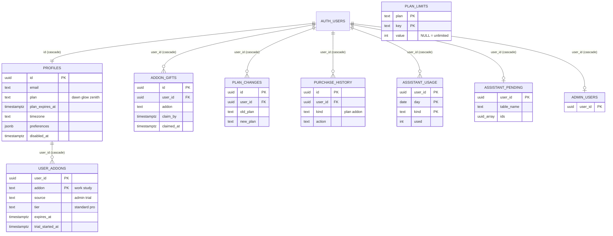
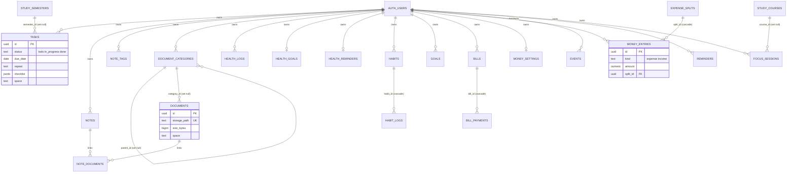
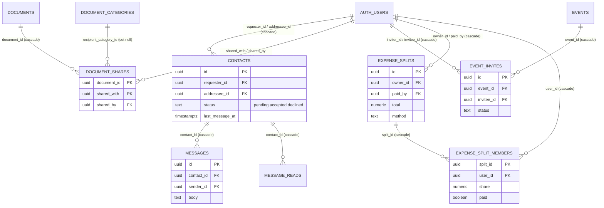
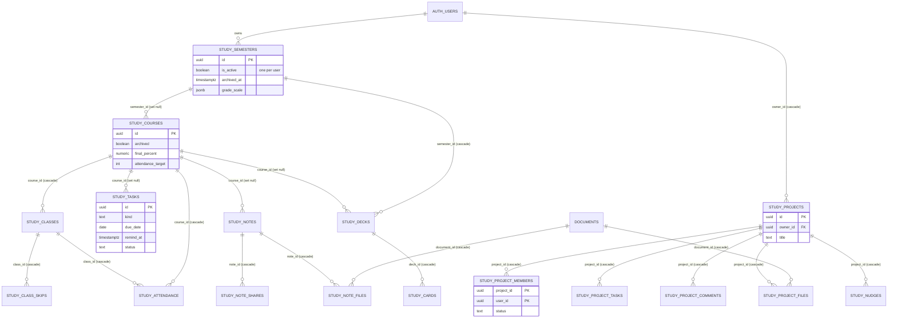
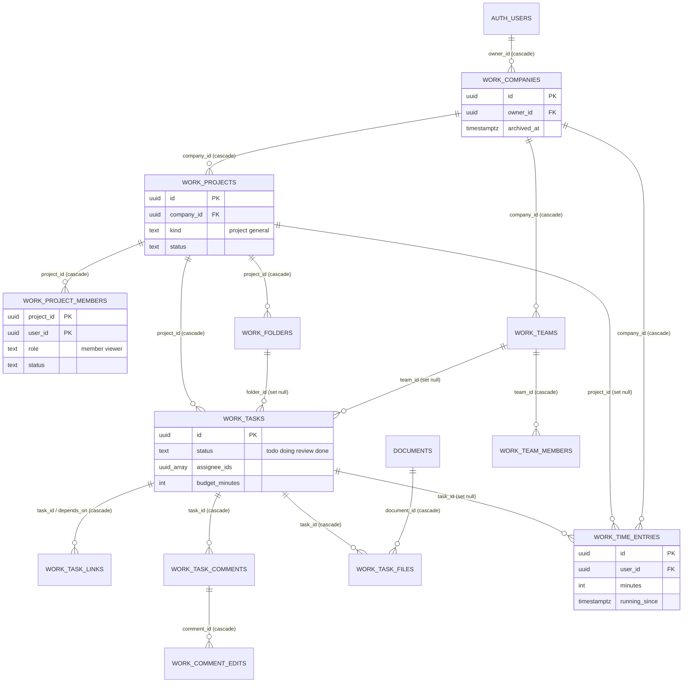
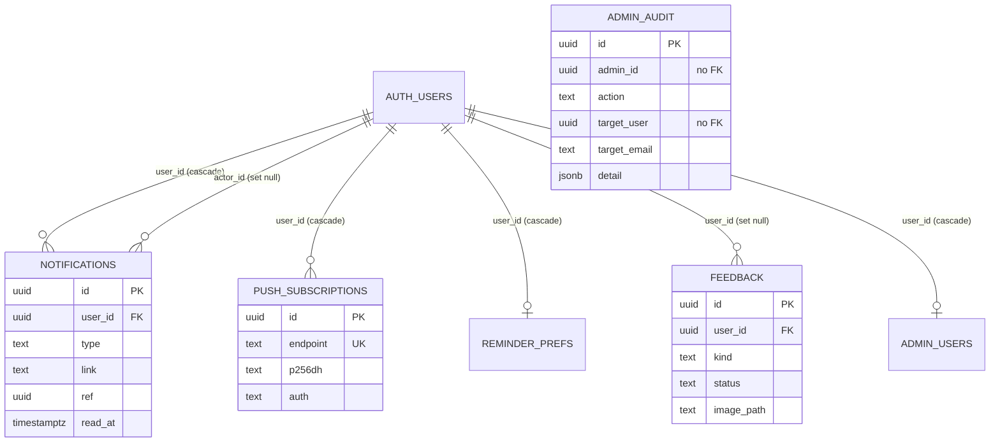

# Database design

**Product:** LUMA (personal OS). **Database:** Supabase Postgres, schema `luma`. **Sources read for this document:** all 85 files in `supabase/migrations/` (001 – 085), `supabase/setup/push_webhook.sql`, `supabase/reset/00_RESET_EVERYTHING.sql`, `scripts/*`, the three Edge Functions, `CHANGELOG.md` (latest entry 0.26.4). Anything the code does not show is written "TBC".

Counts (from the migrations): **70 tables**, **198 functions** (145 callable or helper functions + 53 trigger functions; one more trigger function, `send_push_webhook`, lives in `supabase/setup/`), **15 pg_cron jobs**, **3 storage buckets**, **2 realtime tables**, **85 migrations**.

Contents

1. Conventions
2. Overview diagrams (ERD by area)
3. Table catalogue (A identity and plans · B personal modules · C contacts, chat and sharing · D Study · E Work · F notifications, feedback and admin)
4. Function and RPC catalogue
5. Trigger functions and triggers
6. pg_cron jobs
7. Storage buckets and policies
8. Realtime
9. Migration index
10. Data retention and account deletion
11. Backup and restore
12. Risks and observations

---

## 1. Conventions

### 1.1 Schema, extensions and API access

- Everything lives in schema **`luma`**; `auth.users` (Supabase Auth) is shared. `luma` must be added to **Exposed schemas** (Project Settings → Data API) or the REST / RPC calls fail (migration 001 header; `docs/STAGING_SETUP.md` Part 2).
- Extensions needed: **pg_cron** (every `luma-*` job), **pg_net** (only for `supabase/setup/push_webhook.sql`). Each migration that schedules a job wraps `create extension if not exists pg_cron` and `cron.schedule` in a `do $$ … exception when others then raise notice` block, so a missing extension does **not** stop the migration; it only prints a notice and the job is not created (a silent failure, see Risks).
- Migration 001 runs `grant all on all tables in schema luma to anon, authenticated` plus `alter default privileges … grant all on tables / sequences`. So **every new table starts with full privileges for `anon` and `authenticated`**; the real protection is **RLS** and, for closed tables, an explicit `revoke all … from anon, authenticated`.

### 1.2 Functions: `security definer` and `set search_path = ''`

- Almost every function is `security definer set search_path = ''` and refers to everything with the full `luma.` / `auth.` / `pg_catalog` name. This stops search-path hijacking and lets a function read tables the caller cannot.
- Exceptions (found in code): `luma.use_assistant`, `refund_assistant`, `assistant_left` (029) use `set search_path = luma, public`; the pure helpers `fmt12`, `hhmm_to_min`, `day_matches`, `days_text`, `rm_text`, `reminder_due`, `next_task_date`, `set_updated_at`, `set_task_completed_at`, `set_goal_completed_at`, `study_task_done` are `security invoker` (pure functions or fixed-name triggers); `my_deck_stats` (067) is `security invoker` with an empty search path and relies on RLS.
- Every **client-callable** RPC does `revoke execute … from public, anon` and `grant execute … to authenticated`. Internal helpers (`notify`, `limit_of`, `plan_of`, `has_addon`, `user_tz`, all `run_*` cron functions, `share_doc`, `unshare_doc`, …) are revoked from `public, anon, authenticated`; only the table owner (`postgres`, i.e. cron and other definer functions) can call them.
- Admin RPCs start with `if not luma.is_admin() then raise exception 'Not allowed'`.
- **Transaction-local flags** (set with `set_config(name, value, true)`) let a definer function bypass a guard trigger for one statement: `luma.allow_plan_change` (admin plan change, expiry job, deactivation), `luma.semester_rpc` (activate / archive / restore a semester), **`luma.moving`** (see 1.7).

### 1.3 RLS patterns

| Pattern | Used by | How it works |
|---|---|---|
| **P1 owner only** | tasks, notes, note_tags, document_categories, health_*, habits, habit_logs, goals, bills, bill_payments, money_*, events, reminders, reminder_prefs, focus_sessions, push_subscriptions, assistant_pending | One `for all` policy: `using (auth.uid() = user_id) with check (auth.uid() = user_id)`. Child tables (habit_logs, bill_payments, note_documents) also check that the parent row is the caller's. |
| **P2 add-on gated (Study)** | study_semesters, study_courses, study_classes, study_tasks, study_class_skips, study_breaks, study_attendance, study_decks, study_cards, study_notes | Four policies `<table>_read / _insert / _update / _delete`. **Read and delete: own rows only. Insert and update: own rows AND `luma.has_my_addon('study')`.** So when an add-on ends nothing is lost: the person can still read and delete, not add or change (migrations 045, 046, 049, 052, 053, 067). |
| **P3 closed table + RPC** | event_invites, study_projects, study_project_members, study_project_tasks, study_nudges, study_project_comments, study_project_files, study_note_files, study_note_shares, expense_splits, expense_split_members, work_project_members (select only), work_task_files, work_comment_edits, plan_changes, admin_*, user_addons / addon_gifts / purchase_history (select own only) | RLS on, `revoke all … from anon, authenticated` (sometimes `grant select`). Every read or write goes through a `security definer` function that checks who is asking. |
| **P4 role by function (Work)** | work_projects, work_tasks, work_folders, work_task_comments, work_task_links | Policies call `luma.work_role(project, auth.uid())` (owner / member / viewer / null) and `luma.work_can_edit(project)` (owner or member, AND the Work add-on is active, AND the company is not archived). A person without the add-on who was added to a project can only look. |
| **P5 admin-or-owner** | feedback, storage `luma-feedback` | `user_id = auth.uid() or luma.is_admin()`. |

### 1.4 "SELECT policy for new rows" rule

PostgREST `insert(...).select()` (and `RETURNING`) also requires the **SELECT policy to accept the just-inserted row**. A SELECT policy that only calls a helper which re-reads the same table (for example `work_role()` reading `work_projects`) cannot see a row inserted in the same statement, and the insert fails with "new row violates row-level security". The rule used in the code (migration 071, comment on `work_projects_read`): the SELECT policy checks the owner **directly** (`owner_id = auth.uid() or luma.work_role(id, auth.uid()) is not null`), so a brand-new row can be read back. New tables that the app inserts into with `.select()` must follow this rule. (Evidence: `work_projects_read`; the `work_teams` / `work_team_members` tables are insert-by-RPC, so they avoid the issue.)

### 1.5 `RETURNS TABLE` alias rule

In PL/pgSQL a `returns table (…)` column becomes a variable in the function body. If a column of the same name (`id`, `user_id`, `name`, `status`, `role`, `minutes` …) is used unqualified in a query inside the body, Postgres raises "column reference is ambiguous". The code consistently **qualifies every column with a table alias** inside such functions (`p.id`, `m.user_id`, `e.minutes` …; see `admin_list_users`, `work_project_members`, `work_project_time`, `event_attendees`). When the row type of an existing function changes, the migration `drop function if exists …` first, because `create or replace` cannot change a return type (error 42P13; stated in 001 and used in 007, 044, 055, 059, 062, 065, 078, 080, 083). A written rule file is TBC; the pattern is what the code does.

### 1.6 Limits: `plan_limits`, `limit_of`, `work_tier_plan`

- `luma.plan_limits (plan, key, value)`; `value NULL` = unlimited. `plan` is one of `dawn`, `glow`, `zenith` (user plans) or `work`, `work_pro` (Work add-on sizes, migration 083). Every signed-in user can read it; changes only by SQL or the admin RPC `admin_set_plan_limit` (existing rows only).
- `luma.plan_of(user)` returns `profiles.plan` (default `dawn`). **`luma.work_tier_plan(user)`** returns `work_pro` if the user has an active (`expires_at` null or in the future) `user_addons` row with `addon='work'` and `tier='pro'`, else `work`.
- **`luma.limit_of(user, key)`**: if `key like 'work\_%'` it reads the row of `work_tier_plan(user)`, otherwise the row of `plan_of(user)`. The Work limits therefore follow the **Work add-on size, not the plan** (083). Returns NULL when unlimited or when the row is missing; callers use `coalesce(limit_of(...), <default>)` (for Work: 20 / 60 / 15 / 1500 / 20).
- `luma.my_limits()` returns one JSON object (`plan`, `plan_expires_at`, `limits`, `addons`, `addon_info` with `source / expires_at / tier`, `trials_used`); the app and `lumi` call it.
- Enforcement is in the database: generic trigger `luma.enforce_limit(key, where-sql, label)` on habits (not archived), goals (`completed_at is null`), bills, reminders; `enforce_contact_limit` (accepted + own pending requests); `enforce_doc_limits` (file size and total storage); `enforce_message_limit` (daily chat); `enforce_reminder_timing` and `enforce_health_reminder_timing` (Dawn cannot change reminder times); `save_split` (key `split`); the Work guards (`work_company_guard`, `work_project_guard`, `work_task_guard`, `work_invite`, `work_set_team`). Going over a limit after a downgrade keeps existing rows; it only blocks adding more.
- Some keys are read only by the client or by `lumi`: `lumi_questions`, `lumi_actions`, `insights`, `payroll`, `own_wallpaper`, `wallpapers`, `themes`, `timing` (also enforced by trigger).

Current default values (migrations 033, 037, 043, 064, 077, 083, 084):

| Key | Dawn | Glow | Zenith | Work | Work Pro | Meaning |
|---|---|---|---|---|---|---|
| lumi_questions | 3 | 10 | 15 | | | Lumi chat questions per day |
| lumi_actions | 0 | 1 | 1 | | | 0 = Lumi can only read and answer |
| insights | 0 | 3 | 10 | | | Analytics AI insights per day |
| storage_mb | 50 | 300 | 1000 | | | total document storage |
| file_mb | 5 | 20 | 50 | | | largest single file |
| reminders | 5 | 25 | unlimited | | | custom reminders |
| habits | 5 | 10 | unlimited | | | non-archived habits |
| goals | 3 | 5 | unlimited | | | active goals |
| bills | 5 | 12 | unlimited | | | bills and subscriptions |
| contacts | 3 | 12 | unlimited | | | accepted contacts + own pending requests |
| chat_messages | 50 | 50 | 50 | | | chat messages sent per day |
| timing | 0 | 1 | 1 | | | may choose reminder times / budget warning level |
| payroll | 0 | 1 | 1 | | | client-side feature flag |
| own_wallpaper | 0 | 0 | 1 | | | upload own wallpaper |
| wallpapers | 4 | 8 | 11 | | | built-in wallpapers |
| themes | 1 | 3 | 3 | | | client-side |
| split | 0 | 0 | 1 | | | split expenses |
| work_companies | | | | 5 | 20 | companies (active and archived both count) |
| work_projects | | | | 20 | 60 | projects per owner |
| work_people | | | | 8 | 15 | people on a project |
| work_tasks | | | | 600 | 1500 | tasks per project |
| work_teams | | | | 5 | 20 | teams per owner |

Fixed caps in code (not in `plan_limits`): Study 40 subjects, 200 classes, 1500 assignments, 30 semesters, 300 notes, 1000 cancelled dates, 100 breaks, 6000 attendance records, 200 decks, 20000 cards (`study_cap`); 20 group projects (3 without the add-on), 12 members, 200 tasks, 500 comments, 30 files per project; Work: 40 folders per project, 20 files and 500 comments per task, 10 assignees, 10 dependencies, 20000 time entries, 50 team members; 30 guests per event; 10 feedback messages per day.

### 1.7 The `space` column and the `luma.moving` flag

- **`space`** (migration 050): `text not null default 'personal' check (space in ('personal','work','study'))` on **tasks, events, reminders, notes, documents, habits, goals, bills, money_entries**, each with index `<table>_space_idx (user_id, space)`. Trigger **`check_space`** (before insert or update of space) silently rewrites `work` / `study` to `personal` when the user does not have that add-on active (`luma.has_addon`). The app files each new item under the current mode; the "Show Work / Study in Personal" switches are client-side filters.
- **`semester_id`** (056): the same nine tables plus `study_notes`, `study_projects`, `study_tasks`, `study_courses` get `semester_id → study_semesters on delete set null`. Trigger **`zz_assign_semester`** (`assign_semester`, before insert; the `zz_` prefix makes it run after `check_space`) fills it with the user's active semester for Study items and **raises "Activate a semester first…"** when there is none (except a group project by someone without the add-on, 058).
- **`luma.moving`**: a transaction-local setting (`set_config('luma.moving','1',true)`) that `work_move_task` and `work_move_project` (078, 080) turn on while they change `work_tasks.project_id` / `work_projects.company_id` and the child rows. The guard triggers `work_task_guard`, `work_project_guard` and `work_comment_edit_guard` refuse such a change ("Use Move to put a task in another project") unless `current_setting('luma.moving', true) = '1'`. The functions reset it to `''` at the end; as it is transaction-local it also disappears on error.

### 1.8 `notify()` (6-argument form)

- `luma.notify(p_user, p_type, p_title, p_body, p_link, p_ref uuid)` (migration 064) inserts a row into `luma.notifications`; **`ref`** is the id of the thing the notification is about (document, contact, event, project, task, bill, …) so the app can scroll to it and highlight it (070). The older **5-argument** form `notify(user, type, title, body, link)` (008) still exists and is used by `admin_set_plan`, `start_addon_trial`, `admin_set_addon`, `run_plan_expiry`, `notify_welcome`. Both are revoked from `public, anon, authenticated`.
- Because `supabase/setup/push_webhook.sql` puts an `after insert` trigger on `luma.notifications`, **every notification row is also a Web Push** (see `EDGE-FUNCTIONS.md`). Several cron jobs insert directly into `luma.notifications` instead of calling `notify()`.
- Notification `type` values seen in code: `welcome, share, contact_request, contact_accepted, nudge, message, system, gift, reminder_water, reminder_steps, reminder_active, reminder_sleep, reminder_habit, reminder_subscription, reminder_event, reminder_task, reminder_bill, reminder_goal, reminder_custom, reminder_study, reminder_class, reminder_project, reminder_work, budget_warn, budget_over, weekly_review, busy_day, event_invite, event_invite_reply, note_share, project_invite, project_reply, project_task, project_comment, split, split_nudge, work_invite, work_reply, work_task, work_comment, work_mention, work_budget, work_team, feedback, feedback_reply`. There is no CHECK constraint on `type` (free text).

### 1.9 Time zones

- `profiles.timezone` is an IANA name chosen at sign-up or in Edit profile. **`luma.user_tz(user)`** returns it only if it exists in `pg_timezone_names`, otherwise `'Asia/Kuala_Lumpur'`. All user-facing cron jobs convert `now()` with `timezone(luma.user_tz(user), now())` and compare the local hour / minute (so a job that runs every hour acts only for people whose local clock matches).
- Hard-coded Malaysia time (not per user): `work_time_entries.work_date` default, `work_companies` end-date stamping on archive (074, 077), the very first version of `run_health_reminders` (014, replaced by 028), `admin_monthly_stats` months are cut at UTC midnight (040).
- Stored dates for habits, health, bills are plain `date` values chosen by the client in the user's own day.

### 1.10 Other conventions

- Primary keys are `uuid default gen_random_uuid()`; owner columns are `user_id` (or `owner_id` for projects, companies, teams, splits) `references auth.users(id) on delete cascade`, often `default auth.uid()`.
- `updated_at` is kept by `luma.set_updated_at()` (before update) on many tables; other tables update `updated_at` inside their own guard trigger.
- Colour columns check `^#[0-9a-fA-F]{6}$`; time-of-day text columns check `^([01][0-9]|2[0-3]):[0-5][0-9]$`.
- Migrations are written to be re-runnable (`if not exists`, `drop … if exists`, `create or replace`); `supabase/ALL_MIGRATIONS.sql` is the concatenation made by `scripts/build-all-migrations.py`.
- Error messages raised by functions are written for people ("Plan limit: …", "Not allowed", "Only the project owner can …") and shown by the app.

---

## 2. Overview diagrams

Attribute lists are reduced to keys and the columns that matter. `PK` primary key, `FK` foreign key. All `user_id` / `owner_id` columns reference `auth.users` (shown as `AUTH_USERS`) with `on delete cascade` unless a note says otherwise.

### 2.1 Identity, plans, add-ons, Lumi

### 2.2 Personal modules

### 2.3 Contacts, chat, sharing

### 2.4 Study

### 2.5 Work

### 2.6 Notifications, push, feedback, admin

---

## 3. Table catalogue

Legend: **FK** = foreign keys and what happens on delete. "Owner policy" means pattern P1 (section 1.3). All tables have `grant all … to anon, authenticated` from 001 unless the entry says "closed" (revoked). Migration numbers are in brackets.

### A. Identity, plans, add-ons, Lumi

#### A1. `profiles` (001, 023, 028, 033, 062, 065)
- **Purpose:** one row per user; account settings and plan.
- **Key columns:** `id uuid PK` (= `auth.users.id`); `first_name`, `last_name`; `email text not null`; `plan text not null default 'dawn'` check in (dawn, glow, zenith); `plan_expires_at timestamptz`; `theme text default 'midnight'`; `background_url text`; `preferences jsonb default '{}'` (client settings such as `weekly`, `focus`, `busy_alerts`, `busy_push`, `busy_level`); `country`; `timezone`; `disabled_at timestamptz`, `disabled_reason text`; `created_at`, `updated_at`.
- **FK:** `id → auth.users(id) on delete cascade`.
- **Indexes:** primary key only (no unique index on `email`: TBC / see Risks).
- **RLS:** select own (`auth.uid() = id`); update own. No insert policy (rows are created by trigger `handle_new_user`) and no delete policy (removed by cascade from `auth.users`). Plan, `plan_expires_at`, `disabled_at`, `disabled_reason` cannot be changed by the user: triggers revert them unless a definer function set `luma.allow_plan_change`.
- **Triggers:** `set_luma_profiles_updated_at`; `protect_luma_profiles_plan` (protect_plan, before insert or update); `protect_luma_profiles_disabled`; `log_plan_change` (after update of plan, writes `plan_changes`); `log_plan_history` (after update of plan, plan_expires_at; writes `purchase_history`); `notify_welcome_on_profile` (after insert); `seed_document_categories_on_profile` (after insert). `on_auth_user_created` on `auth.users` inserts the profile from `raw_user_meta_data` (first_name, last_name, country, timezone).

#### A2. `plan_limits` (033, 037, 043, 064, 077, 083, 084)
- **Purpose:** every plan and Work-size limit in one place (section 1.6).
- **Key columns:** `plan text` check in (dawn, glow, zenith, work, work_pro), `key text`, `value integer` (NULL = unlimited). **PK** `(plan, key)`.
- **RLS:** select for everyone (`using (true)`); no write policy (`grant select … to authenticated` only). Written by SQL or `admin_set_plan_limit`.

#### A3. `plan_changes` (036, 040)
- **Purpose:** log of every plan change (written by trigger `log_plan_change`; feeds `admin_monthly_stats`).
- **Columns:** `id`, `user_id` (FK auth.users cascade), `old_plan`, `new_plan not null`, `changed_by` (FK auth.users **set null**), `changed_at`.
- **RLS:** closed (RLS on, no policy, privileges revoked). Read only by admin RPCs.

#### A4. `purchase_history` (063)
- **Purpose:** what a person can see as their plan and add-on history (trial started, started, extended, ended, removed).
- **Columns:** `id`, `user_id` (FK auth.users cascade), `kind` in (plan, addon), `item` (glow / zenith / dawn or work / study), `action` in (trial, started, extended, ended, removed), `ends_at`, `created_at`.
- **Index:** `purchase_history_user_idx (user_id, created_at desc)`.
- **RLS:** select own (`user_id = auth.uid()`); `grant select` only. Rows come from triggers `log_addon_history` (on `user_addons`) and `log_plan_history` (on `profiles`); migration 063 also back-fills existing plans and add-ons once.

#### A5. `user_addons` (044, 062 behaviour, 083)
- **Purpose:** who has which add-on, with an end date.
- **Columns:** `user_id` (FK **`luma.profiles`** cascade), `addon` in (work, study), `source` in (admin, trial), `tier` in (standard, pro) default standard (083; only meaningful for Work), `started_at`, `expires_at` (NULL = no end), `trial_started_at` (set once; the one-time 7-day trial), `granted_by uuid` (no FK). **PK** `(user_id, addon)`.
- **RLS:** select own (`user_addons_read`, to authenticated); `grant select` only; all writes through `admin_set_addon`, `admin_give_trial`, `admin_reset_trial`, `admin_bulk_grant`, `start_addon_trial`, `claim_gift`. Removing an add-on sets `expires_at = now()` so "trial already used" history stays.
- **Triggers:** `log_addon_history` (after insert or update, writes `purchase_history`).

#### A6. `addon_gifts` (069)
- **Purpose:** a free add-on time an admin sends; the person starts it later ("Use now").
- **Columns:** `id`, `user_id` (FK auth.users cascade), `addon`, `days` (1–366) **xor** `months` (1–24), `message` (≤120), `claim_by timestamptz` (NULL = no deadline), `granted_by` (FK auth.users **set null**), `created_at`, `claimed_at`.
- **Index:** `addon_gifts_user_idx (user_id, created_at desc)`.
- **RLS:** select own; no write privilege. Written by `admin_bulk_gift`, `claim_gift`. Max 3 unused gifts per person.

#### A7. `assistant_usage` (029)
- **Purpose:** Lumi allowance counter per user, day and kind (`chat`, `insights`).
- **Columns:** `user_id` (FK auth.users cascade), `day date`, `kind text`, `used integer`. **PK** `(user_id, day, kind)`.
- **RLS:** select own only (`grant select`); written by `use_assistant` / `refund_assistant`. "Day" follows the user's time zone (`user_tz`).

#### A8. `assistant_pending` (051)
- **Purpose:** the preview list for Lumi's two-step delete.
- **Columns:** `user_id PK` (FK auth.users cascade), `table_name` check in (tasks, events, reminders, notes, money_entries, habits, goals, bills, study_tasks, study_courses), `ids uuid[]`, `summary`, `request_id text`, `created_at`.
- **RLS:** owner policy (P1, to authenticated); one row per user, replaced by the next preview, deleted once used. Lumi treats a preview older than 15 minutes as expired (in the Edge Function, not in SQL).

### B. Personal modules

#### B1. `tasks` (002, 026, 050, 056, 066)
- **Purpose:** to-do items.
- **Columns:** `id`, `user_id`, `title` (non-blank), `status` in (todo, in_progress, done), `priority` in (low, med, high), `tag text default 'Personal'`, `due_date`, `completed_at`, `notes` (≤2000, 026), `repeat` in (none, daily, weekdays, weekly, monthly, yearly) (066), `checklist jsonb` array ≤30 of `{t, d}`, `next_spawned_at`, `space`, `semester_id`, timestamps.
- **Indexes:** `tasks_user_status (user_id, status, due_date)`, `tasks_space_idx`, `tasks_semester_idx`.
- **RLS:** owner policy.
- **Triggers:** `set_luma_tasks_updated_at`; `set_luma_tasks_completed_at` (stamps / clears `completed_at`); `check_space`; `zz_assign_semester`; `spawn_next_task` (after update of status: when a repeating task becomes done it inserts the next one dated after today, in the user's time zone; errors are swallowed with a NOTICE so finishing a task always works).

#### B2. `notes` (005, 050, 056)
- Columns `id`, `user_id`, `title` (default ''), `body` (default ''), `tag`, `space`, `semester_id`, timestamps. Index `notes_user_updated (user_id, updated_at desc)`. Owner policy. Triggers: `set_luma_notes_updated_at`, `check_space`, `zz_assign_semester`.

#### B3. `note_documents` (005)
- Link between a note and a document. **PK** `(note_id, document_id)`; FK `note_id → notes` cascade, `document_id → documents` cascade; index on `document_id`. RLS: `for all` when the note is the caller's; on insert the document must be visible to the caller (`exists (select 1 from luma.documents …)`, which RLS limits to own or shared). No triggers.

#### B4. `note_tags` (006)
- Colour per note tag name. Columns `id`, `user_id`, `name`, `color` (hex, not null). Unique index `note_tags_user_name (user_id, lower(name))`. Owner policy.

#### B5. `document_categories` (003, 006, 007)
- User-editable folders for documents. Columns `id`, `user_id`, `name`, `parent_id → document_categories on delete set null` (children are promoted to top level), `color` (hex or NULL), `created_at`. Unique index `(user_id, coalesce(parent_id, 0-uuid), lower(name))` (sibling names). Owner policy. Trigger `check_document_category_parent` (before insert or update of parent_id: parent must be the caller's, no cycle, max depth 5). Seeded with Contracts, Receipts, Finance, ID, Health, Warranty, Other by `seed_document_categories` on profile creation (migration 003 also back-filled existing users once, only users with no categories).

#### B6. `documents` (003, 004, 033, 050, 056)
- **Purpose:** file metadata; bytes are in bucket `luma-documents` at `storage_path`.
- **Columns:** `id`, `user_id`, `category_id → document_categories set null`, `name`, `mime_type`, `size_bytes bigint`, `storage_path text not null unique`, `space`, `semester_id`, timestamps.
- **Indexes:** `documents_user_created (user_id, created_at desc)`, `documents_category`, `documents_space_idx`, `documents_semester_idx`.
- **RLS:** "Users manage their own documents" (for all; the category must be the caller's or null); "Recipients can view shared documents" (select when a `document_shares` row exists for the caller).
- **Triggers:** `set_luma_documents_updated_at`; `enforce_plan_documents` (before insert: `file_mb` and `storage_mb`); `check_space`; `zz_assign_semester`.

#### B7. `health_logs` (011, 013)
- One row per user per day (`unique (user_id, log_date)`); every metric optional: `sleep_hours` 0–24, `water_ml` 0–20000, `steps` 0–200000, `active_minutes` 0–1440, `mood` 1–5, `note`, `bedtime`, `wake_time` (HH:MM text). Index `(user_id, log_date desc)`. Owner policy. Trigger `set_luma_health_logs_updated_at`. (No `space` column.)

#### B8. `health_goals` (011, 012)
- One row per user (`user_id PK`): daily targets `sleep_hours` (8), `water_ml` (2500), `steps` (10000), `active_minutes` (45) and the quick-add amounts `quick_*`. Owner policy; trigger `set_luma_health_goals_updated_at`.

#### B9. `health_reminders` (013, 015, 039)
- One row per user: water / steps / active each with `*_enabled`, `*_every_min`, `*_from`, `*_to`; sleep with `sleep_enabled`, `bedtime`, `wake_time`, `sleep_lead_min`. Defaults: water every 60 min 08:00–22:00; steps and active every 180 min 10:00–20:00; bed 23:00, wake 07:00, lead 30. Owner policy. Triggers `set_luma_health_reminders_updated_at`; `enforce_plan_health_reminder_timing` (on Dawn the times must equal the defaults; only the on/off switches may change).

#### B10. `habits` (016, 017, 018, 033, 050, 056)
- **Columns:** `name` (≤80), `icon` (`fa-…`), `color`, `target`, `days smallint[]` (0 = Sunday … 6), `archived`, `period` in (daily, weekly, monthly), `per_period` 1–31, `goal_value`, `unit`, `source` in (manual, sleep), `reminder_time` (HH:MM, user's time zone), `space`, `semester_id`.
- **Index:** `habits_user (user_id, archived, created_at)`, space, semester. Owner policy.
- **Triggers:** `set_luma_habits_updated_at`; `enforce_plan_habits` (limit key `habits`, counts non-archived); `check_space`; `zz_assign_semester`.

#### B11. `habit_logs` (016, 017)
- A done day: **PK** `(habit_id, log_date)`; FK `habit_id → habits` cascade; `value numeric` for measurable habits. Index `(user_id, log_date desc)`. Owner policy; insert also requires the habit to be the caller's. No triggers.

#### B12. `goals` (019, 033, 050, 056)
- `title`, `category` in (Finance, Health, Learning, Career, Personal, Other), `unit`, `target_value > 0`, `current_value >= 0`, `deadline`, `note`, `completed_at`, `space`, `semester_id`. Index `goals_user (user_id, created_at)`. Owner policy. Triggers: updated_at; `set_luma_goals_completed_at` (stamps when current ≥ target, clears when below); `enforce_plan_goals` (counts rows with `completed_at is null`); `check_space`; `zz_assign_semester`.

#### B13. `bills` (020, 021, 022, 033, 050, 056)
- Bills and subscriptions (a subscription is a bill with category `Subscription`). `name`, `amount > 0`, `category` (10 values), `recurrence` in (once, weekly, monthly, yearly), `due_date` (first due date), `note`, `active` (pause), `space`, `semester_id`. Index `bills_user (user_id, due_date)`. Owner policy. Triggers: updated_at; `enforce_plan_bills`; `check_space`; `zz_assign_semester`.

#### B14. `bill_payments` (020)
- One row per bill per paid due date. **PK** `(bill_id, due_date)`; FK `bill_id → bills` cascade; `amount`, `paid_at`. Index `(user_id, due_date desc)`. Owner policy (the bill must be the caller's). Used by budget alerts and the weekly review.

#### B15. `money_settings` (023, 024)
- One row per user: `gross_salary`, `epf_rate` 0–11, `marital`, `children` 0–30, `other_relief`, `pay_day` 1–31, `monthly_budget`, `pcb_override` (NULL = estimate). Owner policy; trigger updated_at.

#### B16. `money_entries` (023, 050, 056, 064)
- Hand-logged income / expense: `kind` in (expense, income), `amount > 0`, `category` (≤40), `name` (≤80), `entry_date`, `space`, `semester_id`, **`split_id → expense_splits on delete cascade`** (064: the person's own share of a split). Indexes `(user_id, entry_date desc)`, `money_entries_split_idx` (partial), space, semester. Owner policy. Triggers `check_space`, `zz_assign_semester`.

#### B17. `events` (027, 050, 056)
- Calendar event (a repeating event is one row). `title`, `category` in (Work, Meeting, Personal, Health, Social, Other), `event_date`, `all_day`, `start_time` / `end_time` (HH:MM text), `repeats` in (none, daily, weekly, monthly, yearly), `note`, `space`, `semester_id`. Index `events_user_date (user_id, event_date)`. Owner policy for the owner; invited people read the event only through `my_invited_events()`. Triggers: updated_at, `check_space`, `zz_assign_semester`.

#### B18. `reminders` (032, 033, 050, 056)
- User's own reminders. `title`, `note`, `kind` in (once, daily, weekdays, weekends, weekly, monthly, yearly, month_last_day, month_last_weekday), `start_date`, `remind_time` (HH:MM), `days smallint[]` (weekly), `active`, `last_fired_on`, `space`, `semester_id`. Index `reminders_user (user_id, active)`. Owner policy. Triggers: updated_at; `enforce_plan_reminders`; `check_space`; `zz_assign_semester`. Archiving a semester sets `active=false` on its reminders (056).

#### B19. `focus_sessions` (041, 045)
- Completed Focus-mode sessions: `minutes` 1–240, `sound`, `started_at`, `course_id → study_courses on delete set null` (045). Indexes `(user_id, started_at desc)`, `(course_id)`. Owner policy. No `space` column.

### C. Contacts, chat, sharing

#### C1. `contacts` (001, 033)
- One row per **unordered pair**: `requester_id`, `addressee_id` (both FK auth.users cascade, `check (requester_id <> addressee_id)`), `status` in (pending, accepted, declined), `last_message_at`, timestamps. **Unique index** `contacts_unique_pair (least(requester,addressee), greatest(requester,addressee))`. Re-requesting after a decline flips the roles and resets to pending (`request_contact`).
- **RLS:** select if participant; insert if `requester_id = auth.uid()`; update only by the addressee and only to accepted / declined; delete by either participant.
- **Triggers:** `set_luma_contacts_updated_at`; `notify_on_contact_change` (request and acceptance notifications, with ref); `enforce_plan_contacts` (before insert or update: counts accepted contacts + own pending requests; accepting also counts for the addressee).

#### C2. `messages` (001, 037)
- 1:1 chat; the contact row is the conversation. `contact_id → contacts` cascade, `sender_id → auth.users` cascade, `body` (non-blank), `created_at`. Index `messages_contact_id_created_at`. **RLS:** select and insert only when the contact is `accepted` and the caller is a participant (insert also `sender_id = auth.uid()`); no update or delete policy (messages cannot be edited or deleted by users). **Realtime:** yes. **Triggers:** `enforce_chat_limit` (daily limit, key `chat_messages`); `touch_contact_last_message`; `notify_on_new_message` (replaces the receiver's previous unread message notification from the same sender, then inserts a new one with the first 120 characters).

#### C3. `message_reads` (001)
- Per-user last-read marker. **PK** `(contact_id, user_id)`, FK cascade both. Owner-style policies (select, insert, update own).

#### C4. `document_shares` (004, 007)
- A document shared with an accepted contact. **PK** `(document_id, shared_with)`; FK `document_id → documents` cascade, `shared_with` and `shared_by` → auth.users cascade; `check (shared_with <> shared_by)`; `recipient_category_id → document_categories set null` (the recipient's own filing). Index on `shared_with`.
- **RLS:** select by owner or recipient; insert only by the owner of the document to an accepted contact (`owns_document`, `is_accepted_contact`); delete by owner or recipient; no update policy (filing goes through `set_shared_document_category`).
- **Triggers:** `notify_on_document_share`. Rows are also created and removed by helper functions `share_doc` / `unshare_doc` (Study and Work attachments).

#### C5. `event_invites` (048)
- Guests of a calendar event. `event_id → events` cascade, `inviter_id`, `invitee_id` → auth.users cascade, `status` in (pending, accepted, declined), `responded_at`, **unique** `(event_id, invitee_id)`; index `(invitee_id, status)`. **Closed table** (P3). Functions: `invite_to_event`, `respond_event_invite`, `uninvite_from_event`, `my_invited_events`, `event_attendees`. Max 30 guests per event; only accepted contacts.

#### C6. `expense_splits` (064)
- Shared bill. `owner_id` and **`paid_by`** → auth.users cascade, `title` (≤80), `total numeric(12,2) > 0` (tax included), `split_date`, `note`, `method` in (equal, exact, percent, shares), `subtotal`, `tax_label`, timestamps. **Closed.** Zenith only (`limit_of(user,'split') ≥ 1`), enforced in `save_split`.

#### C7. `expense_split_members` (064)
- **PK** `(split_id, user_id)`; `split_id → expense_splits` cascade, `user_id → auth.users` cascade; `share numeric(12,2) ≥ 0`, `paid`, `paid_at`, `last_nudged_at`. Index on `user_id`. **Closed.** Only the payer can mark paid or nudge (once per 6 hours). The owner's own share also exists as a `money_entries` row (`split_id`).

### D. Study

All Study tables follow P2 unless stated. Study semesters and subjects are per user; group projects (D12–D18) are shared between accepted members and are closed tables (P3).

#### D1. `study_semesters` (049, 055, 056, 061)
- `name` (≤60), `start_date`, `end_date` (end > start), `archived_at`, `is_active`, `remark` (≤1000), `grade_scale jsonb` (array of 2–20 rows). **Partial unique index `study_semesters_one_active (user_id) where is_active`** (one active semester per user). Cap 30 (`study_cap`). Trigger `protect_semester_flags` reverts `is_active` / `archived_at` changes unless `luma.semester_rpc='on'`; flags change only through `activate_study_semester`, `archive_study_semester`, `restore_study_semester`; `delete_study_semester` removes an archived one with all contents.

#### D2. `study_courses` (045, 049, 061, 067)
- Subjects. `name` (1–80), `code`, `color`, `lecturer`, `credit_hours` 0–30, `archived`, `semester_id → study_semesters set null`, `target_percent`, `final_percent` (0–100), `grade_scale jsonb`, `attendance_target` 0–100 (default 80). Indexes on `user_id`, `semester_id`. Triggers: `study_courses_cap` (40), `study_courses_semester_owner` (semester must be the user's), `zz_assign_semester`.

#### D3. `study_classes` (045, 047)
- Weekly timetable rows. `course_id → study_courses` **cascade**, `weekday` 0–6, `start_time`, `end_time` (end > start), `room`, `kind` in (lecture, tutorial, lab, other), `start_date`, `end_date` (optional period). Index `(user_id, weekday)`. Triggers: `study_classes_owner` (subject must be the user's), `study_classes_cap` (200).

#### D4. `study_tasks` (045, 060)
- Assignments, quizzes, tests, exams, projects: `course_id → set null`, `title`, `kind`, `due_date`, `due_time`, `weight` 0–100, `score`, `max_score`, `status` in (todo, in_progress, done), `notes`, `completed_at`, `remind_at`, `reminded_at`, `semester_id`. Index `(user_id, due_date)`, `semester_id`. Triggers: owner check, cap 1500, `study_task_done`, `zz_assign_semester`.

#### D5. `study_class_skips` (052)
- Cancel one session: `class_id → study_classes` cascade, `skip_date`, **unique** `(class_id, skip_date)`; triggers `study_class_skips_owner`, `study_class_skips_cap` (1000).

#### D6. `study_breaks` (052)
- Break weeks / holidays: `name`, `start_date`, `end_date` (≥ start); cap 100.

#### D7. `study_attendance` (067)
- `class_id → study_classes` cascade, `course_id → study_courses` cascade, `att_date`, `status` in (present, late, absent, excused), `semester_id → study_semesters set null`, **unique** `(class_id, att_date)`; index `(user_id, att_date desc)`. Triggers: `study_attendance_owner` (class must be the user's and match the subject), `zz_assign_semester`, cap 6000.

#### D8. `study_decks` (067)
- Flashcard decks: `course_id → set null`, `title`, **`semester_id → study_semesters on delete cascade`** (deleting an archived semester removes its decks), timestamps. Triggers: owner check, `zz_assign_semester`, cap 200.

#### D9. `study_cards` (067)
- `deck_id → study_decks` cascade, `front` ≤500, `back` ≤1000, spaced-repetition fields `ease numeric(4,2)` (2.5), `interval_days`, `reps`, `lapses`, `due_on date`, `last_reviewed_at`. Indexes `(deck_id, due_on)`, `(user_id, due_on)`. Triggers: owner check + 500 cards per deck, cap 20000. `my_deck_stats(today)` returns totals and due counts.

#### D10. `study_notes` (053)
- `course_id → set null`, `title` (1–120), `body` ≤20000, `semester_id`, timestamps. Index `(user_id, course_id)`. Triggers: updated_at, owner check, cap 300, `zz_assign_semester`, `note_cleanup_shares` (before delete: un-shares attached documents).

#### D11. `study_note_shares` (053, 059)
- Note shared with a contact. **PK** `(note_id, shared_with)`; `can_edit boolean` (059). **Closed.** Functions `share_study_note`, `unshare_study_note`, `set_study_note_edit`, `study_note_shared_with`, `shared_study_notes`, `update_shared_study_note`. Max 30 people per note.

#### D12. `study_note_files` (058)
- Documents attached to a note: `note_id → study_notes` cascade, `document_id → documents` cascade, unique `(note_id, document_id)`. **Closed.** `attach_note_file`, `detach_note_file`, `note_files`. Max 10 per note. Attaching shares the document with the people the note is shared with.

#### D13. `study_projects` (054, 056)
- Group project: `owner_id → auth.users` cascade, `title`, `course_name`, `due_date`, `notes` ≤5000, `semester_id`, timestamps. **Closed.** Triggers: `project_cleanup_shares` (before delete), `zz_assign_semester`. Functions: `create_study_project` (20 projects; 3 without the Study add-on), `update_study_project`, `delete_study_project`, `my_study_projects`, `study_project_detail`.

#### D14. `study_project_members` (054)
- **PK** `(project_id, user_id)`; `status` in (pending, accepted, declined); `invited_by → set null`; index `(user_id, status)`. **Closed.** `invite_to_study_project` (only accepted contacts; max 12), `respond_study_project`, `leave_study_project`.

#### D15. `study_project_tasks` (054)
- `project_id` cascade, `title`, `assignee_id → auth.users set null`, `status`, `due_date`, `created_by → set null`, timestamps. Index `(project_id)`. **Closed.** `add_study_project_task`, `update_study_project_task`, `delete_study_project_task`. Reminders by `run_group_task_reminders`.

#### D16. `study_nudges` (054)
- Rate-limit log for nudges: `from_user`, `to_user` → auth.users cascade, `project_id` cascade; index `(from_user, to_user, project_id, created_at desc)`. **Closed.** One nudge to the same person per project per 6 hours (`nudge_study_project_member`). Rows are never purged.

#### D17. `study_project_comments` (058)
- `project_id` cascade, `user_id → auth.users` cascade, `body` 1–1000; index `(project_id, created_at)`. **Closed.** `add_project_comment` (500 per project; notifies teammates at most once per 10 minutes per person), `project_comments`, `delete_project_comment`.

#### D18. `study_project_files` (058)
- `project_id` cascade, `document_id → documents` cascade, `added_by`, unique `(project_id, document_id)`; index on `document_id`. **Closed.** `attach_project_file` (30 per project; shares with every accepted member), `detach_project_file`, `project_files`.

### E. Work

Work tables follow P4. A person needs the Work add-on to create or change anything; invited people without it are read-only. An archived company freezes everything under it (`work_can_edit` returns false).

#### E1. `work_companies` (074, 077)
- `owner_id → auth.users` cascade, `name` (1–80), `archived_at`, `start_date`, `end_date` (start ≤ end), `position` (job title ≤80), timestamps. Index `(owner_id, created_at)`.
- **RLS:** select own; insert own with Work add-on; update own with Work add-on; **delete only when archived** (`archived_at is not null`).
- **Trigger:** `work_companies_guard` (limit `work_companies`; owner cannot change; archiving stamps `end_date` in Malaysia time, restoring clears it).

#### E2. `work_projects` (071, 073, 074)
- `owner_id` cascade, `company_id → work_companies` **cascade**, `name`, `client`, `color`, `status` in (active, on_hold, done, archived), `deadline`, `description` ≤2000, `kind` in (project, general), timestamps. Indexes `(owner_id, created_at desc)`, `(company_id)`.
- **RLS:** select if owner or any role on the project; insert own with add-on; update own with add-on; delete own.
- **Triggers:** `work_projects_guard` (limit `work_projects`, company must be the owner's and not archived, default company "My company" created if none, company change only with `luma.moving`); `work_projects_phases` (after insert: six fixed phases as `work_folders` when `kind='project'`); `work_projects_cleanup_files` (before delete).

#### E3. `work_project_members` (071)
- **PK** `(project_id, user_id)`, `role` in (member, viewer), `status` in (pending, accepted, declined), `invited_by → set null`. Index `(user_id, status)`. **RLS:** select if own row or any role on the project; **no write privilege** (writes via `work_invite`, `work_respond`, `work_remove_member`, `work_set_role`). Invitees must be accepted contacts of the owner.

#### E4. `work_folders` (073)
- Phases (fixed, `is_phase=true`) and folders (only in `general` projects): `project_id` cascade, `name`, `notes` ≤8000, `position`, `is_phase`. **RLS:** read for project people; insert only non-phase with `work_can_edit`; update with `work_can_edit`; delete non-phase with `work_can_edit`. Triggers: `work_folders_guard` (max 40; phases keep their name and position; no moving between projects).

#### E5. `work_tasks` (071, 072, 073, 080, 084)
- `project_id` cascade, `title`, `description` ≤4000, `status` in (todo, doing, review, done), `priority`, `start_date`, `due_date` (start ≤ due), `position`, `checklist jsonb` (≤30), `assignee_ids uuid[]` (≤10; replaced the single `assignee_id` in 072), `folder_id → work_folders set null`, `team_id → work_teams set null`, `budget_minutes` 1–60000, `created_by → set null`, `completed_at`, timestamps.
- **Indexes:** `(project_id, status, position)`, GIN `work_tasks_assignees_idx (assignee_ids)`, `(folder_id)`, `(team_id)`.
- **RLS:** read for project people; insert / update with `work_can_edit`; delete by the owner or by the creator who can edit.
- **Triggers:** `work_tasks_guard` (task limit per owner's Work size; assignees must be on the project; no project change without `luma.moving`; stamps `completed_at`); `work_tasks_folder_guard`; `work_tasks_team_guard`; `work_tasks_assigned` (notifies newly added assignees); `work_tasks_cleanup_files` (before delete).

#### E6. `work_task_links` (080)
- "Waits for": **PK** `(task_id, depends_on)`, both → `work_tasks` cascade, `project_id → work_projects` cascade, `check (task_id <> depends_on)`. Select for project people; writes through `work_set_dependencies` (same project, ≤10, no loops).

#### E7. `work_task_comments` (075, 078, 080)
- `task_id` cascade, `project_id` cascade, `user_id` cascade, `body` 1–2000, `edited_at`, `mentions uuid[]` (≤10). Index `(task_id, created_at)`. **RLS:** read for project people; insert as self with `work_can_edit`; update as self with `work_can_edit` (column grants: only `body`, `mentions`); delete by the author or the project owner. Triggers: `work_comments_guard` (sets `project_id`, 500 per task, cleans mentions); `work_comments_edit` (keeps old wording, max 50 edits); `work_comments_notify` (insert) and `work_comments_notify_edit` (update of mentions) → `work_mention` and `work_comment` notifications.

#### E8. `work_comment_edits` (078)
- History of earlier wordings: `comment_id → work_task_comments` cascade, `old_body`, `edited_at`. **Closed**; read through `work_comment_history`.

#### E9. `work_task_files` (075)
- Documents on a task: `task_id` cascade, `project_id` cascade, `document_id → documents` cascade, `added_by`, unique `(task_id, document_id)`. **Closed**; `work_attach_file` (20 per task; shares with all project people), `work_detach_file`, `work_task_files_of`. Cleanup triggers on task and project delete.

#### E10. `work_time_entries` (076, 079)
- `user_id` cascade, `company_id → work_companies` cascade, `project_id → work_projects` **set null**, `task_id → work_tasks` **set null**, snapshots `project_name`, `task_title`, `work_date` (default Malaysia today), `minutes` 0–1440, `note` ≤200, `label` ≤100 (general time), `running_since`. Indexes `(user_id, work_date desc)`, `(task_id)`, `(project_id)`, **unique partial `work_time_one_timer (user_id) where running_since is not null`** (one running timer).
- **RLS:** read own; insert own with Work add-on; update own (with add-on); delete own. People see each other's totals only through `work_time_summary`, `work_time_totals`; the project owner sees the team through `work_project_time`.
- **Triggers:** `work_time_guard` (≤20000 entries, ≤24 h per day, project must be editable, company not archived; stopping a timer or an orphaned entry always works); `work_time_budget` (after insert or update: tells project people once when a task goes over `budget_minutes`).

#### E11. `work_teams` (084)
- `owner_id` cascade, `company_id → work_companies` cascade, `name` (1–60), `note` ≤140, `color`. **Unique** `(owner_id, company_id, lower(btrim(name)))`. RLS: select own only; `grant select` only. Writes via `work_set_team`, `work_delete_team`; list via `my_work_teams`.

#### E12. `work_team_members` (084)
- **PK** `(team_id, user_id)`, FK cascade both, `added_at`; index on `user_id`. RLS: select when the caller owns the team. Max 50 people; members must be the owner's accepted contacts (or the owner).

### F. Notifications, push, reminder settings, feedback, admin

#### F1. `notifications` (008, 009, 010, 035)
- **Purpose:** the inbox, and (via the webhook trigger) the source of every Web Push.
- **Columns:** `id`, `user_id` (cascade), `type text default 'system'`, `title not null`, `body`, `link` (app page, e.g. `documents`, `work`), `read_at`, `created_at`, `actor_id → auth.users on delete set null`, `ref uuid`.
- **Indexes:** `notifications_user_created (user_id, created_at desc)`, partial `notifications_user_unread (user_id) where read_at is null`, partial `notifications_nudge_rate (user_id, actor_id, created_at desc) where type='nudge'`.
- **RLS:** select, update, delete own. **No insert policy and insert revoked** for anon and authenticated: only definer functions create rows. A user can update any column of their own notifications (not only `read_at`).
- **Triggers:** `skip_muted_reminders` (before insert; drops habit / health reminders when `reminder_prefs.habit_on` / `health_on` is false by returning NULL); `send_push_on_notification` (after insert, from `supabase/setup/push_webhook.sql`, **not part of the migrations**). **Realtime:** yes.

#### F2. `push_subscriptions` (014)
- One row per browser / device: `user_id` (cascade), `endpoint text not null unique`, `p256dh`, `auth`, `user_agent`, `created_at`. Index on `user_id`. Owner policy. Deleted by the app when push is turned off and by `send-push` when the push service answers 404 or 410.

#### F3. `reminder_prefs` (031, 035, 045, 052, 060, 077)
- One row per user (`user_id PK`; no row = defaults). Per kind: `event_on`, `event_lead_min` (1–1440, 15), `allday_hour` (8); `task_on`, `task_hour` (9); `bill_on`, `bill_hour`, `bill_days` (1–14, 3); `sub_on/hour/days`; `goal_on/hour/days`; `budget_on`, `budget_pct` (50–100, 80); `habit_on`, `health_on`; `study_on`, `study_hour` (9), `study_days` (3), `study_due_lead_min` (15–240, 60); `class_on`, `class_lead_min` (5–60, 15); `work_on`, `work_hour` (9), `work_days` (1–14, 1). Owner policy. Triggers: updated_at; `enforce_plan_reminder_timing` (on Dawn only the on/off switches may differ from the defaults; the check was extended in 038, 045, 052, 060).

#### F4. `feedback` (081)
- **Columns:** `id`, `user_id → auth.users on delete SET NULL`, `user_label` (name and email snapshot), `kind` in (bug, idea, question, praise), `module` (1–60), `part` (≤80), `message` (3–4000), `image_path` (≤300), `context jsonb` (≤2000 chars), `status` in (new, seen, planned, done, wontfix), `admin_note` ≤1000, `handled_by → set null`, timestamps. Indexes `(status, created_at desc)`, `(user_id, created_at desc)`.
- **RLS:** select own or admin; insert as self; **no update or delete privilege** (admin changes via `admin_feedback_update`, `admin_feedback_delete`).
- **Triggers:** `feedback_guard` (10 per 24 h, picture path must start with the user's id, overwrites `status`/`admin_note`/`handled_by` on insert, builds `user_label`); `feedback_notify` (notifies up to 20 administrators).

#### F5. `admin_users` (036)
- `user_id PK → auth.users cascade`. RLS on with **no policies**, privileges revoked: nobody can read or write it from the app. Edited only in the SQL Editor or by `admin_set_admin`. `luma.is_admin()` reads it.

#### F6. `admin_audit` (065)
- `id`, `admin_id`, `action`, `target_user`, `target_email`, `detail jsonb`, `created_at`; **no foreign keys on purpose** (rows survive account deletion). Index `(created_at desc)`. Closed; `admin_log` writes it, `admin_recent_actions` reads it. The `account` function also inserts `delete_account` rows.

---

## 4. Function and RPC catalogue

"Caller" values: **user** = any signed-in user (`authenticated`), **admin** = signed-in user who passes `luma.is_admin()`, **owner/member** = rules inside the function, **internal** = not callable from the API (revoked; used by other functions or by cron), **cron** = called only by pg_cron. "Errors" lists the notable messages the function raises (shown to people). Return types are abbreviated.

### 4.1 Account, contacts, chat

| Function | Args | Returns | Caller | What it does / notable errors |
|---|---|---|---|---|
| `request_contact` (001) | `p_email text` | table(ok, reason, contact_id, other_id, other_first_name, other_last_name) | user | Looks up a profile by `lower(email)` (the only way to resolve an email), creates or re-opens a pending request. `reason`: `sent`, `not_found`, `self`, `already_accepted`, `already_pending`. A plan-limit trigger error can surface from the insert. |
| `list_contacts` (001) | none | table(contact_id, status, direction, other_id, other_first_name/last_name/email, last_message_at, created_at, has_unread) | user | Pending and accepted contacts with the other person's name and an unread flag, newest first. |
| `nudge_contact` (009) | `p_contact uuid` | table(ok, reason, retry_after) | user | Sends a `nudge` notification to the other person. Reasons `sent`, `not_found`, `too_soon` (one per sender to receiver per 180 s). |
| `chat_left_today` (037) | none | integer | user | Chat messages left today (NULL = unlimited). |
| `is_accepted_contact` (004) | `p_other uuid` | boolean | user (policy helper) | True if the caller and `p_other` are accepted contacts. |
| `is_contact` (054) | `p_a, p_b uuid` | boolean | internal | Same for any pair. |
| `display_name` (008) | `p_user` | text | internal | Name or email or "Someone" (used in notification texts). |
| `person_name` (048) | `p_user` | text | internal | Same idea (used by most later functions). |
| `messages_sent_today` (037) | `p_user` | integer | internal | Count since local midnight. |

### 4.2 Documents and sharing

| Function | Args | Returns | Caller | What it does / errors |
|---|---|---|---|---|
| `owns_document` (004) | `p_doc` | boolean | user (policy helper) | Caller owns the document. |
| `can_read_shared_file` (004) | `p_path text` | boolean | user (storage policy) | A document at this storage path is shared with the caller. |
| `list_shared_documents` (004, 007) | none | table(id, name, mime_type, size_bytes, storage_path, created_at, shared_at, owner_id, owner_first_name, owner_last_name, owner_email, recipient_category_id) | user | Documents others shared with me, with owner details. |
| `set_shared_document_category` (007) | `p_document, p_category` | void | user (recipient) | Files a shared document under one of my own categories (NULL = un-file). Errors "Invalid category.", "That document is not shared with you." |
| `seed_document_categories` (003) | `p_user` | void | internal | Default categories when the user has none. |
| `share_doc` / `unshare_doc` / `doc_linked` (058, 075) | doc, user, skip ids | void / void / boolean | internal | Create or remove a `document_shares` row for a person; a share is removed only when no Study note, Study project or Work task still attaches the document to something they can reach. |

### 4.3 Plans, add-ons, limits, Lumi quota

| Function | Args | Returns | Caller | What it does / errors |
|---|---|---|---|---|
| `plan_of`, `limit_of`, `work_tier_plan` (033, 083) | user (and key) | text / integer / text | internal | See section 1.6. |
| `my_limits` (033, 044, 062, 083) | none | jsonb | user | Plan, plan end, limits (Work keys from the Work size), active add-ons, add-on info, trials used. |
| `has_addon` (044) | `p_user, p_addon` | boolean | internal | Active add-on check (expires_at null or in the future). Not callable by users on purpose (would reveal other people's add-ons). |
| `has_my_addon` (046) | `p_addon` | boolean | user | Same for `auth.uid()`; used by RLS policies. |
| `start_addon_trial` (044) | `p_addon` | timestamptz | user | Starts the one-time 7-day trial. Errors "Unknown add-on", "You already have this add-on", "The free trial was already used". Notifies the user. |
| `my_gifts` (069) | none | jsonb | user | Waiting gifts and gifts used / expired in the last 60 days. |
| `claim_gift` (069) | `p_id` | timestamptz | user | Starts a gift: adds the time to what is left (or starts now). Errors "That gift was not found", "You have already used this gift", "This gift has expired", "You already have … with no end date". |
| `use_assistant` (029) | `p_kind, p_limit` | integer | user | Uses one Lumi request; returns requests left, or -1 when the daily limit is reached. Error "not signed in". |
| `refund_assistant` (029) | `p_kind` | void | user | Gives one request back (provider failed). |
| `assistant_left` (029) | `p_kind, p_limit` | integer | user | Requests left today without using one. |
| `push_reminder` (013, 015) | `p_kind, p_body` | boolean | user | In-app fallback: inserts a water / steps / active / sleep reminder notification for the caller (fixed titles, at most one of a kind per 10 minutes). |
| `user_tz`, `reminder_recent`, `notify` (028, 014, 008/064) | | | internal | Time zone with Malaysia fallback; "same type notified in 10 minutes"; insert a notification. |

### 4.4 Admin (all check `is_admin()` and raise "Not allowed")

| Function | Args | Returns | What it does / errors |
|---|---|---|---|
| `is_admin` (036) | none | boolean | Callable by every signed-in user (the app uses it to show the Admin page). |
| `admin_list_users` (036 … 083) | `p_search, p_limit` (max 500) | table (id, email, names, plan, country, created_at, last_sign_in_at, email_confirmed_at, is_admin, addons, plan_expires_at, addon_expiry, disabled_at, disabled_reason, trials_used, addon_source, addon_tier) | Joins `profiles` with `auth.users`. |
| `admin_stats` (036) | none | jsonb | Counts by plan and new in 7 days. |
| `admin_monthly_stats` (040) | `p_months` (1–36) | table (period, total_accounts, new_signups, on_dawn/glow/zenith, upgrades, downgrades) | Month snapshots rebuilt from `plan_changes`; months cut at UTC midnight. |
| `admin_work_stats` (080) | none | jsonb | Work add-on figures and 12 monthly rows. |
| `admin_set_plan` (036, 062) | `p_user, p_plan, p_months, p_until, p_extend` | jsonb | Sets plan and end date (until the end of that day in the person's time zone, or months from now, or from the current end when `p_extend`); Dawn never ends. Errors "Unknown plan", "No such user". Notifies the person. |
| `admin_set_addon` (044, 062, 083) | `p_user, p_addon, p_on, p_months, p_until, p_extend, p_tier` | jsonb | Switches an add-on on (with Work size `standard` / `pro`) or off (`expires_at = now()`). Errors "Unknown add-on", "Unknown size". |
| `admin_give_trial` / `admin_reset_trial` (065) | user, addon, days (1–60) | timestamptz / void | Starts the person's trial by hand (counts as their trial) / lets them try again. "They already have this add-on switched on". |
| `admin_bulk_grant` (065) | users[], addon, days / months / until, extend, note | jsonb | Gives free access to up to 500 people (skips those already active unless extending); does not use their own trial. "Choose how long it lasts". |
| `admin_bulk_gift` (069) | users[], addon, days / months, claim_days, note | jsonb | Sends a gift; at most 3 unused gifts per person; skips deactivated accounts. |
| `admin_set_disabled` (065) | `p_user, p_disabled, p_reason` | void | Sets `profiles.disabled_at`, sets `auth.users.banned_until = 'infinity'` and deletes the person's `auth.sessions` (errors inside that block are only a NOTICE). Cannot deactivate yourself or an administrator. |
| `admin_set_admin` (068) | `p_user, p_admin` | void | Adds or removes an administrator; not for yourself; a deactivated account cannot be made admin. |
| `admin_plan_limits`, `admin_set_plan_limit` (082, 083) | | table / void | Read and edit `plan_limits` rows (value ≥ 0 or NULL; row must exist). |
| `admin_recent_actions` (065) | `p_limit` (≤200) | table | Reads `admin_audit`. |
| `admin_feedback_update`, `admin_feedback_delete` (081) | id, status, note | void | Sets status (new, seen, planned, done, wontfix) and note, notifies the sender when planned or done; deletes. |
| `admin_log` (065) | action, target, email, detail | void | internal: writes `admin_audit`. |

### 4.5 Calendar, tasks, money

| Function | Args | Returns | Caller | What it does / errors |
|---|---|---|---|---|
| `invite_to_event` (048, 070) | `p_event, p_users[]` | integer | user (event owner) | Invites accepted contacts (≤30 guests). Errors "You can only invite people to your own events", "…who are in your contacts", "An event can have up to 30 guests". |
| `respond_event_invite` (048, 070) | `p_event, p_accept` | text | user (invitee) | Accept or decline (also leave); notifies the organiser. "No invitation found". |
| `uninvite_from_event` (048) | `p_event, p_user` | boolean | user (owner) | Removes a guest. "Not your event". |
| `my_invited_events` (048) | none | table | user | Events others invited me to (pending, accepted). |
| `event_attendees` (048) | `p_event` | table(user_id, name, status, is_owner) | user | Organiser and guests (organiser also sees declined). "Not allowed". |
| `next_task_date` (066) | `p_due, p_repeat, p_today` | date | internal | Next repeat date after today. |
| `save_split` (064) | id or NULL, title, total, paid_by, date, note, method, members jsonb, subtotal, tax_label | uuid | user (Zenith) | Creates or edits a split in one transaction: validates people (≤12, accepted contacts, no duplicates, shares add up to the total within 0.01, payer included), keeps "paid" marks when a share did not change, replaces the owner's `money_entries` row (category "Split"), notifies everyone else. Errors "Plan limit: splitting expenses is a Zenith feature…", "The shares add up to RM x, but the total is RM y", "Only the person who created this split can change it". |
| `delete_split` (064) | `p_id` | void | user (owner) | Deletes the split (members and the Money entry cascade); notifies others. |
| `my_splits` (064) | none | jsonb | user | Up to 300 splits I made or am in, with who owes what. |
| `mark_split_paid` (064) | split, user, paid | void | user (payer) | Payer marks a share paid. "Only the person who paid can mark shares as paid". |
| `nudge_split_member` (064) | split, user | text | user (payer) | `sent`, `too_soon` (6 h), `nothing_to_remind`. |
| `day_matches`, `reminder_due`, `fmt12`, `hhmm_to_min`, `days_text`, `rm_text` (014, 030, 031, 032) | | | internal | Pure helpers for repeat rules and message text. |
| `busy_day_stats` (082) | `p_user, p_day` | table(n, hours, clashes) | internal | Counts events (with repeats), booked hours, clashes, tasks and bills due, Work tasks, Study deadlines and classes for a day. |

### 4.6 Study

| Function | Args | Returns | Caller | What it does / errors |
|---|---|---|---|---|
| `activate_study_semester` (056) | `p_id` | boolean | user (Study add-on) | Activates a semester. "The Study add-on is not active", "That semester is not available", `Archive "x" first: only one semester can be active at a time`. |
| `archive_study_semester` (056) | `p_id, p_remark` | boolean | user | Archives it, sets its subjects `archived` and its reminders `active=false`. |
| `restore_study_semester` (056) | `p_id` | text | user | Un-archives; returns `active` or `inactive` (active only if no other is active). |
| `delete_study_semester` (057) | `p_id` | jsonb | user | Permanently deletes an archived semester and everything in it (assignments, notes, group projects owned, events, reminders, tasks, notes, habits, goals, bills, money entries, subjects with classes), returning counts. Documents are unlinked, files are removed by the app first. "Only an archived semester can be deleted". |
| `study_cap`, `study_check_*` | | | trigger | See section 5. |
| `my_deck_stats` (067) | `p_today date` | table(deck_id, total, due) | user | Card counts per deck. |
| `share_study_note` (053, 059, 070) | `p_note, p_users[], p_can_edit` | integer | user (owner) | Shares with accepted contacts (≤30), read or edit rights, shares attached files. |
| `unshare_study_note` (053, 059) | note, user | boolean | owner or the recipient | Removes the share and un-shares the files. |
| `set_study_note_edit`, `study_note_shared_with`, `shared_study_notes`, `update_shared_study_note` (059) | | | user | Change rights; list people / notes shared with me; an editor changes title and text ("You can only read this note"). |
| `attach_note_file`, `detach_note_file`, `note_files` (059) | | | user | Attach (≤10) / detach / list files on a note. |
| `create_study_project` (054, 058) | title, course, due, notes | uuid | user | Creates a group project and the first member. "Without the Study add-on you can own up to 3 group projects", "You can own up to 20 group projects". |
| `invite_to_study_project`, `respond_study_project`, `leave_study_project` (054, 058, 070) | | integer / text / boolean | user | Invite contacts (≤12 members), join or decline (joining shares the project's files), leave or remove (owner cannot leave). |
| `my_study_projects`, `study_project_detail` (054, 056) | | table / jsonb | user | List and one project with members and tasks (an invited person sees only the basics). "Not allowed". |
| `update_study_project`, `delete_study_project` (054) | | boolean | owner / member | Owner edits title, subject, due date; any member edits shared notes; owner deletes. |
| `add_study_project_task`, `update_study_project_task`, `delete_study_project_task` (054, 070) | | uuid / boolean | member | ≤200 tasks; assignee must be on the project; delete by creator or owner. |
| `nudge_study_project_member` (054) | project, user, task | text | member | `sent` or `too_soon` (6 h). |
| `add_project_comment`, `project_comments`, `delete_project_comment` (058) | | uuid / table / boolean | member | ≤500 comments; notifies teammates once per 10 minutes. |
| `attach_project_file`, `detach_project_file`, `project_files` (058) | | | member | ≤30 files; attaching shares the document with every accepted member. |
| `in_project` (054) | project, user | boolean | internal | Accepted member. |
| `live_item` (060) | `p_sem` | boolean | internal | True unless the semester is archived. |

### 4.7 Work

| Function | Args | Returns | Caller | What it does / errors |
|---|---|---|---|---|
| `work_role` (071) | project, user | text | user (policy helper) | `owner`, `member`, `viewer` (accepted) or NULL. Callable for any project/user pair, see Risks. |
| `work_can_edit` (071, 074) | project | boolean | user (policy helper) | Owner or member AND Work add-on AND company not archived. |
| `work_people` (075) | project | setof uuid | internal | Owner plus accepted members. |
| `work_invite` (071, 077) | project, users[], role | integer | owner | Invites accepted contacts as member or viewer (limit `work_people`). "Only the project owner can invite people", "The Work add-on is needed to invite people", "Your plan allows up to % people on a project". |
| `work_respond` (071, 075) | project, accept | text | invitee | Accept or decline; accepting shares task files with the person. |
| `work_remove_member` (071, 072, 075) | project, user | void | owner or self | Removes a person, removes them from assignees, un-shares files. |
| `work_set_role` (071) | project, user, role | void | owner | Member or viewer. |
| `work_project_members`, `my_work_people`, `my_work_shared` (071, 073, 074) | | table / table / jsonb | project people | Names and roles; shared projects with counts. |
| `work_move_task` (078, 080) | task, project | void | user | Moves a task (comments, files, time follow; links dropped; unavailable assignees dropped; folder cleared) using `luma.moving`. "You can only move a task between projects you can change", "That project is full…". |
| `work_move_project` (078) | project, company | void | owner | Moves to another active company of the owner; the owner's own time entries follow. |
| `work_attach_file`, `work_detach_file`, `work_task_files_of` (075) | | uuid / boolean / table | project people | Attach (≤20 per task; shares with project people), detach, list. |
| `work_task_comments_of`, `work_comment_history` (075, 078, 080) | | table | project people | Comments with names; earlier wordings. |
| `work_timer_start`, `work_timer_stop` (076, 079) | project, task, company, note, label | `work_time_entries` row | user (Work add-on) | Starts a timer (stops the previous one); stop saves minutes (min 1, forgotten timer counts at most 12 h, capped by the day's remaining room). "The Work add-on is needed to track time". |
| `work_time_summary`, `work_time_totals`, `work_project_time` (076, 078, 080) | | table | project people / owner | Minutes per task; team hours (owner only: "Only the project owner can see the team's time"). |
| `work_set_dependencies` (080) | task, depends[] | void | editor | Replaces links (≤10, same project, no loops: "That would make a loop…"). |
| `work_set_team`, `work_delete_team`, `my_work_teams` (084, 085) | | uuid / void / jsonb | owner | Create or edit a team and its people in one call (≤50, contacts only, limit `work_teams`; notifies newly added people); delete; list teams I own or am in. |

### 4.8 Cron entry points (all `internal`; called only by pg_cron; each returns the number of notifications created)

| Function | Defined / last replaced | Summary |
|---|---|---|
| `run_health_reminders` | 014, 015, 028 | Water, steps, active every N minutes inside a from-to window until the daily goal is reached; sleep wind-down before bedtime. User's local clock. |
| `run_habit_reminders` | 018, 028 | Habit reminder time (HH:MM), skipped if done for the day / week / month or not scheduled that weekday. |
| `run_subscription_reminders` | 025, 028, 031 | N days before an active subscription renews, at the user's hour. |
| `run_event_reminders` | 030, 031, 060 | Calendar events: lead minutes before a timed event, or at an hour for all-day events. |
| `run_morning_reminders` | 030, 031, 060 | Task digest, bill reminders (N days before, due day, day after), goal deadlines. |
| `run_budget_alerts` | 030, 031, 035 | Month spend (money entries + bill payments) vs budget; `budget_warn` at the chosen % and `budget_over`, once per month each. |
| `run_custom_reminders` | 032 | Fires custom reminders within 10 minutes of their time, once per day (`last_fired_on`). |
| `run_weekly_review` | 034, 060 | Sunday 18:00 local summary. |
| `run_study_reminders` | 045, 060 | Assignment due reminders, timed items, overdue nudges (≤7 days), per-item `remind_at`. |
| `run_class_reminders` | 052 | "Class starts in N min", respecting skips, breaks, dates, archived subjects. |
| `run_group_task_reminders` | 058 | Group project tasks assigned to me. |
| `run_work_reminders` | 077 | Work tasks assigned to me (day before, due day, overdue nudges ≤7 days). |
| `run_plan_expiry` | 062 | Ends plans (back to Dawn), warns 7 days and 1 day before plan or add-on end, tells when an add-on ended. |
| `run_gift_reminders` | 069 | 7 days and 1 day before an unused gift expires. |
| `run_busy_alerts` | 082 | 18:00 local: "Tomorrow is busy / packed". |

---

## 5. Trigger functions and triggers

53 trigger functions are defined in the migrations. Table: function, event, what it does. (The `Triggers` line of each table in section 3 lists which trigger sits on which table.)

| Trigger function | Fires | Purpose |
|---|---|---|
| `handle_new_user` (001, 023, 028) | after insert on **`auth.users`** (`on_auth_user_created`) | Creates the `profiles` row from `raw_user_meta_data`. |
| `set_updated_at` | before update | `updated_at = now()`. |
| `set_task_completed_at`, `set_goal_completed_at`, `study_task_done` | before insert/update | Stamp or clear `completed_at`. |
| `spawn_next_task` (066) | after update of status on `tasks` | Next repeating task. |
| `check_category_parent` (003) | before insert/update of parent_id | No cycles, same owner, depth ≤5. |
| `seed_categories_on_profile`, `notify_welcome` (003, 008) | after insert on `profiles` | Default categories; welcome notification. |
| `protect_plan` (033, 036, 062), `protect_disabled` (065) | before insert/update on `profiles` | Users cannot set plan, `plan_expires_at`, `disabled_*` (unless `luma.allow_plan_change='on'` or the caller is not `authenticated` / `anon`). |
| `log_plan_change` (040), `log_plan_history` (063), `log_addon_history` (063) | after update | Write `plan_changes` and `purchase_history`. |
| `enforce_limit` (033) | before insert on habits, goals, bills, reminders | Generic count limit (arguments: key, where-sql, label). Error "Plan limit: the % plan allows up to % %. Upgrade your plan in Settings to add more." |
| `enforce_contact_limit`, `enforce_doc_limits`, `enforce_message_limit` (033, 037) | before insert/update | Contacts, file size and storage, daily chat ("Daily limit reached: you can send up to % chat messages a day…"). |
| `enforce_reminder_timing` (033, 038, 045, 052, 060), `enforce_health_reminder_timing` (039) | before insert/update | Dawn cannot change reminder times or budget level ("Plan limit: choosing reminder times … is available on Glow and Zenith."). |
| `check_space`, `assign_semester` (050, 056, 058) | before insert (and update of space) on 9 and 13 tables | See 1.7. |
| `protect_semester_flags` (056) | before update on `study_semesters` | Only the semester RPCs change `is_active`, `archived_at`. |
| `study_cap`, `study_check_owner`, `study_check_semester`, `study_check_class_owner`, `study_attendance_check`, `study_deck_check` (045–067) | before insert/update | Per-user caps and "That subject / class / deck / semester is not yours". |
| `touch_contact_last_message`, `notify_new_message`, `notify_contact_change`, `notify_document_share` (001, 008, 010, 070) | after insert/update | Contact and message bookkeeping and notifications. |
| `skip_muted_reminders` (035) | before insert on `notifications` | Drops muted habit / health reminders. |
| `note_cleanup_shares`, `project_cleanup_shares` (058), `work_task_cleanup_files`, `work_project_cleanup_files` (075) | before delete | Remove document shares created by attachments. |
| `work_company_guard`, `work_project_guard`, `work_project_phases`, `work_task_guard`, `work_task_folder_guard`, `work_task_team_guard`, `work_folder_guard`, `work_task_assigned`, `work_comment_guard`, `work_comment_edit_guard`, `work_comment_notify`, `work_time_guard`, `work_budget_watch` (071–085) | before/after insert/update | Work limits, ownership, archive freeze, phases, assignment and comment notifications, time rules, budget alert. |
| `feedback_guard`, `feedback_notify_admins` (081) | before / after insert on `feedback` | Daily limit, label, notify admins. |
| `send_push_webhook` (`supabase/setup/push_webhook.sql`, not a migration) | after insert on `notifications` | `pg_net` POST to the `send-push` function with header `x-webhook-secret`; swallows every error so a push problem never blocks a notification. |

Trigger order matters where names sort: before-triggers on one table run alphabetically (`check_space` before `zz_assign_semester`; `enforce_*` before `set_*`).

---

## 6. pg_cron jobs

All jobs call a `luma.run_*()` function as `postgres`. The "time-zone handling" column says how the job maps the schedule to each person. All schedules are in UTC (pg_cron default on Supabase; TBC for the project setting). Re-running a migration unschedules and schedules the job again with the same name (idempotent).

| # | Job name | Schedule | Function | Migration | What it does | Time-zone handling |
|---|---|---|---|---|---|---|
| 1 | `luma-health-reminders` | `* * * * *` | `run_health_reminders` | 014 | Water / steps / active / sleep reminders | Per user: `timezone(user_tz(user), now())`; matches the slot minute or the next one; `reminder_recent` (10 min) prevents repeats. |
| 2 | `luma-habit-reminders` | `* * * * *` | `run_habit_reminders` | 018 | Habit reminder at `reminder_time` | Per user clock; skips done / not scheduled. |
| 3 | `luma-subscription-reminders` | `0 * * * *` | `run_subscription_reminders` | 025 (daily 01:00 UTC), rescheduled hourly by 028 | Renewal reminder N days ahead | Acts only when the user's local hour = `sub_hour`; 12 h duplicate guard. |
| 4 | `luma-event-reminders` | `* * * * *` | `run_event_reminders` | 030 | Event reminders | Per user; uses `current_date ± 1` (UTC) only as a coarse filter. |
| 5 | `luma-morning-reminders` | `0 * * * *` | `run_morning_reminders` | 030 | Tasks digest, bills, goals | Local hour = the user's chosen hour. |
| 6 | `luma-budget-alerts` | `30 * * * *` | `run_budget_alerts` | 030 | Budget warning / over | Month boundaries in the user's time zone. |
| 7 | `luma-custom-reminders` | `* * * * *` | `run_custom_reminders` | 032 | Custom reminders | Per user; fires within 10 minutes after the time, once per day. |
| 8 | `luma-weekly-review` | `5 * * * *` | `run_weekly_review` | 034 | Sunday 18:00 summary | Local weekday and hour; 5-day duplicate guard. |
| 9 | `luma-study-reminders` | `0 * * * *` | `run_study_reminders` | 045 | Study deadlines, timed items, overdue | Local hour; timed items use local minutes. |
| 10 | `luma-class-reminders` | `* * * * *` | `run_class_reminders` | 052 | Class start | Local weekday and minute. |
| 11 | `luma-group-task-reminders` | `0 * * * *` | `run_group_task_reminders` | 058 | Group task reminders | Local hour of the assignee. |
| 12 | `luma-plan-expiry` | `5 * * * *` | `run_plan_expiry` | 062 | End plans, expiry warnings | Absolute `timestamptz` comparisons; dates in messages shown in the person's zone. Not hour-gated, so warnings use "ceil(days left) in (1, 7)" plus a 20-hour duplicate guard. |
| 13 | `luma-gift-reminders` | `10 * * * *` | `run_gift_reminders` | 069 | Gift expiry reminders | Same idea as 12. |
| 14 | `luma-work-reminders` | `0 * * * *` | `run_work_reminders` | 077 | Work task due reminders | Local hour of each assignee. |
| 15 | `luma-busy-alerts` | `5 * * * *` | `run_busy_alerts` | 082 | "Tomorrow is busy" at 18:00 | Local hour 18, 20-hour guard, uses profile preferences `busy_alerts`, `busy_push`, `busy_level`. |

Notes: jobs 1, 2, 4, 7, 10 run every minute and loop over rows (see Risks for scale); half-hour-offset time zones still work because jobs that gate on the hour run once per UTC hour and the local hour test uses the local clock. There is no job that deletes old notifications, messages or usage rows.

---

## 7. Storage buckets and policies

Object path convention: `<user_id>/…`; policies compare `(storage.foldername(name))[1]` with `auth.uid()::text`. All buckets are **private**.

| Bucket | Created | Limit | Allowed types | Policies on `storage.objects` (to authenticated) |
|---|---|---|---|---|
| `luma-documents` | 003 | 52 428 800 bytes (50 MB) per file at bucket level; the plan's `file_mb` (5 / 20 / 50) is checked on the `documents` row, not on the object | any | **select** own folder ("Users read their own document files"); **insert** own folder; **delete** own folder; **select** shared files when `luma.can_read_shared_file(name)` ("Recipients can read shared document files", 004). No update policy (an object cannot be overwritten in place). |
| `luma-backgrounds` | 042 | 5 242 880 bytes (5 MB) | any | select / insert / delete own folder ("Users read / upload / delete their own wallpaper"). One current picture per person; a new upload replaces and deletes the old one (client logic). |
| `luma-feedback` | 081 | 5 242 880 bytes (5 MB) | `image/png`, `image/jpeg`, `image/webp`, `image/gif` | insert own folder; select own folder **or** `luma.is_admin()`; delete own folder or admin. |

Notes: the bucket rows are created with `on conflict (id) do update`, so re-running a migration resets limits and privacy. The `account` function removes the person's objects from all three buckets before deleting the account; deleting `documents` rows by cascade does **not** delete the objects.

---

## 8. Realtime

`supabase_realtime` publication contains **`luma.messages`** (001, chat; the app subscribes on channel `luma-messages-<contact id>`) and **`luma.notifications`** (008; channel `luma-notifications-<user id>`, so the bell and in-app toast update at once). Both are added inside `do $$ … if not exists (select from pg_publication_tables …)` blocks, so re-running is safe. Realtime respects the tables' RLS (messages: accepted-contact participants; notifications: own rows). No other table is published.

---

## 9. Migration index

All files are in `supabase/migrations/`; every file says "Safe to re-run". **Dependencies** are the migrations named in each file's header. **Re-run notes** mention only what is not a pure no-op.

| No. | File | Purpose | Depends on | Re-run note |
|---|---|---|---|---|
| 001 | `001_profiles_contacts_chat.sql` | Schema `luma`, `profiles`, `contacts`, `messages`, `message_reads`, `request_contact`, `list_contacts`, API grants, realtime for messages | none | `grant all` re-applied. |
| 002 | `002_tasks.sql` | `tasks` and completed_at trigger | 001 | |
| 003 | `003_documents.sql` | `document_categories`, `documents`, bucket `luma-documents`, seed categories | 001 | Back-fill only for users with no categories. Bucket limit reset. |
| 004 | `004_document_sharing.sql` | `document_shares`, share helpers and policies | 001, 003 | |
| 005 | `005_notes.sql` | `notes`, `note_documents` | 001, 003, 004 | |
| 006 | `006_colors.sql` | Colour on categories, `note_tags` | 003, 005 | |
| 007 | `007_shared_document_categories.sql` | Recipient filing, new `list_shared_documents` | 003, 004 | Drops and recreates a function. |
| 008 | `008_notifications.sql` | `notifications`, `notify`, notification triggers, realtime | 001, 004 | |
| 009 | `009_nudges.sql` | `actor_id`, `ref`, `nudge_contact` | 001, 008 | |
| 010 | `010_message_notifications.sql` | Message notification trigger | 001, 008, 009 | |
| 011 | `011_health.sql` | `health_logs`, `health_goals` | 001 | |
| 012 | `012_health_quick_add.sql` | Quick-add amounts | 011 | |
| 013 | `013_health_reminders.sql` | `health_reminders`, `push_reminder`, bedtime / wake | 008, 011 | |
| 014 | `014_server_reminders_and_push.sql` | Helpers, health reminder job (every minute), `push_subscriptions` | 008, 011, 013 | Reschedules `luma-health-reminders`. Needs pg_cron. |
| 015 | `015_active_reminder.sql` | Active-minutes reminder | 011, 013, 014 | |
| 016 | `016_habits.sql` | `habits`, `habit_logs` | 001 | |
| 017 | `017_habit_periods.sql` | Period, measurable, sleep habits | 016 | |
| 018 | `018_habit_reminders.sql` | Habit reminder job | 008, 014, 016, 017 | Reschedules job. |
| 019 | `019_goals.sql` | `goals` | 001 | |
| 020 | `020_bills.sql` | `bills`, `bill_payments` | 001 | |
| 021 | `021_bill_active.sql` | Pause bills | 020 | |
| 022 | `022_bill_weekly.sql` | Weekly recurrence | 020 | |
| 023 | `023_money_country.sql` | `money_settings`, `money_entries`, `profiles.country` | 001, 020 | Replaces `handle_new_user`. |
| 024 | `024_money_pcb.sql` | `pcb_override` | 023 | |
| 025 | `025_subscription_reminders.sql` | Subscription reminder (daily) | 008, 014, 020–022 | Reschedules job (replaced by 028). |
| 026 | `026_task_notes.sql` | `tasks.notes` | 002 | |
| 027 | `027_events.sql` | `events` | 001 | |
| 028 | `028_timezone.sql` | `profiles.timezone`, `user_tz`, reminder jobs per time zone | 014, 015, 018, 025 | Subscription job becomes hourly. |
| 029 | `029_assistant.sql` | `assistant_usage`, `use_assistant` and friends | 001, 028 | |
| 030 | `030_more_reminders.sql` | Event, morning, budget jobs | 008, 014, 019–022, 023, 027, 028 | Reschedules 3 jobs. |
| 031 | `031_reminder_prefs.sql` | `reminder_prefs`; rewrites the jobs to read it | 028, 030 | |
| 032 | `032_reminders.sql` | `reminders`, custom reminder job | 008, 014, 028, 030 | Reschedules job. |
| 033 | `033_plans.sql` | Plans Dawn / Glow / Zenith, `plan_limits`, limit triggers, `my_limits` | 001, 003, 016, 019, 020, 031, 032 | **Moves every account whose plan is not dawn / glow / zenith to Zenith** (first run only matters) and **overwrites the limit values it lists** (`on conflict do update`). |
| 034 | `034_weekly_review.sql` | Weekly review job | 008, 014, 028, 030 | |
| 035 | `035_more_reminder_prefs.sql` | `habit_on`, `health_on`, `budget_pct`, `skip_muted_reminders` | 031, 030, 008 | |
| 036 | `036_admin.sql` | `admin_users`, `plan_changes`, admin RPCs | 001, 033 | Making yourself admin is a manual SQL step. |
| 037 | `037_chat_limit.sql` | Daily chat limit | 001, 028, 033 | Overwrites `chat_messages` values. |
| 038 | `038_lock_budget_pct.sql` | Dawn cannot change budget level | 033, 035 | |
| 039 | `039_lock_health_reminder_times.sql` | Dawn health reminder times fixed | 013, 015, 033 | |
| 040 | `040_admin_report.sql` | `log_plan_change`, `admin_monthly_stats` | 033, 036 | |
| 041 | `041_focus_sessions.sql` | `focus_sessions` | 001 | |
| 042 | `042_backgrounds.sql` | Bucket `luma-backgrounds` | 001 | Bucket reset. |
| 043 | `043_more_wallpapers.sql` | Wallpaper limits 4 / 8 / 11 | 033 | Overwrites values. |
| 044 | `044_addons.sql` | `user_addons`, trial, admin add-on RPCs | 033, 036, 040 | |
| 045 | `045_study.sql` | Study courses, classes, tasks, caps, reminders | 008, 028, 031, 041, 044 | |
| 046 | `046_fix_addon_policies.sql` | `has_my_addon`; Study policies use it | 044, 045 | Fixes "permission denied for function has_addon". |
| 047 | `047_study_class_dates.sql` | Class period | 045 | |
| 048 | `048_event_invites.sql` | Calendar invitations | 001, 008, 027 | |
| 049 | `049_study_v2.sql` | `study_semesters`, subject marks | 045, 046 | |
| 050 | `050_spaces.sql` | `space` column and `check_space` | 044 | |
| 051 | `051_assistant_pending.sql` | Lumi delete preview | 029 | |
| 052 | `052_study_extras.sql` | Class skips, breaks, class reminders | 045–047, 031 | Reschedules job. |
| 053 | `053_study_notes.sql` | Study notes and sharing | 045, 046, 048 | |
| 054 | `054_study_groups.sql` | Group projects | 044, 046, 008, 048 | |
| 055 | `055_study_semester_archive.sql` | `archived_at` | 049 | |
| 056 | `056_study_active_semester.sql` | One active semester, `semester_id`, semester RPCs | 049, 050, 054, 055 | Back-fill picks the running semester once. |
| 057 | `057_delete_archived_semester.sql` | Delete an archived semester | 055, 056 | |
| 058 | `058_study_groups_extras.sql` | Project comments and files, note files, sharing helpers, group task reminders | 054, 004, 056 | Reschedules job. |
| 059 | `059_study_notes_extras.sql` | Edit rights, note files | 053, 058 | Drops / recreates functions. |
| 060 | `060_study_reminders_v2.sql` | Study reminder v2, `live_item`, archived items quiet | 045, 052, 056, 031, 034 | |
| 061 | `061_grade_scales.sql` | `grade_scale` | 049 | |
| 062 | `062_plan_expiry.sql` | `plan_expires_at`, plan and add-on durations, expiry job | 033, 036, 040, 044 | Reschedules job. |
| 063 | `063_purchase_history.sql` | `purchase_history` and triggers | 044, 062 | Seeds history once (guarded by `not exists`). |
| 064 | `064_split_expenses.sql` | Split expenses, 6-argument `notify` | 023, 033, 008, 048, 054 | Overwrites `split` limits. |
| 065 | `065_admin_tools.sql` | Trials by hand, bulk grant, deactivate, audit log | 036, 044, 062, 063 | |
| 066 | `066_task_repeat_checklist.sql` | Repeating tasks, checklists | 002, 026, 050, 056 | |
| 067 | `067_study_attendance_cards.sql` | Attendance, flashcards | 045, 056 | |
| 068 | `068_admin_roles.sql` | `admin_set_admin` | 036, 065 | |
| 069 | `069_addon_gifts.sql` | Gifts | 044, 062, 064, 065 | Reschedules job. |
| 070 | `070_notification_refs.sql` | Notifications carry a `ref` | 008, 048, 053, 054, 058, 059, 064 | Replaces 9 function bodies. |
| 071 | `071_work_projects.sql` | Work projects, tasks, members | 046, 048, 054, 064 | |
| 072 | `072_work_task_dates_assignees.sql` | Start date, several assignees | 071 | Drops `assignee_id` once. |
| 073 | `073_work_phases_folders.sql` | Phases and folders | 072 | Back-fills phases for existing projects once. |
| 074 | `074_work_companies.sql` | Companies | 071–073 | Moves old projects into "My company". |
| 075 | `075_work_comments_files.sql` | Comments, files | 071–074, 058 | |
| 076 | `076_work_time.sql` | Time tracking | 071–075 | |
| 077 | `077_work_reminders_limits.sql` | Work reminders, limits per plan | 071–076, 033, 031 | Overwrites work limits (083 then removes the plan-based rows). Reschedules job. |
| 078 | `078_work_edit_move_team.sql` | Edit comments, move task / project, team time | 071–077, 058 | |
| 079 | `079_work_time_label.sql` | Name for general time | 076 | |
| 080 | `080_work_links_budget_mentions.sql` | Task links, budget, mentions, admin Work stats | 071–079 | |
| 081 | `081_feedback.sql` | Feedback and bucket `luma-feedback` | 036, 008, 048 | Bucket reset. |
| 082 | `082_busy_push_limits_admin.sql` | Busy-day alert, plan-limit editor | 001, 028, 033, 045, 071–077 | Reschedules job. |
| 083 | `083_work_tiers.sql` | Work and Work Pro sizes | 033, 044, 062, 065, 077, 082 | Deletes `work_*` limit rows of dawn / glow / zenith. Inserts Work rows with `do nothing` (admin edits survive). |
| 084 | `084_work_teams.sql` | Work teams | 071–083 | |
| 085 | `085_work_team_notify.sql` | Notify added team members, `my_work_teams` update | 084 | |

Outside the migrations: `supabase/setup/push_webhook.sql` (create the push trigger; run once per project after deploying `send-push`), `supabase/reset/00_RESET_EVERYTHING.sql` (guarded wipe of all data), `supabase/ALL_MIGRATIONS.sql` (generated by `scripts/build-all-migrations.py`; currently contains all 85 files).

Order and re-running: run in number order. Because most functions are replaced by later migrations (for example `run_study_reminders` in 045, 060), **re-running an old migration on a live database puts an older function body back** until the later files are run again; use `ALL_MIGRATIONS.sql` (everything in order) rather than a single old file.

---

## 10. Data retention and account deletion

### 10.1 Retention

| Data | Kept for | Cleaned by |
|---|---|---|
| `notifications` | forever (no purge job) | only the user deleting them, or account deletion |
| `messages`, `message_reads` | forever; users cannot edit or delete messages (no policy) | contact removal (either person deletes the `contacts` row) cascades to messages |
| `assistant_usage` | one row per user, day and kind, forever | account deletion |
| `assistant_pending` | one row per user until replaced or used | Lumi treats it as expired after 15 minutes |
| `study_nudges` | forever | project or account deletion |
| `plan_changes`, `purchase_history` | forever | account deletion (cascade) |
| `admin_audit` | forever, **no foreign keys**, keeps `target_email` | never (survives account deletion) |
| `feedback` | forever; `user_id` becomes NULL when the account is deleted, but `user_label` (name and email snapshot) stays | admin `admin_feedback_delete` |
| `push_subscriptions` | until the user turns push off or the push service returns 404 / 410 | `send-push` |
| Add-ons | ending an add-on sets `expires_at = now()`; rows stay so the trial history is kept | account deletion |
| Plan end | `run_plan_expiry` returns the account to Dawn; nothing is deleted. Over-limit data is kept; only new items are blocked. |
| Archived Study semester / company | kept, read-only; deleted only by `delete_study_semester` or deleting an archived company |

### 10.2 What happens when an account is deleted

Deletion is done by the `account` Edge Function (admin deleting someone else, or a person deleting themselves with their email as confirmation; `settings.js` and `admin.js` both call it). Order: (1) list and remove every object under `<user_id>/` in `luma-documents`, `luma-backgrounds`, `luma-feedback`; (2) `auth.admin.deleteUser`; (3) insert an `admin_audit` row (`delete_account`). The delete of `auth.users` cascades as follows.

- **Deleted with the person:** `profiles` (and through it `user_addons`), `tasks`, `notes`, `note_tags`, `document_categories`, `documents`, `health_*`, `habits`, `habit_logs`, `goals`, `bills`, `bill_payments`, `money_*`, `events`, `reminders`, `reminder_prefs`, `focus_sessions`, `notifications`, `push_subscriptions`, `assistant_*`, `plan_changes`, `purchase_history`, `addon_gifts`, `admin_users`, all Study tables they own, `work_companies` and everything under them, `work_time_entries`, `work_teams`.
- **Shared things that disappear for other people too (cascade through the owner or a column the person fills):**
  - `contacts` where they are requester or addressee, so the whole conversation (`messages`, `message_reads`) goes for the other person as well.
  - `documents` they own, so their `document_shares`, `note_documents`, `study_project_files`, `study_note_files`, `work_task_files` vanish from other people's views.
  - `study_projects` they own (members, tasks, comments, files, nudges of everyone); `work_projects` they own (tasks, comments, files, folders, links, members).
  - `expense_splits` where they are `owner_id` **or `paid_by`**: the split disappears for everybody, including the other people's copy of the amounts. Where they are only a member, only their `expense_split_members` row is removed, so the remaining members' shares no longer add up to the total.
  - `work_task_comments` and `study_project_comments` they wrote in other people's projects (`user_id … on delete cascade`).
  - `event_invites` (as inviter or invitee) and `study_note_shares` (shared with them).
- **Kept but unlinked (`on delete set null`):** `notifications.actor_id`, `plan_changes.changed_by`, `addon_gifts.granted_by`, `feedback.user_id` / `handled_by`, `study_project_members.invited_by`, `study_project_tasks.assignee_id` and `created_by`, `work_project_members.invited_by`, `work_tasks.created_by`, and (for other people's data) `work_time_entries.project_id` / `task_id` of time other people logged on a deleted project (the `project_name` / `task_title` snapshots remain).
- **Kept as is:** `admin_audit` rows (no FK) and `feedback.user_label`.
- **Not removed by the database:** storage objects (the `account` function does it; an object whose listing exceeds 1000 entries in one folder, or deeper than 4 levels, would be missed, see Risks).
- Deactivation is different: `admin_set_disabled` sets `disabled_at`, bans sign-in (`auth.users.banned_until`) and deletes sessions; no data is removed.
- The reset script `supabase/reset/00_RESET_EVERYTHING.sql` truncates every `luma` table except `plan_limits` and deletes every `auth.users` row; it refuses to run until its guard block is removed; storage objects are not touched.

---

## 11. Backup and restore

The repository contains **no backup or restore scripts, no PITR configuration and no storage export**; what Supabase backs up for the project's plan is TBC (check the dashboard under Database → Backups). What the repository does give you for rebuilding:

- **Schema and logic:** `supabase/ALL_MIGRATIONS.sql` (regenerate with `python3 scripts/build-all-migrations.py`) rebuilds tables, RLS, functions, triggers, the three buckets with their policies, the realtime publication, and the 15 cron jobs on an empty project. Needs `pg_cron` enabled first.
- **Not rebuilt by the migrations (must be redone by hand after a restore or in a new project):**
  1. Extensions `pg_cron` and `pg_net` (Database → Extensions).
  2. Exposed schema `luma` (Project Settings → Data API).
  3. `supabase/setup/push_webhook.sql` with the project reference and webhook secret (creates `send_push_webhook` and the `send_push_on_notification` trigger). This trigger is not in the migrations, so a schema-only rebuild from `ALL_MIGRATIONS.sql` has **no push**.
  4. Edge Function secrets (`npx supabase secrets set --env-file supabase/staging.env --project-ref <ref>`; the `.env` file is git-ignored) and the function deployments.
  5. Auth settings (Confirm email, redirect URLs, the 6-digit code email template, custom SMTP), described in `docs/STAGING_SETUP.md` Part 5.
  6. The first administrator (`insert into luma.admin_users …`, `docs/STAGING_SETUP.md`).
  7. Production project reference in `scripts/deploy-functions.sh` (`PROD_REF` is empty).
- **Data:** restoring database data restores `luma.*` rows; **uploaded files live in Storage and are separate** (the reset script says so too). A database-only restore leaves `documents.storage_path` pointing at objects that may not exist. Whether Supabase includes Storage objects in its backups is TBC.
- **Cron history and queued webhooks** are not part of any restore plan in the repo.
- A restore test procedure is TBC (not documented).

---

## 12. Risks and observations

Each item cites the file / migration. Severity is my judgement (H / M / L).

| # | Sev | Observation |
|---|---|---|
| 1 | H | **Push is not in the migrations.** The trigger that turns every notification into a push exists only in `supabase/setup/push_webhook.sql`, run by hand, with the webhook secret and project reference written as literals inside a function body (`v_secret`). A project built from `ALL_MIGRATIONS.sql` silently has no push; the secret sits in `pg_proc`. The repo ignores `*.local.sql` copies, good, but the secret is still stored in the database. |
| 2 | H | **`scripts/deploy-functions.sh` deploys only `lumi` and `send-push`.** `account` is deployed by a separate command (README "The account function"). Account deletion (self and admin) fails with a function-not-found error on any project where nobody ran that command. `PROD_REF` is empty. |
| 3 | M | **Cron jobs and the pg_cron extension fail silently.** Every `cron.schedule` is inside `exception when others then raise notice`, so a project without `pg_cron` finishes all migrations with notices only and has no reminders. There is no check or health view. |
| 4 | M | **No retention.** No job purges `notifications`, `messages`, `assistant_usage`, `study_nudges`; the minute jobs scan whole tables (`run_event_reminders`, `run_habit_reminders`, `run_custom_reminders`, `run_health_reminders`, `run_class_reminders` loop over rows and call `user_tz()` per row), and `run_weekly_review` / `run_busy_alerts` loop over every profile each hour. Fine for staging; scale is untested (TBC). |
| 5 | M | **Stale `limit_of` / limit values on re-run.** Migrations 033, 037, 043, 064, 077 use `on conflict do update`, so re-running them overwrites limits an admin changed through `admin_set_plan_limit`. Also older function bodies come back if an old file is re-run (section 9). |
| 6 | M | **Profile email is user-editable and not unique.** `profiles` has an update policy for the whole row (001), no unique index on `email`, and `request_contact` looks up `lower(email)` with `limit 1`. A person could set their profile email to someone else's and make contact lookup ambiguous; `request_contact` also tells anyone whether an email is registered (`not_found`). Whether the app blocks editing the email is TBC (not checked). |
| 7 | M | **Storage quota is checked on the `documents` row, not on the object.** The bucket accepts any object under the user's folder up to 50 MB regardless of plan (003); `enforce_doc_limits` only runs when a `documents` row is inserted. Orphan objects are possible. `luma-documents` has no update policy. |
| 8 | M | **Account deletion storage clean-up is partial by design.** `listAll` in `supabase/functions/account/index.ts` lists at most 1000 entries per folder, no pagination, depth ≤4; files are removed before the auth user, so a failed `deleteUser` leaves a live account with its files gone. |
| 9 | M | **Deleting a payer or owner removes shared data of others** (splits with `paid_by`, group projects, Work projects, comments written by the person, direct conversations); see 10.2. There is no warning for the other people in the schema. |
| 10 | L | `luma.work_role(project, user)` and `work_can_edit` are executable by every signed-in user (needed by policies), so a caller can ask the role of any user in any project if they know both ids. |
| 11 | L | `notifications` allows users to update every column of their own rows, not only `read_at` (008). |
| 12 | L | Hard-coded Malaysia time in `work_time_entries.work_date` default and company archive date (074, 076, 077), and UTC months in `admin_monthly_stats` (040), while the rest follows each user's zone. |
| 13 | L | `use_assistant`, `refund_assistant`, `assistant_left` accept the limit from the caller (029). Harmless today because only the `lumi` function calls the AI, but `refund_assistant` is callable by any user and can reduce their own `used` count (they could call it directly to gain questions). The real cap is enforced only when `lumi` runs `use_assistant`. |
| 14 | L | `grant all on all tables … to anon, authenticated` (001) means the TRUNCATE and TRIGGER privileges exist on owner-only tables; PostgREST does not expose TRUNCATE, so only a direct SQL connection with those roles could use it. A forgotten `enable row level security` on a future table would be open by default. |
| 15 | L | `supabase/ALL_MIGRATIONS.sql` is a generated, committed file; it can drift if someone adds a migration and forgets to rebuild (currently complete: 85 of 85). |
| 16 | L | Doc / code drift found while reading: `lumi/index.ts` header and README say "Lumi can't delete anything", but `delete_items` exists (051); `account/index.ts` header says self-delete is "not used by the app yet", but `settings.js` calls it; README says 15 Lumi questions a day, `plan_limits` gives Dawn 3 / Glow 10 / Zenith 15; the 025 header comment (daily at 01:00 UTC) was superseded by the hourly job in 028. The code wins. |
| 17 | L | Trigger exceptions swallowed on purpose: `spawn_next_task` (066), `send_push_webhook` (setup), `admin_set_disabled` ban update (065). They keep the main action working but hide failures (only a NOTICE). |
| 18 | L | `savePushSubscription` (client) deletes then inserts a subscription (not atomic); a failure between the two loses the subscription until the next `resyncPush`. |

**Findings summary for traceability:** the database rules enforced server-side are plan and add-on limits (triggers and RLS), ownership, sharing, Work archive freeze, Study semester rules, and reminder timing locks; everything else (such as "Show Work in Personal") is client-side.
