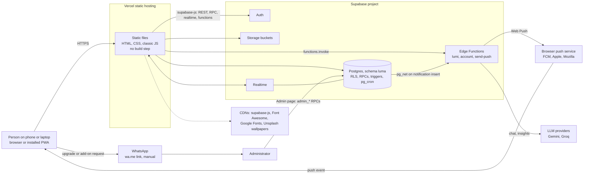
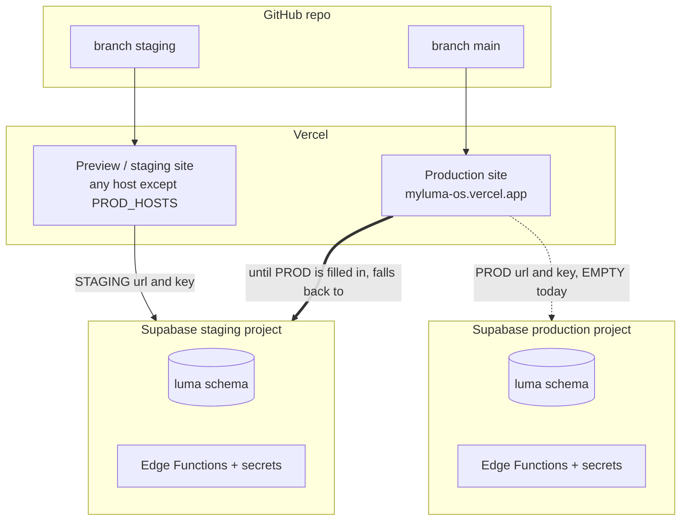
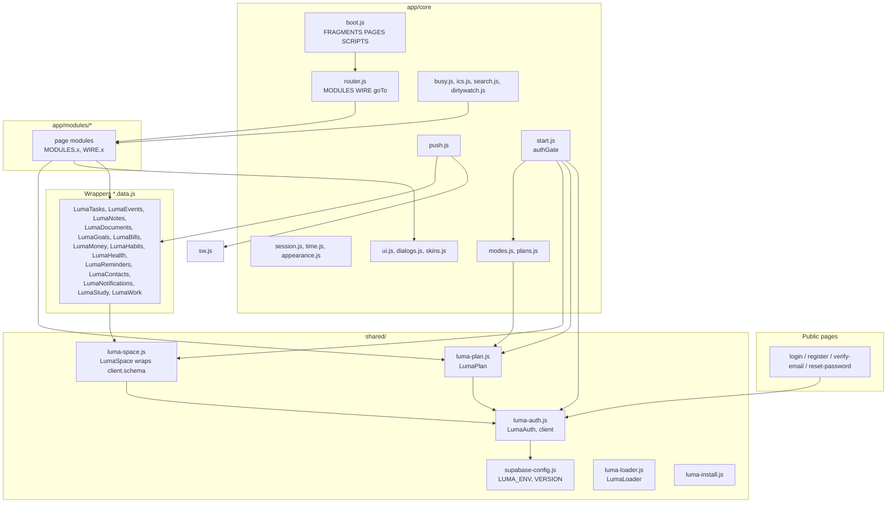
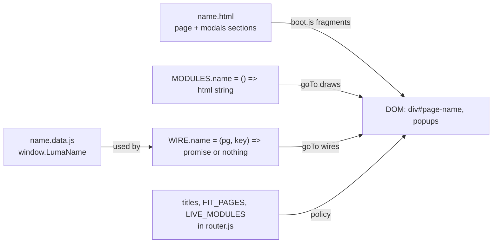
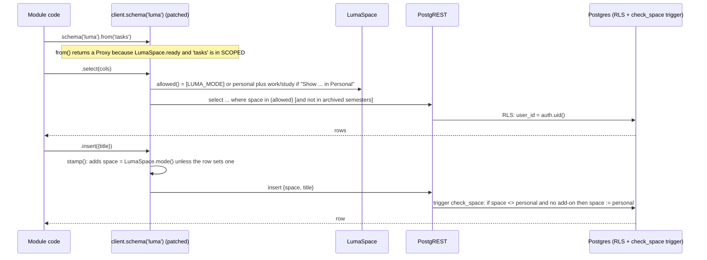
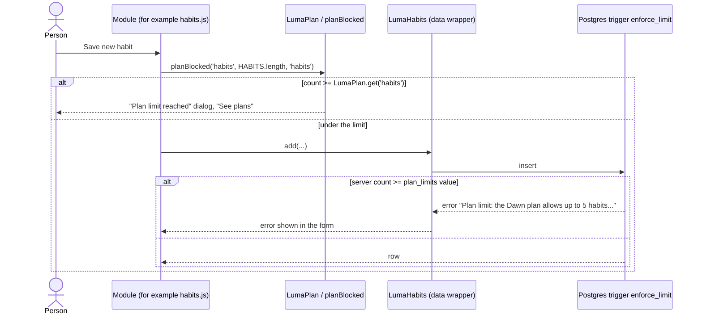
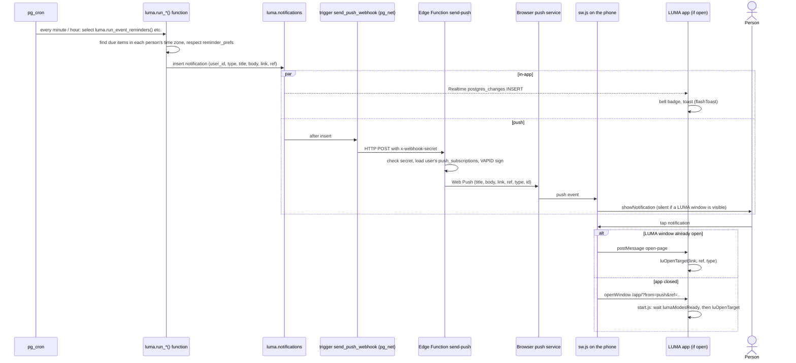

# Software Design Description: architecture and front end

| | |
|---|---|
| Product | LUMA, a personal operating system (web app, installable as a PWA) |
| Document | Software Design Description (SDD), architecture and front end |
| Code version described | `window.LUMA_VERSION` = 0.26.4 (staging), latest migration 085 |
| Companion documents | [DATABASE.md](DATABASE.md) (schema, RLS, RPCs, cron) · [EDGE-FUNCTIONS.md](EDGE-FUNCTIONS.md) (`lumi`, `account`, `send-push`) · [../srs/SRS-00-introduction.md](../srs/SRS-00-introduction.md) (requirements) · [../CONVENTIONS.md](../CONVENTIONS.md) |
| Rule of truth | The code, the migrations and `CHANGELOG.md`. Where something could not be confirmed from them it says "TBC". Where code and an older document disagree, the code wins and the difference is listed in section 8 (Findings). |

## Contents

1. Purpose, scope, audience and glossary
2. Architecture overview and deployment
3. Front-end design
4. Module-by-module table
5. Key design decisions and trade-offs
6. Known technical debt and risks
7. Extension guide
8. Findings (code versus documents)

---

## 1. Purpose, scope, audience and glossary

### 1.1 Purpose

This document explains how LUMA is put together on the client side and how the client meets Supabase: which files load in which order, how a page is drawn, how a mode ("space") filters data, how plans and add-ons gate features, how a notification travels from a database job to a phone, and how to extend each part safely. It is written so that a developer who joins the project can find the right file and avoid the known traps without reading all of the roughly 11,000 lines of front-end JavaScript (many lines are very long).

### 1.2 Scope

In scope: the static front end (`index.html`, `login/`, `register/`, `verify-email/`, `reset-password/`, `app/`, `shared/`, `sw.js`, `manifest.webmanifest`, `vercel.json`), the contract between the front end and Supabase, and the release routine.

Out of scope (see the companion documents): table definitions, RLS policies, security-definer RPC bodies, cron job SQL, and Edge Function internals. This document only names the tables and RPCs a module calls.

### 1.3 Audience

Developers (front end and database) joining the project, reviewers, and testers who need to know where a behaviour lives.

### 1.4 Glossary

| Term | Meaning |
|---|---|
| Space / mode | Personal, Work or Study. The word "mode" is the UI switch at the top of the menu (`LUMA_MODE`); a "space" is the value stored in the `space` column (`personal`, `work`, `study`) of the nine scoped tables (migration 050). What a person creates in a mode is filed under that mode's space. |
| Add-on | A paid extra on top of any plan: Study (RM7 / month), Work (RM15 / month), Work Pro (RM25 / month), or the Work + Study bundle (RM19 / month). Stored per user with a source (`admin` or `trial`) and an optional end date. Read through `LumaPlan.hasAddon(key)`. |
| Tier | Two different things share this word. A **plan tier** is Dawn (free), Glow (RM9 / month) or Zenith (RM19 / month). The **Work tier** is `standard` or `pro` (`LumaPlan.workTier()`), set by the add-on, not by the plan. |
| Plan limit | A numeric value in `luma.plan_limits`, per plan and key. The Work limits come from the Work add-on tier instead (see 3.7). |
| Module | A folder `app/modules/<name>/` with its markup, CSS and scripts. A module usually owns one page, sometimes several (Work owns `work` and `company`; Study owns `study` and `studyarchive`; Feedback owns `feedback` and `adminfeedback`). |
| Page | A `<div class="page" id="page-<key>">` container created by the boot script. Only one has the class `active`. |
| Fragment | A module's `.html` file. It can hold up to three sections introduced by the marker lines `<!--@shell-->`, `<!--@page-->` and `<!--@modals-->`. `core/boot.js` fetches every fragment and distributes the sections. |
| `FRAGMENTS`, `PAGES`, `SCRIPTS` | The three arrays in `app/core/boot.js`: markup files to fetch, page keys to create (menu order), and scripts to load (strict order). |
| `MODULES` | Global object in `app/core/router.js`. `MODULES.<page>` is a function that returns the page's HTML string. |
| `WIRE` | Global object in `app/core/router.js`. `WIRE.<page>(pg, key)` attaches event handlers and starts the data load; it may return a promise so the loading cover waits for it. |
| `LIVE_MODULES` | Set of page keys that are drawn again on every visit (they show live data). Pages not in the set are drawn once. |
| `FIT_PAGES` | Set of page keys whose header stays fixed while their list scrolls (class `fit` on `.main-content`). `FIT_WRAP` is the subset whose markup is "heading plus content" and gets wrapped in a `.fit-root` scroll box. |
| Wrapper (data module) | A file `<module>.data.js` that exposes `window.LumaXxx` with small async functions over the Supabase client, for example `LumaTasks.list()`. |
| `LumaAuth`, `LumaPlan`, `LumaSpace`, `LumaLoader`, `LumaInstall`, `LumaNotifications` | Global singletons from `shared/` and `app/modules/notifications/`. |
| WhatsApp request | There is no payment gateway. Upgrades, add-ons and renewals open a prefilled WhatsApp message to the number in `shared/plan-config.js`; an administrator then grants the plan or add-on in the Admin page. |
| Trial | A one-time 7-day free add-on, started from the add-on popup through the RPC `start_addon_trial`. |
| Guest | Someone invited to another person's Study group project or Work project. They may open that mode, read-only, without owning the add-on (`LumaPlan.guestStudy`, `LumaPlan.guestWork`). |
| Busy day | A day whose load (count, hours, clashes) passes a threshold; see 3.14. |
| Lumi | The built-in AI assistant (Edge Function `lumi`). |
| PWA | Progressive web app: `manifest.webmanifest` plus `sw.js`, so the browser offers "install". |

---

## 2. Architecture overview and deployment

### 2.1 System context



### 2.2 Technology summary

| Layer | Choice | Where to look |
|---|---|---|
| Hosting | Vercel, static files, no build, no server code in the repo | `vercel.json` |
| Front end | Plain HTML, CSS and classic `<script>` JavaScript (no framework, no bundler, no module system) | `app/` |
| Client library | `@supabase/supabase-js@2` from jsDelivr | `app/index.html`, `login/index.html` |
| Icons, fonts | Font Awesome 6.7.2 (cdnjs), Inter (Google Fonts) | `app/index.html` |
| Auth | Supabase Auth, email and password, 6-digit email code to verify sign-up | `shared/luma-auth.js` |
| Database | Postgres, schema `luma`, exposed through the Data API; access by RLS and security-definer RPCs | [DATABASE.md](DATABASE.md) |
| Storage | Buckets `luma-documents`, `luma-backgrounds`, `luma-feedback` (created in migrations 003, 042, 081) | module data files |
| Realtime | `postgres_changes` on `luma.notifications` (live toasts, bell) and `luma.messages` (chat) | `notifications.data.js`, `contacts.data.js` |
| Server jobs | `pg_cron` calls `luma.run_*()` functions (reminders, weekly review, busy-day alerts, plan expiry, gift reminders and others) | [DATABASE.md](DATABASE.md) |
| Push | Web Push with VAPID keys; the sender is the `send-push` Edge Function, called by a `pg_net` trigger on `luma.notifications` | `supabase/setup/push_webhook.sql`, `sw.js` |
| AI | Edge Function `lumi` calls Gemini first and Groq as fallback | [EDGE-FUNCTIONS.md](EDGE-FUNCTIONS.md) |

### 2.3 Repository layout

| Path | Contents |
|---|---|
| `index.html` | Site root: redirects to `/login/` (keeps the hash). |
| `login/`, `register/`, `verify-email/`, `reset-password/` | Public pages, each with its own `.html`, `.css`, `.js`. They share `shared/luma-auth.js` and `shared/auth-mobile.css`. |
| `app/index.html` | The signed-in shell page: loads CSS, the Supabase SDK, shared scripts, wrapper files, then `core/boot.js`. |
| `app/core/` | Boot, router, shell, modes, plans, UI kit, styling, push client, busy-day, ICS export, search, session, time. |
| `app/modules/<name>/` | One folder per feature (see section 4). |
| `shared/` | Code used by both the public pages and the app: `supabase-config.js`, `luma-auth.js`, `luma-plan.js`, `luma-space.js`, `luma-loader.js`, `luma-install.js`, `plan-config.js`, `push-config.js`, `recovery-redirect.js`, icons. |
| `sw.js`, `manifest.webmanifest` | Service worker and PWA manifest, at the site root so the worker's scope is `/`. |
| `supabase/migrations/NNN_*.sql` | Numbered migrations (001 to 085). `supabase/ALL_MIGRATIONS.sql` is generated from them. |
| `supabase/functions/` | `lumi`, `account`, `send-push` (Deno / TypeScript). |
| `supabase/setup/` | One-off setup SQL, for example `push_webhook.sql` (run once per project). `supabase/reset/` wipes a project. |
| `scripts/` | `build-all-migrations.py`, `deploy-functions.sh`. |
| `docs/` | SRS, design documents, test automation. |

### 2.4 Deployment topology: staging and production

LUMA has two logical environments, chosen in the browser by the host name, not by a build flag.



How the choice is made (`shared/supabase-config.js`):

1. `PROD_HOSTS` lists the host names that count as production (currently `myluma-os.vercel.app`).
2. `STAGING` holds the sandbox project's URL and publishable key. `PROD` holds the live project's; **both fields are empty today**.
3. `useProd = onProdHost && PROD.url && PROD.key`. So until the production project is configured, even the production host talks to the staging project and reports `LUMA_ENV = "staging"`.
4. The file sets `window.LUMA_SUPABASE_URL`, `window.LUMA_SUPABASE_ANON_KEY`, `window.LUMA_ENV` (`"staging"` or `"production"`) and `window.LUMA_VERSION`, and paints "Version x.y.z · STAGING" into every element with `data-luma-version`.
5. The publishable key is public by design; protection is RLS (see [DATABASE.md](DATABASE.md)).

What `LUMA_ENV` changes in the code:

| Effect | File |
|---|---|
| Script cache-busting: staging appends `Date.now()` so every load fetches fresh files; production uses only the version. | `app/core/boot.js` |
| The free 7-day Study trial button is on while `LUMA_ENV !== 'production'`. | `app/core/modes.js` (`ADDONS.study.live`) |
| The "STAGING" label next to the version. | `shared/supabase-config.js` |

Per-environment configuration files:

| File | Holds | Notes |
|---|---|---|
| `shared/supabase-config.js` | Supabase URL and key per environment, `LUMA_ENV`, `LUMA_VERSION` | Edit when the production project exists. Bump the version on every release (7.6). |
| `shared/push-config.js` | `LUMA_VAPID_PUBLIC_KEY` | Same value on both environments today; the private key lives only in Edge Function secrets. Empty value switches closed-app push off (tab-only notifications remain). |
| `shared/plan-config.js` | `LUMA_WHATSAPP`, the number that receives plan, add-on and renewal requests | Digits only, international format. |
| `scripts/deploy-functions.sh` | `STAGING_REF`, `PROD_REF` (production empty) | Deploys `lumi` with JWT verification on and `send-push` with `--no-verify-jwt`. |
| `supabase/staging.env` | Secrets for the functions (not in git; template `staging.env.example`) | Set with `npx supabase secrets set --env-file ...`. |
| `supabase/setup/push_webhook.sql` | The trigger that posts new notifications to `send-push`, with the project reference and `WEBHOOK_SECRET` | Run once per project. |

Full first-time staging steps are in `docs/STAGING_SETUP.md`.

### 2.5 Hosting rules (`vercel.json`)

| Rule | Why |
|---|---|
| `/sw.js`: `Cache-Control: no-cache` and `Service-Worker-Allowed: /` | A changed worker is picked up on the next visit; the worker may control the whole site. |
| `/(.*)\.html`: `Cache-Control: no-cache` | The HTML shells, and the fragment files, are always revalidated, so a release shows up at once. |
| `trailingSlash: true` | Pages are folders (`/login/`, `/app/`). |

There is no CSP, no `X-Frame-Options` and no other security header in `vercel.json` (see 6.1). Caching of `.js` and `.css` files uses Vercel's defaults (TBC; not configured in this repo). The app's own `?v=` query on boot-loaded scripts is what guarantees a fresh script on production after a version bump. Files loaded straight from `app/index.html` (the CSS files and the `*.data.js` wrappers) carry no version query (see 6.2).

### 2.6 Service worker and manifest

`sw.js` (54 lines) does three things only: `skipWaiting` and `clients.claim` on install and activate; an empty `fetch` handler (this makes the app installable; it does **no** caching and no offline mode); and Web Push handling (section 3.16). `manifest.webmanifest` sets `id` and `start_url` to `/app/`, `scope` to `/`, `display: standalone`, portrait orientation, three icons (including a maskable one) and shortcuts to Tasks, Calendar and Reminders. Registration happens in `app/core/start.js` and again in `app/core/push.js` (`pushRegistration`); registering the same URL twice is harmless.

### 2.7 Component diagram (front end)



---

## 3. Front-end design

### 3.1 Page families

| Family | Files | Notes |
|---|---|---|
| Public pages | `login/`, `register/`, `verify-email/`, `reset-password/` | Each page has its own script. They use `LumaAuth` only. `login.js` calls `LumaAuth.redirectIfSignedIn()` and, after `signIn`, goes to `/app/`. Unverified accounts are sent to `/verify-email/`. `shared/recovery-redirect.js` forwards a password-reset link that landed on the wrong page to `/reset-password/` with its tokens. |
| The app | `app/index.html` plus everything in `app/` | One HTML file, one document. "Pages" are `div`s inside it; navigation never reloads the document. |

### 3.2 Sign-in and session

```mermaid
sequenceDiagram
  actor U as Person
  participant L as login/login.js
  participant A as LumaAuth (luma-auth.js)
  participant S as Supabase Auth
  participant App as app/index.html + core/start.js
  participant DB as Postgres (luma)

  U->>L: email, password, "Remember me"
  L->>A: signIn({email, password, remember})
  A->>A: setRemember (localStorage key luma.remember)
  A->>S: signInWithPassword
  S-->>A: session (stored in localStorage or sessionStorage)
  A-->>L: ok (or error; unverified goes to /verify-email/)
  L->>App: location = /app/
  App->>A: requireSession("/login/")
  A->>S: getSession (local storage read)
  alt no session
    A-->>U: redirect /login/
  else session
    App->>A: getProfile (select luma.profiles)
    A->>DB: select * from profiles where id = uid
    alt profile.disabled_at set
      App->>S: signOut, redirect /login/?disabled=1
    else active
      App->>DB: rpc my_limits, rpc is_admin (LumaPlan.load)
      App->>DB: LumaSpace.init (probe space column)
      App->>App: applyUserUI, initModes, initNotifications, loadDashboard
      App->>App: LumaLoader.release("app")
    end
  end
```

Design points:

- **"Remember me"** chooses where the Supabase session lives: `localStorage` (survives closing the browser) or `sessionStorage`. The choice is stored under `luma.remember`. `authStorage` in `shared/luma-auth.js` reads the right store, so every page sees the same session. `signIn` removes the stale copy from the other store.
- **The gate is client-side.** `authGate()` in `app/core/start.js` redirects when there is no session. The data is protected by RLS, not by this redirect.
- **Disabled accounts.** After `getProfile`, a non-null `disabled_at` signs the person out and redirects to `/login/?disabled=1`, where the login page shows the message.
- **Profile fallback.** `lumaName()`, `lumaFullName()` and friends in `app/core/session.js` prefer the `luma.profiles` row and fall back to the sign-up metadata in the auth user, so the UI keeps working if the profile read fails.
- **Profile writes are resilient.** `saveProfile()` in `app/core/appearance.js` writes through `LumaAuth.updateProfile`; on failure it keeps the fields in `localStorage` (`luma_profile_pending`), shows a toast, and `flushPendingProfile()` retries at the next start. Preferences (theme, wallpaper, mode, toggles) live in `profiles.preferences` (JSON) so they follow the account across devices; `setLumaPref(key, value)` and `prefOn(key, default)` are the accessors.
- **Time zone.** `app/core/time.js` holds the app time zone `MYT` (default `Asia/Kuala_Lumpur`; the name is historical). `setAppTimezone()` is called from the profile after sign-in. All "today", greeting and calendar maths go through the `myt*` helpers (`mytDayKey` itself is defined in `notifications.js`, see 3.3).

### 3.3 Boot sequence

`app/index.html` is deliberately thin. It holds the CSS links, then in `<body>` loads, in this order: the Supabase SDK (blocking), `luma-install.js` (blocking), and a list of `defer` scripts that run in document order after parsing: `supabase-config.js`, `luma-auth.js`, `plan-config.js`, `luma-plan.js`, `luma-space.js`, the wrapper files (`contacts`, `tasks`, `documents`, `notes`, `push-config`, `notifications`, `health`, `habits`, `goals`, `bills`, `money`, `calendar`, `reminders`, `study` `.data.js`), and last `core/boot.js`. `luma-loader.js` is the very first script in `<head>` and calls `LumaLoader.hold('app')`, so a loading cover is on screen from the first paint.

`core/boot.js` is one IIFE. It has three arrays (all in the file, in plain sight):

| Array | Meaning | Order matters? |
|---|---|---|
| `FRAGMENTS` | The `.html` files to fetch (`core/shell.html`, `core/plans.html`, `core/modes.html`, `core/search.html`, then one per module that has markup). | Only for where popups end up in the document. |
| `PAGES` | Page keys, in menu order. For each key a `div.page#page-<key>` is created inside `.content-wrapper`; the page's own markup is the `<!--@page-->` section of `modules/<key>/<key>.html` when that file exists. `dashboard` gets class `active`. | Menu order only. |
| `SCRIPTS` | Every core and module script. | **Yes, strictly** (3.4). |

```mermaid
sequenceDiagram
  participant B as Browser
  participant H as app/index.html
  participant Boot as core/boot.js
  participant V as Vercel (static)
  participant S as start.js authGate

  B->>H: GET /app/ (no-cache)
  H->>B: CSS, SDK, config, luma-*.js, *.data.js (defer, in order)
  Note over B: luma-loader.js shows "Loading..." (hold "app")
  B->>Boot: run boot.js
  Boot->>V: fetch every FRAGMENT (cache: no-cache), in parallel
  V-->>Boot: markup files
  Boot->>Boot: parts(): split into shell / page / modals sections
  Boot->>B: insert shell.html shell section at start of body
  Boot->>B: create div.page for each key in PAGES, fill page section
  Boot->>B: append every modals section to the end of body
  loop each script in SCRIPTS (one at a time)
    Boot->>V: GET script.js?v=VERSION (+ .timestamp unless production)
    V-->>Boot: script runs; onload starts the next (onerror logs and continues)
  end
  Note over Boot,S: the last two scripts are core/skins.js then core/start.js
  S->>S: authGate (see 3.2)
  S->>B: LumaLoader.release("app") after the dashboard loaded
```

Details worth knowing:

- **Cache-busting query.** Every boot-loaded script is requested as `src?v=<LUMA_VERSION>`; on staging and localhost `.<Date.now()>` is appended, so a changed file is never served from an old browser copy. On production the query changes only when the version changes. **Forgetting to bump the version therefore leaves production users on old scripts** (7.6).
- **Fragments** are fetched with `cache: 'no-cache'` (revalidate each time).
- **Failure handling.** If a fragment fails, `fail()` logs and holds the loading cover (`LumaLoader.hold("boot-failed")`); after 3 minutes the cover shows "Something went wrong" with a Refresh button. If one script fails to load (for example an ad blocker), `onerror` logs a message and the chain **continues**, so one blocked file does not stop the rest (but code depending on it will throw later).
- **`LumaLoader`** (`shared/luma-loader.js`): minimum 1 second on screen, maximum 3 minutes before the error popup; `hold(name)` / `release(name)` let a page keep it up while it loads; `LumaLoader.page(pg, key, promise)` covers page-to-page navigation while data loads.
- **Shell markup is data.** `core/shell.html` has the sidebar menu items (`<a class="menu" data-page="...">`), the top bar, the notification panel and toasts container. Adding a menu item is a markup change plus entries in the router tables (7.2).
- **`core/skins.js` is loaded last of the module scripts** because it needs every popup to exist: it replaces native selects, date and time inputs with themed versions and wraps each popup that has `.pem-head` and `.pem-actions` into a fixed header / scrolling body / fixed footer layout.
- **Startup order in `start.js`** after the session check: `flushPendingProfile` → `getProfile` → disabled check → `LumaPlan.load()` → `lumaFocusLoad` → clear the `rendered` cache → show the Admin menu if `LumaPlan.admin` → `setAppTimezone` → `LumaSpace.init()` → `applyUserUI` → `initModes()` → resolve `lumaModesReady` → register `sw.js` → `initNotifications` → `initReminders` → `loadDashboard()` then release the cover → `resyncPush` → `maybePromptPlan()` then `maybePromptPush()`. A separate block restores the page from the URL hash after a refresh, waiting on `lumaModesReady` (10-second cap) so the right mode and spaces are known first.
- **Fresh launch versus refresh.** `sessionStorage.luma_booted` marks the tab. A fresh launch opens the Dashboard (the hash is dropped); a refresh keeps the page in the hash. A tap on a push notification opens `?from=push` and always goes to its page.

### 3.4 Classic-script shared global scope: rules and hazards

All core and module scripts are classic scripts loaded with `document.createElement('script')` one after another. They share one global scope. There are no `import` / `export` statements.

How names are shared:

| Declaration at top level of a script | Visible in later scripts? | Is it `window.x`? |
|---|---|---|
| `function f() {}` | Yes | Yes |
| `var v` | Yes | Yes |
| `const c` / `let l` / `class` | **Yes** (global lexical scope) | **No** |
| Anything inside an IIFE `(function () { ... })()` | No, unless assigned to `window.X` | Only if assigned |

Rules that follow:

1. **Never declare the same top-level `const` / `let` name in two files.** The second script throws `SyntaxError: Identifier 'x' has already been declared` and **none of that file runs**. Because `boot.js` continues after a failed script, the symptom is a half-working app with one console error. Check with `grep -rn "const NAME" app/` before adding a top-level constant. This is why the `*.data.js` wrappers and most module constants (`COLS`, `BASE_COLS`) sit inside IIFEs or carry a module prefix (`wk`, `sd`, `adm`, `rem`, `cal`, `h`, `b`, `g`).
2. **Load order is a dependency declaration.** A top-level statement may only use names defined by earlier scripts. Use inside a function body (run later) is safe. Examples already in the code: `core/push.js` uses `titles` (declared in `router.js`, loaded later) only inside an event handler; `core/busy.js` uses `mytDayKey` (declared in `modules/notifications/notifications.js`, loaded later) only inside functions; `core/modes.js` needs `docEl` (from `ui.js`) and `LumaPlan` at load time and registers DOM listeners at load time, so it must come after `shell.html` has been inserted (true by design).
3. **Cross-module calls are guarded.** Modules call each other with `typeof fn === 'function'` or `typeof SD !== 'undefined'` checks (see `luOpenTarget`, `enforceModeAccess`, `search.js`) so a module that failed to load does not take the others down.
4. **Shared mutable state lives in a few named globals**: `LUMA_USER`, `LUMA_PROFILE` (session.js), `LUMA_MODE` (modes.js), `MYT` (time.js), `rendered` (router.js), and per-module state objects (`SD`, `WK`, `SP`, `FB`, ...). Prefer these over new ones.
5. **Inline event handlers are not used** (`onclick="` appears zero times in `app/`). Markup is wired by `WIRE.<page>` with `querySelector` and delegated listeners (`data-*` attributes), or by `el.onclick = ...` on static popups.
6. **`shared/*.js` files that must also work on the public pages** are IIFEs that attach `window.LumaX` and never touch app-only globals, except `luma-space.js`, which reads `LUMA_MODE` and `prefOn` lazily inside `try / catch`.

### 3.5 Module contract

A page module is a set of files in `app/modules/<name>/` and four registrations:



| Piece | Where | Contract |
|---|---|---|
| Markup | `<name>.html` (optional) | `<!--@page-->` section: static page body. `<!--@modals-->` section: popups appended to `body`. `<!--@shell-->` is used only by `core/shell.html`. |
| Render | `MODULES.<page> = function () { return '<html>'; }` | Pure string builder (helpers `head()`, `card()`, `btn()` in `ui.js`). Runs before wiring. For a page with static markup (Calendar, Dashboard) there is no `MODULES` entry; the markup from the fragment is used and `WIRE` only attaches behaviour. |
| Wire | `WIRE.<page> = function (pg, key) { ... }` | Attach events to elements inside `pg`; start the data load. **Return the promise** of the first load: `LumaLoader.page` keeps the cover up until it settles. |
| Refresh policy | `LIVE_MODULES` | If the key is in the set, `goTo` redraws and rewires the page on every visit (`pg.innerHTML = MODULES[key]()`), so data is re-fetched. If not, it is drawn once and reused. The `rendered` map records which pages have been drawn; `modeSync` and `switchMode` clear it (a different mode needs different items) and `start.js` clears it after the plan loads. |
| Layout policy | `FIT_PAGES`, `FIT_WRAP` | `FIT_PAGES` puts `.fit` on `.main-content` so the header is fixed and the list scrolls. For `FIT_WRAP` pages `fitWrap()` moves everything except `.page-head` into a `.fit-root` box. |
| Title | `titles` object in `router.js` | Page key to title; `goTo` ignores keys without a title, and the global search lists these as "Pages". |
| Menu entry | `<a class="menu" data-page="key">` in `core/shell.html` | Optional `data-only="work"` or `"study"` makes it mode-only. |
| Data wrapper | `<name>.data.js` exposing `window.LumaName` | Section 3.10. Loaded by `app/index.html` (or listed in `SCRIPTS`, as `work.data.js` is). |
| Focus hook | `LU_FOCUS_HOOKS.<page> = (ref, type, tries) => ...` | Optional, section 3.6. |

`wireModule(key)` in `router.js` also gives every page generic behaviour: `.switch` toggles flip the class `on`, and `.add-card` placeholders in kanban columns (except Tasks) add a demo card (legacy; see 6.2).

### 3.6 Routing

There is no router library; navigation is `goTo(key)` in `app/core/router.js`.

```mermaid
sequenceDiagram
  actor U as Person
  participant M as .menu click / luOpenTarget / search
  participant R as goTo(key)
  participant P as LumaPlan
  participant Mo as modeSync()
  participant Pg as MODULES / WIRE
  participant L as LumaLoader

  U->>M: choose a page
  M->>R: goTo(key)
  R->>R: unknown key? return (needs titles[key])
  opt key = feedback
    R->>R: LU_PREV_PAGE = current page (Feedback starts on that module)
  end
  alt work / study and no add-on and not guest
    R->>U: openAddon(key) popup, stop
  else company or studyarchive without its add-on
    R->>U: openAddon(...), stop
  else allowed
    R->>Mo: modeSync(key) (may flip LUMA_MODE, clear rendered, save pref)
    R->>R: closeContactChat (tear down realtime channel)
    R->>R: toggle .active on .page and .menu, set #pageTitle
    alt MODULES[key] and (not rendered or in LIVE_MODULES)
      R->>Pg: pg.innerHTML = MODULES[key](); fitWrap; WIRE[key](pg)
      R->>L: LumaLoader.page(pg, key, promise)
    end
    R->>R: .main-content.fit per FIT_PAGES; calOnShow; reset scroll
    R->>R: history.replaceState('#key')
  end
```

- **URL.** Only the hash changes, and with `replaceState` (not `pushState`), so the browser Back button does **not** step through pages. The hash exists so a refresh lands on the same page (3.3).
- **Titles and active menu.** `pageTitle.textContent = titles[key]`; the menu item whose `data-page` equals the key (or `admin` for `adminreport`) gets `active`. On phones (`<= 768px`) a menu click also closes the slide-out sidebar.
- **Add-on pre-checks** (`work`, `study`, `company`, `studyarchive`) call `openAddon()`; this is a UI gate; the database has its own checks (3.8, 3.9).
- **`LU_PREV_PAGE`** (global on `window`): set when opening the Feedback page, so the feedback form can preselect the module the person came from (`FB_PAGE_TO_MODULE` in `feedback.js`).
- **Opening a thing from a notification (`luOpenTarget`, `app/core/ui.js`).** Used by the bell panel (`openNotif`), by search, and by the service-worker message. Signature `luOpenTarget(key, ref, type)`:
  1. If the notification type maps to a scoped table (`LU_ITEM_TABLE`: `reminder_event` to `events`, `reminder_task` to `tasks`, and so on), ask `LumaSpace.spaceOf(table, ref)` which space the item lives in. If that space is not currently visible and the person may open it, call `switchMode(space)` first (otherwise the page would open with the item filtered out).
  2. For Study, pick the right tab from `LU_TARGET_TABS` (`reminder_study` to `assignments`, `project_invite` to `groups`, and so on).
  3. `goTo(key)`, then `luFocusItem(key, ref, type)`.
  4. `luFocusItem` polls every 150 ms for up to about 5 seconds: it looks for an element matching `ref` (`data-id`, `data-task`, `data-cls`, `data-note`, `data-shared`, `data-sem`, `data-proj`, `data-contact-id`, or a `#css-selector` with optional `|text:a;b` and `|closest:.x` modifiers), scrolls only the list it is in, and adds the class `luma-flash` for 4.8 seconds. While the element is not found it calls `LU_FOCUS_HOOKS[key](ref, type, tries)`, so a page can first move to the right month or tab (Calendar, Bills and Work register hooks).
  5. `luNoticeTarget(link, title, body, type)` builds a ref for notifications that carry no item id (budget alerts, health rings, plan or add-on notices, contact requests).
- **Mode switching** is described in 3.7.

### 3.7 Shell, menus and modes

`core/shell.html` is data only: the sidebar markup with one `<a class="menu" data-page=...>` per page, the mode switch (`#modeSwitch`, three buttons), the top bar, the notification bell and panel. No logic lives in it.

`core/modes.js` decides which menu items show:

| Constant | Meaning |
|---|---|
| `ADDONS` | Work and Study: name, icon, colour, tag line, price, perks, and `live` (whether the free trial is offered). |
| `WORK_SIZES` | `standard` (RM15) and `pro` (RM25) with `lim: [companies, projects, people per project, tasks per project, teams]` = `[5, 20, 8, 600, 5]` and `[20, 60, 15, 1500, 20]`. The same numbers are in migration 083 and Admin, Plan limits; **they are duplicated** in the client for display (6.2). |
| `ADDON_BUNDLE` | Work + Study, RM19 / month, "Save RM3 a month". |
| `MODE_HOME` | Page opened when a mode is chosen: personal to `dashboard`, work to `work`, study to `study`. |
| `MODE_MENUS` | Pages shown in Work: `work, company, calendar, reminders, documents, contacts, assistant`; in Study: `study, studyarchive, calendar, reminders, notes, documents, assistant`. Personal shows every page that is not mode-only. |
| `MODE_ALWAYS` | Shown in every mode: `settings, support, feedback, admin, adminreport, adminfeedback, notifications`. |

`applyModeMenus()` toggles the class `mode-off` on each `.menu` using those tables (an item with `data-only` shows only in that mode; `company` additionally needs the Work add-on) and updates the switch (`.on`, `.locked`). `lumaModeOpen(m)` is true for Personal, for an owned add-on, or for a guest.

State changes:

- `switchMode(m)`: if the mode is not open, show the add-on popup; otherwise set `LUMA_MODE`, save it to `localStorage.luma_mode` and to the profile preference `mode`, clear `rendered`, redraw the menus and go to the mode's home page.
- `modeSync(key)`: called from `goTo`; if a page belongs to another mode (a search result, a link) the mode flips so the menu matches.
- `initModes()` (on sign-in): restore the mode from the profile or localStorage, but only if the add-on is still active.
- `enforceModeAccess()`: after an add-on changes or expires, leave a mode the person no longer has and go to the Dashboard.
- A `visibilitychange` listener reloads the plan if the tab has been hidden for more than 2 minutes (`LumaPlan.loadedAt`), and calls `enforceModeAccess()` if the plan or add-ons changed, so an administrator's change appears without logging out.
- `sdCheckGuest()` and `wkCheckGuest()` set `LumaPlan.guestStudy` / `guestWork` when the person has been invited to somebody else's project; the add-on popup also offers the 7-day trial (`rpc start_addon_trial`) and the WhatsApp request (`requestAddon`).

### 3.8 Modes and spaces: how every read is filtered and every insert stamped

`shared/luma-space.js` wraps the Supabase client **once**, so no module writes its own space logic.



Implementation facts (`shared/luma-space.js`):

- `SCOPED` = `tasks, events, reminders, notes, documents, habits, goals, bills, money_entries` (the nine tables of migration 050).
- `LumaSpace.init()` runs once after sign-in: it probes `tasks.space`; if the column does not exist yet (migration 050 not run) `ready` stays false and **nothing is filtered or stamped**. It also probes `semester_id` (migration 056) and loads the list of archived semesters.
- `LumaSpace.allowed()`: in Work or Study mode, only that mode; in Personal, `personal` plus `work` and/or `study` when the preferences `show_work_personal` / `show_study_personal` are on (Settings, Preferences).
- Only `.select()` called directly on `.from(table)` is filtered. `insert()` is stamped; `update()`, `delete()` and `upsert()` are passed through. A `.select()` chained **after** `insert()` or `update()` is the normal builder's, not the filtered one (that is intended: you read back the row you just wrote).
- Items belonging to an **archived Study semester** are excluded from every read (`semester_id is null or not in (...)`) unless `LumaSpace.bypass` is switched on, which only the Study archive page does.
- `LumaSpace.visible(row)` filters rows already in memory; `spaceOf(table, id)` bypasses the wrapper and reads one row's space (used by `luOpenTarget`).
- Study, Work, Health, Contacts, Notifications and the other tables are **not** in `SCOPED`. They have their own meaning of ownership (see [DATABASE.md](DATABASE.md)).

What the server enforces and what it does not (details in [DATABASE.md](DATABASE.md)):

| Aspect | Client wrapper | Server |
|---|---|---|
| Rows of another user | not involved | **RLS** (`user_id = auth.uid()`) on every table. This is the security boundary. |
| Only show the current mode's rows | **Yes, client only** (`.in("space", ...)`) | **No.** No RLS policy mentions `space` (checked in migrations; only 050 adds the column, constraint, index and trigger). A direct API call returns all of the user's rows from every space. |
| Stamp the space on insert | Yes (`stamp`) | Column default is `personal`; check constraint allows only `personal`, `work`, `study`. |
| Refuse work / study without the add-on | UI gates | **Yes**: trigger `check_space` silently downgrades a `work` / `study` row to `personal` when `luma.has_addon(user, space)` is false (migration 050). |
| Update or delete by id | not scoped | RLS by owner only |

So "space" is a presentation and organisation feature, backed by a server guard against tagging without the add-on. It is not a confidentiality boundary between modes of the same person, and it does not need to be: all spaces belong to the same user.

### 3.9 Plan and add-on gating

Two files and one popup system:

- `shared/luma-plan.js` defines `window.LumaPlan`.
- `app/core/plans.js` defines the plan popup, `planBlocked()`, `planLocked()`, upgrade and renewal requests.
- `app/core/modes.js` defines the add-on popup.

`LumaPlan` state: `plan` (`dawn`, `glow`, `zenith`), `lim` (map of limit key to number or null), `planExpires`, `addons` (array of `work` / `study`), `addonInfo` (`{work: {source, expires_at, tier}, study: {...}}`), `trialsUsed`, `gifts`, `ready`, `admin`, `loaded` (a promise), `loadedAt`.

| Method | Behaviour |
|---|---|
| `load()` | Calls `rpc my_limits` (up to 3 tries, 0.5 s back-off), stores the answer and caches it, then calls `rpc is_admin`, then `loadGifts()` (`rpc my_gifts`). |
| `get(key)` | The numeric limit, or `null` when there is none (unlimited or plans not set up). Returns `null` until `ready`. |
| `has(key)` | For on/off features: true unless the plan has exactly 0. |
| `hasAddon(k)` | True while the add-on is in `addons`. |
| `workTier()` | `'pro'` or `'standard'` from `addonInfo.work.tier`. |
| `addonName(k)` | "Work Pro" or the plain name. |
| `canTrial(k)` | No add-on now and not in `trialsUsed`. |

Caching and fallbacks (`luma-plan.js`): the last good answer is kept in `localStorage.luma_plan_cache` and used immediately on the next start, so the UI does not flash Dawn. If `my_limits` cannot be fetched at all, the plan becomes **Dawn with the Dawn limits** (never a bigger one). If the function does not exist (database without migration 033), the app runs "legacy": plan `zenith`, no limits. Pages that depend on the plan wait on `LumaPlan.loaded`; `start.js` clears `rendered` once the plan is known.



Gating layers:

| Layer | Mechanism | Authoritative? |
|---|---|---|
| Menu and pages | `goTo` calls `openAddon()` for Work, Study, Company and Study archive without the add-on; `applyModeMenus` hides items | No (UX) |
| Count limits (habits, goals, bills, reminders, contacts, documents and storage) | `planBlocked(key, count, what)` before the call; trigger `luma.enforce_limit` (and the contact and document variants) in migration 033 | **Server** |
| Feature on / off (insights, Lumi actions, payroll, wallpapers, themes) | `LumaPlan.has(key)` and `planLocked(feature, plan)`; Lumi reads `my_limits` itself | Server for Lumi and storage; client for visual features (TBC per feature, see [DATABASE.md](DATABASE.md)) |
| Work limits (companies, projects, people, tasks, teams) | The Work add-on tier sets them (`WORK_SIZES`, migration 083, `plan_limits`) | **Server** in the Work RPCs and triggers (migrations 071 to 085; details in [DATABASE.md](DATABASE.md)) |
| Add-on needed to tag a space | `check_space` trigger (050) | **Server** |
| Plan or add-on **changes** | Only an administrator, through `admin_set_plan`, `admin_set_addon`, `admin_give_trial`, `admin_bulk_*`, or `start_addon_trial` / `claim_gift` by the user. A trigger (`protect_plan`, migration 033) stops a person editing their own plan on `profiles`. | **Server** |
| Expiry | `luma.run_plan_expiry()` by pg_cron (migration 062); the client rechecks after 2 hidden minutes | **Server** |

`WORK_SIZES` and the perk lists in `plans.js` / `modes.js` are display copies of values stored in the database (6.2).

### 3.10 Data access layer pattern

Every table a page needs is reached through a `window.LumaXxx` object in `<module>.data.js`. Pattern (see `app/modules/tasks/tasks.data.js`, `calendar.data.js`):

```
(function () {
  if (!window.LumaAuth || !window.LumaAuth.client) { console.error("... check <script> order"); return; }
  const db = () => window.LumaAuth.client.schema("luma");   // patched by luma-space.js
  const COLS = "id, title, ...";
  window.LumaThing = {
    async list()  { return db().from("things").select(COLS).order(...); },
    async add(f)  { return db().from("things").insert(f).select(COLS).single(); },   // user_id defaults to auth.uid()
    async update(id, f) { ... .eq("id", id) ... },
    async remove(id)    { ... .delete().eq("id", id); },
    rpcThing: (a, b) => db().rpc("thing_rpc", { p_a: a, p_b: b }),
  };
})();
```

Conventions:

- Functions return the raw `{ data, error }` pair of supabase-js. **Callers check `error`**; wrappers do not throw.
- `user_id` is never sent: the database default is `auth.uid()` and RLS enforces it.
- **Tolerant columns.** The app is released before the database always catches up (staging first), so wrappers ask for the newest column set and fall back when the error says the column or schema cache is missing. `tasks.data.js` tries `COLS_FULL` (with `repeat`, `checklist`; migration 066), then `COLS` (with `notes`; migration 026), then `BASE_COLS`, matching the error text with `NO_EXTRA` / `NO_NOTES` regular expressions, and strips unknown fields on write. Habits, bills, health and money use the same idea (`withCols`, `COL_SETS`, `BASE_COLS`, `NO_ACTIVE`, `NO_PCB`); Goals and Calendar request a fixed column list. Rule: a new optional column gets a fallback so the previous database keeps working.
- RPCs are called with `p_`-prefixed argument names that mirror the SQL function parameters.
- Complex multi-table operations (Study projects, Work invitations, split expenses, time tracking) are **security-definer RPCs**, not client-side sequences of inserts (5.2).
- Realtime: `LumaNotifications.subscribe(userId, cb)` (channel `luma-notifications-<uid>`, filter `user_id=eq.<uid>`) and the chat channel `luma-messages-...` in `contacts.data.js`; `closeContactChat()` removes the chat channel on navigation.

### 3.11 UI kit

Defined in `app/core/ui.js`, `dialogs.js`, `skins.js`, `appearance.js` (all plain globals).

| Helper | Use |
|---|---|
| `escapeHtml(s)` | Escape text before putting it in a template string. **Required for any user text** (6.1). |
| `head(title, sub, actions)`, `card(inner, cls)`, `btn(label, icon)`, `ring(pct, ...)` | HTML-string builders for page headers, cards, buttons, progress rings. |
| `flashToast(title, body, icon, colour)` | Transient toast in `#notifToasts`, auto-dismiss at 3.5 s. |
| `luConfirm({title, message, ok, icon, tone})`, `luAlert(message, title)`, `luPrompt({...})`, `luDialog` | Themed replacements for `confirm`, `alert`, `prompt`; all return promises (`true`/`false`, `undefined`, string or `null`). One shared `#dialogOverlay`. **Do not use the native dialogs.** |
| `luUndo(title, restore)` | A 9-second "Deleted. Undo" bar; `restore()` puts the item back. |
| `skinSelect(sel)` | Themed dropdown; the real `<select>` stays hidden as the source of truth, `change` still fires; call again after repopulating options. |
| `skinNumber(input, step)` | Number field with up / down buttons (hold to repeat). |
| `skinDate(input)` and `luDatePopup(anchor, {value, min, max, onPick})` | Themed date picker: month arrows, month-and-year view with a typed year, and a box that accepts `25/12/2026`, `25-12-26`, `2026-12-25`. After changing `.value` from code call `input._luDateRefresh()`. |
| `skinTime(input, opts)` | Themed 12-hour time picker (`input._luTimeRefresh()`). |
| `openDateFilter(anchor, state, onChange)`, `dateFilterRange`, `inDateRange` | Preset and custom date filter used by Documents and Notes. |
| `openSwatches(anchor, current, onPick)`, `randomColor`, `catColor` | Colour palette (10 colours). |
| `selectAllRow`, `bindSelectAll` | "Select all" for checkbox lists. |
| `uiSound`, `applyTheme`, `applyBg`, `BGS`, `THEMES` | Optional interface sounds, theme tint (`slate`, `midnight`, `obsidian`), wallpapers (11 Unsplash pictures plus the person's own upload from the private `luma-backgrounds` bucket, a signed URL valid for 7 days). |
| `planBlocked`, `planLocked`, `openPlans`, `openAddon` | Plan and add-on dialogs (3.9). |
| `luOpenTarget`, `luFocusItem`, `luNoticeTarget` | Notification click-through (3.6). |
| `LumaLoader.page` | Loading cover for page loads. |
| Dirty-watch (`core/dirtywatch.js`) | For the listed edit popups (event, task, money entry, bill, goal, habit, reminder, profile, note, income, Study course / class / task / semester / note / project) it keeps **Save disabled until something has changed** (compares a signature of inputs and `on` / `sel` / `active` elements 150 ms after open). The list of `[overlayId, saveButtonId, isEditFn]` triples is hard-coded; a new popup must be added to it to get the behaviour (7.1). |

Popup structure: a `.modal-overlay` containing `.profile-edit-modal` with `.pem-head`, content and `.pem-actions`; `skins.js` turns it into the fixed-header layout automatically. Open and close by toggling the class `open` on the overlay.

### 3.12 Styling system

- **No preprocessor, no utility framework.** Plain CSS: `app/core/core.css` (3,500 lines: variables, glass look, layout, shared components), one `modules/<name>/<name>.css` per module (listed in `app/index.html`), and `app/core/responsive.css` loaded **last** (phone and small-screen overrides).
- **Theme tokens.** `core.css` `:root` defines `--app-bg` (the wallpaper `url(...)`) and `--theme-tint` (the overlay colour). `applyBg()` and `applyTheme()` set those two custom properties at run time from the profile, which is how wallpapers and the three themes work. Colour and spacing values elsewhere are mostly literal values in the module CSS (TBC: no central design-token file beyond these two).
- **Glass look.** Panels use translucent white backgrounds, a 1 px light border and `backdrop-filter: blur(...) saturate(...)` (with `-webkit-` prefix) over the wallpaper. This is GPU heavy on low-end phones (6.4).
- **Accent colours by mode.** Personal is blue, Study green (`#34d399`), Work orange (`#fb923c`); the add-on colours live in `ADDONS` in `modes.js` and in the module CSS.
- **Scrolling model.** On desktop `.main-content.fit` fixes the header and scrolls the list. On phones (`max-width: 768px`) the body does not scroll; `.page.active` is the one scroller and every block inside takes its natural height (`responsive.css`).
- **Naming.** Module CSS uses a short prefix per module for classes (`sd-` Study, `wk-` Work, `adm-` Admin, `lu-` shared UI kit, `kcard` Tasks board). IDs for popups end in `Overlay`.

### 3.13 Responsiveness rules

The working rule of the project: every new screen and popup must work from 320 px phones up, with breathing room at the screen edges. Mechanics:

| Mechanism | Where |
|---|---|
| Breakpoints used: `1024`, `768` (phone layout, slide-out sidebar), `560`, `480`, `420`, `360` px | `responsive.css`, module CSS |
| Safe areas: `env(safe-area-inset-*)` on body and sidebar; `viewport-fit=cover`; `100dvh` | `responsive.css`, `app/index.html` |
| Sidebar becomes a slide-out glass panel with a hamburger; closing on item tap and on resize above 768 px | `core/shell.js` (`toggleSidebar`) |
| Floating button room: `--fab-room` padding at the bottom of a page | `responsive.css` |
| Rows that are grids collapse to one or two columns at narrow widths (`minmax(0, 1fr)`) | module CSS |
| The calendar's month grid folds what does not fit into "+N more" and hides times in narrow cells | `calendar.js`, `calendar.css` (`calFitCells`) |
| Study tab labels collapse to icons on windows up to about 1360 px | `study.css` |
| PWA install on phones, standalone display | `manifest.webmanifest` |

Test every change at 320, 375, 768 and desktop width. There is no automated layout test (6.5).

### 3.14 Busy-day algorithm (`app/core/busy.js`)

Purpose: warn when a day is heavily booked, in the Calendar and on the Dashboard, and (server-side, migration 082) with an evening-before push.

For a date key `k`, `luLoad(k)` collects the items the Calendar shows for the current mode (`cItemsOn(k)`: events, tasks and bills due, Study classes and deadlines, Work tasks; the Calendar's category filters are temporarily cleared so a filter never hides a busy day) and computes:

- `score` = number of items, with a Study class counting as **0.5**;
- `hours` = sum of timed items' durations (an item with no end time counts 60 minutes; minimum 15 minutes; overlap is not double counted in the clash count only);
- `clashes` = number of timed items that start before the latest end so far.

Level 2 ("packed", red) if `score`, `hours` or `clashes` reach the second threshold; level 1 ("busy", amber) if they reach the first; else 0. Thresholds per "How easily a day counts as busy" (preference `busy_level`):

| Level | items | hours | clashes |
|---|---|---|---|
| sensitive | 4 / 6 | 4 / 6 | 1 / 2 |
| normal (default) | 6 / 9 | 6 / 9 | 1 / 3 |
| relaxed | 8 / 12 | 8 / 12 | 2 / 4 |

Rendering: `luBusyBanner()` (look at 7 days, show the first busy day and up to four more, dismissible for the day through `sessionStorage.luma_busy_x`), `luBusyStrip()` (seven squares), `luPaintBusy(id, opts)` (called by pages with a container id; first calls `calEnsureData()`), `luBusyOpen(k)` (open the Calendar's day view). Switched off by preference `busy_alerts`. The server's `luma.run_busy_alerts()` uses "the same numbers" (comment in the file); **the two implementations must be changed together** (6.2).

### 3.15 ICS export (`app/core/ics.js`)

`luIcs.build(events, calendarName)` returns an iCalendar (RFC 5545 subset) string; `luIcs.download(filename, text)` saves it through a Blob link. Event fields: `uid, title, date, time, endDate, endTime, allDay, rrule, until, exdates, desc, loc, alarm`. Rules: all-day events use `DTSTART;VALUE=DATE` with an exclusive end (+1 day); timed events are written as **floating local time** (no `TZID`), so they land at the same clock time wherever the file is opened; `rrule` is passed through (with `UNTIL`); `exdates` become `EXDATE`; `alarm` minutes become a `VALARM` display trigger; text is escaped and lines folded at 74 characters. Callers: `calendar.js` (`LUMA-calendar.ics`: events, tasks and bills), `study.extras.js` (`LUMA-study.ics`, the timetable), `work.js` (`LUMA-work.ics`, task deadlines). There is no import.

### 3.16 Push client and service worker

`app/core/push.js` (client) and `sw.js` (worker):

- **Capability test.** Push needs service worker, `PushManager`, `Notification`, HTTPS or localhost, and a VAPID key. `pushStatus()` returns `unsupported`, `denied`, `off`, `on`, or `tab` / `tab-on` (notifications only while a tab is open, when closed-app push is not possible).
- **Enable.** `enablePush()` asks permission, registers `/sw.js`, subscribes with the public VAPID key and saves the subscription (`endpoint`, `p256dh`, `auth`, `user_agent`) to `luma.push_subscriptions` through `LumaNotifications.savePushSubscription`. `disablePush()` deletes the row and unsubscribes.
- **Self-healing.** `resyncPush()` after every sign-in re-saves the current device's subscription, so the server row comes back if it was dropped. `maybePromptPush()` (session.js) offers push once per device after the plan prompt; "No thanks" or turning push off sets `luma_push_declined` so it is never offered again on that device.
- **Receiving.** The worker's `push` handler shows a notification for every push (iOS cancels subscriptions that show nothing); when a LUMA window is visible it shows it silently and closes it after 400 ms because the in-app toast already covers it. The payload fields are `title, body, id (tag), link, ref, type`.
- **Click.** `notificationclick` focuses an open window under `/app/` and posts `{type: 'open-page', link, ref, ntype, ntitle, nbody}`; `push.js` listens to that message and calls `luOpenTarget`. If no window is open it opens `/app/?from=push&ref=...&nt=...&tt=...#<link>`, which `start.js` turns into the same `luOpenTarget` call after the mode is ready.



The exact cron schedules and functions are listed in [DATABASE.md](DATABASE.md); the sender is described in [EDGE-FUNCTIONS.md](EDGE-FUNCTIONS.md).

### 3.17 Edge-function call from Lumi

```mermaid
sequenceDiagram
  actor U as Person
  participant A as assistant.js (lumiCall)
  participant SB as supabase-js functions.invoke
  participant E as Edge Function lumi
  participant DB as Postgres (as the user, RLS)
  participant LLM as Gemini / Groq

  U->>A: types a question
  A->>SB: invoke('lumi', {mode:'chat', messages, tz, today, now, view: LUMA_MODE, page})
  SB->>E: POST with the user's JWT (verification on)
  E->>E: getUser(jwt)
  E->>DB: rpc my_limits (lumi_questions, lumi_actions, insights)
  E->>DB: count today's questions, enforce the daily limit
  E->>LLM: messages + tool definitions
  loop tool calls
    LLM-->>E: call create_task / add_event / log_health ...
    E->>DB: run the tool AS THE USER (RLS applies; scoped rows carry the mode in "view")
    E->>LLM: tool result
  end
  LLM-->>E: final text
  E-->>A: { reply, left, limit } or { error, detail }
  A->>U: bubble text; "N of M questions left today"
```

Client details (`app/modules/assistant/assistant.js`): `lumiCall(body)` always adds the app time zone, today's date, the formatted "now", the current mode (`view`) and the active page; maps HTTP 404 to a "Lumi is not deployed on this environment yet" message; reads an error body when the function answers with one; keeps the last 12 messages in `LUMI_HIST`; `lumiCheckLeft()` asks `{mode:'chat', check:true}` to show the remaining questions; Analytics sends its numbers for 3 to 4 short insights through the same function (`insights.js`). The `account` function is called by Settings (delete own account, `{action:'delete', confirm}`) and Admin (delete a user, `{action:'delete', user_id}`).

### 3.18 Error-handling conventions

| Situation | Convention |
|---|---|
| Data call fails | Check `{ error }`; show it in the form's error line (`pemShowError`, per-module `*Err` elements) or as a toast. Plan-limit and RPC errors are already written as readable sentences in SQL (`raise exception 'Plan limit: ...'`) and shown as they are. |
| Missing migration | Wrappers fall back to older column sets (3.10); some pages show a hint such as "Run supabase/migrations/NNN ..." instead of failing (`push.js`, `luma-plan.js`). |
| Search and optional modules | Each source is wrapped in `try / catch` that returns `[]`; one odd row never breaks the list (`search.js`). |
| Destructive actions | `luConfirm` first; where possible `luUndo` afterwards. |
| Profile save fails | Kept locally and retried (3.2). |
| Boot failure | Loader hold plus "Something went wrong" after 3 minutes (3.3). |
| Unexpected exception in a handler | `console.error('LUMA: ...')`; no global error reporter or telemetry exists (6.5). |
| Never use `alert()` / `confirm()` | Use `luAlert` / `luConfirm`. |

### 3.19 Accessibility notes

What exists: a `lang="en"` document; real `<button>` elements for most actions; `aria-label` on icon-only buttons in the busy-day banner; `role="status"` on the loader and the undo bar; keyboard support in `skinSelect` (arrows, Enter, Space, Escape), the date and time pickers (Escape), dialogs (Enter accepts, Escape cancels, focus moves to the primary button) and global search (Ctrl or Cmd + K); visible `title` tooltips; `viewport` allows zoom; text sizes are not locked (`-webkit-text-size-adjust: 100%` only prevents automatic enlargement).

Gaps (be honest, TBC where not measured): very few `aria-*` or `role` attributes in the markup (a handful in `shell.html`, Study and Work); menu items are `<a>` without `href`, so they are not keyboard-focusable by default; modals do not trap focus or restore it on close; custom selects and date pickers are `div`/`button` compositions with no listbox / grid roles; `prefers-reduced-motion` is not honoured anywhere (no match in `app/`); contrast on the glass panels over a wallpaper depends on the chosen picture and has not been measured; colour alone marks busy / packed days (an icon and text also appear in the banner, not in the strip squares, which have a tooltip only). See 6.6.

---

## 4. Module-by-module table

How to read it: "Files" are under `app/modules/<module>/`. "Tables / RPCs" are the ones the module's own files call (grep of `.from(...)`, `.rpc(...)`, `storage.from`, `functions.invoke`, `channel`); some modules also read other modules' wrappers (listed as "uses"). Table and RPC meanings are in [DATABASE.md](DATABASE.md). "Pages" are the keys registered in `PAGES` / `titles`. "Exports" are the key globals other files may rely on.

| Module (pages) | Files | Tables / RPCs / other | Key globals exported |
|---|---|---|---|
| dashboard (`dashboard`) | `dashboard.html`, `.css`, `.js` | None of its own. Uses `LumaTasks`, `LumaEvents`, `LumaHealth`, `LumaReminders`, `LumaInstall`, busy-day strip. | `loadDashboard`, `paintDashboard`, `DASH_SPACES`; static markup, no `MODULES` entry. |
| calendar (`calendar`) | `calendar.html`, `.css`, `.js`, `calendar.data.js` | `events`; RPCs `my_invited_events`, `invite_to_event`, `respond_event_invite`, `uninvite_from_event`, `event_attendees`. Reads tasks, bills and Study items to draw days; uses `LumaContacts` for invitations. | `window.LumaEvents`, `cItemsOn`, `calEnsureData`, `paintCalendar`, `calOnShow`, `LU_FOCUS_HOOKS.calendar`; no `MODULES` entry (static markup). |
| tasks (`tasks`, "Tasks & Work") | `tasks.html`, `.css`, `.js`, `tasks.data.js` | `tasks` (scoped; tolerant columns for migrations 026, 066) | `window.LumaTasks`, `MODULES.tasks`, `WIRE.tasks`, `TASKS`, `openTaskModal` |
| reminders (`reminders`) | `reminders.html`, `.css`, `.js`, `reminders.data.js` | `reminders` (scoped) | `window.LumaReminders`, `REMS`, `remDue`, `remNext`, `remDesc`, `initReminders` |
| money (`money`) | `money.html`, `.css`, `.js`, `money.data.js` | `money_entries` (scoped), `money_settings` (payroll / budget; tolerant for `NO_PCB`) | `window.LumaMoney`, `myPayroll`, `MSET` |
| split (`split`, "Split expenses", Zenith) | `split.html`, `.css`, `.js` | RPCs `my_splits`, `save_split`, `delete_split`, `mark_split_paid`, `nudge_split_member`; uses `LumaContacts` | `SP`, `spLoad`, `spPaint` |
| bills (`bills`) | `bills.html`, `.css`, `.js`, `bills.data.js` | `bills` (scoped), `bill_payments` | `window.LumaBills`, `BILLS`, `LU_FOCUS_HOOKS.bills`, `bNext` |
| subscriptions (`subscriptions`) | `subscriptions.css`, `.js` (no `.html`, no own data file) | Uses `LumaBills` (rows with category "Subscription") | `MODULES.subscriptions`, `paintSubs`, `bNext` |
| goals (`goals`) | `goals.html`, `.css`, `.js`, `goals.data.js` | `goals` (scoped) | `window.LumaGoals`, `GOALS` |
| habits (`habits`) | `habits.html`, `.css`, `.js`, `habits.data.js` | `habits` (scoped), `habit_logs` | `window.LumaHabits`, `HABITS`, `paintDashHabits` |
| health (`health`) | `health.html`, `.css`, `.js`, `health.data.js` | `health_logs`, `health_goals`, `health_reminders`; RPC `push_reminder` | `window.LumaHealth`, `initReminders` (health reminder checks), `REMINDERS` |
| focus (no page; a popup / timer) | `focus.html`, `.css`, `.js` | `focus_sessions` (read and insert directly); timer lengths and ambience stored in the profile | `window.lumaFocusLoad` |
| notes (`notes`, "Notes & Docs") | `notes.html`, `.css`, `.js`, `notes.data.js` | `notes` (scoped), `note_tags`, `note_documents` | `window.LumaNotes` |
| documents (`documents`) | `documents.html`, `.css`, `.js`, `documents.data.js` | `documents` (scoped), `document_categories`, `document_shares`; RPCs `list_shared_documents`, `set_shared_document_category`; Storage bucket `luma-documents` | `window.LumaDocuments`, `closeViewer` (viewer loads docx / sheet libraries on demand) |
| contacts (`contacts`) | `contacts.html`, `.css`, `.js`, `contacts.data.js` | `contacts`, `messages`, `message_reads`; RPCs `list_contacts`, `request_contact`, `nudge_contact`, `chat_left_today`; Realtime channel `luma-messages-<contact>` | `window.LumaContacts`, `closeContactChat`, `pendingChatOpen` |
| notifications (`notifications`) | `notifications.html`, `.css`, `.js`, `notifications.data.js` | `notifications`, `push_subscriptions`; Realtime channel `luma-notifications-<uid>` | `window.LumaNotifications`, `NOTIFS`, `initNotifications`, `openNotif`, `mytDayKey`, `mytTime` |
| assistant (`assistant`, "Lumi") | `assistant.html`, `.css`, `.js` | Edge Function `lumi` | `lumiCall`, `lumiSend`, `openChat`, `LUMI_HIST` |
| analytics (`analytics`) | `insights.css`, `insights.js` (no `.html`) | Uses `LumaHealth`, `LumaTasks` and other loaded data; AI insights through `lumiCall` (Edge Function `lumi`) | `MODULES.analytics`, `paintAnalytics`, `anAskAi` |
| study (`study`, `studyarchive`; Study add-on) | `study.html`, `.css`, `.js`, `study.data.js`, `study.notes.js`, `study.groups.js`, `study.archive.js`, `study.extras.js`, `study.cards.js` | Tables `study_attendance`, `study_cards` (plus Study courses, classes, semesters, tasks through `study.data.js`, TBC exact list in [DATABASE.md](DATABASE.md)); RPCs for semesters (`archive_study_semester`, `restore_study_semester`, `activate_study_semester`, `delete_study_semester`), group projects (`create_study_project`, `invite_to_study_project`, `respond_study_project`, `update_study_project_task`, `add_project_comment`, `attach_project_file`, ... ), shared notes (`share_study_note`, `shared_study_notes`, `update_shared_study_note`, `attach_note_file`, ...), flash cards (`my_deck_stats`) | `window.LumaStudy`, `SD`, `SDC`, `SDF`, `SDG`, `SDH`, `SDK`, `SDN`, `SDW`, `SA`, `studySearchItems`, `sdCheckGuest` (in modes.js) |
| work (`work`, `company`; Work add-on) | `work.html`, `.css`, `.js`, `work.data.js`, `work.company.js`, `work.time.js`, `work.views.js`, `work.teams.js` | Tables `work_companies`, `work_projects`, `work_folders`, `work_tasks`, `work_task_comments`, `work_task_links`, `work_time_entries`; RPCs `work_invite`, `work_respond`, `work_remove_member`, `work_set_role`, `work_project_members`, `my_work_people`, `my_work_shared`, `my_work_teams`, `work_set_team`, `work_delete_team`, `work_move_task`, `work_move_project`, `work_set_dependencies`, `work_attach_file`, `work_detach_file`, `work_task_files_of`, `work_task_comments_of`, `work_comment_history`, `work_timer_start`, `work_timer_stop`, `work_time_summary`, `work_time_totals`, `work_project_time` | `window.LumaWork`, `WK`, `WKC`, `WKF`, `WKT`, `WKTM`, `TM`, `CO`, `wkCheckGuest`, `workSearchItems`, `LU_FOCUS_HOOKS.work`, group helpers `wkGrp*` |
| settings (`settings`) | `settings.html`, `.css`, `.js` | `reminder_prefs`; RPC `claim_gift`; Edge Function `account` (delete my account); Storage `luma-backgrounds`; profile preferences through `LumaAuth.updateProfile`; reads counts from most wrappers; `LumaInstall` | `openProfileEditModal`, `wireReminderPrefs`, `settingsGiftsHtml`, `claimGift`, `REM_DEFAULTS` |
| purchases (`purchases`, "Purchase history") | `purchases.css`, `.js` | `purchase_history` | `PH`, `phLoad` |
| support (`support`) | `support.css`, `.js` | None. Static contact channels (email, WhatsApp) and FAQ text | `MODULES.support` |
| feedback (`feedback`, `adminfeedback`) | `feedback.css`, `.js` | `feedback`; RPCs `admin_feedback_update`, `admin_feedback_delete`; Storage `luma-feedback` | `FB`, `FBA`, `FB_MODULES`, `FB_PAGE_TO_MODULE`, uses `window.LU_PREV_PAGE` |
| admin (`admin`; administrators only) | `admin.html`, `.css`, `.js` | `feedback` (counts); RPCs `admin_list_users`, `admin_stats`, `admin_set_plan`, `admin_set_addon`, `admin_set_admin`, `admin_set_disabled`, `admin_give_trial`, `admin_reset_trial`, `admin_bulk_grant`, `admin_bulk_gift`, `admin_plan_limits`, `admin_set_plan_limit`, `admin_recent_actions`; Edge Function `account` (delete a user) | `ADM`, `ADM_LIMIT_LABELS`, `loadAdmin` |
| adminreport (`adminreport`, "Plan report") | `adminreport.css`, `.js` (no `.html`) | RPCs `admin_monthly_stats`, `admin_work_stats` | `loadAdminReport`, `loadAdminWork` |

Core (not modules): `app/core/*` (3.3 to 3.16), `shared/*` (2.3). The Admin menu entry (`#menuAdmin`) is shown only when `LumaPlan.admin` (from `rpc is_admin`); the Admin RPCs check the caller on the server (see [DATABASE.md](DATABASE.md)).

Notes for readers:

- `app/modules/dashboard`, `calendar` and the others without `MODULES.<page>` render from their fragment's static markup.
- Pages without an `.html` file (subscriptions, analytics, adminreport, purchases, support, feedback) are built fully by `MODULES.<page>`.
- `focus` has no entry in `PAGES`; it is a timer popup started from the shell and Dashboard (TBC: exact entry points in `focus.js`).

---

## 5. Key design decisions and trade-offs

### 5.1 Static front end: no framework, no build step

- **Decision.** Plain HTML, CSS and classic scripts; Vercel serves the repository as is.
- **Why.** One person (non-specialist team) can edit a file and see the result at once; a deploy is a `git push`; no toolchain to break or update; the app is small enough that the browser loads it in one go; boot is observable (the order in `boot.js` is the whole "build").
- **Cost.** No type checking, no tree-shaking, no module isolation (3.4 hazards), no automated linting; HTML is built with template strings (XSS risk if `escapeHtml` is forgotten, 6.1); duplicated helpers; large files (`study.js` is the longest). More than 11,000 lines of JavaScript are shipped unminified on every load.
- **When to revisit.** If a second developer team joins, or when files pass a size where load order bugs recur. A reasonable first step is ES modules plus a lint step, without changing the architecture.

### 5.2 Security-definer RPCs for multi-user and privileged operations

- **Decision.** Anything that crosses users (invitations, shared Study notes, Work membership, split bills, event invitations, admin tools, trials, gifts) is a Postgres function declared `security definer` with a fixed `search_path`, and the client only calls `rpc(...)`.
- **Why.** RLS policies are per-row and per-user; a policy that lets user B read a project owned by user A and also write a membership row quickly becomes hard to reason about. A function can check the caller, check the add-on or plan, write several tables atomically and produce notifications, and nothing else is exposed. Admin actions are the same: the client has no table access to other people's profiles.
- **Cost.** Logic lives in SQL (harder to test than JS; the project has a SQL test rig in `docs/test-automation/sql`); each function must repeat the caller check; mistakes bypass RLS entirely. See [DATABASE.md](DATABASE.md) for the audit of each function.

### 5.3 Spaces: client wrapper plus a small server guard

- **Decision.** The "which mode am I looking at" filter is done once in `luma-space.js`; the server stores the `space` and refuses to tag `work` / `study` without the add-on (trigger `check_space`).
- **Why.** Filtering in one place keeps 9 tables and about 20 modules free of space logic, and mode switching needs no extra round trip. A server-side filter would need the current mode as a session variable on every request (PostgREST is stateless), or a view per mode.
- **Truth about enforcement.** RLS isolates **users**; it does not isolate **modes**. Mode filtering is a view concern. This is acceptable because all spaces belong to the same person and the add-on right is enforced separately. It means: (a) any API client sees all of a person's rows regardless of the add-on right (the add-on only controls tagging new rows and the Work / Study tables' own RPCs); (b) rows tagged `work` before an add-on expires stay tagged; (c) Lumi is told the mode through `view` and filters on its side (see [EDGE-FUNCTIONS.md](EDGE-FUNCTIONS.md)).
- **Fragility.** The wrapper works only when the module reaches data through `client.schema('luma').from(table)`. A module that created its own client, or called an RPC that returns scoped rows, would show everything. `SCOPED` must be extended when a new table gets a `space` column (7.4).

### 5.4 Plan limits in `luma.plan_limits` and add-on limits per tier

- **Decision.** Every numeric limit is a row `(plan, key, value)` (NULL = unlimited) read by `my_limits()` and by the enforcement triggers; Work limits follow the add-on tier; the Admin page edits them (`admin_set_plan_limit`).
- **Why.** A limit changes by an `update`, not a deploy; the client and the server read the same numbers (`my_limits` for the UI, `limit_of()` in triggers); an administrator can tune limits on staging without a code change; Work's size follows what was bought (the Work add-on), not the plan (a Dawn user with Work gets the same numbers as a Zenith user with Work).
- **Cost.** The client keeps display copies (perk lists in `plans.js`, `WORK_SIZES` in `modes.js`, `DAWN` defaults in `luma-plan.js`); they can drift from the table (6.2).

### 5.5 Manual sales: WhatsApp request and administrator grant

- No payment provider is integrated. The client builds a prefilled `wa.me` message (`requestUpgrade`, `requestAddon`, `requestRenew`) and an administrator grants the plan or add-on with an expiry date; expiry is processed by `run_plan_expiry` (cron). Trade-off: low engineering cost and a personal touch versus manual work, no automatic renewal, and no proof of payment in the system (a `purchase_history` table records grants; see [DATABASE.md](DATABASE.md)).

### 5.6 Notifications are rows

- Every reminder, share, invite and alert is an insert into `luma.notifications`; the bell, the toast (Realtime) and the push (trigger to `send-push`) are three consumers of that row. Trade-off: one uniform path and easy click-through (`link`, `ref`, `type`), versus the cron functions needing to know copy text and every consumer needing to understand every `type` (the `NOTIF_ICONS`, `LU_ITEM_TABLE`, `LU_TARGET_TABS`, `luNoticeTarget` tables must be kept in step, 7.3).

### 5.7 Service worker that does not cache

- The worker only handles push and makes the app installable. Because it never caches, a release takes effect on the next load and there is no stale-asset class of bug. Cost: no offline mode; every open needs the network.

### 5.8 Fragment loading instead of one big HTML file

- Markup is split per module and assembled at run time. Trade-off: files stay small and ownership is clear, but the first paint needs about 24 extra requests before the scripts start (mitigated by HTTP/2 and parallel fetch), and the page is blank (cover shown) until all fragments arrive.

---

## 6. Known technical debt and risks

Be honest list, most urgent first inside each group. Each item cites the file.

### 6.1 Security and privacy

| # | Item | Evidence | Suggested action |
|---|---|---|---|
| S1 | **No HTTP security headers.** No Content-Security-Policy, `X-Frame-Options` / `frame-ancestors`, `X-Content-Type-Options`, `Referrer-Policy` or `Permissions-Policy`. Combined with template-string HTML this raises the impact of any XSS, and the app can be framed. | `vercel.json` has only cache headers. | Add headers; start with `frame-ancestors 'none'`, `nosniff`, and a report-only CSP. A strict CSP will first need removal of inline `style=` and inline scripts in HTML (TBC how many). |
| S2 | **HTML built from strings; escaping is manual.** About 331 `innerHTML` uses against about 365 `escapeHtml(` calls. Each dynamic value in a template must be escaped by hand; one miss is a stored XSS against other users (names, project titles, comments, shared notes, contacts, feedback are all user text shown to other people). | `app/**/*.js` (counts by grep); safe pattern in `notifications.js` `notifItemHtml`. | Audit modules that show other people's text first: `work*.js`, `study.groups.js`, `study.notes.js`, `contacts.js`, `assistant.js` (renders reply with `textContent`, good), `feedback.js`. Add an automated grep test for unescaped `${...}` of known text fields. |
| S3 | **Mode filter is not a security boundary** (5.3). | `shared/luma-space.js`; no policy on `space`. | Document for testers; no change needed unless modes are ever shared between people. |
| S4 | **Plan cache is not per user.** `localStorage.luma_plan_cache` and `luma_mode` are global keys, never cleared at sign-out (`LumaAuth.signOut` only calls `auth.signOut`; `shell.js` logout redirects). A second person signing in on the same browser briefly sees the previous person's cached plan, add-ons and mode in the UI until `my_limits` returns. Only UI is affected (the server decides), but menus and locked states are wrong for a moment, and `initModes` may try to open a mode. | `shared/luma-plan.js` (`CACHE`), `app/core/modes.js`, `app/core/shell.js` | Key the cache by user id, or clear `luma_plan_cache` and `luma_mode` on sign-out. |
| S5 | **Legacy fallback grants Zenith.** If `my_limits` fails with "could not find the function" the client assumes plan `zenith` with no limits. Only reachable on a database without migration 033, but a mis-deployed production database would show every feature unlocked in the UI. | `shared/luma-plan.js` `load()` (the `legacy` branch). | Remove the branch once all environments are past 033, or fall back to Dawn. |
| S6 | The publishable Supabase key and the VAPID public key are in git (by design). `supabase/setup/push_webhook.staging.local.sql` is a local file with a real secret: confirm it is git-ignored (TBC). | `.gitignore` not checked here. | Confirm. |
| S7 | Third-party scripts and styles from CDNs (supabase-js `@2` floating major version, Font Awesome, Google Fonts) with no Subresource Integrity; Unsplash hot-linked wallpapers. | `app/index.html`, `appearance.js` | Pin versions, add SRI, consider self-hosting. |

### 6.2 Maintainability

| # | Item | Evidence |
|---|---|---|
| M1 | **Shared global scope** (3.4): a duplicate top-level `const` silently disables a whole file; no linter or module system catches it. | All of `app/core`, `app/modules` |
| M2 | **Hidden load-order coupling.** For example `mytDayKey` is defined in `notifications.js` but is used by `core/busy.js`, `core/ui.js` and others; `titles` (router) is used by `push.js`; `docEl` (ui) by `modes.js`. | `boot.js` `SCRIPTS` order |
| M3 | **Duplicated business constants** that must be changed in several places: Work sizes (`modes.js` `WORK_SIZES`, `plans.js` copy text, migration 083 / `plan_limits`), plan perks text (`plans.js`) versus `plan_limits` values, Dawn defaults (`luma-plan.js` `DAWN`), busy-day thresholds (`busy.js` and `run_busy_alerts`, migration 082), notification types (icons, targets). No test checks that they agree. |
| M4 | **Very long lines and large files** (`study.js` 949 lines, many lines over 300 characters) make review hard; `core.css` is 3,500 lines. |
| M5 | **Router tables contain duplicates and cruft**: `FIT_PAGES` lists `purchases`, `split` and `work` twice; `wireModule` carries a demo "add-card" handler and a no-op comment ("habit rows"); `plans.js` header comment still says "a preview for now: nothing is enforced or sold yet" although limits are enforced. `app/core/router.js`, `app/core/plans.js` |
| M6 | **Hard-coded lists to maintain**: `dirtywatch.js` popup list; `titles`, `FIT_PAGES`, `FIT_WRAP`, `LIVE_MODULES` in `router.js`; `PAGES`, `FRAGMENTS`, `SCRIPTS` in `boot.js`; `MODE_MENUS` in `modes.js`; `SCOPED` in `luma-space.js`; menu items in `shell.html`. Forgetting one gives a partial feature (7.1). |
| M7 | **Inconsistent wrapper loading.** Most `*.data.js` files are `defer` scripts in `app/index.html`; `work.data.js` is in `SCRIPTS`; `analytics`, `subscriptions`, `split`, `purchases`, `feedback`, `study` call `LumaAuth.client` directly (or use `study.data.js`) without a wrapper. Several modules have no `.html`. |
| M8 | **Tolerant-column fallbacks accumulate.** Each one adds a retry round trip on old databases and regular expressions on error text, and none are removed after the migration is everywhere. `tasks.data.js`, `habits.data.js`, `bills.data.js`, `health.data.js`, `money.data.js` |
| M9 | **README is out of date** (7.6 and section 8). |
| M10 | **Uncommitted work**: at the time of writing the working tree had many modified files and untracked `app/core/busy.js`, `app/core/ics.js`, `app/modules/feedback/` (git status snapshot). Commit before relying on this document's file list. |

### 6.3 Reliability

| # | Item | Evidence |
|---|---|---|
| R1 | **A failed script does not stop boot** (`onerror` continues). Good for resilience, but errors can be silent and leave modules half-registered; there is no user-visible indication except a console message. `boot.js` |
| R2 | **Realtime and polling are minimal.** Notifications and chat use Realtime; everything else re-fetches on page visit (`LIVE_MODULES`) and on tab return after 2 minutes (plan only). Two devices can show stale data until the page is reopened. |
| R3 | **`history.replaceState` only**: the browser Back button leaves LUMA (or the previous site) instead of the previous page; on phones this surprises people. `router.js` |
| R4 | **Tab-state globals**: some state (`SD.tab`, `pendingChatOpen`, `LU_PREV_PAGE`) is a global set just before `goTo` by another module; a failed navigation leaves it set. |
| R5 | **Focus polling** (`luFocusItem` 150 ms for about 5 s) wastes CPU when the target never appears and can highlight the wrong element if the `ref` matches several; repeating events are special-cased only for reminders. `ui.js` |
| R6 | **Time zone**: ICS export writes floating times; server reminders use the profile time zone; the busy-day numbers must match between client and server (M3). |
| R7 | **Search loads up to 11 data sets** in parallel (cached for 60 s), including `LumaEvents.list()` with `limit(5000)`; fine today, slow for heavy users. `search.js`, `calendar.data.js` |

### 6.4 Performance

- Every page load downloads and parses about 50 scripts uncompressed-minification-free (Vercel compresses in transit), with a staging cache-buster that defeats the browser cache on every load (production does not).
- `backdrop-filter: blur()` on many layered panels is costly on low-end Android devices.
- `LIVE_MODULES` pages are fully re-rendered (`innerHTML`) on each visit; large lists (Study, Work boards) rebuild the DOM completely.
- Wallpapers are 1920 px Unsplash images loaded at start; the person's own upload is shrunk to 1920 px by `shrinkImage`.

### 6.5 Testing and observability

- The automated suites are in `docs/test-automation` (`sql`, `edge`, `ui`, `rig`, `run_all.sh`); they run outside the app and need their rig. There is no unit test for the shared-scope code, no CI configuration in the repository (TBC), no layout / visual regression test, and no error reporting from the browser (errors go to `console` only).
- Version drift: `LUMA_VERSION` is edited by hand (7.6).

### 6.6 Accessibility

See 3.19: missing roles and focus management, no reduced-motion support, un-measured contrast, anchors as menu items.

### 6.7 Most urgent, in order

1. **S1 and S2 together**: add security headers (at least framing and nosniff, then a report-only CSP) and audit user-text rendering in the modules that show other people's content.
2. **S4**: clear or key `luma_plan_cache` and `luma_mode` per user (small change, avoids showing someone else's plan and mode after a shared-device sign-in).
3. **M3**: a single checklist or a test that compares `WORK_SIZES`, perk text and `plan_limits`, and the busy-day thresholds between `busy.js` and migration 082.
4. **M1 / M2**: a lint step (ESLint `no-redeclare` / `no-undef` over the classic-script set, or a script that greps top-level `const` collisions) in CI before the first production release.
5. **Production configuration**: `PROD` in `supabase-config.js` and `PROD_REF` in `deploy-functions.sh` are empty, and the production host currently talks to the staging database. Decide and complete before 1.0.0.
6. **S5** (Zenith legacy fallback), **R3** (back button) and the README refresh.

---

## 7. Extension guide

Before any change read `docs/CONVENTIONS.md` and the working rules in this section. For every change: keep it responsive (works from 320 px), bump the version, add a `CHANGELOG.md` entry, commit and push only when asked, land on `staging` first.

### 7.1 Add a module (new page)

Example: a module called `garden`.

1. Create `app/modules/garden/garden.html`, `garden.css`, `garden.js` (and `garden.data.js` if it stores data).
2. In `garden.html` put `<!--@page-->` with the static page body (optional if `MODULES.garden` builds it) and `<!--@modals-->` with popups (an overlay `div.modal-overlay` with `.profile-edit-modal`, `.pem-head`, content, `.pem-actions`; `skins.js` wraps it automatically).
3. In `garden.js` register:
   ```
   MODULES.garden = function () { return head('Garden', 'sub', btn('New', 'fa-plus')) + '<div id="gardenList"></div>'; };
   WIRE.garden = function (pg) { /* attach events; return the first load's promise */ };
   ```
   Use names that start with a module prefix for top-level declarations (3.4 rule 1). Escape every dynamic string with `escapeHtml`.
4. Register in the front-end tables:
   | File | Edit |
   |---|---|
   | `app/index.html` | `<link rel="stylesheet" href="modules/garden/garden.css">` before `core/responsive.css`; `<script defer src="modules/garden/garden.data.js">` after `luma-space.js` and before `core/boot.js` (if there is a data file). |
   | `app/core/boot.js` | Add `"modules/garden/garden.html"` to `FRAGMENTS`; the key `"garden"` to `PAGES` (menu order); `"modules/garden/garden.js"` to `SCRIPTS` before `core/skins.js`. |
   | `app/core/router.js` | `titles.garden`; add to `FIT_PAGES` (and `FIT_WRAP` if the markup is "heading plus content"); add to `LIVE_MODULES` if it shows live data. |
   | `app/core/shell.html` | `<a class="menu" data-page="garden">...</a>` (add `data-only="work"` or `"study"` for a mode-only page). |
   | `app/core/modes.js` | Add `'garden'` to `MODE_MENUS.work` and / or `.study` if it should show there; to `MODE_ALWAYS` if it should show everywhere. |
   | `app/core/dirtywatch.js` | Add `[overlayId, saveId, isEditFn]` for each edit popup. |
   | `app/core/search.js` | Add a search source if its items should be found (wrap in `try / catch`). |
   | `app/modules/feedback/feedback.js` | Add to `FB_MODULES` / `FB_PAGE_TO_MODULE` so people can send feedback on it. |
5. If it needs the plan or add-on: gate in `goTo` (like `work`) and on the server; use `planBlocked()` before adding.
6. If its tables have a `space` column: add the table to `SCOPED` in `shared/luma-space.js` and to the migration's table list (see 7.4 and `050_spaces.sql`).
7. Test at 320 / 375 / 768 / desktop; check the console for "already declared" errors; add test cases (see `docs/test-automation`).

### 7.2 Add a page to an existing module

Add the key to `PAGES`, `titles`, `FIT_PAGES` (and `LIVE_MODULES` if live), add `MODULES.<key>` and `WIRE.<key>` in a script already in `SCRIPTS`, and a menu item in `shell.html` (with `data-only` if it belongs to one mode). If a mode owns it, extend `MODE_MENUS` and the `modeSync` and `goTo` branches (see `studyarchive`, `company`). Pages without an `.html` section are created empty and filled by `MODULES`.

### 7.3 Add a notification type

1. **Server.** In the migration, insert into `luma.notifications` with a new `type`, `title`, `body`, `link` (a page key from `titles`) and `ref` (the item id, or a `#selector|text:...|closest:...` string). If it is produced by cron, add the `luma.run_*()` function and `cron.schedule` (guard with `cron.unschedule` or the pattern used in earlier migrations; see [DATABASE.md](DATABASE.md)). The `send-push` trigger needs no change: any insert is pushed. Respect `reminder_prefs` and the person's time zone.
2. **Icon and colour.** Add the type to `NOTIF_ICONS` in `app/modules/notifications/notifications.js`.
3. **Click-through.** If `ref` is an item of a scoped table, add the type to `LU_ITEM_TABLE` in `app/core/ui.js` (so the right mode opens first). If it should open a Study tab, add it to `LU_TARGET_TABS`. If it has no item id, add a case to `luNoticeTarget`. If the target page needs to navigate first (month, tab), register `LU_FOCUS_HOOKS.<page>`.
4. **Preference toggle** (optional): add a switch in Settings (`settings.js`, `wireReminderPrefs`) and the column in `reminder_prefs` (migration).
5. **Test**: insert a row by SQL for a test user, check the bell, the toast, the push on a phone and the click-through with the app open and closed.

### 7.4 Add a plan limit

1. Migration: `insert into luma.plan_limits (plan, key, value) values ('dawn','newkey',N), ('glow','newkey',N), ('zenith','newkey',NULL) on conflict do nothing;` (NULL = unlimited). Add a trigger using `luma.enforce_limit('newkey', 'where-clause', 'label')` for a count limit, as migration 033 does for habits and goals.
2. Client: call `planBlocked('newkey', count, 'label')` before the insert (and `LumaPlan.has('newkey')` / `planLocked()` for an on / off feature).
3. `shared/luma-plan.js`: add the key to `DAWN` (the offline fallback).
4. `app/core/plans.js`: update the `perks` text of each plan.
5. Admin: add a label in `ADM_LIMIT_LABELS` (`admin.js`) so it can be edited on the Plan limits screen.
6. Add test cases for each plan.

### 7.5 Add an add-on tier (for example a bigger Study)

The Work tiers are the model:

1. Migration: store the tier with the add-on (`addon_info.work.tier` comes from migration 083); add the limit values per tier (in `plan_limits` or the tier table 083 uses; see [DATABASE.md](DATABASE.md)); make the enforcement functions read the tier; update `my_limits()` so it returns `addon_info.<addon>.tier`; extend the admin RPCs (`admin_set_addon`, bulk grant) to accept it.
2. Client: add the sizes to a `*_SIZES` constant next to `WORK_SIZES` in `modes.js`; update `LumaPlan.<addon>Tier()` and `addonName()` in `shared/luma-plan.js`; the add-on popup (`openAddon`), the plan popup (`paintPlanAddons`, `requestRenew` in `plans.js`), the WhatsApp message in `requestAddon`; Admin screens (`admin.js` add-on chips) and the plan report (`adminreport.js`).
3. Update the price text everywhere (search for the price string, `RM25 / month`) and `docs/srs`.

### 7.6 Add a migration and release

**Numbering.** Files are `supabase/migrations/NNN_short_name.sql` with the next unused three-digit number (latest today: 085). Never edit a migration that has run on any environment; add a new one. Write it to be safe to re-run (`create or replace`, `if not exists`, `drop trigger if exists`, `on conflict do nothing`), start with a comment header saying what it does and what it depends on (the existing files are the style guide), set `security definer set search_path = ''` on privileged functions and grant `execute` only to `authenticated` (and revoke from `public, anon`).

**Release routine (every change that goes to staging):**

1. Make the change; test at phone widths.
2. If there is a migration: add `NNN_*.sql`, then run `python3 scripts/build-all-migrations.py` from the repository root to rebuild `supabase/ALL_MIGRATIONS.sql` (it concatenates all `supabase/migrations/*.sql` in name order for brand-new projects). Do not edit `ALL_MIGRATIONS.sql` by hand.
3. Bump `window.LUMA_VERSION` in `shared/supabase-config.js`: patch for fixes and small tweaks (0.26.4 to 0.26.5), minor for a new feature or module (0.26.4 to 0.27.0), 1.0.0 for the first production release. This also changes the `?v=` cache-buster on production.
4. Add an entry at the top of `CHANGELOG.md`: `## x.y.z — YYYY-MM-DD (staging)` with `### Added`, `### Changed`, `### Fixed` and, when relevant, `### Database` (name the migration and "run after NNN").
5. If an Edge Function changed: `./scripts/deploy-functions.sh staging` (`lumi` keeps JWT verification; `send-push` is deployed with `--no-verify-jwt` and checks `x-webhook-secret`). New secrets go in `supabase/staging.env`, then `npx supabase secrets set --env-file ...`.
6. Run the migration on the Supabase project (SQL Editor, or the staging setup steps in `docs/STAGING_SETUP.md`) **before or together with** the deploy; the front end tolerates a missing migration only where a fallback was written (3.10).
7. Commit and push only when asked, to branch `staging` first (Vercel builds a preview / staging site). Production is branch `main`, after review.
8. Run the suites listed in `docs/test-automation/README.md` that apply.
9. Tell the owner what is left to run (migrations, function deploys, secrets).

**Production (not yet set up):** fill `PROD.url` and `PROD.key` in `shared/supabase-config.js`, `PROD_REF` in `scripts/deploy-functions.sh`, run `ALL_MIGRATIONS.sql` on the new project (enable `pg_cron` and `pg_net` first, expose schema `luma` in the Data API), set the function secrets, run `supabase/setup/push_webhook.sql` with the new project reference and secret, deploy functions with `prod`, and review S1 to S5 in section 6.1 first.

### 7.7 Other common changes

| Change | Steps |
|---|---|
| New popup | Markup in the module's `<!--@modals-->`; open and close by the class `open`; add to `dirtywatch.js` if it edits something; pass through `skins.js` (automatic); test at 320 px. |
| New themed control | Use `skinSelect`, `skinDate`, `skinTime`, `skinNumber`; after changing options or values in code call the refresh helper. |
| New wallpaper or theme | `BGS` / `THEMES` in `appearance.js` and the `wallpapers` / `themes` limits (7.4). |
| New Edge Function | `supabase/functions/<name>/index.ts`, add to `scripts/deploy-functions.sh`, document in [EDGE-FUNCTIONS.md](EDGE-FUNCTIONS.md). Call it with `LumaAuth.client.functions.invoke(name, { body })` and handle the 404 "not deployed" case (see `lumiCall`). |
| New data table | Migration with RLS enabled and policies for `user_id = auth.uid()`, grants to `authenticated`, an index on `(user_id, ...)`; add `<module>.data.js` following 3.10; if the table needs to be mode-aware add `space` as in 050 and extend `SCOPED`. |

---

## 8. Findings (code versus documents, and doubtful behaviour)

| # | Finding | File |
|---|---|---|
| F1 | `README.md` still says that only Tasks, Documents, Notes, Health, Habits, Notifications and Contacts are real and that Calendar, Money, Bills, Goals, Analytics are "mock / static UI" with nothing persisted. The code and migrations show they all persist to Supabase, and Study, Work, Admin, Split, Feedback and the add-on system exist. The README's description of `Each page is a single self-contained .html file` is also out of date (fragments). | `README.md` |
| F2 | `app/core/plans.js` header says the plans popup is "a preview for now: nothing is enforced or sold yet". Limits are enforced by triggers (migration 033) and plans are sold by WhatsApp request. | `app/core/plans.js` line 2 |
| F3 | `FIT_PAGES` repeats `purchases`, `split` and `work` (harmless; Set). `wireModule` has a legacy "add-card" demo handler. | `app/core/router.js` |
| F4 | `LUMA_ENV` is `"staging"` on every host today because `PROD.url` and `PROD.key` are empty; so the Study trial is offered everywhere and the production host uses the staging database. | `shared/supabase-config.js`, `app/core/modes.js` |
| F5 | `shared/luma-plan.js` caches the plan under one global key (not per user) and falls back to Zenith when `my_limits` does not exist (S4, S5). | `shared/luma-plan.js` |
| F6 | `docs/CONVENTIONS.md` lists `account` as "export / delete account". The client calls it only with `action: 'delete'` (Settings and Admin). No client call for an export was found (TBC whether the function supports an action that nothing calls). | `app/modules/settings/settings.js`, `app/modules/admin/admin.js` |
| F7 | The space filter is client-side only; there is no RLS policy on `space` (5.3). The conventions say "What a person creates in Work or Study stays in that mode (`space` column, migration 050)"; this is true for the app's views, not as a server access rule. | `shared/luma-space.js`, `supabase/migrations/050_spaces.sql` |
| F8 | Boot comment in `boot.js` says to list a new module's files "in `app/index.html` (css) and below", but the `*.data.js` wrapper must also be added to `app/index.html` as a `defer` script (or to `SCRIPTS`, as `work.data.js` is). | `app/core/boot.js` |
| F9 | `app/core/busy.js` and `luma.run_busy_alerts()` (migration 082) must agree; no test checks it (M3). | `app/core/busy.js`, `supabase/migrations/082_busy_push_limits_admin.sql` |
| F10 | `sw.js` comment says it is "served from the same folder as the HTML pages", while the file is at the site root with scope `/` (set by the `Service-Worker-Allowed` header); the click handler opens `app/` relative to the registration scope. | `sw.js`, `vercel.json` |
