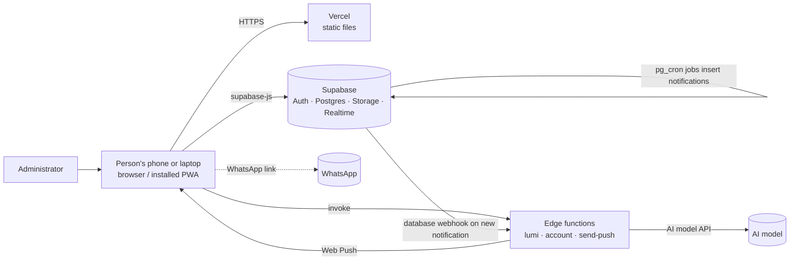

# Software Requirements Specification — LUMA

**Part 0: Introduction and overall description**

| | |
|---|---|
| Product | LUMA — a personal operating system (Personal, Work and Study modes) |
| Document | SRS, part 0 of 6 (the functional requirements are in parts 1–5; see the list at the end) |
| Software version described | 0.26.x (staging); see `CHANGELOG.md` |
| Status | Draft for review. Requirements were written from the code and the migrations, not from an earlier specification. |

---

## 1. Introduction

### 1.1 Purpose

This document states what LUMA must do and how well it must do it. It is written so that product owners can check that the product matches the intent, developers can see what each part is for, and testers can derive test cases. Every functional requirement has an identifier (`FR-<AREA>-<NNN>`) that the test cases in `docs/tests/` point back to.

### 1.2 Scope

LUMA is a web application (a progressive web app) that gives one person a single place for daily life, work and study:

- **Personal mode** — dashboard, calendar with events and invitations, reminders, tasks, notes, documents, contacts and chat, focus mode, money, subscriptions, bills, goals, habits, health, analytics and insights, split expenses and the Lumi AI assistant.
- **Work mode** (add-on) — companies, projects with phases or folders, tasks with several assignees, teams, comments with files and @mentions, Gantt chart and timeline, time tracking with a monthly timesheet, reminders and plan limits.
- **Study mode** (add-on) — timetable, assignments and exams, subjects and semesters with an archive, grades, group projects, shared notes, flashcards and attendance.
- **Platform** — sign-up and sign-in, plans and add-ons, settings, notifications and push, busy-day alerts, feedback to the developer, support and FAQ, administration and account export / deletion.

Out of scope: native mobile apps, online payment (add-ons and plans are requested by WhatsApp and switched on by an administrator), multi-language screens (the interface is English), and a public API.

### 1.3 Definitions

| Term | Meaning |
|---|---|
| Mode / space | Personal, Work or Study. What a person creates in Work or Study stays in that mode (the `space` column). In Personal mode, "Show Work in Personal" and "Show Study in Personal" also show those items. |
| Plan | Dawn (free), Glow (RM9 / month) or Zenith (RM19 / month). Sets limits for the Personal features. |
| Add-on | Study (RM7 / month), Work (RM15 / month) or Work Pro (RM25 / month). Bundle Work + Study RM19 / month. Gives access to a mode. Work and Work Pro set the Work limits. |
| Trial | A one-time free 7-day use of an add-on, started by the person. |
| Administrator | A person listed in `luma.admin_users`; may grant plans and add-ons and read reports. |
| RLS | Row Level Security: the database rule that decides which rows a signed-in person can read or change. |
| RPC | A database function called from the browser. Most writes that need checks go through RPCs. |
| Edge function | A server function on Supabase: `lumi` (AI assistant), `account` (export / delete account), `send-push` (Web Push). |
| MYT | Malaysia Time (UTC+8), the default time zone of the interface; reminders use each person's own time zone. |

### 1.4 References

- `docs/CONVENTIONS.md` — identifiers and formats used by all documents.
- `docs/design/SDD.md`, `docs/design/DATABASE.md`, `docs/design/EDGE-FUNCTIONS.md` — design.
- `docs/04-TEST-PLAN.md`, `docs/tests/` — verification.
- `CHANGELOG.md`, `README.md`, `docs/STAGING_SETUP.md`.

---

## 2. Overall description

### 2.1 Product perspective

LUMA is a static web front end (plain HTML, CSS and JavaScript, no build step) hosted on Vercel. It talks directly to Supabase: Auth for accounts, Postgres (schema `luma`) for data with Row Level Security, Storage for files, Realtime for chat and live notifications, scheduled jobs (`pg_cron`) for reminders, and Edge functions for the AI assistant, account export / deletion and push notifications. See `docs/design/SDD.md` for the architecture.

### 2.2 Product functions (summary)

| Group | Main functions |
|---|---|
| Account | Register, confirm e-mail, sign in / out, reset password, profile, delete account, export data |
| Personal | Plan the day (calendar, reminders, tasks, notes), keep files, talk to contacts, track money / bills / subscriptions / goals / habits / health, review analytics, ask Lumi |
| Work | Run projects for one or more companies, with teams, time tracking and timesheets |
| Study | Run a semester: classes, assignments, grades, groups, notes, flashcards |
| Platform | Plans, add-ons and gifts; settings; notifications and push; busy-day alerts; feedback; support |
| Administration | Users, plans, add-ons, trials, gifts, reports, limits |

### 2.3 User classes

| Class | Description | Typical rights |
|---|---|---|
| Visitor | Not signed in | Register, sign in, reset password |
| Dawn user | Free plan | All Personal features within the Dawn limits |
| Glow / Zenith user | Paid plan | Higher limits; Lumi actions; own wallpaper; Zenith: split expenses |
| Add-on user | Has Work, Work Pro and / or Study | Opens that mode; limits of the add-on |
| Project owner | Created a Work project | Everything in it; invites people; sees team time; manages teams |
| Project member | Accepted an invitation to a Work project (has the Work add-on) | Edits tasks, logs time, comments |
| Project viewer / guest | Invited as viewer, or invited without the Work add-on | Looks, comments where allowed; cannot change tasks |
| Study group member | Invited to a Study group project, with or without the Study add-on | Works in that group project |
| Contact | An accepted contact of another person | Chat; may be invited to events, shared documents / notes, projects, teams |
| Administrator | Listed in `admin_users` | Admin pages; reads feedback; grants plans / add-ons; edits plan limits |

### 2.4 Operating environment

- **Browsers:** current Chrome, Edge, Firefox and Safari (macOS and iOS). Installable as a PWA; Web Push needs HTTPS and, on iPhone, installation to the Home Screen (iOS 16.4+).
- **Screens:** phones from 320 px wide up to desktop monitors; the layout is responsive.
- **Back end:** Supabase (managed Postgres with the `pg_cron` extension enabled), Edge functions (Deno), Vercel static hosting.
- **Environments:** staging (own Supabase project and Vercel site, shows a STAGING tag) and production.

### 2.4.1 Constraints

- No build step and no front-end framework: classic `<script>` files share one global scope (see the SDD for the rules this imposes).
- All data access is through the Supabase client under the signed-in person's rights; there is no custom API server. Rules that matter must therefore be enforced in the database (RLS, triggers, security-definer functions).
- Payments are manual (WhatsApp request, then an administrator switches the plan / add-on on).
- Limits are stored in `luma.plan_limits` and can be changed by an administrator without a release.

### 2.5 Assumptions and dependencies

- A working Supabase project with all migrations (`supabase/migrations/001` onward) applied in order, `pg_cron` enabled, and the Edge functions deployed with their secrets.
- E-mail delivery for confirmation and password-reset messages is provided by Supabase Auth (a custom SMTP sender is recommended for production).
- An administrator account exists.
- The person's device clock and time zone are correct enough for reminders (reminder times follow the time zone saved in the profile).

---

## 3. Where the requirements are

| Part | File | Area codes |
|---|---|---|
| 0 | `docs/srs/SRS-00-introduction.md` (this file) | — |
| 1 | `docs/srs/SRS-personal-a.md` | DASH, CAL, REM, TASK, NOTE, DOC, CON, FOC |
| 2 | `docs/srs/SRS-personal-b.md` | MON, SUB, BILL, GOAL, HAB, HLTH, ANA, SPL, PUR, LUMI |
| 3 | `docs/srs/SRS-work.md` | WRK, WCO, WTM, WTE, WCM, WGV, WLM, WNT |
| 4 | `docs/srs/SRS-study.md` | STT, STA, STS, STG, STN, STC, STK, STM |
| 5 | `docs/srs/SRS-platform.md` | AUTH, SHL, SET, PLN, NTF, BSY, FBK, SUP, ADM, ACC and the NFRs |
| 9 | `docs/srs/SRS-99-appendices.md` | Plan and add-on limits, permission matrix, notification catalogue pointers |

`docs/SRS-complete.md` joins all parts into one file (generated by `docs/build-docs.py`).
